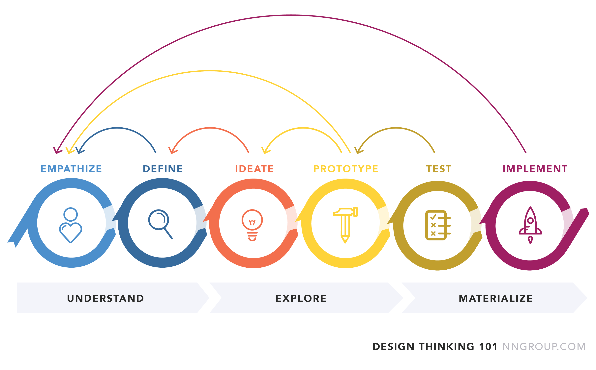

```{r setup tidyverse primer, include = FALSE}
# Not positive if the book will compile without this, so I'm including it just
# to be safe.
library(tidyverse)
```

# A tidyverse primer

**Learning objectives:**

-   List the [**`tidyverse` design principles.**](#tidyverse-design-principles)
-   Explain what it means for the [`tidyverse` to be **designed for humans.**](#design-for-humans)
-   Describe how [**reusing existing data structures** can make functions easier to work with.](#reusing-existing-data-structures)
-   Explain what it means for a set of functions to be [**designed for the pipe.**](#designed-for-the-pipe)
-   Explain what it means for function to be [**designed for functional programming.**](#designed-for-functional-programming)
-   List some [**differences between a `tibble` and a base `data.frame`.**](#tibbles-vs.-data-frames)
-   Recognize how to [**use the `tidyverse` to read and wrangle data.**](#how-to-read-and-wrangle-data)

## Tidyverse design Principles {#tidyverse-design-principles}

The `tidyverse` has [four core design principles](https://design.tidyverse.org/unifying-principles.html):

1.  **Human centered:** Designed to promote human usability.
2.  **Consistent:** Learning how to use one function or package is as similar as another.
3.  **Composable:** Easily breakdown data challenges into smaller components with exploratory tools to find the best solution.
4.  **Inclusive:** Fostering a community of like-minded users (e.g. \#*rstats*)

## Design for Humans - Overview 

> "Programs must be written for people to read, and only incidentally for machines to execute."
>
> \- Hal Abelson


Credit: [Nielson Norman Group](https://www.nngroup.com/articles/design-thinking/)

**Motivation** - [Avoiding Norman Doors](https://design.tidyverse.org/unifying-principles.html)

What are the equivalent of Norman Doors in programming?

`r knitr::include_url("https://www.youtube.com/embed/yY96hTb8WgI")`

## Design for Humans and the Tidyverse {#design-for-humans}

The `tidyverse` offers packages that are easily readable and understood by humans. It enables them to more easily achieve their programming goals.

Consider the `mtcars` dataset, which comprises fuel consumption and 10 aspects of autombile design and performance from 1973-1974. Previewing the first six rows of the data, we see:

```{r, echo = FALSE}
head(mtcars)
```

If we wanted to arrange these in ascending order based on the `mpg` and `gear` variables, how could we do this?

------------------------------------------------------------------------

The function `arrange()`, in the `dplyr` package of the `tidyverse`, takes a data frame and column names as such:

```{r, eval = FALSE}
arrange(.data = mtcars, gear, mpg)
```

------------------------------------------------------------------------

`arrange()`, and other tidyverse functions, use **names that are descriptive and explicit.** For general methods, there is a **focus on verbs,** as seen with the functions `pivot_longer()` and `pivot_wider()` in the `tidyr` package.

## Reusing existing data structures {#reusing-existing-data-structures}

> "You don't have to reinvent the wheel, just attach it to a new wagon."
>
> \- Mark McCormack

There are many different data types in R, such as matrices, lists, and data frames.[^a_tidyverse_primer-1] A typical function would take in data of some form, conduct an operation, and return the result.

[^a_tidyverse_primer-1]: For a more detailed discussion, see Hadley Wickham's [*Advanced R*](https://adv-r.hadley.nz/vectors-chap.html)

`tidyverse` functions most often operate on data structures called tibbles.

-   Traditional data frames can represent different data types in each column, and multiple values in each row.

-   Tibbles are a special data frame that have additional properties helpful for data analysis.

    -   Example: list-columns

------------------------------------------------------------------------

```{r tidyverse-resample}
boot_samp <- rsample::bootstraps(mtcars, times = 3)
boot_samp
class(boot_samp)
```

------------------------------------------------------------------------

The above example shows how to create bootstrap resamples of the data frame mtcars. It returns a tibble with a `splits` column that defines the resampled data sets.

This function **inherits data frame and tibble methods so other functions that operate on those data structures can be used.**

## Designed for the pipe {#designed-for-the-pipe}

The pipe operator, `%>%`, comes from the [`magrittr`](https://magrittr.tidyverse.org) package by [Stefan Milton Bache](http://stefanbache.dk), and is used to chain together a sequence of R functions. More specifically, **the pipe operator uses the value of the object on the left-hand side of the operator as the first argument on the operator's right-hand side.**

The pipe allows for highly readable code. Consider wanting to sort the `mtcars` dataset by the number of gears (`gear`) and then select the first ten rows. How would you do that?

------------------------------------------------------------------------

```{r no pipe arrange slice}
cars_arranged <- arrange(mtcars, gear)
cars_selected <- slice(cars_arranged, 1:10)

# more compactly
cars_selected <- slice(arrange(mtcars, gear), 1:10)
```

Using the pipe to substitute the left-hand side of the operator with the first argument on the right-hand side, we can get the same result as follows:

```{r pipe arrange slice}
cars_selected <- mtcars %>%
  arrange(gear) %>%
  slice(1:10)
```

------------------------------------------------------------------------

This approach with the pipe works because all the functions **return the same data structure (a tibble/data frame) which is the first argument of the next function.**

**Whenever possible, create functions that can be incorporated into a pipeline of operations.**

## Designed for Functional Programming {#designed-for-functional-programming}

Functional Programming is an approach to replace iterative (i.e. for) loops. Consider the case where you may want two times the square root of the `mpg` for each car in `mtcars`. You could do this with a for loop as follows:

```{r for loop sqrt }
n <- nrow(mtcars)
roots <- rep(NA_real_, n)
for (car in 1:n) {
  roots[car] <- 2 * sqrt(mtcars$mpg[car])
}
```

You could also write a function to do the computations. In functional programming, it's important that the function **does not have any side effects and the output only depends on the inputs.** For example, the function `my_sqrt()` takes in a car's mpg and a weight by which to multiply the square root.

```{r my-sqrt}

my_sqrt <- function(mpg, weight) {
  weight * sqrt(mpg)
}

```

Using the [`purrr`](http://purrr.tidyverse.org/) package, we can forgo the for loop and use the `map()` family of functions which use the basic syntax of `map(vector, function)`. Below, we are applying the `my_sqrt()` function, with a weight of 2, to the first three elements of `mtcars$mpg`. User supplied functions can be declared by prefacing it with `~` (pronounced "twiddle").

-   By default, `map()` returns a list.

    -   If you know the class of a function's output, you can use special suffixes. A character output, for example, would used by `map_chr()`, a double by `map_dbl()`, and a logical by `map_lgl()`.

```{r map sqrt}
map(
  .x = head(mtcars$mpg, 3),
  ~ my_sqrt(
    mpg = .x,
    weight = 2
  )
)
```

-   `map()` functions can be used with 2 inputs, by specifying `map2()`

    -   Requires arguments `.x` and `.y`

```{r map2 sqrt}
map2(
  .x = head(mtcars$mpg, 3),
  .y = c(1,2,3),
  ~ my_sqrt(
    mpg = .x,
    weight = .y
  )
)
```

## Tibbles vs. Data Frames {#tibbles-vs.-data-frames}

A `tibble` is a special type of data frame with some additional properties. Specifically:

-   **Tibbles work with column names that are not syntactically valid variable names**.

```{r tibble syntax}
data.frame(`this does not work` = 1:2,
           oops = 3:4)

tibble(`this does work, though` = 1:2,
       `woohoo!` = 3:4)
```

-   **Tibbles prevent partial matching of arguments** to avoid accidental errors

```{r accidental matching tibble}
df <- data.frame(partial = 1:5)
tbbl <- tibble(partial = 1:5)

df$part

tbbl$part
```

-   **Tibbles prevent dimension dropping**, so subsetting data into a single column will never return a vector.

```{r subsetting vector conversion}
df[, "partial"]

tbbl[, "partial"]
```

-   **Tibbles allow for list-columns**, which can be a powerful tool when working with the `purrr` package.

```{r tibble list columns}

template_list <- list(a = 1, b = 2, c = 3, d = 4, e = 5)

data.frame(col = 1:5, list_col = template_list)

tibble(col = 1:5, list_col = template_list)

```

## How to read and wrangle data {#how-to-read-and-wrangle-data}

The following example shows how to use the `tidyverse` to read in data (with the `readr` package) and easily manipulate it (using the `dplyr` and `lubridate` packages). We will walk through these steps during our meeting.

```{r read wrangle data, message = FALSE}
library(tidyverse)
library(lubridate)

url <- "http://bit.ly/raw-train-data-csv"

all_stations <- 
  # Step 1: Read in the data.
  readr::read_csv(url) %>% 
  # Step 2: filter columns and rename stationname
  dplyr::select(station = stationname, date, rides) %>% 
  # Step 3: Convert the character date field to a date encoding.
  # Also, put the data in units of 1K rides
  dplyr::mutate(date = lubridate::mdy(date), rides = rides / 1000) %>% 
  # Step 4: Summarize the multiple records using the maximum.
  dplyr::group_by(date, station) %>% 
  dplyr::summarize(rides = max(rides), .groups = "drop")
```

```{r preview all stations}
head(all_stations, 10)
```

> "This pipeline of operations illustrates why the tidyverse is popular. A series of data manipulations is used that have simple and easy to understand user interfaces; the series is bundled together in a streamlined and readable way. The focus is on how the user interacts with the software. This approach enables more people to learn R and achieve their analysis goals, and adopting these same principles for modeling in R has the same benefits."
>
> \- Max Kuhn and Julia Silge in *Tidy Modeling with R*

## Further Reading

- [Design of Everyday Things - Don Norman](https://www.amazon.com/Design-Everyday-Things-Revised-Expanded/dp/0465050654) 
- [Tidyverse Design Principles - The Tidyverse Team](https://design.tidyverse.org/)
- [Visualization Analysis and Design](https://www.amazon.com/Visualization-Analysis-Design-AK-Peters/dp/1466508914)  - A really great primer on visualization design from a human-centered perspective. Draws on research in cognitive science and presents a high-level framework for designing visualizations to support decision making.

From [Tidyverse Design Principles Chapter 2](https://design.tidyverse.org/unifying-principles.html):

- [The Unix philsophy](https://homepage.cs.uri.edu/~thenry/resources/unix_art/ch01s06.html)
- [The Zen of Python](https://www.python.org/dev/peps/pep-0020/)
- [Design Principles Behind Smalltalk](https://refs.devinmcgloin.com/smalltalk/Design-Principles-Behind-Smalltalk.pdf)

## Meeting Videos

### Cohort 1

`r knitr::include_url("https://www.youtube.com/embed/M7xmKrXuyDQ")`

<details>
    <summary> Meeting chat log </summary>
   
```
00:07:43    Daniel Chen:    hi Jon. hi everyone. first time here :)
00:08:03    Jon Harmon (jonthegeek):    Welcome!
00:09:27    KakShA Ekam DallasSK:   the gang is here..except for tyler
00:09:31    KakShA Ekam DallasSK:   and his kid
00:10:01    David Severski: The 4 seasons of hex bin stickers. LOL
00:10:11    Tan Ho: MiniTyler doesn't need help with the tidyverse
00:10:44    KakShA Ekam DallasSK:   that's right..he just wanted to learn bangbang
00:11:11    Tan Ho: hey, there's Tyler!
00:11:23    pavitra:    yay!!
00:12:36    Daniel Chen:    i feel like more people have cameras on and respond here than any other zoom meeting i've been in all year...
00:12:50    Tony ElHabr:    haha I second that
00:13:03    Tan Ho: we're all frens here :)
00:17:25    Tony ElHabr:    i will not hate on using mtcars i will not hate on using mtcars i will not hate on using mtcars
00:17:30    Tan Ho: Ooh! A use case for the <details> block
00:17:41    Tan Ho: shush, no dataset snobbery
00:17:54    Darya Vanichkina:   Yup, details is so helpful for easily hiding stuff in Rmd
00:18:06    Jon Harmon (jonthegeek):    Ooooh, good call on details, let's make it clear how to do that in the instructions! (I'm still partly here).
00:18:25    Yoni Sidi:  Shameless plug {details} https://github.com/yonicd/details
00:18:48    Tan Ho: ohhh dang
00:18:53    Tan Ho: installing now, I use that all the time
00:19:24    mayagans:   Ooooooh it makes a collapsible div?? That is sick nasty!
00:19:29    pavitra:    wow, details is very cool
00:19:34    David Severski: Funny, I was just exposed to details in GH issues earlier today. :)
00:20:03    Yoni Sidi:  Seamless integration to rmd with it’s own knitter chunk engine…ok I’m done plugging
00:20:15    Vasant M:   Ah yes details! That’s why I recall your name @yoni Sidi
00:20:31    Tony ElHabr:    lol i have also been having this weird data frame print out issue
00:20:55    Darya Vanichkina:   I wonder why…
00:21:27    Tan Ho: must be new tibble package related issue
00:22:17    Yoni Sidi:  What print problem?
00:22:22    Daniel Chen:    fyi: not all things that work on tibbles will work on data.frame
00:22:36    Tony ElHabr:    things like "[90m" get printed out instead of "#"
00:22:53    Gabriela Palomo:    and viceversa data.frame -> tibbles
00:22:55    Tan Ho: https://r4ds.github.io/bookclub-tmwr/reusing-existing-data-structures.html
00:23:39    Tony ElHabr:    jonathan brought the jokes tonight
00:23:42    Tony ElHabr:    always love that
00:23:47    Jon Harmon (jonthegeek):    Thinking of %>% as "and then" is very useful. Learning to read code in a way that makes sense is super super helpful!
00:24:24    Yoni Sidi:  Ironically Tony You can look at the print method for data.frames in details to see how I got around it
00:24:38    Tony ElHabr:    hmm will do Yoni
00:25:08    Tyler Grant Smith:  for small loops and especially if youve preallocated the for loop is probably faster
00:25:10    Daniel Chen:    to fix the "[90m" stuff you need to put:
options(crayon.enabled = FALSE)
either in your renvion or on the top of the knited file
at the
00:25:25    Yoni Sidi:  :+1:
00:25:36    Tony ElHabr:    thx y'all. will try that out!
00:26:03    Darya Vanichkina:   To evaluate the speed you can use microbenchmark::microbenchmark(<code here>) - I tend to use it when picking from stackoverflow
00:26:23    Tan Ho: ope TIL that's called a twiddle
00:26:28    Vasant M:   i thought ~ is tilde
00:26:34    Jon Harmon (jonthegeek):    bench::mark is another option (by Jim Hester)
00:26:38    Tan Ho: today-I-learned
00:27:03    Daniel Chen:    yes it's an annononyoms fuunction
00:27:05    Vasant M:   Statistician here and I call it tilde
00:27:07    Tan Ho: I always called it a lambda
00:27:09    Daniel Chen:    the twittle is a shortcut for the lambda
00:27:27    Tan Ho: Hadley renames things outta nowhere for no reason
00:27:28    Tan Ho: grah
00:27:32    Jon Harmon (jonthegeek):    Good to hear that, Vasant! But it isn't just Hadley!
00:27:34    Tan Ho: insert pooh meme
00:27:49    mayagans:   And twittle is writing a model in twitter
00:27:51    Vasant M:   Ya! I think it’s the atlantic/pacific divide
00:28:01    Tony ElHabr:    zoom really missed the boat by not allowing images to be embedded in chat
00:28:08    Darya Vanichkina:   .x is also hidden from the global environment (i.e. it exists but is not visible in the environment, from memory (?)
00:28:11    Jon Harmon (jonthegeek):    https://hsm.stackexchange.com/questions/7999/why-do-mathematicians-call-twiddle#:~:text=Tilde%20is%20from%20Spanish%20tildar,pretty%20apt%20name%20for%20it.
00:28:30    mayagans:   Im still trying to find the JB quote about loops
00:28:32    Tyler Grant Smith:  i prefer giving arguments in the ... to map when possible rather than making a partial lambda.  opinions?
00:28:33    Yoni Sidi:  Wait … isn’t ~ $/sim$?
00:28:59    Darya Vanichkina:   Tyler, can you give an example?
00:29:05    Tan Ho: > JB quote about loops
someone has to write a for loop, but it doesn't have to be you!
00:29:13    mayagans:   Lol yes thank you tan so good
00:29:20    Tony ElHabr:    yea tyler. ellipses as the default, and partial only minimally
00:29:57    Tan Ho: yeah, where possible I write map, map-args, function, static args, but not always possible with argument order
00:30:04    Tyler Grant Smith:  so for the given example.  map(1:5, my_sqrt, weight = 2)
00:30:25    Tan Ho: tbh Tyler started it
00:32:15    Kevin Kent: Yeah I like the … static arg style too.
00:32:54    Darya Vanichkina:   And if we have more than one arg would it be (ex_ weight = 2, height = 3, randomarg = 4)?
00:33:03    Daniel Chen:    to tyler, re ... : the ... works, but you can't map a vector of values with it (can't do: map(1:5, my_sqrt, weight = 11:15) ). that's what map2 and pmap are for.
00:33:16    Tan Ho: LIVE CODE
00:33:18    Tan Ho: YAY
00:33:26    Joe Sydlowski:  The correct window setup too!
00:33:29    Tony ElHabr:    insert environment pane comment
00:33:32    Tan Ho: BOOO
00:33:40    Tan Ho: BOOOOOOOOO
00:33:41    Tyler Grant Smith:  yep daniel
00:34:05    Tyler Grant Smith:  and Darya, yes
00:34:09    David Severski: Source goes on the right. Console on left. Change my mind. ;P
00:34:17    Tan Ho: oh nooooo
00:34:18    mayagans:   Thats chaos
00:34:25    atoumi: this is absolutely the correct layout
00:34:30    mayagans:   ^^^
00:34:32    Tan Ho: where's daryn I need backup
00:34:34    Darya Vanichkina:   @atoumi I agree
00:34:36    mayagans:   Queen has spoken
00:34:37    Kevin Kent: haha. My eyes would get crossed with source on the right
00:34:40    Tyler Grant Smith:  that hurts my brain to think about
00:34:40    Daniel Chen:    i have to say it's the "wrong env pane setup" when you're teaching (new learners) becuase students ask "mine don't look like that". unless you take out time from the lesson to show them how to customize it
00:34:57    Darya Vanichkina:   @Daniel I actually do that at the start of every workshop
00:35:13    David Severski: Now it’s time for the RMarkdown notebook output to console/in-line debate.  :D
00:35:26    Darya Vanichkina:   Because that allows me to stick EVERYTHING into the bottom right pane, and have source take up the entire left of the screen
00:35:28    Tan Ho: i assume we don't need to have a lightmode darkmode fight?
00:35:39    Tony ElHabr:    i think we are all on the dark side, right?
00:35:43    atoumi: Output to console and darkmode because we care about our eyes
00:35:44    Scott Nestler:  That might be something we all agree on.
00:35:46    Tony ElHabr:    RIGHT Y'ALL?
00:35:47    Darya Vanichkina:   Also, I think it’s a discussion, not a fight …
00:35:59    Tan Ho: shush
00:36:00    David Severski: For teaching, Studio Cloud or a dockerized version is my goto setup.
00:36:08    Tan Ho: we don't pull punches with dark mode
00:36:50    David Severski: Yay! Rsthemes!
00:36:53    mayagans:   Blindeddd by the lightttt
00:37:07    Darya Vanichkina:   I’m Carpentries-trained/based, so I still tend to want people to walk away with something they can work with on their own data later
00:37:11    Darya Vanichkina:   Although it does take time
00:37:21    Tony ElHabr:    makes sense Darya
00:37:40    Daniel Chen:    i run into horizontal space issues when i make the font bigger when i have to teach, but that usually ends up being workshop dependent.
00:37:43    Joe Sydlowski:  I never noticed that before!
00:38:25    Darya Vanichkina:   Surprisingly, I recently had a horrific workshop (geospatial python with DL, via zoom - install issues every session), and the post-workshop survey learners STILL said they wanted us to fix installs (instead of a docker-based VM solution)
00:38:43    Darya Vanichkina:   [I am still setting up a viable docker/VM for next year]
00:39:11    Daniel Chen:    for python, can  you use a binder instance for workshops?
00:39:27    Darya Vanichkina:   I needed GPUs
00:39:33    Daniel Chen:    :(
00:40:00    Daniel Chen:    conda environment.yml files aren't able to install the binaries?
00:40:28    Connor Krenzer: Could you use the map() function on this dataset?
00:40:29    mayagans:   Your python talk is gonna get you booted from this chat (lol jk xoxo)
00:40:32    David Severski: I kinda hate the warning messages the new dplyr spits out about groups (yes, I know they’re configurable).
00:40:34    Jordan Krogmann:    Great job!
00:40:37    Tony ElHabr:    discussion of python install issues in an R meeting? how fitting
00:40:54    Yoni Sidi:  Great job Jonathan!
00:40:54    Tan Ho: i threw the option into my rprofile once and have never had problems again
00:41:02    Darya Vanichkina:   @mayagans/@Tony I think it’s more a teaching issue
00:41:08    Darya Vanichkina:   And I definitely use/teach both
00:41:10    Tony ElHabr:    yeah, global Rprofile option ftw
00:41:19    Tony ElHabr:    don't get me wrong, i love python too
00:41:26    Tony ElHabr:    i just like to joke haha
00:41:28    David Severski: I do to, but I use a lot of renv these days, so I’m always going into environments where my rprofile isn’t active
00:45:14    Vasant M:   Especially when you apply a lot of different functions (models) , being explicit is better
00:45:19    Tan Ho: https://imgur.com/WdcWnKz
00:45:54    Connor Krenzer: Is there a reason why you would use map() instead of vapply()?
00:46:52    Daniel Chen:    vapply lets you specify the output types and how many elements in each list element.
map only returns a list.
00:47:28    Daniel Chen:    that's map vs map_*
map will return a list
00:48:25    David Severski: And the easy path to parallelization with `furrr` is so nice.
00:49:01    Darya Vanichkina:   @David agreed
00:49:56    Yoni Sidi:  https://github.com/hrbrmstr/freebase
00:51:02    David Severski: He really called it freebase? :P
00:51:06    Darya Vanichkina:   Thanks, everyone!
00:51:08    David Severski: Bye!

```

