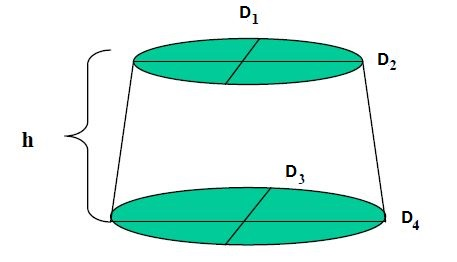
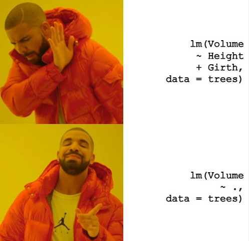
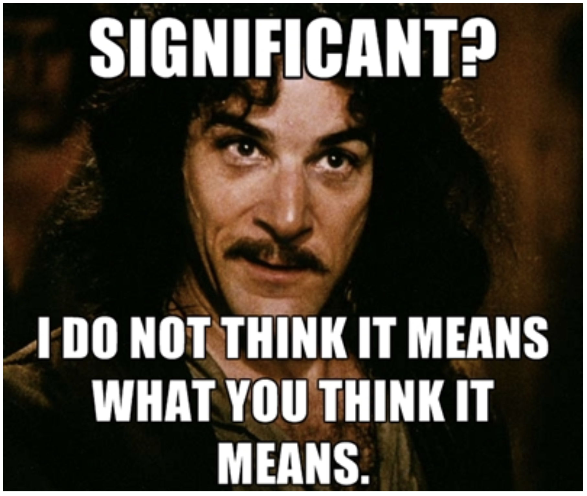
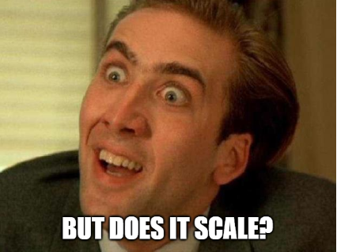
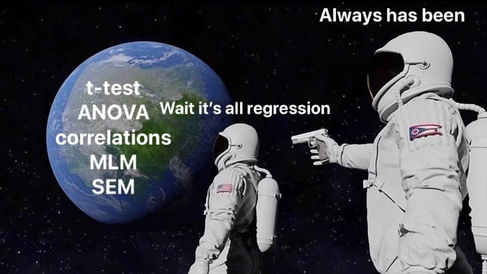

```{r setup-03, include=F, echo=F}
knitr::opts_chunk$set(
  # collapse = TRUE
  warning = FALSE,
  message = FALSE
)
library(details)
```

# A review of R modeling fundamentals

**Learning objectives:**

-   Specify model terms using the **R formula syntax.**
-   List **conveniences for modeling** that are supported by the R formula syntax.
-   Use `anova()` to **compare** models.
-   Use `summary()` to **inspect** a model.
-   Use `predict()` to **generate new predictions** from a model.
-   List the **three purposes** that the R model formula serves.
-   Recognize how the **design for humans** rubric is applied to `{tidymodels}` packages.
-   Use `broom::tidy()` to **standardize the structure** of R objects.
-   Use the `{tidyverse}` along with base modeling functions like `lm()` to **produce multiple models at once.**

## R formula syntax {#r-formula-syntax}

We'll use the `trees` data set provided in `{modeldata}` (loaded with `{tidymodels}`) for demonstration purposes. Tree girth (in inches), height (in feet), and volume (in cubic feet) are provided. (Girth is somewhat like a measure of diameter.)


```{r library-theme-03}
library(tidyverse)
library(tidymodels)
theme_set(theme_minimal(base_size = 14))
```

```{r trees-03}
data(trees)

trees <- as_tibble(trees)
trees
```

Note that there is an analytical way to calculate tree volume from measures of diameter and height.




We observe that `Girth` is strongly correlated with `Volume`

```{r trees-correlation-03, eval=F, echo=F, include=F}
trees %>% 
  mutate(across(Girth, list(`2` = ~.x^2))) %>% 
  corrr::correlate()
```

```{r trees-correlation-b-03}
trees %>% 
  corrr::correlate()
```

Shame on you `r emo::ji('wink')` if you didn't guess I would make a scatter plot given a data set with two variables.

```{r trees-plot-03}
trees %>% 
  ggplot(aes(x = Girth, y = Height)) + 
  geom_point(aes(size = Volume))
```

------------------------------------------------------------------------

We can fit a linear regression model to predict `Volume` as a function of the other two features, using the formula syntax to save us from some typing.

```{r reg_fit-03}
reg_fit <- lm(Volume ~ ., data = trees)
reg_fit
```

<details>

<summary>How would you write this without the formula syntax?</summary>



</details>

------------------------------------------------------------------------

If we want to get fancy with our pipes (`%>%`), then we should wrap our formula with `formula()`.

This due to the way `.` is interpreted by (`%>%`). The (`%>%`) passes the object on the left-hand side (lhs) to the first argument of a function call on the right-hand side (rhs).   

> Often you will want lhs to the rhs call at another position than the first. For this purpose you can use the dot (.) as placeholder. For example, y %>% f(x, .) is equivalent to f(x, y) and z %>% f(x, y, arg = .) is equivalent to f(x, y, arg = z). - [magrittr/pipe](https://magrittr.tidyverse.org/reference/pipe.html)

This would be confusing since within `lm()`, the `.` is interpreted as "all variables aside from the outcome". This is why we explicitly call `formula()`. This allows us to pass the data object (`trees`) with the pipe to the `data` argument, below, not to the actual formula.

```{r lm-03}
trees %>% lm(formula(Volume ~ .), data = .)
```

Interaction terms are easy to generate.

```{r inter_fit-03}
inter_fit <- lm(Volume ~ Girth * Height, data = trees)
inter_fit
```

Same goes for polynomial terms. The use of the identity function, `I()`, allows us to apply literal math to the predictors.

```{r poly_fit-03}
poly_fit <- lm(Volume ~ Girth + I(Girth^2) + Height, data = trees)
poly_fit 
```

```{r poly_fit3-03}
poly_fit3 <- lm(Volume ~ (.)^2, data = trees)
poly_fit3
# There are only two predictors in this model so this produces the same results as 
# inter_fit but if there were 3 there would be three individual 
# effects and the combination of those effects as interaction depending on if the third 
# variable is continuous or categorical
```

Excluding columns is intuitive.

```{r no_heigh_fit-03}
no_height_fit <- lm(Volume ~ . - Height, data = trees)
no_height_fit
```

The intercept term can be removed conveniently. *This is just for illustrative purposes only. Removing the intercept is rarely done. In this particular case, it may make sense as it is impossible for a tree to have negative volume*

```{r no_intercept_fit-03}
no_intercept_fit <- lm(Volume ~ . + 0, data = trees)
no_intercept_fit
```

------------------------------------------------------------------------

To illustrate another convenience provided by formulas, let's add a categorical column.

```{r trees2-03}
trees2 <- trees
set.seed(42)
trees2$group = sample(toupper(letters[1:4]), size = nrow(trees2), replace = TRUE)
trees2
```

Encoding the categories as separate features is done auto-magically with the formula syntax.

```{r dummy_fit-03}
dummy_fit <- lm(Volume ~ ., data = trees2)
dummy_fit
```

Under the hood, this is done by `model.matrix()`.

```{r matrix-03}
model.matrix(Volume ~ ., data = trees2) %>% head(10)
```

To visualize the inclusion of a polynomial:

```{r dummy_fit3-03}
dummy_fit3 <- lm(Volume ~ (.)^3, data = trees2)
dummy_fit3
```

### Recap

Purposes of R model formula:

-   The formula defines the columns that are used by the model.

-   The standard R machinery uses the formula to encode the columns into an appropriate format.

-   The roles of the columns are defined by the formula.

## Inspecting and developing models

Being the sound analysts that we are, we should check if the assumptions of linear regression are violated. The `plot()` generic function has a specific method for `lm` objects that generates various diagnostic plots.

A short recap of the 4 main diagnostic plots produced by `plot()` of a model object.  

- *Residuals vs Fitted* - to see if residuals have non-linear patterns. Good sign if you see equally spread residuals around a horizontal line without distinct patterns  
- *normal Q-Q* plot to see if both sets of residuals are identical, if the line is straight then sets come from normal distributions  
- *Scale Location* plot to see if residuals are spread evenly along ranges of predictors  
  - good to check for assumptions of homoscedasticity (equal variance)  
- *Residual vs Leverage* plot helps to identify an influential cases (cases that don't get along with the trend of the majority). these are identified by where residuals are located off the Cook's distance line.

```{r base_plot-03}
par(mfrow = c(1, 2))
plot(reg_fit, which = c(1, 2))
```

```{r par_tweak-03, echo=F, include=F}
par(mfrow = c(1, 1))
```

The second plot does not show any strong violation of the normality assumption. However, the first plot shows a violation of the linearity assumption (that there is a linear relationship between the response variable and the predictors). If the assumption were satisfied, the smooth red line would be like a straight horizontal line at y=0.

Note that there is a `{ggplot2}` way to generate the same plots.

```{r ggfortify-03}
library(ggfortify)

autoplot(reg_fit, which = c(1, 2))
```

------------------------------------------------------------------------

<details>

<summary>But what about the coefficients?</summary>



</details>

</details>

```{r summary-03}
summary(reg_fit)
```

Use `{broom}` for a tidy version.

```{r broom-03}
library(broom)

reg_fit %>% tidy()
reg_fit %>% glance() %>% glimpse()
```

------------------------------------------------------------------------

<details>

<summary>`{purrr}` and `{dplyr}` can help you scale up your modeling process.</summary>



</details>

We can compare all of the models we made before.

```{r glance-03}
list(
  'reg' = reg_fit,
  'inter' = inter_fit,
  'poly' = poly_fit,
  'no_height' = no_height_fit,
  'no_intercept' = no_intercept_fit
) %>% 
  map_dfr(glance, .id = 'id') %>% 
  select(id, adj.r.squared) %>% 
  arrange(desc(adj.r.squared))
```

We observe that the polynomial fit is the best.

We can create models for each `group` in `trees2`.

```{r tidy-03}
reg_fits <-
  trees2 %>%
  group_nest(group) %>% 
  mutate(
    fit = map(data, ~ lm(formula(Volume ~ .), data = .x)),
    # converts model object's coefficients to a dataframe
    tidied = map(fit, tidy), 
    # row summary of a model
    glanced = map(fit, glance),
    # returns a tibble of additional metrics like Cooks distance, lower and upper bounds 
    # of fitted values, standard errors of fitted values
    augmented = map(fit, augment) 
  )

.select_unnest <- function(data, ...) {
  data %>% 
    select(group, ...) %>% 
    unnest(...)
}

reg_fits %>% .select_unnest(tidied)
reg_fits %>% .select_unnest(glanced)
reg_fits %>% .select_unnest(augmented)
```

## More of `{base}` and `{stats}`

R's `{base}` and `{stats}` libraries have lots of built-in functions that help perform statistical analysis. For example, `anova()` can be used to compare two regression models quickly.

```{r anova-03}
anova(reg_fit, poly_fit)
```

We observe that the second order term for `Girth` does indeed provide significant explanatory power to the model. (Formally, we reject the null hypothesis that the second order term for `Girth` is zero.)

<details>

<summary>What is ANOVA?</summary>



</details>

```{r anscombe-03, echo=F, include=F, eval=F}
ff <- y ~ x
mods <- setNames(as.list(1:4), paste0("lm", 1:4))
for(i in 1:4) {
  ff[2:3] <- lapply(paste0(c("y","x"), i), as.name)
  mods[[i]] <- lmi <- lm(ff, data = anscombe)
}

op <- par(mfrow = c(2, 2), mar = 0.1+c(4,4,1,1), oma =  c(0, 0, 2, 0))
for(i in 1:4) {
  ff[2:3] <- lapply(paste0(c("y","x"), i), as.name)
  plot(ff, data = anscombe, col = "red", pch = 21, cex = 1.2, xlim = c(3, 19), ylim = c(3, 13))
  abline(mods[[i]], col = "blue")
}
mtext("Anscombe's 4 Regression data sets", outer = TRUE, cex = 1.5)
par(op)
```

------------------------------------------------------------------------

Use base R statistical function when someone tries to test your statistics knowledge.

> Question: If $U_1$ and $U_2$ are i.i.d. (independent and identically distributed) $Unif(0,1)$ random variables, what is the distribution of $U_1 + U_2$?

```{r hw03-q13}
set.seed(42)
n <- 10000
u_1 <- runif(n)
u_2 <- runif(n)
.hist <- function(x, ...) {
  hist(x, probability = TRUE,...)
  lines(density(x), col = "blue", lwd = 2, ...)
}

layout(matrix(c(1,2,3,3), 2, 2, byrow = TRUE))
.hist(u_1)
.hist(u_2)
.hist(u_1 + u_2)
```

> Answer: Evidently it's triangular.

------------------------------------------------------------------------

There are probably lots of functions that you didn't know you even needed.

```{r clean-03, echo=F, include=F}
# If the whole book is knitted, `df` might be assigned in a previous chapter, throwing off the following example error.
rm('df')
```

```{r add_column-03, error=T}
add_column <- function(data) {
  # Whoops! `df` should be `data`
  df %>% mutate(dummy = 1)
}

trees %>% add_column()
```

`df()` is the density function for the F distribution with `df1` and `df2` degrees of freedom

```{r density_function-03}
df
```

## Why Tidy Principles and `{tidymodels}`?

[The `{tidyverse}` has four guiding principles](https://design.tidyverse.org/unifying-principles.html#human-centered) which `{tidymodels}` shares.

-   It is **human centered**, i.e. the `{tidyverse}` is designed specifically to support the activities of a human data analyst.

    -   Functions use sensible defaults, or use no defaults in cases where the user must make a choice (e.g. a file path).
    -   `{recipes}` and `{parnsip}` enable data frames to be used every where in the modeling process. Data frames are often more convenient than working with matrices/vectors.

-   It is **consistent**, so that what you learn about one function or package can be applied to another, and the number of special cases that you need to remember is as small as possible.

    -   Object orientated programming (mainly S3) for functions such as `predict()` provide a consistent interface to the user.
    -   `broom::tidy()` output is in a consistent format (data frame). List outputs provided by package-specific functions vary.

-   It is **composable**, allowing you to solve complex problems by breaking them down into small pieces, supporting a rapid cycle of exploratory iteration to find the best solution.

    -   `{recipes}`, `{parsnip}`, `{tune}`, `{dials}`, etc are separate packages used in a tidy machine learning development workflow. It may seem inconvenient to have so many packages to perform specific tasks, but such a paradigm is helpful for decomposing the whole model design process, often making problems feel more manageable.

-   It is **inclusive**, because the tidyverse is not just the collection of packages, but it is also the community of people who use them.

    -   Although the `{tidyverse}` and `{tidymodels}` are opinionated in their design, the developers are receptive to public feedback.

## Meeting Videos

### Cohort 1

`r knitr::include_url("https://www.youtube.com/embed/Je7RoEIR54g")`

<details>
  <summary> Meeting chat log </summary>
  
```
00:06:11	Jonathan Trattner:	I second that
00:08:03	Tan Ho:	Time to find and send memez
00:09:11	Tan Ho:	You all have seen Hadley cat vibing, right?
00:09:18	Jon Harmon (jonthegeek):	https://www.vivino.com/mcpherson-cellars-la-herencia/w/2270344?ref=nav-search&cart_item_source=text-search
00:10:00	Jon Harmon (jonthegeek):	https://twitter.com/RCoderWeb/status/1351282600086810634
00:10:18	David Severski:	Any chance you could get a bit closer to your mic, Tony? Audio is a bit poor on my end.
00:10:43	Jon Harmon (jonthegeek):	I muted the one that was crackling, I think.
00:10:50	Maya Gans:	Friendly reminder to please mute :)
00:10:54	Maya Gans:	Oh you beat me thanks
00:13:16	Jon Harmon (jonthegeek):	New base pipe makes this all... weird. But they have a way to do it now, at least!
00:13:53	Jon Harmon (jonthegeek):	trees |> my_data => lm(Volume ~ ., data = my_data)
00:13:55	Jordan Krogmann:	I haven't played around with the base pipe yet
00:14:17	Tan Ho:	=> ???
00:14:24	Jordan Krogmann:	that is going to take some re-learning
00:14:27	David Severski:	Is there a comprehensive guide to R’s formula syntax? Always found learning I(), + , *, etc. kind of scattered through bits of documentation.
00:14:28	Jon Harmon (jonthegeek):	Kinda a lambda function... thing.
00:14:31	Jordan Krogmann:	"=>"?
00:14:53	Maya Gans:	I thought `I` was “asis” - is it different inside the context of lm?
00:14:56	Jon Harmon (jonthegeek):	But don't get hung up on that 'cuz it's still in development, RStudio will make it clear when it's time :)
00:15:36	Jon Harmon (jonthegeek):	@David: Hmm, I haven't seen a formula cheat sheet, but there HAS to be one out there...
00:17:35	Tyler Grant Smith:	https://cran.r-project.org/doc/contrib/Paradis-rdebuts_en.pdf page 57
00:18:12	Yoni Sidi:	There is a  Belgian flavored cheatsheet, but not going to share anything from said site
00:19:20	Jon Harmon (jonthegeek):	Yeahhhh, no thanks! The Paradis book has a good guide in there, it'd be nice to pull that out... so let's do that in the notes for this chapter!
00:20:45	David Severski:	Shout out to gglm for better lm plots with ggplot! http://graysonwhite.com/gglm/
00:21:02	luifrancgom:	Also ggplot2::geom_qq(): https://ggplot2.tidyverse.org/reference/geom_qq.html
00:21:24	Tan Ho:	Belgian...flavoured...
00:21:37	Tan Ho:	ohhhhh
00:21:39	Jon Harmon (jonthegeek):	Reference to a litigious website.
00:21:43	Tan Ho:	I was thinking of waffles
00:21:58	tim:	Now I'm thinking about waffles
00:22:15	Yoni Sidi:	+1 on waffles
00:22:30	Jon Harmon (jonthegeek):	https://github.com/hrbrmstr/waffle
00:22:39	David Severski:	Gotta be a minority here but pancakes > waffles. ;)
00:22:55	Jon Harmon (jonthegeek):	My wife's pancakes > waffles.
00:23:07	Tan Ho:	crepes?
00:23:10	Maya Gans:	Insert {stacks} pun
00:23:20	Yoni Sidi:	blinches>pancakes
00:24:32	Conor Tompkins:	What is the difference between modeling each subgroup separately vs. adding the subgroup as a term in a model that contains all the subgroups?
00:24:32	Yoni Sidi:	Side note, you can pass arguments to the broom arguments on the res of the function in map
00:24:41	Yoni Sidi:	*rhs
00:27:30	Andrew G. Farina:	I think the biggest difference is robustness. modeling each subgroup lets you know how well the model fits that subgroup. Adding in a variable (subgroup) will tell you how much variance is accounted for by the subgroup. Does that make sense?
00:28:05	DX:	Hi I am new to the book club. Where can we find this book?
00:28:24	Ben Gramza:	https://www.tmwr.org/base-r.html
00:28:28	DX:	Thanks
00:28:31	Scott Nestler:	I used to get confused about 'anova' and 'aov' but they are very different.  'aov' fits a model (by calling lm) whereas 'anova' is a generic function that analyzes a fitted model (or models).
00:28:36	Joe Sydlowski:	One reason I've used subgroups instead of a categorical variable is when I want to do feature selection with the subgroups. If you use a categorical variable than each level is confined to the same predictors
00:29:00	Maya Gans:	Thats a super useful distinction @Scott !
00:31:03	Conor Tompkins:	Andrew, Joe, thanks. I think I see what the benefit is.
00:31:51	Jon Harmon (jonthegeek):	If someone wants to pipe up and summarize what Andrew and Joe explained, that'd be great :D
00:32:22	luifrancgom:	jajajaja
00:32:40	Jon Harmon (jonthegeek):	btw data is also a function, so... be careful :)
00:33:08	Yoni Sidi:	Last week me can confirm
00:33:15	Maya Gans:	I love using single letters and t always gets me too
00:33:18	Scott Nestler:	Many years ago, a common way to estimate a standard normal distribution was to sum 12 Uniform(0,1) distributions and then subtract 6.
00:33:19	luifrancgom:	interesting from utils (data)
00:33:23	Jon Harmon (jonthegeek):	For following along: r4ds.io/tmwr is this study guide... thing... that we're making
00:34:09	Jon Harmon (jonthegeek):	And I use extremely specific variable names. RStudio autocomplete means you only have to type the full thing once, and then people know what you mean.
00:34:48	Tan Ho:	trying to grok joe's comments for my non-statsy self: fitting one model with a categorical variable means you have one coefficient for each feature and the difference between categories is explained by the coefficient for the category. Fitting one model for each level of the categorical variable means you get different coefficients for a feature based on the subgroup of data
00:35:31	Yoni Sidi:	It also depends if you incl the intercept
00:36:23	Yoni Sidi:	w and wo it changes the meaning of the coefficients
00:36:48	Conor Tompkins:	Sounds like subgrouping lets you turn non-tree models into a model with more tree-ish logic
00:38:02	Andrew G. Farina:	I think that is a good way to think about it. If you had multiple models and were comparing fit. A linear model may fit one group better then the others, while a poly model may fit another group better.
00:38:12	luifrancgom:	Thank you Tony
00:38:13	Jordan Krogmann:	nice work!
00:38:16	Andrew G. Farina:	Tony that was great
00:38:17	Scott Nestler:	I learned a new term from reading this chapter. In the Advanced R book, we talked about R being "lazy," but didn't know what the opposite of that was.  Apparently, the word is "eager."
00:38:40	Maya Gans:	Thanks Tony!!!
00:38:40	darynr:	Good job, Tony
00:38:48	Tan Ho:	YAY TONY
00:38:50	Jonathan Trattner:	thanks Tony!
00:39:01	Jonathan Leslie:	Thanks, Tony!
00:39:01	Jim Gruman:	thank you Tony
00:39:03	Conor Tompkins:	Thanks Tony!
00:39:14	caroline:	Thank you Tony
00:43:12	Tan Ho:	"There are houses" /fin
00:43:40	Scott Nestler:	There are actually a bunch of Ames housing data set memes out there.
00:44:21	Jonathan Trattner:	https://gallery.shinyapps.io/ames-explorer/
00:44:44	Jonathan Trattner:	doesn't map stuff though
00:44:54	Jonathan Trattner:	so leaflet is still an option!
00:45:32	David Severski:	Gotta run here. Thanks everyone!
00:45:59	Jordan Krogmann:	Thanks jon and tony later!
```
</details>

### Cohort 2

`r knitr::include_url("https://www.youtube.com/embed/gqhvjvFxwlo")`

<details>
  <summary> Meeting chat log </summary>
  
```
00:08:16	Kevin Kent:	Welcome Carlo! Where are you living now?
00:08:29	Carlo Medina:	im based in nyc currently
00:08:44	Kevin Kent:	Nice! I grew up there. Currently in Boston
00:26:54	Kevin Kent:	Yeah I was thinking along the lines of August’s explanation as well. I bet it captures the formula expression in the context of the data environment.
00:27:16	Kevin Kent:	Like a quosure
00:27:38	August:	You know we're just reading that chapter xD
00:27:47	Kevin Kent:	:) advr you mean?
00:28:39	August:	yep, Monday class. Its getting cognitively complex. 
00:28:57	Kevin Kent:	Sweet! I had to diagram that out to make any sense of it
00:29:46	Kevin Kent:	Not sure if this is 100% accurate, but if you all  could improve on it that would be awesome. Helped me think through it https://docs.google.com/drawings/d/1cSQreGTUabMhRy9Vx2hYGJdJTdVRqTzOUtaJJvvb3mw/edit?usp=sharing
00:32:02	Stephen Holsenbeck:	looks right
00:38:42	Luke Shaw:	reminds me of Simpsons paradox
00:41:23	August:	This blog explains interactions pretty well: https://statisticsbyjim.com/regression/interaction-effects/
00:41:32	Carmen:	thanks!
00:41:39	Amélie Gourdon-Kanhukamwe (she/they):	Page 27 of the this pre-print, my collaborator has reported an interaction as Kevin suggests: https://psyarxiv.com/ajv4q/
00:44:36	Stephen Holsenbeck:	💡 thank you!
00:44:46	Stephen Holsenbeck:	thanks August!
00:53:10	Kevin Kent:	That groupB, c etc binary coding is a good example of one hot encoding
00:53:31	Kevin Kent:	(From our discussion last week)
00:53:56	Kevin Kent:	N - 1 binary variables for n levels in the factor
00:54:18	Stephen Holsenbeck:	Yes! 👆
00:55:50	Carlo Medina:	might be a little late on the interaction stuff and why we have negative betas for girth and height:

one way to think about regression is Kevin's point is to have other variables fixed. thus given the regression result of V=69-5.85G =1.2H + 0.13GH (1)

to do this, we can do differentiation with respect to a variable:  say dV/dH to check how change in H affects change in V. 

when we derive eqn (1) we get dV/dH=-1.2+0.13G this implies that H's effect on Volume is "dependent" on the value of the girth you are currently at. (e.g. if you have a girth of 10 vs a girth of 20, a unit increase in height translates to 0.1 volume per length and  1.4 volume per length, respectively 

given that our starting girth is 8.3, the dV/dH should be positive even if we have a -1.2 fixed term. sorry might be a little too long, but i hope that helps. :)
00:57:54	Stephen Holsenbeck:	That does! a good refresher on differentiation and a reminder that it underlies the mathematics of regression
01:00:08	Kevin Kent:	Broom is an incredible package
01:05:39	Carlo Medina:	is group_nest syntactic sugar for group_by() %>% nest() ? :O #TIL
01:09:01	Kevin Kent:	I think that’s right Carlo. I have never used it - I find the tibble of tibbles approach interesting but I usually split into a list for this type of thing.. But I think this could make it easier to run multiple models and retain original metadata
01:09:24	Kevin Kent:	I want to try it this way and see if it makes the workflow cleaner
01:11:10	Kevin Kent:	I often lose the name of the group when I map across a list of dfs and then do other transformations to each output.
01:16:12	Luke Shaw:	The .hist function was a good example of what shamsuddeen found last time - it would have been bad to call it "hist" as it would have conflicted with the function that already existed
01:16:36	Kevin Kent:	Ah ah. That’s an awesome connection. Thanks Luke
01:17:06	Kevin Kent:	I think I usually call things like “my_hist” or something like that. This seems more professional or something haha
01:17:26	Shamsuddeen:	Yah, luke. Thats good connection
01:19:38	Amélie Gourdon-Kanhukamwe (she/they):	This may answer: https://stackoverflow.com/questions/802050/what-is-opinionated-software
01:19:50	Stephen Holsenbeck:	👆
01:20:22	Shamsuddeen:	Oh nice
01:21:06	Kevin Kent:	Yeah, I think its largely about, as august mentioned, clear and comprehensive set of design standards that are “enforced” in each of the packages in the tidyverse
01:21:45	Kevin Kent:	And those standards emanate from a philosophy about how programs should be designed. Basically agreeing with august
```
</details>

### Cohort 3

`r knitr::include_url("https://www.youtube.com/embed/nNvjk3qtHUo")`

<details>
  <summary> Meeting chat log </summary>
  
```
00:12:03	Ildiko Czeller:	not modeling related, but girth was a new word for me :)
00:22:04	Hannah Frick:	it's doing 2-way interactions for all in the ()
00:23:57	Toryn Schafer:	lm(mpg ~ (.)^2, data = mtcars)
00:25:57	Hannah Frick:	and then all 3-way interactions: m(mpg ~ (.)^3, data = mtcars)
00:26:08	Hannah Frick:	*lm
00:36:24	Chris Martin:	I think this was the example for + 0
00:37:11	Jake Scott:	Thank you! I think seeing it like that makes it make more sense, at least for me. Also thanks to Toryn for explaining!
00:37:40	Ildiko Czeller:	+1! thank you both. (it is a shame we cannot like posts here :) )
00:43:57	Hannah Frick:	you specify like a matix with c(rows, columns)
00:56:15	Ildiko Czeller:	does anova makes sense if one models predictors are not a superset of the other model predictors?
00:58:41	Jake Scott:	I think it would make sense just insofar as we care whether the fit is different between model 1 or model 2. Like maybe model 1 is Y ~ X and model 2 is Y ~ Z. I believe we could use ANOVA to see we get different fits. Not sure it is the primary way to discern that, but I think it'd work no? I may have to hit the books to refresh myself!
00:59:23	Hannah Frick:	anova is for nested models only if I recall correctly
00:59:31	Toryn Schafer:	Would have to double check, but no, I think the models need to be nested (predictors a subset of the larger model)
01:00:15	Ildiko Czeller:	i need to refresh a lot of stats :) it is not clear to me when /why you would use anova or just compare r^2
01:00:28	Toryn Schafer:	ANOVA has the p-value haha
01:00:37	Ildiko Czeller:	or maybe anova tells you if a smaller r^2 is smaller enough
01:01:15	Jake Scott:	The mighty p-value. But yes I am rusty so not sure- if you say it has to be nested, my guess is you're correct!
01:01:27	Chris Martin:	Thanks Edgar
01:02:51	Toryn Schafer:	Ildiko, yes it will tell you if the increase in R^2 is significant (remember R^2 always increases with more predictors)
01:04:10	Ildiko Czeller:	thank you Toryn, makes sense!
```
</details>

### Cohort 4

`r knitr::include_url("https://www.youtube.com/embed/FbPjR_Iimwk")`

<details>
  <summary> Meeting chat log </summary>
  
```
00:12:59	Isabella Velásquez:	Hi everybody, getting my headphones ready.
00:13:15	Federica Gazzelloni:	Hi Isabella
00:42:56	Laura Rose:	I need to jump off for another meeting. Nice explanations, AL! See you all next week.
00:46:44	Isabella Velásquez:	Such a good quotation!!! https://twitter.com/fermatslibrary/status/1235582404388982785?lang=en
00:48:25	Isabella Velásquez:	dat all the way 😄
```
</details>
