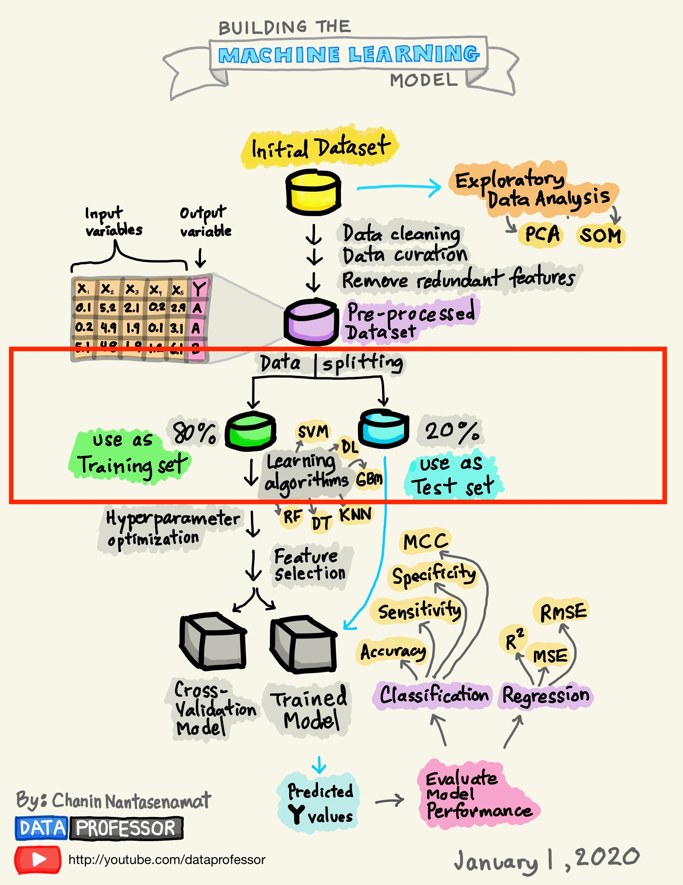
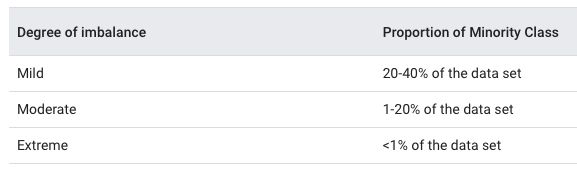
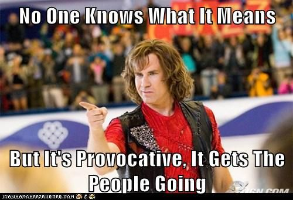

# Spending our data

**Learning objectives:**

- Use {rsample} to **split data into training and testing sets.**
- Identify cases where **stratified sampling** is useful.
- Understand the **difference** between `rsample::initial_time_split()` and `rsample::initial_split()`.
- Understand the **trade-offs** between too little training data and too little testing data.
- Define a **validation set** of data.
- Explain why data should be split at the **independent experimental unit** level.

## Spending our data 

The task of creating a useful model can be daunting. Thankfully, one can do so step-by-step. It can be helpful to sketch out your path, as Chanin Nantasenamat has done so:  



We're going to zoom into the data splitting part. As the diagram shows, it is one of the earliest considerations in a model building workflow. The **training set** is the data that the model(s) learns from. It's usually the majority of the data (~ 80-70% of the data), and you'll be spending the bulk of your time working on fitting models to it. 

The **test set** is the data set aside for unbiased model validation once a candidate model(s) has been chosen. Unlike the training set, the test set is only looked at once. 

Why is it important to think about data splitting? You could do everything right, from cleaning the data, collecting features and picking a great model, but get bad results when you test the model on data it hasn't seen before. If you're in this predicament, the data splitting you've employed may be worth further investigation.

## Common methods for splitting data 

Choosing how to conduct the split of the data into training and test sets may not be a trivial task. It depends on the data and the purpose. 

The most common type of sampling is known as random sampling and it is done readily in R using the [rsample](https://rsample.tidymodels.org) package with the `initial_split()`function. For the [Ames housing dataset](https://www.tmwr.org/ames.html), the call would be:

```{r message=FALSE}
library(tidymodels)
set.seed(123)
data(ames)
ames_split <- initial_split(ames, prob = 0.80)
ames_split
```

The object `ames_split` is an `rsplit` object. To get the training and test results you can call on `training()` and `test()`:

```{r}
ames_train <- training(ames_split)
ames_test  <- testing(ames_split)
```

## Class imbalance 
In many instances, random splitting is not suitable. This includes datasets that contain *class imbalance*, meaning one class is dominated by another. Class imbalance is important to detect and take into consideration in data splitting. Performing random splitting on a dataset with severe class imbalance may cause the model to perform badly at validation. You want to avoid allocating the minority class disproportionately into the training or test set. The point is to have the same distribution across the training and test sets. Class imbalance can occur in differing degrees:



Splitting methods suited for datasets containing class imbalance should be considered. Let's consider a #Tidytuesday dataset on [Himalayan expedition members](https://github.com/rfordatascience/tidytuesday/blob/master/data/2020/2020-09-22/readme.md), which Julia Silge recently explored [here](https://juliasilge.com/blog/himalayan-climbing/) using **{tidymodels}**. 

```{r message=FALSE}
library(tidyverse)
library(skimr)
members <- read_csv("https://raw.githubusercontent.com/rfordatascience/tidytuesday/master/data/2020/2020-09-22/members.csv") 

skim(members)
```

Let's say we were interested in predicting the likelihood of survival or death for an expedition member. It would be a good idea to check for class imbalance: 

```{r message=FALSE}
library(janitor)

members %>% 
  tabyl(died) %>% 
  adorn_totals("row")
```

We can see that nearly 99% of people survive their expedition. This dataset would be ripe for a sampling technique adept at handling such extreme class imbalance. This technique is called *stratified sampling*, in which "the training/test split is conducted separately within each class and then these subsamples are combined into the overall training and test set". Operationally, this is done by using the `strata` argument inside `initial_split()`:

```{r}
set.seed(123)
members_split <- initial_split(members, prob = 0.80, strata = died)
members_train <- training(members_split)
members_test <- testing(members_split)
```

## Continuous outcome data 

For continuous outcome data (e.g. costs), a stratified random sampling approach would involve conducting a 80/20 split within each quartile and then pool the results together. For the [Ames housing dataset](https://www.tmwr.org/ames.html), the call would look like this:

```{r}
set.seed(123)
ames_split <- initial_split(ames, prob = 0.80, strata = Sale_Price)
ames_train <- training(ames_split)
ames_test  <- testing(ames_split)
```

## Time series data 

For time series data where you'd want to allocate data to the training set/test set depending on a sorted order, you can use `initial_time_split()` which works similarly to `initial_split()`. The `prop` argument can be used to specify what proportion of the first part of data should be used as the training set. 

```{r}
data(drinks)
drinks_split <- initial_time_split(drinks)
train_data <- training(drinks_split)
test_data <- testing(drinks_split)
```

The `lag` argument can specify a lag period to use between the training and test set. This is useful if lagged predictors will be used during training and testing. 

```{r}
drinks_lag_split <- initial_time_split(drinks, lag = 12)
train_data_lag <- training(drinks_lag_split)
test_data_lag <- testing(drinks_lag_split)
c(max(train_data_lag$date), min(test_data_lag$date))
```

## Multi-level data 

It's important to figure out what the **independent experimental unit** is in your data. In the Ames dataset, there is one row per house and so houses and their properties are considered to be independent of one another. 

In other datasets, there may be multiple rows per experimental unit (e.g. as in patients who are measured multiple times across time). This has implications for data splitting. To avoid data from the same experimental unit being in both the training and test set, split along the independent experimental units such that X% of experimental units are in the training set. 

## What proportion should be used?

```{r include = F}
library(tweetrmd)
```

```{r echo = F}
include_tweet("https://twitter.com/asmae_toumi/status/1356024351720689669?s=20")
```





Some people said the 80/20 split comes from the [Pareto principle/distribution](https://en.wikipedia.org/wiki/Pareto_principle) or the [power law](https://en.wikipedia.org/wiki/Power_law). Some said because it works nicely with 5-fold cross-validation (which we will see in the later chapters). 


I believe the point is to use enough data in the training set to allow for solid parameter estimation but not too much that it hurts performance. 80/20 or 70/30 seems reasonable for most problems at hand, as it's what is widely used. Max Kuhn notes that a test set is almost always a good idea, and it should only be avoided when the data is "pathologically small".


## Summary

Data splitting is an important part of a modeling workflow as it impacts model validity and performance. The most common splitting technique is random splitting. Some data, such as time-series or multi-level data require a different data splitting technique called stratified sampling. The `rsample` package contains many functions that can perform random splitting and stratified splitting. 

We will learn more about how to remedy certain issues such as class imbalance, bias and overfitting in Chapter 10. 
 
### References

- Tidy modeling with R by Max Kuhn and Julia Silge: https://www.tmwr.org/splitting.html
- Feature Engineering and Selection: A Practical Approach for Predictive Models by Max Kuhn and Kjell Johnson: https://bookdown.org/max/FES/
- Handle class imbalance in #TidyTuesday climbing expedition data with tidymodels: https://juliasilge.com/blog/himalayan-climbing/
- Data preparation and feature engineering for machine learning: https://developers.google.com/machine-learning/data-prep/construct/sampling-splitting/imbalanced-data
- How to Build a Machine Learning Model by Chanin Nantasenamat: https://towardsdatascience.com/how-to-build-a-machine-learning-model-439ab8fb3fb1
