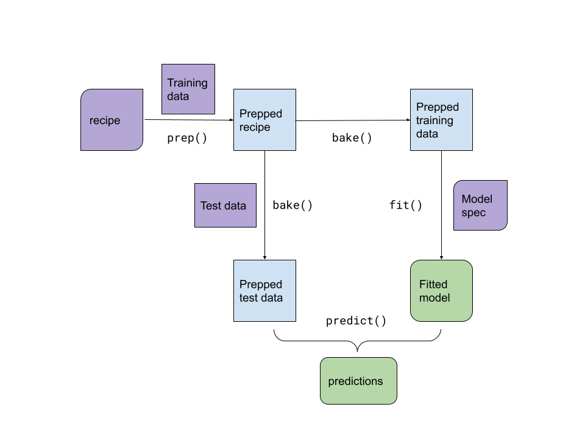

# A model workflow

**Learning objectives:**

- Explain why a **model workflow** includes preprocessing, fitting, and post-processing.
  - Describe parts of the modeling process that **occur before the model is fit.**
  - Describe parts of the modeling process that **occur after the model is fit.**
- Use the `{workflows}` package to **create a simple workflow.**
  - **Add a model** to a workflow.
  - **Add a formula** to a workflow.
  - **Fit** a workflow.
  - Use a workflow to **predict new data.**
  - **Update** a workflow.
- Use `{recipes}` with `{workflows}`.
  - **Add a recipe** to a workflow.
  - Use `workflows::pull_*()` to **extract objects from fitted workflows.**
- Describe how a workflow that uses a formula decides how to pre-process data.
  - Describe how workflows **using tree-based models** pre-process factor predictors.
  - **Add a special formula** to a workflow with the `formula` argument to `workflows::add_model()`.
- Describe workflow steps that are **not yet included** in `{tidymodels}`.

## Workflows

A single object to wrap the pre-processing and model fitting.



[Link to drawing](https://docs.google.com/drawings/d/1TbasFufN0y2vmj83Gn5u3IUx7Fsov0Ls3_Vqr6ns8FU/edit)

Workflows help you manage fewer objects and call fewer functions to achieve your goal.

## Demonstration

```{r setup-08, message=FALSE}
library(tidyverse)
library(tidymodels)
tidymodels_prefer()
set.seed(123)
```


A previous Tidy Tuesday dataset is used for demonstration. References:

- [Tidy Tuesday description](https://github.com/rfordatascience/tidytuesday/blob/master/data/2020/2020-01-28/readme.md)
- [Data source](https://data.sfgov.org/City-Infrastructure/Street-Tree-List/tkzw-k3nq)

```{r 08_read_sf_trees}
sf_trees <- readr::read_csv('https://raw.githubusercontent.com/rfordatascience/tidytuesday/master/data/2020/2020-01-28/sf_trees.csv')
kableExtra::kable(head(sf_trees, 10)) %>% kableExtra::scroll_box(width = '100%')
```

The goal will be to predict dbh which means diameter at breast height.

### Some data exploration and cleaning

```{r skim_sf_trees}
kableExtra::kable(skimr::skim(sf_trees)) %>% kableExtra::scroll_box(width = '100%')
# DataExplorer::create_report(sf_trees)
```


```{r sf_trees_cleaning}
trees_cleaned <- sf_trees %>%
  rename(diam = dbh, date_planted = date) %>%
  filter(!is.na(diam)) %>%
  filter(!is.na(legal_status)) %>%
  filter(latitude <= 40 & longitude >= -125) %>%
  filter(diam <= 100 & diam > 0) %>%
  filter(site_order >= 0) %>%
  select(-plot_size)

kableExtra::kable(skimr::skim(trees_cleaned)) %>% kableExtra::scroll_box(width = '100%')
```

```{r sf_trees_eda_plots}
ggplot(trees_cleaned, aes(x = diam)) +
  geom_histogram() +
  scale_x_log10()

ggplot(trees_cleaned, aes(x = date_planted, y = diam)) +
  geom_bin2d() +
  geom_smooth()
```

## Modeling with workflows

```{r common_modeling_setup_08}
trees_split <- initial_split(trees_cleaned %>% mutate(diam = log10(diam)), prop = 0.8)
trees_training <- training(trees_split)
trees_testing <- testing(trees_split)
```

```{r sf_trees_first_workflow}
trees_recipe <- recipe(trees_training, diam ~ .) %>%
  update_role(tree_id, address, new_role = "id") %>%
  step_indicate_na(date_planted) %>%
  # really dummy imputation
  step_mutate(date_planted = if_else(!is.na(date_planted), date_planted, as.Date('1950-01-01'))) %>%
  step_other(all_nominal_predictors(), threshold = 0.01) %>%
  step_dummy(all_nominal_predictors())

linear_model_spec <- linear_reg() %>% set_engine("lm")

tree_workflow_lm <- workflow() %>%
  add_model(linear_model_spec) %>%
  add_recipe(trees_recipe)
```

```{r sf_trees_fit_and_examine}
fitted_workflow_lm <- tree_workflow_lm %>% fit(trees_training)

tidy(extract_recipe(fitted_workflow_lm), 3)
tidy(extract_fit_parsnip(fitted_workflow_lm))
```

```{r sf_trees_predict_and_eval}
trees_testing$pred_lm <- predict(fitted_workflow_lm, trees_testing)$.pred

rmse(trees_testing, diam, pred_lm)
```

### Different model, same recipe

```{r sf_trees_rf_predict_and_eval}
rand_forest_spec <- rand_forest(
  mode = 'regression',
  mtry = 3,
  trees = 50,
  min_n = 10
) %>% 
  set_engine('ranger')

tree_workflow_rf <- tree_workflow_lm %>%
  update_model(rand_forest_spec)

fitted_workflow_rf <- tree_workflow_rf %>% fit(trees_training)

trees_testing$pred_rf <- predict(fitted_workflow_rf, trees_testing)$.pred

rmse(trees_testing, diam, pred_lm)
rmse(trees_testing, diam, pred_rf)
```


### Same model, different preprocessing

```{r sf_trees_formula}
formula_predictions <- tree_workflow_lm %>%
  remove_recipe() %>% 
  add_formula(diam ~ is.na(date_planted) + longitude) %>%
  fit(trees_training) %>%
  predict(trees_testing)

rmse_vec(trees_testing$diam, formula_predictions$.pred)
```

## Managing many workflows

```{r managing_many_workflows}
rand_forest_spec <- rand_forest(
  mode = 'regression',
  mtry = 2,
  trees = 25,
  min_n = 10
) %>% 
  set_engine('ranger')
tree_workflows <- workflow_set(
  preproc = list(
    "variables" = workflow_variables(diam, c(longitude, latitude, site_order)),
    "simple_formula" = diam ~ is.na(date_planted) + longitude + latitude,
    "trees_recipe" = trees_recipe
  ),
  models = list(
    "lm" = linear_model_spec,
    "rf" = rand_forest_spec
  )
)

tree_workflows
```

```{r using_workflow_sets}
tree_predictions <- tree_workflows %>%
  rowwise() %>%
  mutate(fitted_wf = list(fit(info$workflow[[1]], trees_training))) %>%
  mutate(pred = list(predict(fitted_wf, trees_testing)))

tree_predictions %>%
  mutate(rmse = rmse_vec(trees_testing$diam, pred$.pred))
```


## Notes

- how the formula is used will depend on the model specification
- If a modeling package uses the formula not only for pre-processing or has a syntax not supported by `model.matrix` you can specify a formula in `add_model`
- Later the `{workflows}` package will contain tools to help with post processing, such as creating hard predictions from class probabilities.


## Meeting Videos

### Cohort 1

`r knitr::include_url("https://www.youtube.com/embed/0vgcdWw3k6E")`

<details>
  <summary> Meeting chat log </summary>
  
```
00:13:53	Tyler Grant Smith:	i used skimr today on a dataset with 77 million rows and 200 columns...it took a while
00:14:14	Tan Ho:	The official R soundtrack https://www.youtube.com/watch?v=-9BzWBufH1s
00:14:19	Tyler Grant Smith:	that would have been smart...oh well
00:14:35	Ben Gramza:	https://www.kaggle.com/yamaerenay/spotify-dataset-19212020-160k-tracks
00:16:21	Tony ElHabr:	i'm blind
00:16:31	Asmae Toumi:	pAIN
00:16:42	Jordan Krogmann:	the humanity
00:16:54	Scott Nestler:	I just turned off my Vitamin D sunlamp.
00:17:01	Jordan Krogmann:	coobalt
00:17:03	Jordan Krogmann:	= love
00:17:14	Tony ElHabr:	bad programmers use light mode so they can see their bugs
00:17:15	Tyler Grant Smith:	thanks
00:17:16	Jim Gruman:	monokai
00:17:31	Tan Ho:	correct pane layout tho
00:17:34	Tan Ho:	much appreciate
00:17:37	Asmae Toumi:	Absolutely not
00:17:48	Jim Gruman:	console, upper right...
00:21:20	Jon Harmon (jonthegeek):	Is there actually no chat, or does zoom just not show it to me when I'm late?
00:21:28	Tony ElHabr:	it doesn't show
00:21:29	Tan Ho:	you don't see it if you're late
00:21:40	Jordan Krogmann:	yeah there were some comments up top
00:21:53	Jon Harmon (jonthegeek):	Ok. That's funny, since I can see the full log after the meeting.
00:26:25	Tony ElHabr:	steps like step_meanimpute will only do work on the training data, so you avoid data leakage
00:26:31	Jordan Krogmann:	+1
00:29:57	Asmae Toumi:	I do it with insurance costs a lot because I don’t want to throw out the information in claims with 0$
00:30:58	Asmae Toumi:	My internet is bad but I do use an offset
00:31:30	Jim Gruman:	step_YeoJohnson and step_BoxCox would be better choices
00:32:11	Tyler Grant Smith:	^
00:32:37	Tony ElHabr:	are they always better tho?
00:35:38	Tyler Grant Smith:	well yeo johnson is a generalization og log1p
00:36:22	Tony ElHabr:	ah right. google verifies this is true
00:36:39	Pavitra Chakravarty:	thanks Jon
00:36:41	Tyler Grant Smith:	sure?
00:36:46	Tyler Grant Smith:	no idea me neither
00:42:31	Jordan Krogmann:	tidy is black magic
00:43:40	Tony ElHabr:	how do we feel about super long function names like `pull_workflow_prepped_recipe()`
00:44:39	Jordan Krogmann:	%<>% update_formula() would overwrite it
00:45:28	Conor Tompkins:	Long specific functions are better than “bake” and “juice” IMO
00:45:58	Tony ElHabr:	yeah i agree
00:46:15	Scott Nestler:	Back to the log(0) issue.  Transformations like log(x+c) where c is a positive constant "start value" can work--and can be indicated even when no value of x is zero--but sometimes they destroy linear relationships.
00:46:26	Scott Nestler:	Here's the other method I recall seeing (in Hosmer, Lemeshow, & Sturdivant's Logistic Regression book):   A good solution is to create two variables. One of them equals log(x) when x is nonzero and otherwise is anything; it's convenient to let it default to zero. The other, let's call it zx, is an indicator of whether x is zero: it equals 1 when x=0 and is 0 otherwise.
00:47:31	Scott Nestler:	These terms contribute a sum βlog(x)+β0zx to the estimate. When x>0, zx=0 so the second term drops out leaving just βlog(x). When x=0, "log(x)" has been set to zero while zx=1, leaving just the value β0. Thus, β0 estimates the effect when x=0 and otherwise β is the coefficient of log(x).
00:47:57	Scott Nestler:	Found a reference to it here:  https://stats.stackexchange.com/questions/4831/regression-transforming-variables
00:54:16	Asmae Toumi:	Resampling is my chapter *cracks knuckles*
00:54:28	Asmae Toumi:	nooooope
00:54:39	Scott Nestler:	rf_fit_rs <- 
  rf_wf %>% 
  fit_resamples(folds)
00:55:26	Conor Tompkins:	Right Scott, that will contain the results of the fit
00:55:49	Conor Tompkins:	If you keep the .pred, that is
00:56:20	Jordan Krogmann:	Asmae, time to voluntell someone!
00:56:32	Asmae Toumi:	Let me play the music of my people
00:56:37	Asmae Toumi:	I nominateeeeeeeeeeeeeeee
00:56:40	Tan Ho:	JOE
00:56:41	Asmae Toumi:	JOE
00:56:45	Asmae Toumi:	WE DID IT JOE
00:56:52	Jordan Krogmann:	lol
00:57:10	Asmae Toumi:	https://www.youtube.com/watch?v=dP6_pYYWAT8
00:57:11	Asmae Toumi:	This is the song
00:57:50	Asmae Toumi:	asorry
00:57:51	Asmae Toumi:	https://www.youtube.com/watch?v=-9BzWBufH1s
00:57:52	Jon Harmon (jonthegeek):	https://www.youtube.com/watch?v=-9BzWBufH1s
00:57:53	Asmae Toumi:	THIS IS IT
00:58:52	Jordan Krogmann:	Thanks!
00:59:04	Asmae Toumi:	Goodnight gang
```
</details>

### Cohort 2

`r knitr::include_url("https://www.youtube.com/embed/sNrJrEiPF0U")`

<details>
  <summary> Meeting chat log </summary>
  
```
00:14:55	Janita Botha:	THIS IS SOOOOO COOL!!!!
00:33:32	shamsuddeen:	This is good Kevin. Tidy Modelling should have something like this incorporated in a workflow.
00:33:33	shamsuddeen:	Tidy target
00:48:17	Roberto Villegas-Diaz:	https://snakemake.readthedocs.io/en/stable/
00:52:40	shamsuddeen:	Thanks Kevin
```
</details>


### Cohort 3

`r knitr::include_url("https://www.youtube.com/embed/J29iQXGmw8w")`

<details>
  <summary> Meeting chat log </summary>
  
```
00:06:03	Daniel Chen (he/him):	hello. i'm here. just finishing up stuff before meeting
00:06:44	Ildiko Czeller:	welcome Federica. is this your first tidymodels bookclub?
00:15:21	Federica Gazzelloni:	@Ildiko hello yes, just jumped in. Thanks!
00:16:05	Toryn Schafer (she/her):	Welcome!
00:16:40	Daniel Chen (he/him):	Q: the bake() gives you the data after all those step_() functions from recipies?
00:17:39	Toryn Schafer (she/her):	Yes, I think that’s right, Daniel. From the help page the value of bake() is: “A tibble, matrix, or sparse matrix that may have different columns than the original columns in new_data.”
00:22:45	Daniel Chen (he/him):	what is the response/y variable for this dataset?
00:28:36	Daniel Chen (he/him):	oh I see it's `diam`
00:41:56	Federica Gazzelloni:	@Toryn thanks very interesting
00:45:24	Federica Gazzelloni:	Hello @Daniel 
00:45:37	Daniel Chen (he/him):	so working with workflow_sets still needs you to drop into rowwise? there's no function to fit those models for you?
00:45:49	Daniel Chen (he/him):	hello @Federica!
00:47:27	Toryn Schafer (she/her):	In the book they used map instead of rowwise, but yeah doesn’t seem to be one function: map(info, ~ fit(.x$workflow[[1]], ames_train))
00:54:39	Federica Gazzelloni:	need to go, very good job! see you next time hopefully
01:07:43	Ildiko Czeller:	https://www.tidymodels.org/learn/develop/
01:08:24	Ildiko Czeller:	https://hardhat.tidymodels.org/
01:09:07	Ildiko Czeller:	https://tidymodels.github.io/model-implementation-principles/
```
</details>

### Cohort 4

`r knitr::include_url("https://www.youtube.com/embed/lnfMBSgSRcQ")`
