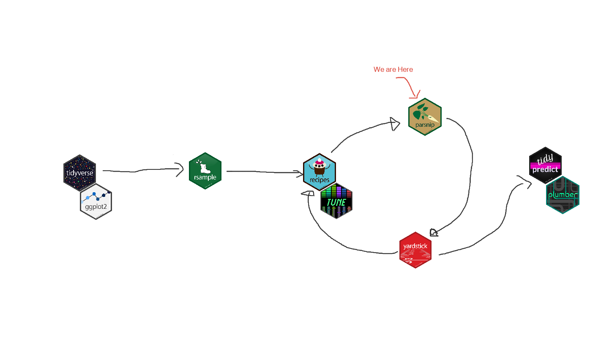
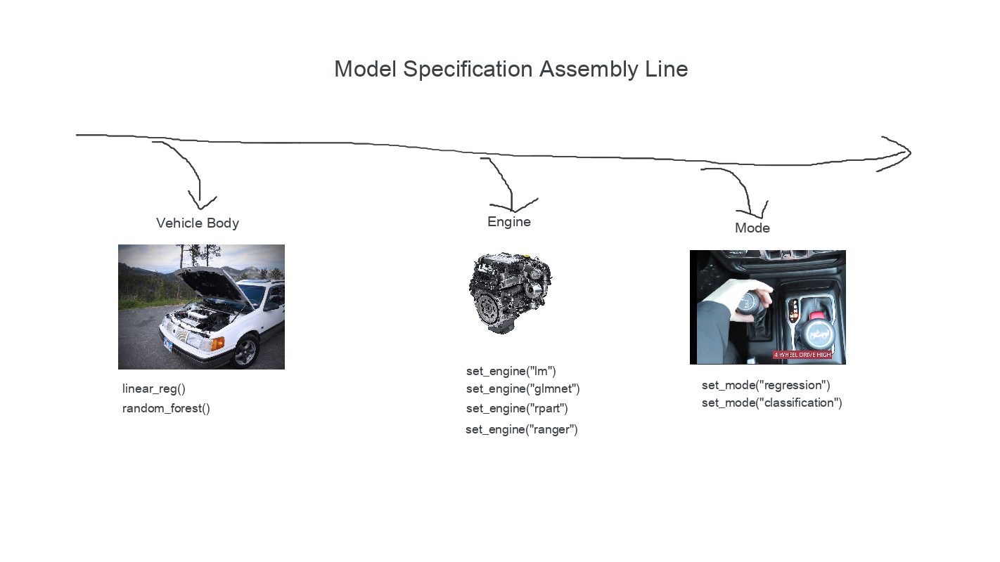
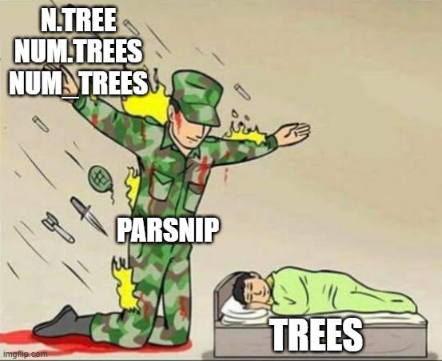

# Fitting models with parsnip

**Learning objectives:**

- Identify ways in which **model interfaces can differ.** x
- **Specify a model** in `{parsnip}`. x
- **Fit a model** with `parsnip::fit()` and `parsnip::fit_xy()`. x
- Describe how `{parsnip}` **generalizes model arguments.** x
- Use `broom::tidy()` to **convert model objects to a tidy structure.** x
- Use `dplyr::bind_cols()` and the `predict()` methods from `{parsnip}` to **make tidy predictions. **
- **Find interfaces to other models** in `{parsnip}`-adjacent packages. 

<details>
  <summary> Modeling Map </summary>
  
  

- __Chapter Setup Below__

```{r set-up-07, warning=FALSE, message=FALSE}
# load parsnip, recipes, rsample, broom...
library(tidymodels)
library(AmesHousing)

# attach data
data(ames)

# log scale price
ames <- mutate(ames, Sale_Price = log10(Sale_Price))

# train/test
set.seed(123)
ames_split <- initial_split(ames, prob = 0.80, strata = Sale_Price)
ames_train <- training(ames_split)
ames_test  <-  testing(ames_split)
```  

</details>


<br>

## Create a Model


### Different Model Interfaces

  


<br>

- Model Interfaces
  - Different Implementations = Different Interfaces
  - _Linear Regression_ can be implemented in many ways
    - Ordinary Least Squares
    - Regularized Linear Regression 
    - ...

<br>

- __{stats}__
  - takes formula
  - uses `data.frame`

```{r lm-interface, eval=FALSE}
lm(formula, data, ...)
```

<br>


- __{glmnet}__ 
  - Has x/y interface
  - Uses a matrix

```{r glmnet-interface, eval=FALSE}
glmnet(x = matrix, y = vector, family = "gaussian", ...)
```

<br>
<br>

### Model Specification



- __{tidymodels}/{parsnip}__ - Philosophy is to unify & make interfaces more predictable.
  - Specify model type (e.g. linear regression, random forest ...)
    - `linear_reg()`
    - `rand_forest()`
  - Specify engine (i.e. package implementation of algorithm)
    - `set_engine("some package's implementation")`
  - declare mode (e.g. classification vs linear regression)
    - use this when model can do both classification & regression
    - `set_mode("regression")`
    - `set_mode("classification")`
    
  
<br>

- __Bringing it all together__

```{r model-spec}
lm_model_spec <- 
  linear_reg() %>% # specify model
  set_engine("lm") # set engine


lm_model_spec
```


<br>
<br>


### Model Fitting

From above we will use our existing model specification


<br>

- `fit()`
  - any nominal or categorical variables will be split out into dummy columns
  - _most_ formula methods also turn do the same thing
- `fit_xy`
  - delays creating dummy variable and has underlying model function

```{r model-fit}
# create model fit using formula
lm_form_fit <- 
  lm_model_spec %>% 
  fit(Sale_Price ~ Longitude + Latitude, data = ames_train)


# create model fit using x/y
lm_xy_fit <- 
  lm_model_spec %>% 
  fit_xy(
    x = ames_train %>% select(Longitude, Latitude),
    y = ames_train %>% pull(Sale_Price)
    )

```

<br>
<br>


### Generalized Model Arguments


- Like the varying interfaces, model parameters differ from implementation to implementation
- two level of model arguments
  - __main arguments__ - Parameters aligned with the mathematical vehicle
  - __engine arguments__ - Parameters aligned with the package implementation of the mathematical algorithm


```{r package-param-comparisions, echo=FALSE}
tribble(
 ~argument,     ~ranger,  ~randomForest, ~sparklyr,
  "sampled predictors",    "mtry", "mtry", "feature_subset_strategy",
  "trees",    "num.tress", "ntree", "num_trees",
  "data points to split",    "min.node.size", "nodesize", "min_instances_per_node"
) %>% 
  knitr::kable()
```

<br>

  

```{r parsnip-param-comparisions, echo=FALSE}
tribble(
 ~argument,              ~parsnip,
  "sampled predictors",  "mtry",  
  "trees",               "trees",
  "data points to split","min_n"  
) %>% 
  knitr::kable()
```


<br>




<br>


+ The `translate()` provides the mapping from the parsnips interface to the each individual package's implementation of the algorithm.

```{r model-package-differences}
# stats implementation
linear_reg() %>% 
  set_engine("lm") %>% 
  translate()


# glmnet implementation
linear_reg(penalty = 1) %>% 
  set_engine("glmnet") %>% 
  translate()
```


## Use Model results


Now that we have a fitted model we will need to pull some summary information from it we will use two extremely _fun_ functions from the `{broom}` package to help us out (`tidy()` & `glance()`). 


+ `tidy()` - Has a bunch of versatility, but for our context it can take our model object and return our model coefficients into a nice tibble.

```{r broom-tidy}
broom::tidy(lm_form_fit) %>% 
  knitr::kable()
```

<br>

+ `glance()` - allows us in this context to convert our model's summary statistics into a `tibble`

```{r broom-glance}
broom::glance(lm_form_fit) %>% 
  knitr::kable()
```


## Make Predictions


- __Rules to Live by__: 
  - Returns a tibble
  - Column names are ... erh Predictable
  - Return the same number of rows as are in the data set
    - some predict functions omit observations with `NA` values.  Which is great if that's what you intend, but if you aren't expecting that behavior you would have to find out the hard way.


```{r predict-new-data}
# create example test set
ames_test_small <- ames_test %>% slice(1:5)

# predict on test set
predict(lm_form_fit, new_data = ames_test_small) %>% 
  knitr::kable()
```

<br>

- Combining `bind_cols` with our predict function we can merge our predictions back to the test set.

```{r combine-07}
# add predictions together with actuals
ames_test_small %>%
  select(Sale_Price) %>%
  bind_cols(predict(lm_form_fit, ames_test_small)) %>%
  # Add 95% prediction intervals to the results:
  bind_cols(predict(lm_form_fit, ames_test_small, type = "pred_int")) %>% 
  knitr::kable()
```

## {tidymodels}-Adjacent Packages

- Opinions can be shared, other modeling packages can use the same opinion to replicate a workflow. The `{discrim}`^[Discrim Package [Link](https://github.com/tidymodels/discrim)] package adds a new set of mathematical models to our arsenal of tools.
  - `discrim_flexible()` `%>%` - Mathematical Model or if we are using my terrible analogy the car body
    - `set_engine("earth")` - The package we want to approximate our discriminat analysis

```{r adjacent-packages, warning=FALSE, message=FALSE}
# devtools::install_github("tidymodels/discrim") # to install
# load package
library(discrim)

# create dummy data
parabolic_grid <-
  expand.grid(X1 = seq(-5, 5, length = 100),
              X2 = seq(-5, 5, length = 100))

# fit model from discrim
fda_mod <-
  discrim_flexible(num_terms = 3) %>% 
  set_engine("earth") %>%
  fit(class ~ ., data = parabolic)

# assigning predictions to data frame
parabolic_grid$fda <-
  predict(fda_mod, parabolic_grid, type = "prob")$.pred_Class1

# plotting prediction
library(ggplot2)
ggplot(parabolic, aes(x = X1, y = X2)) +
  geom_point(aes(col = class), alpha = .5) +
  geom_contour(data = parabolic_grid, aes(z = fda), col = "black", breaks = .5) +
  theme_bw() +
  theme(legend.position = "top") +
  coord_equal()
```


## Summary

- __Create a Common Interface__ - All models are comprised of some core components
  - mathematical model
  - engine implementation
  - mode if needed
  - Arguments
    - Main - algorithm specific (trees, mtry, penalty)
    - Engine - Package/Engine specific  (e.g. verbose, num.threads, ...)
- __Predictable Behavior__
  - tibble in, tibble out
  - same number of observations returned for `predict()`

## Meeting Videos

### Cohort 1

`r knitr::include_url("https://www.youtube.com/embed/97VLayRdu-A")`

<details>
  <summary> Meeting chat log </summary>
  
  ```
00:15:40	Tan Ho:	YESSS
00:15:58	Tan Ho:	(@ the drake meme)
00:21:51	Tyler Grant Smith:	space advantage
00:23:32	Asmae :	what's that
00:24:28	Jim Gruman:	http://www.feat.engineering/categorical-trees.html on dummies or no-dummies with trees
00:24:37	Tony ElHabr:	amazing meme
00:24:48	Tony ElHabr:	I am physically applauding
00:25:03	Scott Nestler:	Some additional discussion regarding fit_xy() at tidyverse.org/blog/2019/04/parsnip-internals, related to possible range of mtry variables when you don't know number of predictors before recipe is prepped.
00:25:56	Scott Nestler:	Is there a typo in the book after tables toward end of 7.1 where it talks about common argument names?  It mentions num_n but I think they meant min_n.  What do others think?  Or is num_n actually used?
00:26:30	Conor Tompkins:	Scott I think Jon made a PR to fix that typo
00:26:53	Scott Nestler:	Thx.  I hadn't checked yet.  Just caught it in a quick read right before we started.
00:31:15	Scott Nestler:	There are actually 30 different model types and engines at https://www.tidymodels.org/find/parsnip/ that work with parsnip.
00:43:55	Tony ElHabr:	yay volunteers
00:44:48	Andy Farina:	Thanks Jordan, excellent presentation
```
</details>
