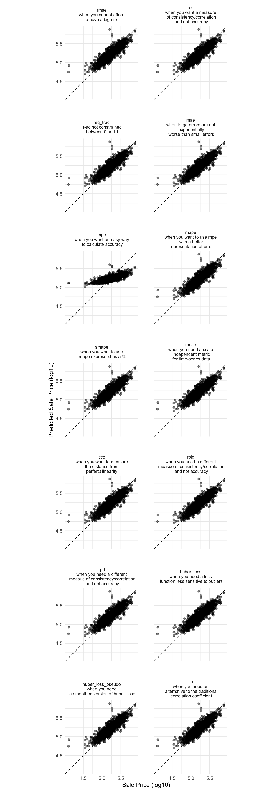
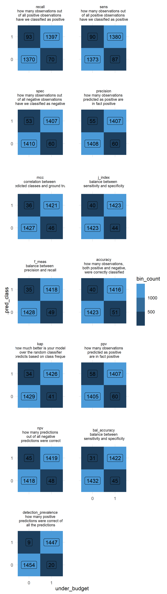

# Judging model effectiveness

**Learning objectives:**

- Explain why **measures of model fit** to actual data **are important** even for purely inferential models.
- Use `{yardstick}` to compute regression metrics.
  - Recognize `{yardstick}` function output.
  - Create a metric set with `yardstick::metric_set()`.
- Use `{yardstick}` to compute binary classification metrics.
  - Describe the common arguments for `{yardstick}` classification metrics.
  - Visualize a binary classification model fit using `{yardstick}` and `{ggplot2}`.
- Use `{yardstick}` to compute multi-class classification metrics.
  - Extend an explicitly binary metric such as `sensitivity()` to multiple classes using `{yardstick}`.
- Combine `{yardstick}` metrics with `dplyr::group_by()`.
  - Visualize a model fit for different groups using `{yardstick}`, `{dplyr}`, and `{ggplot2}`

## Measures of Model Fit
- Empirical Validation: a quantitative approach for estimating effectiveness
- Focused on how close our predictions come to the observed data
- Optimization of statistical characteristics of the model does not imply that the model fits the data well
- Choice of which metrics to examine can be critical


## Disclaimers
- These examples are to demonstrate metric evaluation not good data science!
- Explore the full set of metrics available through `{yardstick}`
- Talk through use cases for different metrics


## Regression Metrics

Load in the Data
```{r load-ames}
library(tidymodels)
library(glmnet)
library(ranger)
set.seed(1123)
data(ames)

ames <- ames %>%
  mutate(
    under_budget = as.factor(if_else(Sale_Price<=160000,1,0)),
    Sale_Price = log10(Sale_Price))

```

```{r best-models-setup, eval=FALSE}
#Cross-fold validation
ames_folds <- vfold_cv(ames, v = 5)

#Create Recipe
ames_recipe <- 
  recipe(formula = Sale_Price ~ Gr_Liv_Area + Full_Bath + Half_Bath + Lot_Area + Neighborhood + Overall_Cond,
         data = ames) %>%
  step_dummy(all_nominal())

#Set the model and hyperparameters
ames_spec <- 
  linear_reg(penalty = tune(), mixture = tune()) %>% 
  set_mode("regression") %>% 
  set_engine("glmnet")

#Create workflow
ames_workflow <- 
  workflow() %>%
  add_recipe(ames_recipe) %>%
  add_model(ames_spec)

#Create metric set of all regression metrics
ames_tune <-
  tune_grid(
    ames_workflow,
    metrics =
      metric_set(rmse, rsq, rsq_trad, mae, mpe, mape, smape, mase, ccc, rpiq, rpd, huber_loss, huber_loss_pseudo, iic),
    resamples = ames_folds,
    grid = grid_latin_hypercube(penalty(), mixture(), size = 8)
  )

#Pick the best model for each metric and pull out the predictions
best_models <- 
  tibble(
    metric_name = c('rmse', 'rsq', 'rsq_trad', 'mae', 'mpe', 'mape', 'smape', 'mase',
                    'ccc','rpiq', 'rpd', 'huber_loss', 'huber_loss_pseudo', 'iic')) %>% 
  mutate(metric_best = map(metric_name, ~select_best(ames_tune, .x)),
         wf_best = map(metric_best, ~finalize_workflow(ames_workflow, .x)),
         fit_best = map(wf_best, ~fit(.x, data = ames)),
         df_pred = map(fit_best, ~ames %>% bind_cols(predict(.x, new_data = ames)) %>% select(Sale_Price, .pred))) %>%
  select(-c(wf_best, fit_best)) %>% 
  unnest(cols = c(metric_name, metric_best, df_pred))

#Plot!
best_models %>% 
  mutate(metric_desc = factor(
    metric_name, 
    levels = c('rmse', 'rsq', 'rsq_trad', 'mae', 'mpe', 'mape', 'smape', 'mase',
               'ccc','rpiq', 'rpd', 'huber_loss', 'huber_loss_pseudo', 'iic'),
    labels = c('rmse\nwhen you cannot afford\n to have a big error', 
               'rsq\nwhen you want a measure\n of consistency/correlation\n and not accuracy', 
               'rsq_trad\n r-sq not constrained\n between 0 and 1',
               'mae\nwhen large errors are not\n exponentially\n worse than small errors', 
               'mpe\nwhen you want an easy way\n to calculate accuracy', 
               'mape\nwhen you want to use mpe\n with a better\n representation of error', 
               'smape\nwhen you want to use\n mape expressed as a %', 
               'mase\nwhen you need a scale\n independent metric\n for time-series data',
               'ccc\nwhen you want to measure\n the distance from \nperferct linearity',
               'rpiq\nwhen you need a different\n measue of consistency/correlation\n and not accuracy', 
               'rpd\nwhen you need a different\n measue of consistency/correlation\n and not accuracy', 
               'huber_loss\nwhen you need a loss\n function less sensitive to outliers', 
               'huber_loss_pseudo\nwhen you need\n a smoothed version of huber_loss', 
               'iic\nwhen you need an\n alternative to the traditional\n correlation coefficient'))) %>% 
  ggplot(aes(x = Sale_Price, y = .pred)) + 
  geom_abline(lty = 2) + 
  geom_point(alpha = 0.5) + 
  labs(y = "Predicted Sale Price (log10)", x = "Sale Price (log10)") +
  coord_obs_pred() +
  facet_wrap(~metric_desc, ncol = 2) +
  theme_minimal() +
  theme(panel.spacing = unit(2, "lines"),
        strip.text.x = element_text(size = 8))
```


```{r best-models-load, include=FALSE}
best_models <- readRDS(here::here("data", "09-best_models.rds"))
```

```{r best-models}
best_models %>% select(metric_name, penalty, mixture) %>% distinct()
```

## Binary Classification Metrics

Note: This code might take several minutes (or longer) to run.

```{r binary-classification-setup, eval=FALSE}
#Cross-fold validation
ames_folds_binary <- vfold_cv(ames, v = 5)

#Create Recipe
ames_recipe_binary <- 
  recipe(formula = under_budget ~ Gr_Liv_Area + Full_Bath + Half_Bath + Lot_Area + Neighborhood + Overall_Cond,
         data = ames)

#Set the model and hyperparameters
ames_spec_binary <- 
    rand_forest(mtry = tune(), trees = tune(), min_n = tune()) %>% 
  set_mode("classification") %>% 
  set_engine("ranger")

#Create workflow
ames_workflow_binary <- 
  workflow() %>%
  add_recipe(ames_recipe_binary) %>%
  add_model(ames_spec_binary)

#Create metric set of all binary metrics
ames_tune_binary <-
  tune_grid(
    ames_workflow_binary,
    metrics =
      metric_set(sens,spec,recall,precision,mcc,j_index,f_meas,accuracy,
                 kap,ppv,npv,bal_accuracy,detection_prevalence),
    resamples = ames_folds_binary,
    grid = grid_regular(
      mtry(range = c(2, 6)),
      min_n(range = c(2, 20)),
      trees(range = c(10,100)),
      levels = 10
    )
  )

#Pick the best model for each metric and pull out the predictions
best_models_binary <- 
  tibble(
    metric_name = c('recall','sens','spec', 'precision','mcc','j_index','f_meas','accuracy',
                    'kap','ppv','npv','bal_accuracy','detection_prevalence')) %>% 
  mutate(metric_best = map(metric_name, ~select_best(ames_tune_binary, .x)),
         wf_best = map(metric_best, ~finalize_workflow(ames_workflow_binary, .x)),
         fit_best = map(wf_best, ~fit(.x, data = ames)),
         df_pred = map(fit_best, ~ames %>% bind_cols(predict(.x, new_data = ames)) %>% select(under_budget, .pred_class))) %>%
  select(-c(wf_best, fit_best)) %>% 
  unnest(cols = c(metric_name, metric_best, df_pred))

# Plot!
best_models_binary %>%
  mutate(metric_desc = factor(
    metric_name, 
    levels = c('recall','sens','spec', 'precision','mcc','j_index','f_meas','accuracy',
               'kap','ppv','npv','bal_accuracy','detection_prevalence'),
    labels = c('recall\nhow many observations out \nof all positive observations \nhave we classified as positive',
               'sens\nhow many observations out \nof all positive observations \nhave we classified as positive',
               'spec\nhow many observations out \nof all negative observations \nhave we classified as negative', 
               'precision\nhow many observations \npredicted as positive are \nin fact positive',
               'mcc\ncorrelation between \npredicted classes and ground truth',
               'j_index\nbalance between \nsensitivity and specificity',
               'f_meas\nbalance between \nprecision and recall',
               'accuracy\nhow many observations,\n both positive and negative,\n were correctly classified',
               'kap\nhow much better is your model\n over the random classifier\n that predicts based on class frequencies',
               'ppv\nhow many observations\n predicted as positive\n are in fact positive',
               'npv\nhow many predictions\n out of all negative\n predictions were correct',
               'bal_accuracy\nbalance between\n sensitivity and specificity',
               'detection_prevalence\nhow many positive\n predictions were correct of\n all the predictions'))) %>% 
  group_by(metric_desc, under_budget, .pred_class) %>% 
  summarise(bin_count = n()) %>% 
  ungroup() %>% 
  ggplot(aes(x = under_budget, y = .pred_class, fill = bin_count, label = bin_count)) +
  scale_fill_binned() +
  geom_tile() +
  geom_label() +
  coord_fixed() +
  facet_wrap(~metric_desc, ncol = 2) +
  theme_minimal() +
  theme(panel.spacing = unit(2, "lines"),
        strip.text.x = element_text(size = 8))
```



## References

[Regression Classification Metrics](https://www.h2o.ai/blog/regression-metrics-guide/)

[Binary Classification Metrics](https://towardsdatascience.com/the-ultimate-guide-to-binary-classification-metrics-c25c3627dd0a)

[Tidymodels Function Reference](https://yardstick.tidymodels.org/reference/index.html)

[Custom Metrics](https://yardstick.tidymodels.org/articles/custom-metrics.html)

## Meeting Videos

### Cohort 1

`r knitr::include_url("https://www.youtube.com/embed/xvJRRmEG1yc")`

<details>
  <summary> Meeting chat log </summary>
  
```
00:14:27	Jonathan Trattner:	Is there supposed to be sound?
00:16:42	Jonathan Trattner:	I love how R’s parent S is up next
00:24:03	Asmae Toumi:	Amazing
00:24:49	Scott Nestler:	This whole chapter reminds me of a classic 2010 paper from my professor and friend Galit Shmueili, "To Explain or to Predict?"  https://projecteuclid.org/journals/statistical-science/volume-25/issue-3/To-Explain-or-to-Predict/10.1214/10-STS330.full
00:25:48	Scott Nestler:	Correction … her last name is Shmueli (had an extra 'i' in there).
00:26:08	Andy Farina:	This chapter reminded me of a quote I have heard numerous times from my advisor over the past few years…”All models are wrong, some are useful”
00:26:24	Jon Harmon (jonthegeek):	Hehe, yup!
00:28:11	Ben Gramza:	I seem to hear that George Box quote 10000000 times a year
00:28:42	Conor Tompkins:	map() go brrrrr
00:30:25	Conor Tompkins:	Would be cool to create a raster of the density of the points, and find the differences between models
00:30:45	Jon Harmon (jonthegeek):	I'm a little skeptical, we'll have to dig into that code!
00:31:30	Scott Nestler:	Something doesn't seem right.  Some of these metrics should *not* come up with the same results.
00:35:49	Conor Tompkins:	Can you expect higher RMSE in general for higher priced homes? Ie $3 million. Is it better to use a percentage error term if that is the case?
00:54:24	Jonathan Trattner:	Gotta head out now. Thanks Joe! Great job!
00:58:20	Asmae Toumi:	Cool thanks
00:59:54	Tyler Grant Smith:	like rock is correct pronunciation
01:02:10	Scott Nestler:	A macro-average will compute the metric independently for each class and then take the average (hence treating all classes equally), whereas a micro-average will aggregate the contributions of all classes to compute the average metric.
01:02:21	Scott Nestler:	The weighted macro computes them independently, but weights them by number of observations, rather than equally.  Usually better than regular macro when there are class imbalances.
01:06:47	Andy Farina:	Excellent Joe, thank you!
```
</details>

### Cohort 2

`r knitr::include_url("https://www.youtube.com/embed/wVYp6PVJhqI")`

<details>
  <summary> Meeting chat log </summary>
  
```
00:10:24	Amélie Gourdon-Kanhukamwe (she/they):	https://www.meetup.com/tech-ethics-bristol/
00:11:52	Janita Botha:	it's a little small but ok
00:12:34	Janita Botha:	that is perfect!
00:27:39	Janita Botha:	sidewarren - but I really like the idea of a "stupid" model. What would be the equivalent in a classification model?
00:28:45	rahul bahadur:	I think that would be simply assigning all predictions to one value out of the 2
00:55:51	Janita Botha:	bye folks!
```
</details>


### Cohort 3

`r knitr::include_url("https://www.youtube.com/embed/jvN0YP37Xlg")`

<details>
  <summary> Meeting chat log </summary>
  
```
00:13:11	Ildiko Czeller:	my connection is unstable, i am here but without video for now
00:57:20	jiwan:	https://community.rstudio.com/t/predict-a-class-using-a-threshold-different-than-the-0-5-default-with-tidymodels/56273
00:58:29	Toryn Schafer (she/her):	https://www.rdocumentation.org/packages/probably/versions/0.0.6/topics/make_class_pred
00:59:06	Toryn Schafer (she/her):	https://cran.r-project.org/web/packages/probably/vignettes/where-to-use.html
00:59:42	Ildiko Czeller:	https://probably.tidymodels.org/reference/append_class_pred.html
01:01:41	Toryn Schafer (she/her):	https://adv-r.hadley.nz/fp.html
```
</details>

### Cohort 4

`r knitr::include_url("https://www.youtube.com/embed/URL")`

<details>
  <summary> Meeting chat log </summary>
  
```
LOG
```
</details>
