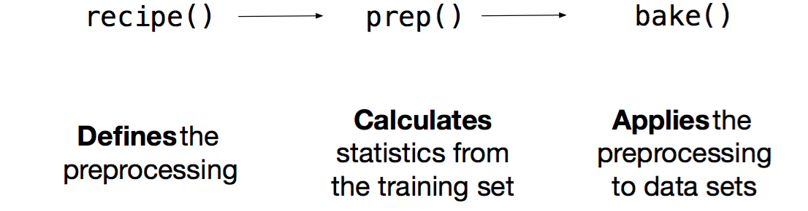
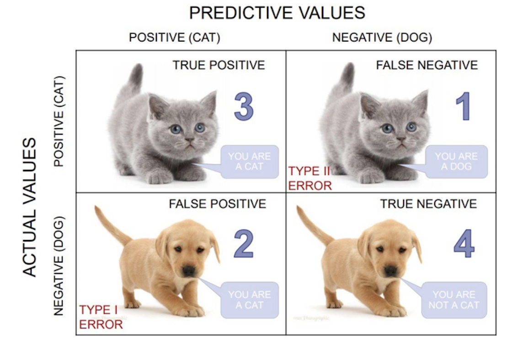

# Judging model effectiveness

**Learning objectives:**

- How will we evaluate the performance of our workflow?
- How the model will be used? (predictive strength is primary)
- How close our predictions come to the observed data?
- How closely this model fits the actual data?


## Performance Metrics and Inference

In this chapter, we will be talking about the qualities of a model, while applying several functions from the **yardstick** package.


```{r message=FALSE, warning=FALSE, include=TRUE}
library(tidyverse)
library(tidymodels)
tidymodels_prefer()
library(DiagrammeR)
library(viridis)
```


This package focuses on methods of resampling that are critical to modeling activities, such as performance measures and performance metrics.

> yardstick: Tidy Characterizations of Model Performance


**Identification of the quality of a model**:

The main takeaway of this chapter is **Judging the model effectiveness**, or identification of the effectiveness of the modeling procedures.

Constraints may arise when the model uses different units for measuring the differences between observed and predicted values. 

In particular, transformations can be applied to standardize observed values so that they can be used in the model interchangeably. Somehow if a transformation is already in place within some variables in the observed data, it will be important to identify the type of transformation applied in order to proceed with the model specification correctly.

It is even for this reason that the use of model metrics is very important. The metrics are able to summarize the results of a model.

There are different types of metrics that can be used to summarize the results of a model fit, depending on the type of response variable whether is numeric or categorical, and so if a regression or classification modeling procedure is performed.

We can use:

- the **Root Mean Squared Error (RMSE)**, a performance metric used in regression modeling.
- the **Accuracy**, to estimate the model error
- the **ROC and AUC**, the receiver observation curve and the area under the curve, respectively, if we perform a classification modeling. This curve is calculated combining the **Specificity and Sensitivity** of the model.


## A little Recap of previous chapters

A useful model would include:

- parameter estimation
- model selection and tuning
- performance assessment


### Case Study 1


The construction of a model implies: 

- `check for correlation`; to see if predictors influence each other, and in what way. For example, the predictors correlation can influence the estimation of the outcome, this can be identified when the estimated values change sign of have very different values, if a modification in association takes place.


Here we use the `crickets` data from `modeldata` package:
```{r}
data(crickets, package = "modeldata")
crickets %>% head
```


In this case we check for the correlation between the response and the predictor:
```{r}
cor(crickets$rate,crickets$temp)
```

While if we look at the correlation between predictors, which in this case one of the predictor is categorical, we need to make a transformation of the categorical predictor in order to be able to calculate the correlation. 

```{r}
crickets%>%count(species)
```

```{r}
crickets1 <- crickets%>%
  mutate(species=ifelse(species=="O. exclamationis",1,0)) 

crickets1 %>%
  head
```

```{r}
cor(crickets1$species,crickets1$temp)
```


- `construction of the model`; *sample* data are used to make a simple linear model with the function `lm()`, and a comparison of the two models is done with `anova()` function.

A little EDA, exploratory data analysis is done to identfy the relationship between response and predictors.
```{r warning=FALSE,message=FALSE}
crickets %>%
  ggplot(aes(temp,rate,color=species))+
  geom_point()+
  geom_smooth(se=F)+
  theme_linedraw()
```


```{r}
interaction_fit <-  lm(rate ~ (temp + species)^2, data = crickets) 

main_effect_fit <-  lm(rate ~ temp + species, data = crickets) 
# Compare the two: standard two-way analysis of variance 
anova(main_effect_fit, interaction_fit)
```

- `estimation of the model`; obtained using the `predict()` function; it conducts specific calculations after the fitted model is created, in this case we test it against *new data*.

```{r warning=FALSE,message=FALSE}
new_values <- data.frame(species = "O. exclamationis", 
                         temp = 15:20)
pred <- predict(main_effect_fit, new_values)

prediction_values <- bind_cols(new_values,rate=pred)

bind_rows(crickets,prediction_values)%>%
  ggplot(aes(temp,rate,color=species))+
  geom_point()+
  geom_smooth(se=F)+
  theme_linedraw()
```

### Tidymodels: modeling as a step by step mode

The strategy of **Tidymodels** is to decide for a model to use on a step-by-step mode, this is the main difference than just using `lm()` or `glm()` functions and then `predict()`.


> When valuing a model, the fundamental is to have a clear view of the data and the type of manipulation to obtain the answer to our questions


The first step is to *evaluate the structure of the data*, it needs to be balanced for deciding a smart strategy for allocating data.


Smart Strategy for allocating data:

- allocate specific subsets of data for different tasks
- allocate the largest possible amount to the model parameter estimation only

The second is to *split the data into two main parts* as train and test sets, sometimes a third set is valued such as the validation set.


Splitting data: 

- **training set** (the substrate to develop the model and estimate the parameters)

- **validation set** (a small set of data to measure performance as the network was trained)

- **test set** (the final (unbiased) arbiter to determine the efficacy of the model)


```{r}
data(ames, package = "modeldata")
set.seed(123)
ames_split <- initial_split(ames, prop = 0.80)
ames_train <- training(ames_split)
ames_test  <- testing(ames_split)
```

The step-by-step model decomposes the modeling procedure into a certain number of customized steps. 

Preprocessing model functions: 

- recipe()
- prep()
- bake()

Recipe objects for feature engineering and data preprocessing prior to modeling.


Transformations and encoding of the data with `recipes::recipe()` help choosing the option which is the most associated with the outcome, through data preprocessing techniques applying it for different models.

`recipe()` defines the formula and allows for the preprocessing steps of a model with the help of the `step_**` functions

Figure \@ref(fig:diagram1) Graph of the modeling steps  
```{r diagram1, echo = FALSE, out.width = NULL, fig.cap = "Graph of the modeling steps"}
# library(DiagrammeR)
mermaid("
graph LR
A(recipe)-->B[formula for lm]
A-->C[formula for glm]
A-->D[formula for stan]
B-- some step_ functions -->P(prep)
C-- some step_ function-->P(prep)
D-- some step_ function-->P(prep)
P-->H(bake)
G[recipe applys a formula]-->F[prep shows the steps in the recipe]
F-->E[bake releases preprocessed data]
style A fill:#f9f
style P fill:#f9f
style H fill:#f9f
style F fill:#bbf,stroke:#f66,stroke-width:2px,color:#fff,stroke-dasharray: 5 5
",height = '100%', width = '100%'
)
```

The matrix data transformation is obtained from a data frame through the modeling procedure of preprocessing data to obtain a new designed matrix.



### Workflow: to combine models and recipes 

Once the preprocessing steps are done, data are allocated to test and training sets, and the model engine is set, the next step involves wrapping everything up into a workflow to have all the steps together.


### Case Study 2

**NYC flights** data modeling

Let's see this in practice with an example taken from:
<https://www.tidymodels.org/start/recipes/>

Data are from {nycflights13} package:
```{r}
library(nycflights13) 
# tidy data and manipulation
set.seed(123)
flight_data <-
  flights %>%
  # data modification
  mutate(arr_delay = ifelse(arr_delay >= 30, "late", "on_time"),
         arr_delay = factor(arr_delay),
         date = as.Date(time_hour)) %>%
  inner_join(weather, by = c("origin", "time_hour")) %>%
  select(dep_time, flight, origin, dest, air_time, distance,
         carrier, date, arr_delay, time_hour) %>%
  na.omit() %>%
  mutate_if(is.character, as.factor)

flight_data %>% head
```

```{r}
flight_data%>%
  ggplot(aes(arr_delay))+
  geom_bar()
```

Spending our data:
```{r}
## split
set.seed(555)
data_split <- initial_split(flight_data, prop = 3/4)
train_data <- training(data_split)
test_data  <- testing(data_split)
```


Apply the recipe:
```{r}
flights_rec <-
  recipe(arr_delay ~ ., data = train_data) %>%
  update_role(flight, time_hour, new_role = "ID") %>%
  step_date(date, features = c("dow", "month")) %>%
  step_holiday(date, holidays = timeDate::listHolidays("US")) %>%
  step_rm(date) %>%
  step_dummy(all_nominal(), -all_outcomes()) %>%
    # remove columns from the data when the training
  # set data have a single value
  step_zv(all_predictors())

flights_rec %>%
  prep() %>%
  bake(new_data = NULL) %>%
  head
```

Fit a model with a recipe and apply the workflow:

1. process the recipe using the training set
2. apply the recipe to the training set
3. apply the recipe to the test set


```{r}
lr_mod <-
  logistic_reg() %>%
  set_engine("glm")
```


**Workflow**: to simplify the process a *parsnip object* pairs a model and recipe together

```{r}
flights_wflow <-
  workflow() %>%
  add_model(lr_mod) %>%
  add_recipe(flights_rec)

flights_wflow
```

**Fit**: The function to prepare the recipe and train the model from the resulting predictors

```{r}
# this takes a bit
flights_fit <-
  flights_wflow %>%
  # prepare the recipe and train the model
  fit(data = train_data)
```


**Extract** the model or recipe objects from the workflow:

```{r}
flights_fit %>%
  # pull_workflow_fit() %>%
  tidy() %>%
  head
```


Use a trained workflow to **predict** following these steps:

1. build the model (lr_mod),
2. create a preprocessing recipe (flights_rec),
3. bundle the model and recipe (flights_wflow), and
4. train the workflow using a single call to fit()


Figure \@ref(fig:diagram2) Graph of the workflow steps  
```{r diagram2, echo = FALSE, out.width = NULL, fig.cap = "Graph of the workflow steps"}
mermaid("
graph TB
A(Build the model) .->B(Create a preprocessing recipe)
A-->E(lr_mod)
B.->C(Bundle the model and recipe)
B-->F(flights_rec)
C.->D(Train the workflow using fit)
C-->G(flights_wflow)
D-->H(fit)
style A fill:#f9f
style B fill:#bbf,stroke:#f66,stroke-width:2px,color:#fff,stroke-dasharray: 5 5
style C fill:#bbf,stroke:#f66,stroke-width:2px,color:#fff,stroke-dasharray: 5 5
style D fill:#bbf,stroke:#f66,stroke-width:2px,color:#fff,stroke-dasharray: 5 5
",
height = '100%', width = '100%'
)
```


Then use the trained workflow to predict using the **test data** or any other new data:

```{r}
flights_pred <- 
  predict(flights_fit, test_data, type = "prob") %>% 
  bind_cols(test_data %>% 
              select(arr_delay, time_hour, flight))


flights_pred %>%head
```


Figure \@ref(fig:diagram3) Graph of the workflow to predict  
```{r diagram3, echo = FALSE, out.width = NULL, fig.cap = "Graph of the workflow to predict"}
mermaid("
        graph LR
        A[workflow]-->B{predict}
style A fill:#f9f
style B fill:#bbf,stroke:#f66,stroke-width:2px,color:#fff,stroke-dasharray: 5 5
        ",
height = '100%', width = '100%')
```

**How will we evaluate the performance of our workflow?**


To finally answer our question we need to check the area under the ROC curve.

- `What is a ROC curve?`

It is a curve that identifies the area of credibility of our model. To calculate the curve we use two functions: `roc_curve()` and `roc_auc()`, the curve and the area under the curve, respectively.

The ROC curve uses the class probability estimates to give us a sense of performance across the entire set of potential probability cutoffs. 

Once the predicted class of probabilities are obtained we can generate a ROC curve. Let's see it applied in our NYC flights case study. We need late and on_time variable predictors to create the curve and apply the `autoplot()` method as shown below:

```{r}
flights_pred %>%
  roc_curve(truth = arr_delay, .pred_late)%>%
  ggplot(aes(x=1-specificity,y=sensitivity))+
  geom_abline(linetype="dashed")+
  geom_line()+
  coord_equal()
```

```{r}
flights_pred %>%
  roc_curve(truth = arr_delay, .pred_late) %>%
  autoplot()
```

```{r}
flights_pred %>% 
  roc_auc(truth = arr_delay, .pred_late)
```


In particular, below are shown the steps for different cases, and the visualization used to evaluate the credibility of a model.


## Functions used to measure predictive strengths of a model

The assessment of the models is via `empirical validation` and grouped by the nature of the outcome data, and this can be done through: 

- Regression: 

    - regression metrics (purely numeric)
    
- Classification:    

    - binary classes 
    - multilevel metrics (three or more class levels)


### Case Study 3


For this example data is from **The Trust for Public Land** for ranking the public parks in the US. The dataset ranges within a period between 2012 and 2020, in 102 US cities, parks are ranked by characteristics of services.

In particular we will be looking at selected `amenities` in the parks, which are things that conduce to comfort, convenience, or enjoyment.

<https://github.com/rfordatascience/tidytuesday/blob/master/data/2021/2021-06-22/readme.md> 

- `Data load`


```{r message=FALSE, warning=FALSE}
library(tidytuesdayR)
tuesdata <- tidytuesdayR::tt_load(2021, week = 26)
parks <- tuesdata$parks
parks%>%head
```
```{r}
parks%>%names
```

- `EDA: Exploratory data analysis`

```{r}
ggplot(parks,aes(x=year,y = rank))+
  geom_col(aes(fill=city)) +
  labs(x="Year", y = "Rank values")+
  guides(fill="none")+
  labs(title="US City Ranks per Year")+
  theme_minimal()
```


Select three years 2018, 2019, and 2020 and 99 cities, with full information.

```{r message=FALSE, warning=FALSE}
parks_long <- parks %>%
  select(-amenities_points,-total_points,
         -contains("_data"),
         -park_benches,-city_dup)%>% 
  drop_na() %>%
  pivot_longer(
    cols = contains("_points"),
    names_to = "amenities",
    values_to = "points"
  ) %>%
  mutate(amenities=gsub("_points","",amenities))

parks_long%>% head
```


```{r message=FALSE, warning=FALSE}
parks_long %>% 
  ggplot(aes(x = total_pct, y = rank, group=year,color=factor(year))) +
  geom_point(size = 0.5,
             alpha = 0.7) +
  geom_smooth(aes(color=factor(year)),linewidth=0.3,se=F) +
  scale_y_reverse()+
  scale_color_viridis(discrete = TRUE) +
  labs(title = "Amenities points",color="Year") +
  theme_minimal()
```


Let's pose some questions before to choose:

- **What are we going to predict?**
- **What is our research question?**


- `Data Split` 


```{r}
set.seed(123)
parks_split <- initial_split(parks_long, strata=rank,prop = 0.80)
parks_train <- training(parks_split)
parks_test  <- testing(parks_split)
```


- `Preprocessing steps: recipe() %>% step_*.*`

This step involves setting the model formula and eventually make some data preprocessing with the help of the `step_*.*` functions. 

In this case we don't make any extra manipulations, in the first step of our model.
```{r}
parks_rec <-
  recipe(
    rank ~ ., data = parks_train
  )
```


- `Set the Workflow`

Wrap everything into a workflow.
```{r}
# set model engine
lm_model <- linear_reg() %>% set_engine("lm") 

# use a workflow
lm_wflow <- 
  workflow() %>% 
  add_model(lm_model) %>% 
  add_recipe(parks_rec)
```

Fit the `workflow` with the `training set`.
```{r}
lm_fit <- fit(lm_wflow, parks_train)

lm_fit %>% tidy() %>% head
```


- `Predict` with `new data` from the `testing set`
```{r}
# predict(lm_fit, parks_test %>% slice(1:3))
# test the model on new data
pred <- predict(lm_fit, 
                new_data = parks_test %>%
                  filter(city %in% c("Seattle","Atlanta","Baltimore")))
```

```{r}
parks_test_res <- predict(lm_fit, 
                          new_data = parks_test %>% select(-rank)) %>% 
  bind_cols(parks_test %>% select(rank))
parks_test_res%>%head
```

```{r}
ggplot(parks_test_res, aes(x = rank, y = .pred)) + 
  # Create a diagonal line:
  geom_abline(lty = 2) + 
  geom_point(alpha = 0.5) + 
  labs(y = "Predicted Rank", x = "Rank") +
  # Scale and size the x- and y-axis uniformly:
  coord_obs_pred()
```

```{r}
lm_fit%>%
  augment(new_data = parks_test %>% 
            filter(city %in% c("Seattle","Atlanta","Baltimore")))%>%
  group_by(city)%>%
  reframe(rank=mean(rank),.pred=mean(.pred))
```

```{r}
ggplot() +
  geom_point(data=parks_long,
         aes(x = total_pct, y = (rank)),
         color="grey0",
         size = 0.5,
         alpha = 0.7)+
  scale_y_reverse()+
  geom_smooth(data= lm_fit%>%
               augment(new_data = parks_test),
             aes(total_pct,.pred),
             color="darkred",
             size = 0.5,
             alpha = 0.7)
  
```


- Apply the root mean squared error `rmse()`

The first measure used for the model is the root mean squared error: *RMSE*

```{r}
# rmse(data, truth = outcome, estimate = .pred)
rmse(parks_test_res, truth = rank, estimate = .pred)
```


Then make a comparison adding more metrics at once: *Multiple metrics at once*
```{r}
# data_metrics <- metric_set(rmse, rsq, mae)
# data_metrics(data_test_res, truth = outcome, estimate = .pred)
parks_metrics <- metric_set(rmse, rsq, mae)
parks_metrics(parks_test_res, truth = rank, estimate = .pred)
```


Here we use some examples from the book with a sample predictions and multiple resampling:

**Binary classes**

1. *Confusion matrix*:

Confusion matrix gives a holistic view of the performance of your model

**What is a Confusion Matrix?**

It is a matrix that contains values such as:

- True Positive (TP)
- True Negative (TN)
- False Positive – Type 1 Error (FP)
- False Negative – Type 2 Error (FN)



**Example 1: two_class_example**

```{r}
data("two_class_example")
conf_mat(two_class_example, truth = truth, estimate = predicted)
```


The confusion matrix contains other metrics that can be extracted under specific conditions.


- **Precision** is how certain you are of your true positives
- **Recall** is how certain you are that you are not missing any positives.

The measure used to estimate the effectiveness is the **overall accuracy**. It uses the hard class predictions to measure performance, which tells us whether our model is actually estimating a probability of cutoff to establish if the model predicted well or not with *accuracy*.


2. *Accuracy*:

```{r}
accuracy(two_class_example, truth = truth, estimate = predicted)
```

3. *Matthews correlation coefficient*:
```{r}
mcc(two_class_example, truth, predicted)
```

4. *F1 metric*:
F1-score is a harmonic mean of **Precision** and **Recall**.
The F1-score captures both the trends in a single value: when we try to increase the precision of our model, the recall (aka, *sensitivity*) goes down, and vice-versa. 
```{r}
f_meas(two_class_example, truth, predicted) #,event_level = "second")
```


All of the above have the **event_level** argument (first/second level)


To visualize the model metrics behavior, the **receiver operating characteristic (ROC) curve** computes the *sensitivity* and *specificity* over a continuum of different event thresholds

- **roc_curve()** (curve)
- **roc_auc()** (area)

```{r}
two_class_curve <- roc_curve(two_class_example, truth, Class1)
  
two_class_curve %>% head
```


```{r}
roc_auc(two_class_example, truth, Class1)
```

```{r}
autoplot(two_class_curve)
```


**Multi-class**

Finally we see data with three or more classes

- *Accuracy*:
```{r}
data(hpc_cv)
hpc_cv%>%head
```


```{r}
hpc_cv%>%
accuracy(obs, pred)
```

- *Matthews correlation coefficient*:
```{r}
mcc(hpc_cv, obs, pred)
```


```{r include=FALSE}
class_totals <- 
  count(hpc_cv, obs, name = "totals") %>% 
  mutate(class_wts = totals / sum(totals))
class_totals
```


```{r include=FALSE}
cell_counts <- 
  hpc_cv %>% 
  group_by(obs, pred) %>% 
  count() %>% 
  ungroup()


# Compute the four sensitivities using 1-vs-all
one_versus_all <- 
  cell_counts %>% 
  filter(obs == pred) %>% 
  full_join(class_totals, by = "obs") %>% 
  mutate(sens = n / totals)


one_versus_all
```

```{r include=FALSE}
one_versus_all %>% 
  summarize(
    macro = mean(sens), 
    macro_wts = weighted.mean(sens, class_wts),
    micro = sum(n) / sum(totals)
  )
```


And then the *sensitivity* calculation for different estimators:
```{r}
macro_sens <-sensitivity(hpc_cv, obs, pred, estimator = "macro");
weigh_sens <- sensitivity(hpc_cv, obs, pred, estimator = "macro_weighted");
micro_sens <- sensitivity(hpc_cv, obs, pred, estimator = "micro");
sens <- rbind(macro_sens,weigh_sens,micro_sens)
sens
```

And the ROC curve:
```{r}
roc_auc(hpc_cv, obs, VF, F, M, L)
```

The ROC area:
```{r}
roc_auc(hpc_cv, obs, VF, F, M, L, estimator = "macro_weighted")
```

The ROC visualization:
<https://www.tidymodels.org/start/resampling/>
```{r}
hpc_cv %>% 
  group_by(Resample) %>%
  roc_curve(obs, VF, F, M, L) %>% 
  autoplot()
```


### Conclusion

Judging the effectiveness of a variety of different models and to choose between them, we need to consider how well these models behave through the use of some performance statistics:

- the area under the Receiver Operating Characteristic (ROC) curve, and
- overall classification accuracy.

In conclusion when judging on a model effectiveness is important to follow few clear steps:

- check of the data used for the modeling if contains any of the hidden information, such as modification of the units
- second step is to calculate the ROC curve and the Area underneath the curve, plot it to see how it behaves on the model
- third is to apply some selected metrics such as RMSE or RSQ, MAE etc.. to evaluate the estimation values
- fourth make the confusion matrix as well as all the related metrics (sensitivity, specificity, accuracy, F1 ...)
- finally apply again the ROC curve visualization on resampling to see the best fit


#### Resources

- yardstick:
<https://yardstick.tidymodels.org/>
- recipes:
<https://www.tidymodels.org/start/recipes/>
- ROC curve:
<https://www.analyticsvidhya.com/blog/2020/06/auc-roc-curve-machine-learning/?utm_source=linkedin&utm_medium=social&utm_campaign=old-blog&utm_content=B&custom=LDV150>
- Decoding the confusion matrix:
<https://towardsdatascience.com/decoding-the-confusion-matrix-bb4801decbb>


## Measures of Model Fit - Case Study (Cohort 1)


- Empirical Validation: a quantitative approach for estimating effectiveness
- Focused on how close our predictions come to the observed data
- Optimization of statistical characteristics of the model does not imply that the model fits the data well
- Choice of which metrics to examine can be critical


## Disclaimers
- These examples are to demonstrate metric evaluation not good data science!
- Explore the full set of metrics available through `{yardstick}`
- Talk through use cases for different metrics


## Regression Metrics

Load in the Data
```{r load-ames}
library(tidymodels)
library(glmnet)
library(ranger)
set.seed(1123)
data(ames)

ames <- ames %>%
  mutate(
    under_budget = as.factor(if_else(Sale_Price<=160000,1,0)),
    Sale_Price = log10(Sale_Price))

```

```{r best-models-setup, eval=FALSE}
#Cross-fold validation
ames_folds <- vfold_cv(ames, v = 5)

#Create Recipe
ames_recipe <- 
  recipe(formula = Sale_Price ~ Gr_Liv_Area + Full_Bath + Half_Bath + Lot_Area + Neighborhood + Overall_Cond,
         data = ames) %>%
  step_dummy(all_nominal())

#Set the model and hyperparameters
ames_spec <- 
  linear_reg(penalty = tune(), mixture = tune()) %>% 
  set_mode("regression") %>% 
  set_engine("glmnet")

#Create workflow
ames_workflow <- 
  workflow() %>%
  add_recipe(ames_recipe) %>%
  add_model(ames_spec)

#Create metric set of all regression metrics
ames_tune <-
  tune_grid(
    ames_workflow,
    metrics =
      metric_set(rmse, rsq, rsq_trad, mae, mpe, mape, smape, mase, ccc, rpiq, rpd, huber_loss, huber_loss_pseudo, iic),
    resamples = ames_folds,
    grid = grid_latin_hypercube(penalty(), mixture(), size = 8)
  )

#Pick the best model for each metric and pull out the predictions
best_models <- 
  tibble(
    metric_name = c('rmse', 'rsq', 'rsq_trad', 'mae', 'mpe', 'mape', 'smape', 'mase',
                    'ccc','rpiq', 'rpd', 'huber_loss', 'huber_loss_pseudo', 'iic')) %>% 
  mutate(metric_best = map(metric_name, ~select_best(ames_tune, .x)),
         wf_best = map(metric_best, ~finalize_workflow(ames_workflow, .x)),
         fit_best = map(wf_best, ~fit(.x, data = ames)),
         df_pred = map(fit_best, ~ames %>% bind_cols(predict(.x, new_data = ames)) %>% select(Sale_Price, .pred))) %>%
  select(-c(wf_best, fit_best)) %>% 
  unnest(cols = c(metric_name, metric_best, df_pred))

#Plot!
best_models %>% 
  mutate(metric_desc = factor(
    metric_name, 
    levels = c('rmse', 'rsq', 'rsq_trad', 'mae', 'mpe', 'mape', 'smape', 'mase',
               'ccc','rpiq', 'rpd', 'huber_loss', 'huber_loss_pseudo', 'iic'),
    labels = c('rmse\nwhen you cannot afford\n to have a big error', 
               'rsq\nwhen you want a measure\n of consistency/correlation\n and not accuracy', 
               'rsq_trad\n r-sq not constrained\n between 0 and 1',
               'mae\nwhen large errors are not\n exponentially\n worse than small errors', 
               'mpe\nwhen you want an easy way\n to calculate accuracy', 
               'mape\nwhen you want to use mpe\n with a better\n representation of error', 
               'smape\nwhen you want to use\n mape expressed as a %', 
               'mase\nwhen you need a scale\n independent metric\n for time-series data',
               'ccc\nwhen you want to measure\n the distance from \nperferct linearity',
               'rpiq\nwhen you need a different\n measue of consistency/correlation\n and not accuracy', 
               'rpd\nwhen you need a different\n measue of consistency/correlation\n and not accuracy', 
               'huber_loss\nwhen you need a loss\n function less sensitive to outliers', 
               'huber_loss_pseudo\nwhen you need\n a smoothed version of huber_loss', 
               'iic\nwhen you need an\n alternative to the traditional\n correlation coefficient'))) %>% 
  ggplot(aes(x = Sale_Price, y = .pred)) + 
  geom_abline(lty = 2) + 
  geom_point(alpha = 0.5) + 
  labs(y = "Predicted Sale Price (log10)", x = "Sale Price (log10)") +
  coord_obs_pred() +
  facet_wrap(~metric_desc, ncol = 2) +
  theme_minimal() +
  theme(panel.spacing = unit(2, "lines"),
        strip.text.x = element_text(size = 8))
```


```{r best-models-load, include=FALSE}
best_models <- readRDS(here::here("data", "09-best_models.rds"))
```

```{r best-models}
best_models %>% select(metric_name, penalty, mixture) %>% distinct()
```

## Binary Classification Metrics

Note: This code might take several minutes (or longer) to run.

```{r binary-classification-setup, eval=FALSE}
#Cross-fold validation
ames_folds_binary <- vfold_cv(ames, v = 5)

#Create Recipe
ames_recipe_binary <- 
  recipe(formula = under_budget ~ Gr_Liv_Area + Full_Bath + Half_Bath + Lot_Area + Neighborhood + Overall_Cond,
         data = ames)

#Set the model and hyperparameters
ames_spec_binary <- 
    rand_forest(mtry = tune(), trees = tune(), min_n = tune()) %>% 
  set_mode("classification") %>% 
  set_engine("ranger")

#Create workflow
ames_workflow_binary <- 
  workflow() %>%
  add_recipe(ames_recipe_binary) %>%
  add_model(ames_spec_binary)

#Create metric set of all binary metrics
ames_tune_binary <-
  tune_grid(
    ames_workflow_binary,
    metrics =
      metric_set(sens,spec,recall,precision,mcc,j_index,f_meas,accuracy,
                 kap,ppv,npv,bal_accuracy,detection_prevalence),
    resamples = ames_folds_binary,
    grid = grid_regular(
      mtry(range = c(2, 6)),
      min_n(range = c(2, 20)),
      trees(range = c(10,100)),
      levels = 10
    )
  )

#Pick the best model for each metric and pull out the predictions
best_models_binary <- 
  tibble(
    metric_name = c('recall','sens','spec', 'precision','mcc','j_index','f_meas','accuracy',
                    'kap','ppv','npv','bal_accuracy','detection_prevalence')) %>% 
  mutate(metric_best = map(metric_name, ~select_best(ames_tune_binary, .x)),
         wf_best = map(metric_best, ~finalize_workflow(ames_workflow_binary, .x)),
         fit_best = map(wf_best, ~fit(.x, data = ames)),
         df_pred = map(fit_best, ~ames %>% bind_cols(predict(.x, new_data = ames)) %>% select(under_budget, .pred_class))) %>%
  select(-c(wf_best, fit_best)) %>% 
  unnest(cols = c(metric_name, metric_best, df_pred))

# Plot!
best_models_binary %>%
  mutate(metric_desc = factor(
    metric_name, 
    levels = c('recall','sens','spec', 'precision','mcc','j_index','f_meas','accuracy',
               'kap','ppv','npv','bal_accuracy','detection_prevalence'),
    labels = c('recall\nhow many observations out \nof all positive observations \nhave we classified as positive',
               'sens\nhow many observations out \nof all positive observations \nhave we classified as positive',
               'spec\nhow many observations out \nof all negative observations \nhave we classified as negative', 
               'precision\nhow many observations \npredicted as positive are \nin fact positive',
               'mcc\ncorrelation between \npredicted classes and ground truth',
               'j_index\nbalance between \nsensitivity and specificity',
               'f_meas\nbalance between \nprecision and recall',
               'accuracy\nhow many observations,\n both positive and negative,\n were correctly classified',
               'kap\nhow much better is your model\n over the random classifier\n that predicts based on class frequencies',
               'ppv\nhow many observations\n predicted as positive\n are in fact positive',
               'npv\nhow many predictions\n out of all negative\n predictions were correct',
               'bal_accuracy\nbalance between\n sensitivity and specificity',
               'detection_prevalence\nhow many positive\n predictions were correct of\n all the predictions'))) %>% 
  group_by(metric_desc, under_budget, .pred_class) %>% 
  summarise(bin_count = n()) %>% 
  ungroup() %>% 
  ggplot(aes(x = under_budget, y = .pred_class, fill = bin_count, label = bin_count)) +
  scale_fill_binned() +
  geom_tile() +
  geom_label() +
  coord_fixed() +
  facet_wrap(~metric_desc, ncol = 2) +
  theme_minimal() +
  theme(panel.spacing = unit(2, "lines"),
        strip.text.x = element_text(size = 8))
```


## References

[Regression Classification Metrics](https://www.h2o.ai/blog/regression-metrics-guide/)

[Binary Classification Metrics](https://towardsdatascience.com/the-ultimate-guide-to-binary-classification-metrics-c25c3627dd0a)

[Tidymodels Function Reference](https://yardstick.tidymodels.org/reference/index.html)

[Custom Metrics](https://yardstick.tidymodels.org/articles/custom-metrics.html)

## Meeting Videos

### Cohort 1

`r knitr::include_url("https://www.youtube.com/embed/xvJRRmEG1yc")`

<details>
  <summary> Meeting chat log </summary>
  
```
00:14:27	Jonathan Trattner:	Is there supposed to be sound?
00:16:42	Jonathan Trattner:	I love how R’s parent S is up next
00:24:03	Asmae Toumi:	Amazing
00:24:49	Scott Nestler:	This whole chapter reminds me of a classic 2010 paper from my professor and friend Galit Shmueili, "To Explain or to Predict?"  https://projecteuclid.org/journals/statistical-science/volume-25/issue-3/To-Explain-or-to-Predict/10.1214/10-STS330.full
00:25:48	Scott Nestler:	Correction … her last name is Shmueli (had an extra 'i' in there).
00:26:08	Andy Farina:	This chapter reminded me of a quote I have heard numerous times from my advisor over the past few years…”All models are wrong, some are useful”
00:26:24	Jon Harmon (jonthegeek):	Hehe, yup!
00:28:11	Ben Gramza:	I seem to hear that George Box quote 10000000 times a year
00:28:42	Conor Tompkins:	map() go brrrrr
00:30:25	Conor Tompkins:	Would be cool to create a raster of the density of the points, and find the differences between models
00:30:45	Jon Harmon (jonthegeek):	I'm a little skeptical, we'll have to dig into that code!
00:31:30	Scott Nestler:	Something doesn't seem right.  Some of these metrics should *not* come up with the same results.
00:35:49	Conor Tompkins:	Can you expect higher RMSE in general for higher priced homes? Ie $3 million. Is it better to use a percentage error term if that is the case?
00:54:24	Jonathan Trattner:	Gotta head out now. Thanks Joe! Great job!
00:58:20	Asmae Toumi:	Cool thanks
00:59:54	Tyler Grant Smith:	like rock is correct pronunciation
01:02:10	Scott Nestler:	A macro-average will compute the metric independently for each class and then take the average (hence treating all classes equally), whereas a micro-average will aggregate the contributions of all classes to compute the average metric.
01:02:21	Scott Nestler:	The weighted macro computes them independently, but weights them by number of observations, rather than equally.  Usually better than regular macro when there are class imbalances.
01:06:47	Andy Farina:	Excellent Joe, thank you!
```
</details>

### Cohort 2

`r knitr::include_url("https://www.youtube.com/embed/wVYp6PVJhqI")`

<details>
  <summary> Meeting chat log </summary>
  
```
00:10:24	Amélie Gourdon-Kanhukamwe (she/they):	https://www.meetup.com/tech-ethics-bristol/
00:11:52	Janita Botha:	it's a little small but ok
00:12:34	Janita Botha:	that is perfect!
00:27:39	Janita Botha:	sidewarren - but I really like the idea of a "stupid" model. What would be the equivalent in a classification model?
00:28:45	rahul bahadur:	I think that would be simply assigning all predictions to one value out of the 2
00:55:51	Janita Botha:	bye folks!
```
</details>


### Cohort 3

`r knitr::include_url("https://www.youtube.com/embed/jvN0YP37Xlg")`

<details>
  <summary> Meeting chat log </summary>
  
```
00:13:11	Ildiko Czeller:	my connection is unstable, i am here but without video for now
00:57:20	jiwan:	https://community.rstudio.com/t/predict-a-class-using-a-threshold-different-than-the-0-5-default-with-tidymodels/56273
00:58:29	Toryn Schafer (she/her):	https://www.rdocumentation.org/packages/probably/versions/0.0.6/topics/make_class_pred
00:59:06	Toryn Schafer (she/her):	https://cran.r-project.org/web/packages/probably/vignettes/where-to-use.html
00:59:42	Ildiko Czeller:	https://probably.tidymodels.org/reference/append_class_pred.html
01:01:41	Toryn Schafer (she/her):	https://adv-r.hadley.nz/fp.html
```
</details>

### Cohort 4

`r knitr::include_url("https://www.youtube.com/embed/NjYQJ7_HvRQ")`

<details>
  <summary> Meeting chat log </summary>
  
```
00:08:59	Isabella Velásquez:	https://twitter.com/WeAreRLadies
```
</details>
