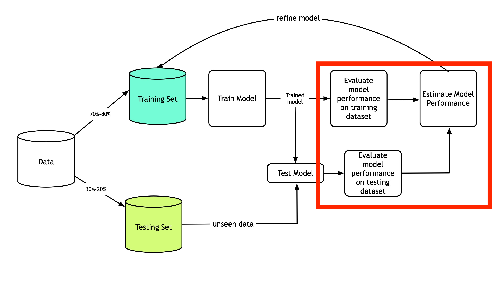
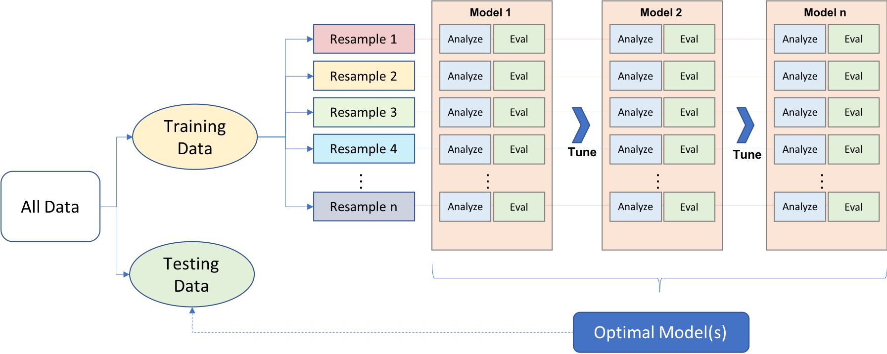
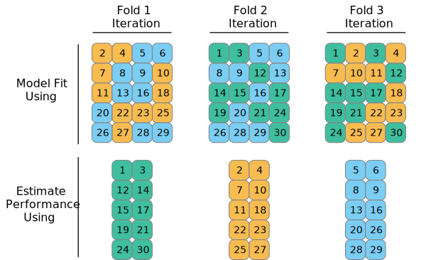
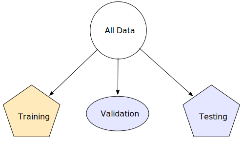
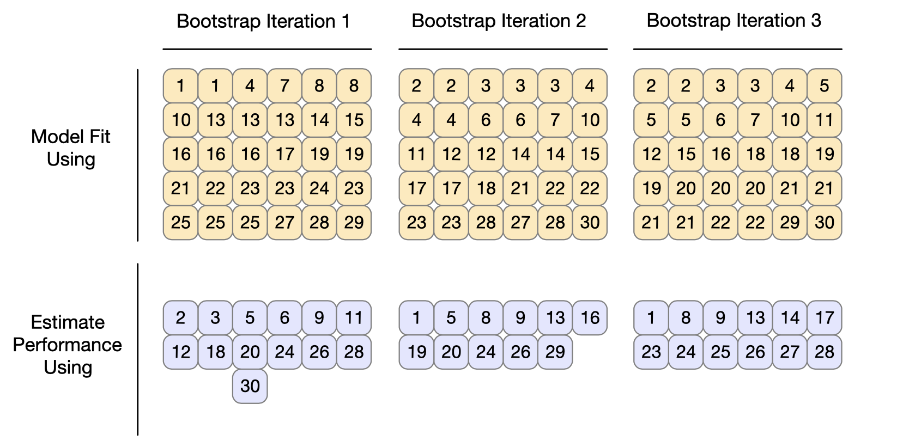
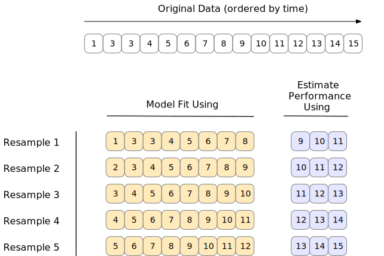

# (PART\*) Tools for Creating Effective Models {-}

# Resampling for evaluating performance

**Learning objectives:**

- Recognize why **naive performance estimates can often fail.**
  - Explain the difference between **low bias models** and **high bias models.**
- Use **resampling** to **divide a training set** into an **analysis set** and an **assessment set.**
  - Use **cross-validation** to resample a training set.
  - Compare **repeated cross-validation, leave-one-out cross-validation,** and ***Monte Carlo* cross-validation.**
  - **Divide** a "not testing" set into a **single training set** and a **single validation set.**
  - Use **bootstrap resampling** to **divide a training set** into an **analysis set** and an **assessment set.**
  - Use **rolling forecast origin resampling** to **divide a training set** into an **analysis set** and an **assessment set.**
- Use **resampling** to **estimate model performance.**
  - Use **`tune::fit_resamples()`** to **fit multiple models** for a resampled dataset.
  - Use **`tune::collect_metrics()`** to **measure model performance.**
  - Use **`tune::collect_predictions()`** to **analyze model predictions.**
- Use **parallel processing** to **speed up resample fitting.**
- **Save model objects** created during resampling.

## Why?



As mentioned in chapter 5, we do not touch the test set until a
candidate model(s) has been chosen. We need to test the performance of
the candidate model(s). This can be done with resampling.

## Resubstitution approach

In chapter 8, we fit a linear model to the training set. This is
candidate model \#1.

```{r setup-10, message = F}
library(tidymodels)
data(ames)

ames <- mutate(ames, Sale_Price = log10(Sale_Price))

set.seed(123)
ames_split <- initial_split(ames, prop = 0.80, strata = Sale_Price)
ames_train <- training(ames_split)
ames_test  <-  testing(ames_split)

ames_rec <- 
  recipe(Sale_Price ~ Neighborhood + Gr_Liv_Area + Year_Built + Bldg_Type + 
           Latitude + Longitude, data = ames_train) %>%
  step_log(Gr_Liv_Area, base = 10) %>% 
  step_other(Neighborhood, threshold = 0.01) %>% 
  step_dummy(all_nominal()) %>% 
  step_interact( ~ Gr_Liv_Area:starts_with("Bldg_Type_") ) %>% 
  step_ns(Latitude, Longitude, deg_free = 20)

lm_model <- linear_reg() %>% set_engine("lm")

lm_wflow <- 
  workflow() %>% 
  add_model(lm_model) %>% 
  add_recipe(ames_rec)

lm_fit <- fit(lm_wflow, ames_train)
```

We can fit a random forest model the training data, and this random
forest model will be candidate \#2.

```{r rf-10}
rf_model <- 
  rand_forest(trees = 1000) %>% 
  set_engine("ranger") %>% 
  set_mode("regression")

rf_wflow <- 
  workflow() %>% 
  add_formula(
    Sale_Price ~ Neighborhood + Gr_Liv_Area + Year_Built + Bldg_Type + 
      Latitude + Longitude) %>% 
  add_model(rf_model) 

rf_fit <- rf_wflow %>% fit(data = ames_train)
```

We can compare the performance of these two candidate models by

```{r estimate-10}
estimate_perf <- function(model, dat) {
  # Capture the names of the objects used
  cl <- match.call()
  obj_name <- as.character(cl$model)
  data_name <- as.character(cl$dat)
  data_name <- gsub("ames_", "", data_name)
  
  # Estimate these metrics:
  reg_metrics <- metric_set(rmse, rsq)
  
  model %>% 
    predict(dat) %>% 
    bind_cols(dat %>% select(Sale_Price)) %>% 
    reg_metrics(Sale_Price, .pred) %>% 
    select(-.estimator) %>% 
    mutate(object = obj_name, data = data_name)
}

```

Resubstitution errors for the linear model:

```{r call-estimate-10}
estimate_perf(lm_fit, ames_train)
```

Resubstitution errors for the random forest model:

```{r call-estimate-b-10}
estimate_perf(rf_fit, ames_train)
```

We can see that the random forest model performs significantly better
(2+ times as better). We can choose the random forest model as our only
candidate model. We can test its performance on the test set:

```{r call-estimate-c-10}
estimate_perf(rf_fit, ames_test)
```

The random forest model, which previously performed well on the training
set, is significantly worse on the test set. Just out of curiosity, we
can see how the linear model performs on the test set:

It's interesting that the linear model performs similarly (bad) for the
training and test sets, while the random forest did not. This is because
linear models are considered *high bias* models and random forest models
are *low bias*:

> In this context, bias is the difference between the true data pattern
> and the types\
> of patterns that the model can emulate. Many black-box machine
> learning models have low bias. Other models (such as linear/logistic
> regression, discriminant analysis, and others) are not as adaptable
> and are considered high-bias models.
> `r tufte::quote_footer('--- Max Kuhn and Julia Silge')`

Re-predicting the training set is bad for performance evaluation. We
need to use resampling methods.

## Resampling methods

This diagram from the *Hands-on machine learning in R* from Boehmke &
Greenwell illustrates how resampling fits into the general modeling
workflow:



We can see that in resampling:

\- happens **after** the data split into training and test sets

\- some data is used for analyzing (analysis set), and some for
evaluation (evaluation or assessment set, we'll use assessment set from
now on)

\- this is an iterative as it can be repeated many times - it only
applies to the training data

Effectively,

\- the model is fit with the analysis set

\- the model is evaluated with the evaluation set

The overall, final performance evaluation for the model is the average
of the performance metrics of the *n* evaluation sets.

The way in which these analysis and evaluation sets are created define
what the resampling techniques are specifically. We'll go through the
common ones:

-   cross-validation

-   repeated cross-validation

-   leave-one-out cross-validation

-   monte-carlo cross-validation

### Cross-validation

Cross-validation is one of the most popular resampling techniques. There
are several flavors

#### V-fold cross-validation

V-fold cross-validation involves the random splitting of the training
data into approximately equal-sized "folds". The diagram below
illustrates v-fold cross validation with v set to 3 folds.

 We can see that the training data points have
been randomly assigned to roughly equal-sized folds (in this case,
exactly equal) and that the assessment set for each fold is 2/3 of the
training data. Max and Julia note that while 3-fold CV is good to use
for illustrative purposed, it is not good in practice - in practice,
rather 5- or 10- fold CV is preferred.

```{r folds-10}
set.seed(55)
ames_folds <- vfold_cv(ames_train, v = 10)
ames_folds
```

The output contains info on how the training data was split: \~2000 are
in the analysis set, and \~220 are in the assessment set. You can
recuperate these sets by calling `analysis()` or `assessment()`.

In chapter 5, we introduced the idea of stratified sampling, which is
almost always useful but particularly in cases with class imbalance. You
can perform V-fold CV with stratified samplying by using the `strata`
argument in the `vfold_cv()` call.

#### Repeated cross validation

V-fold CV introduced above may produce noisy estimates. A technique that
averages over more than *V* statistics may be more appropriate to reduce
the noise. This technique is repeated cross-validation, where we create
*R* repeats of V-fold CV. Instead of averaging over V statistics, we are
now averaging over *V x R* statistics:

```{r folds-b-10}
vfold_cv(ames_train, v = 10, repeats = 5) 
```

#### Leave-one-out cross validation

M & J say it sucks, so I'm skipping this lol.

#### Monte Carlo cross validation (MCCV)

It's like V-fold CV in the sense that training data is allocated to the
assessment set with some fixed proportion. The difference is the
resampling objects generated by MCCV are not mutually exclusive as the
same data points can appear in the assessment set multiple times.

```{r mccv-10}
mc_cv(ames_train, prop = 9/10, times = 20)
```

### Validation sets

Another way you can assess the performance of your candidate model(s) -
before moving forward to the test set - is to use a validation set. This
might be an attractive option if you have big data. As the diagram below
shows, the validation set is independent of the training data.



You can create your validation set by calling on `validation_split()`
and setting the proportion desired. There is also a `strata` argument to
conduct stratified sampling.

```{r validation-10}
set.seed(12)
val_set <- validation_split(ames_train, prop = 3/4)
val_set
```

### Boostrapping

Bootstrapping can be used to estimate model performance. It's good to be
aware that while it does produce lower variance compared to other
resampling methods, it has "significant pessimistic bias". It also works
differently than other resampling methods. In the diagram below, we can
see that the analysis set is always equal to the size of the whole
training set, and we can also see that the same points can be selected
multiple times. The assessment sets contain the data points that were
not previously included in the analysis sets. Furthermore, these
assessment sets are not of the same size, as we're about to see when we
call `bootstraps()`.

 Operationally, performing
bootstrap resampling involves specifying the number of bootstrap samples
via the `times` argument. There is also a `strata` argument for
conducting stratified sampling.

```{r bootstraps-10}
bootstraps(ames_train, times = 5)
```

### Rolling forecasting origin resampling

Resampling with time series data needs a special setup as random
sampling can ignore important trends such as seasonality. Rolling
forecast resampling involves specifying the size of the analysis and
assessment sets, and each iteration after the first one skips by a set
number as the diagram illustrates below (with a skip of 1 as an
example):



This time series resampling is done with `rolling_origin`. You can
specify the number of samples to be used for analysis with `initial`,
the number of samples used for each assessment resample with `assess`,
and `cumulative` set to true if you want the analysis resample to grow
beyong the size specified with `initial`. Additional arguments include
the `skip` and `lag`.

```{r rolling-10, eval = F}
rolling_origin(data, initial = 5, assess = 1, cumulative = TRUE, skip = 0, lag = 0)
```

## Estimating performance

To recap, the resampling methods above estimate overall model
performance using the predictions from the assessment sets. The
**{tune}** package (included in tidymodels package) contains a function
called `fit_resamples` (which is akin to `fit()`) that computes a set of
performance metrics across resamples (or just one, as is the case with a
validation set). The call requires either a parsnip model specification
or a `workflows::workflow`, and `rset` object (as created with
`rsample::vfold_cv` for example). You can also specify the performance
metrics you want with the `metrics` argument or stick with the defaults.
The `control` argument can be used to view/retain/save outputs if
further tuning is desired. Your call might look like:

```{r resamples-10, eval = F}
rf_res <-
  rf_wflow %>% 
  fit_resamples(resamples = ames_folds, control = keep_pred)
```

The output (not viewed here because it's thicc) can be manipulated in a
number of ways to view just what you need. You can for example run
`tune::collect_metrics(rf_res)` to see just the performance metrics.

For more on how the outputs can be used for diagnostics and further
model evaluation refer to section 10.3 in the book.

## Parallel processing

Parallel processing can speed up the computations done by the tune
package (introduced in the last section via `fit_resamples` and
`collect_metrics`). Speed can be improved when processing uses fewer
than the number of physical cores. To enable this, *parallel backend R
packages* need to be configured. These packages and operating system
specific instructions are outlined in section 10.4.

## Saving the resampled objects

By default, the models created during resampling are not saved since
most users are interested in the performance metrics that they generate.
But, sometimes, you might realize that a specific model is the better
suited one and so you need fit again to the whole training set. There is
a method of saving the models created during resampling. You can save
them whole or just certain components.

In the book, M & J walk us through a linear regression model example
where they save the model results.

## Meeting Videos

### Cohort 1

`r knitr::include_url("https://www.youtube.com/embed/Zj1wPdglYIA")`

<details>
  <summary> Meeting chat log </summary>
  
```
00:10:27	pavitra:	hahaha..look at Jon resampling his wine 
00:10:38	Jonathan Trattner:	HAH
00:10:44	pavitra:	1-fold CV
00:11:16	pavitra:	that's bad..jon's test and train sets are the same
00:11:36	pavitra:	HAHAHA...
00:12:05	pavitra:	Let me grab my IPA. Tan, get your Milk stout
00:12:30	Tan Ho:	bahaha bottoms up!
00:13:23	Tan Ho:	*awkward eyes meme*
00:13:30	pavitra:	lmao
00:30:59	Tyler Grant Smith:	i feel like this deserves experimental support to compare 50 fold cv vs 5fold x10
00:34:35	pavitra:	gotcha…
00:42:34	pavitra:	is this bootstrapping with replacement?
00:43:42	Jon Harmon (jonthegeek):	63.2% 36.8%
00:43:54	pavitra:	2 SDs
00:44:34	Conor Tompkins:	@max why is it those numbers
00:45:24	Tan Ho:	(or just doubleclick the function lol)
00:45:42	Jonathan Trattner:	Both of those are GAME changers
00:45:43	Tyler Grant Smith:	ive lost the ink on my f2 key i use it so much
00:45:46	Jonathan Trattner:	wowowow
00:45:49	Tan Ho:	er, wait, ctrl-click?
00:45:51	pavitra:	yeah - I just discovered "go to function definition" in the code menu myself
00:46:31	Jonathan Trattner:	Productivity boost 🤯
00:46:42	Tan Ho:	it's a trap! - admiral ackbar
00:46:52	Tan Ho:	(you can end up digging too deep)
00:47:16	pavitra:	tyler is an expert at time series
00:54:03	Tyler Grant Smith:	this seems to be contrary to how hyndman defines it
00:58:01	pavitra:	isn't there a way to dynamically tune your hyperparameters such that it can do it for the defined range and you can see the performance using the control?
00:59:14	Jim Gruman:	time series resampling at the tidymodels web site covers `sliding_window()` `sliding_index()` and `sliding_period()` functions. Maybe the book 10.2.4 rolling forecasting could be a little more clear about all three methods
00:59:31	Tyler Grant Smith:	reading the documentation for rolling_origin i think that graphic represents cumulative=FALSE not TRUE.  This agrees with the books code
01:06:24	Jon Harmon (jonthegeek):	lm_res$.extracts[[1]][[1]]
01:07:34	Tyler Grant Smith:	may not be tidy but thats code im used to!
01:09:44	Jonathan Trattner:	Go, Jon, go!
01:10:44	Jim Gruman:	thank you Jon!!!!!
01:10:52	Tyler Grant Smith:	step_interact( ~ Gr_Liv_Area:starts_with("Bldg_Type_"))     neat i didnt know you could do that
01:12:29	Tyler Grant Smith:	my models are all organic non-gmo
01:17:36	Joe Sydlowski:	For Conor's question: http://uc-r.github.io/mars
01:17:47	Jonathan Trattner:	Thanks, Jon! Have a great night, everyone!
01:18:14	Joe Sydlowski:	There's a plot with model selection for the autoplot in MARs that shows the metrics 
01:18:19	pavitra:	thanks Jon
01:18:19	Conor Tompkins:	Thanks Jon!
```
</details>

### Cohort 2

`r knitr::include_url("https://www.youtube.com/embed/21j9SRPTmX4")`

<details>
  <summary> Meeting chat log </summary>
  
```
00:03:08	Roberto Villegas-Diaz:	I’m using my 4G today, but it’s running really slow, so I won’t turn on my video!
00:03:29	Stephen Holsenbeck:	ok 👍
00:22:57	August:	FYI this is where the idea comes from: https://otexts.com/fpp3/tscv.html
00:29:12	August:	https://robjhyndman.com/papers/cv-wp.pdf
00:35:03	rahul bahadur:	http://appliedpredictivemodeling.com/blog/2014/11/27/vpuig01pqbklmi72b8lcl3ij5hj2qm
00:35:38	Amélie Gourdon-Kanhukamwe (she/they):	Thanks
```
</details>


### Cohort 3

`r knitr::include_url("https://www.youtube.com/embed/h9nWpsAHFuw")`

<details>
  <summary> Meeting chat log </summary>
  
```
00:21:50	Ildiko Czeller:	https://stats.stackexchange.com/a/386608 about why boostrap resample is pessimistic
```
</details>

### Cohort 4

`r knitr::include_url("https://www.youtube.com/embed/6t11D9uSJE8")`

<details>
  <summary> Meeting chat log </summary>
  
```
00:48:26	Federica Gazzelloni:	laura
00:50:36	Federica Gazzelloni:	Hi @priyanka!
00:51:44	priyanka gagneja:	Hi Federica, I was interested in topic particularly.. so I decided to jump in :) for one off calls ..hope that's ok
00:51:52	Federica Gazzelloni:	thanks!
00:52:08	Federica Gazzelloni:	sure of course!
00:52:38	Ryan Metcalf:	Rolling Forecasting would be similar to Weather Prediction, correct? Using time series data. I’m imagining the radar prediction into the future.
00:52:50	Federica Gazzelloni:	yep
```
</details>
