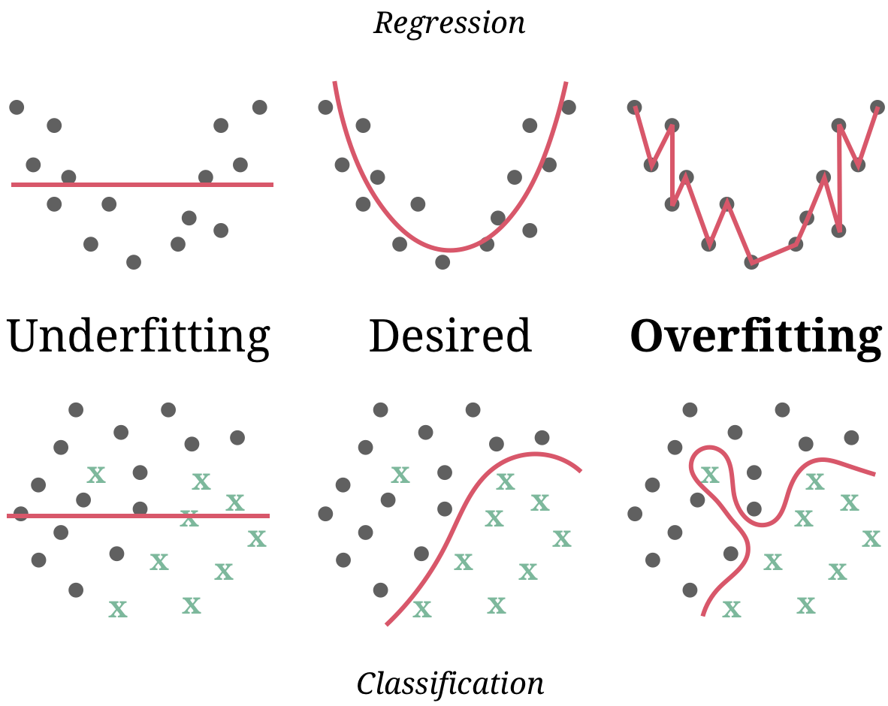
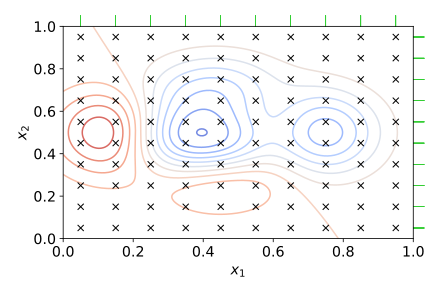
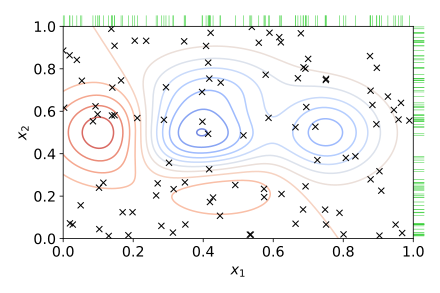
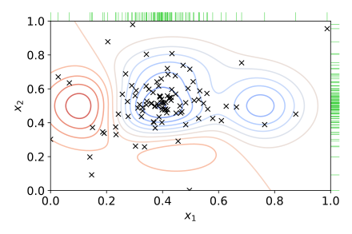

# Model tuning and the dangers of overfitting

```{r setup12, echo = FALSE, include = FALSE}
library(patchwork)
library(tidyverse)
library(tidymodels)
```

**Learning objectives:**

- Recognize examples of **tuning parameters.**
  - Recognize hyperparameters for **machine learning models.**
  - Recognize tuning parameters for **preprocessing techniques.**
  - Recognize structural parameters for **classical statistical models.**
  - Recognize examples of **parameters** that **should *not* be tuned.**
- Explain how **different metrics** can lead to **different decisions** about the choice of tuning parameter values.
- Explain how **poor parameter estimates** can lead to **overfitting** of training data.
- Recognize **strategies for optimizing tuning parameters.**
  - Compare and contrast **grid search** and **iterative search.**
- Use `tune::tune()` and the `{dials}` package to **optimize tuning parameters.**

## What is a Tuning Parameter?

An unknown structural or other kind of value that has significant impact on the model but *cannot be directly estimated from these data*

### Examples

- Machine Learning (hyperparameters)
  - Boosting: number of boosting iterations
  - ANN: number of hidden units and type of activation function
  - Modern Gradient Descent: Learning rates, momentus, and iterations
  - Random Forest: number of predictors, number of trees, number of data points

- Preprocessing (tuning parameters)
  - PCA: number of extracted components
  - Imputation (uses KNN): number of neighbors

- Statistical Models (structural parameters)
  - Binary Regression (logistic regression): probit, logit link
  - Longitudinal Models: correlation and covariance structure of the data

## When not to tune

- Prior distribution (Bayesian analysis)
- Number of Trees (Random Forest and Bagging) 
  - Does not need tuning--instead focus on stability

## Decisions, Decisions...

```{r dataset, echo = TRUE}
data(ames, package = "modeldata")
ames <- ames %>% mutate(Sale_Price = log10(Sale_Price)) 

set.seed(63)
ames_split <- initial_split(ames, prop = 0.80, strata = Central_Air)
ames_train <- training(ames_split)
ames_test <- testing(ames_split)

set.seed(63)
rs <- vfold_cv(ames_train, repeats = 10)
```

```{r plot_ames-12, echo = FALSE}
ames_train %>% 
  ggplot() +
  aes(x = Year_Remod_Add, y = Sale_Price, color = Central_Air) +
  geom_point() +
  labs(title = "Central Air According to Sale Price and Remodel Year", subtitle = "Using ames_train dataset")
```

## What Metric Should We Use?

Which link function should we use...does it matter?

- logistic regression using a logit
- probit
- complementary log-log

```{r llhood-12, warning  = FALSE, echo = FALSE}
llhood <- function(...) {
  logistic_reg() %>% 
    set_engine("glm", ...) %>% 
    fit(Central_Air ~ Sale_Price + Year_Remod_Add, data = ames_train) %>% 
    glance() %>% 
    select(logLik)
}

bind_rows(
  llhood(),
  llhood(family = binomial(link = "probit")),
  llhood(family = binomial(link = "cloglog"))
) %>% 
  mutate(link = c("logit", "probit", "c-log-log"))  %>% 
  arrange(desc(logLik)) %>% 
  kableExtra::kbl(caption = "Likelihood Statistics") %>%
  kableExtra::kable_classic(full_width = F, html_font = "Cambria")
```

```{r lloss-12, echo = FALSE}
lloss <- function(...) {
  perf_meas <- metric_set(roc_auc, mn_log_loss)
    
  logistic_reg() %>% 
    set_engine("glm", ...) %>% 
    fit_resamples(Central_Air ~ Sale_Price + Year_Remod_Add, rs, metrics = perf_meas) %>% 
    collect_metrics(summarize = FALSE) %>%
    select(id, id2, .metric, .estimate)
}
```

```{r resampled-12, eval=FALSE, include=FALSE, echo = FALSE}
resampled_res <- 
  bind_rows(
    lloss()                                    %>% mutate(model = "logitistic"),
    lloss(family = binomial(link = "probit"))  %>% mutate(model = "probit"),
    lloss(family = binomial(link = "cloglog")) %>% mutate(model = "c-log-log")     
  ) %>%
  # Convert log-loss to log-likelihood:
  mutate(.estimate = ifelse(.metric == "mn_log_loss", -.estimate, .estimate)) %>% 
  group_by(model, .metric) %>% 
  summarize(
    mean = mean(.estimate, na.rm = TRUE),
    std_err = sd(.estimate, na.rm = TRUE) / sum(!is.na(.estimate)), 
    .groups = "drop"
  )

saveRDS(resampled_res, file = here::here("data", "12-resample_results.rds"))
```

```{r load-resampled-12, echo = FALSE}
resampled_res <- readRDS(file = here::here("data", "12-resample_results.rds"))
```

If we just look at the log-likelihood statistic, the logistic link function appears to be statistically (significantly) better than the probit and complementary log-log link functions.

However, if we use the area under the ROC curve, we see that there is no significant difference between the three link functions. When we plot the three link functions, we also see that they are not substantially different in predicting whether a house has central air.

```{r logistic-12, echo = FALSE}
logistic <- glm(Central_Air ~ Sale_Price + Year_Remod_Add, data = ames_test, family = binomial)
logistic_slope <- coef(logistic)[3]/(-coef(logistic)[2])
logistic_intercept <- coef(logistic)[1]/(-coef(logistic)[2]) 
probit <- glm(Central_Air ~ Sale_Price + Year_Remod_Add, data = ames_test, family = binomial(link = "probit"))
probit_slope <- coef(probit)[3]/(-coef(probit)[2])
probit_intercept <- coef(probit)[1]/(-coef(probit)[2]) 
cloglog <- glm(Central_Air ~ Sale_Price + Year_Remod_Add, data = ames_test, family = binomial(link = "cloglog"))
cloglog_slope <- coef(cloglog)[3]/(-coef(cloglog)[2])
cloglog_intercept <- coef(cloglog)[1]/(-coef(cloglog)[2]) 
```

```{r plots-12, echo = FALSE}
p1 <- resampled_res %>% 
  filter(.metric == "mn_log_loss") %>% 
  ggplot(aes(x = mean, y = model)) + 
  geom_point() + 
  geom_errorbar(aes(xmin = mean - 1.96 * std_err, xmax = mean + 1.96 * std_err),
                width = .1) + 
  labs(y = NULL, x = "log-likelihood")

p2 <- resampled_res %>% 
  filter(.metric == "roc_auc") %>% 
  ggplot(aes(x = mean, y = model)) + 
  geom_point() + 
  geom_errorbar(aes(xmin = mean - 1.96 * std_err, xmax = mean + 1.96 * std_err),
                width = .1) + 
  labs(y = NULL, x = "Area Under the ROC Curve")

p3 <- ames_test %>% 
  ggplot() +
  aes(x = Year_Remod_Add, y = Sale_Price, color = Central_Air) +
  geom_point() +
  geom_abline(slope = logistic_slope, intercept = logistic_intercept) +
  geom_abline(slope = probit_slope, intercept = probit_intercept, linetype = 2) +
  geom_abline(slope = cloglog_slope, intercept = cloglog_intercept, linetype = 3)

(p1 + p2) / p3
```

## Can we make our model *too* good?

**Overfitting** is always a concern as we start to tune hyperparameters.

tip from the book: `Using out of sample data is the solution for detecting when a model is overemphasizing the training set`



Image Credit (https://therbootcamp.github.io/ML_2019Oct/_sessions/Recap/Recap.html#8)

## Tuning Parameter Optimization Strategies

- Grid Search (Space Filled Grid)



- Random Search (Global Search)



- Iterative Search (Global Search)



image credits: (https://en.wikipedia.org/wiki/Hyperparameter_optimization)

## Tuning Parameters in tidymodels `{dials}`

Parsnip Model Specifications

- Main Arguments (rand_forest)
- engine-specific (ranger)

Good starting points (tidymodels website):

- [reference docs](https://www.tidymodels.org/find/parsnip/#models)
- [searchable table](https://www.tidymodels.org/find/parsnip/#model-args) 

## Let's try an example:

See if we can predict the home sale price in our ames dataset 

1. Start with a recipe
```{r rf-recipe-12, echo= TRUE}
ames_recipe <- recipe(Sale_Price ~ Neighborhood + Gr_Liv_Area + Year_Remod_Add + Bldg_Type, 
                      data = ames_train)
```

## Build our random forest model:

random forest model
```{r rf-model-12, echo = TRUE}
rf_spec <- rand_forest() %>% 
  set_engine("ranger") %>% 
  set_mode("regression") 
```

Main Arguments `args()`:
```{r rf-args-12, echo = TRUE}
args(rand_forest)
```

engine specific arguments: 
```{r ranger-help-12, eval = FALSE}
?ranger::ranger()
```

## Add tuning parameters:

We can add main arguments (mtry, min_n) and engine specific arguments (regularization.factor)
```{r rf-tuned-12, echo = TRUE}
rf_spec_tuned <- rand_forest(mtry = tune(), trees = 2000, min_n = tune()) %>% 
  set_engine("ranger", regularization.factor = tune("reg")) %>% 
  set_mode("regression") 
```

`tune()` returns an expression. This tags the parameters for optimization within the tidymodels framework

```{r rf-params-12, echo = TRUE}
parameters(rf_spec_tuned)
```

The notation `nparam[+]` indicates a complete numeric parameter, `nparam[?]` indicates a missing value that needs to be addressed.

## Updating tuning parameters:

To see what we need to update/ finalize, we can call the function in the `{dials}` package
```{r rf-mtry-12, echo = TRUE}
mtry()
```

We can also use the `{dials}` package to see the tuning range
```{r min_n-12, echo = TRUE}
min_n()
```

To update/finalize or adjust the hyperparameters we can use the `update()` function to update in-place:

```{r update-params-12, echo = TRUE}
parameters(rf_spec_tuned) %>% 
  update(mtry = mtry(c(1, 4)))
```

We see that mtry is now a complete numeric parameter

## Finalizing tuning parameters:

The update function may not be useful if a recipe is attached to a workflow that adjusts the number of columns. Instead of `update()` we can use the `finalize()` function.

```{r updated_params-12, echo = TRUE}
updated_params <- workflow() %>% 
  add_model(rf_spec_tuned) %>% 
  add_recipe(ames_recipe) %>% 
  parameters() %>% 
  finalize(ames_train)

updated_params
```

With the `finalize()` function, mtry was completed based on the number of predictors in the training dataset

```{r pull_dials_object-12, echo = TRUE}
updated_params %>% pull_dials_object("mtry")
```

## What is next?

The parameter object we just explored knows the range of the parameters. the `{dials}` package contains a number of `grid_*()` functions that takes the parameter object as input to produce different types of grids. Chapter 13 will explore this further.

## Meeting Videos

### Cohort 1

`r knitr::include_url("https://www.youtube.com/embed/EarVQUj4XbQ")`

<details>
  <summary> Meeting chat log </summary>
  
```
00:11:27	Jon Harmon (jonthegeek):	usethis::use_package("patchwork")
00:23:12	Jon Harmon (jonthegeek):	@jim Which chapter are you going to present: 13? 14? 15? 😊
00:27:52	Jim Gruman:	:) sure, 13 sounds good
00:29:42	Jon Harmon (jonthegeek):	Woot!
00:29:57	Jordan Krogmann:	1, 1000, 5000 is the correct answer
00:31:11	Jon Harmon (jonthegeek):	Ok, Jim! You're PRed into the README, no take-backsies!
00:33:44	Tan Ho:	fixed sorry
00:35:29	Tony ElHabr:	i'm sorry but are these python generated graphs?
00:35:33	Tony ElHabr:	unforgiveable
00:36:06	Tan Ho:	gg
00:36:12	Tan Ho:	i'm out
00:36:54	Jon Harmon (jonthegeek):	Ok, after Jim everyone who's here will have gone at least once! Except wait Tan never actually went did he?????
00:37:45	Tony ElHabr:	CALL HIM OUT
00:38:03	Jon Harmon (jonthegeek):	TAN WHAT CHAPTER ARE YOU PRESENTING??? 14, right?
00:39:01	Tan Ho:	*awkwardly looking around after going MIA from the book club since chapter 9*
00:39:43	Tony ElHabr:	as long as tan gives us a killer review at the end of this all, then i'll give him a pass
00:40:03	Jon Harmon (jonthegeek):	Fair! Tan *is* the master of the review week!
00:40:21	Jon Harmon (jonthegeek):	I pinged Max on the Slack to see if we should do a review after 14, or after 15, or later, or what.
00:40:55	Tony ElHabr:	how can we do a proper review if we never stop learning?
00:41:14	Tan Ho:	I might  be more apt to do 15, I think?
00:41:23	Jon Harmon (jonthegeek):	Yeah, this one is tricky 'cuz I'm not sure when it ends 🙃
00:41:53	Tony ElHabr:	tan picks chapter 15 so he can have 3 weeks to prep :P
00:42:02	Tan Ho:	two weeks to catch up and one week to prep!
00:42:21	Tan Ho:	okay I lied twenty days to catch up and one day to prep, let's be honest
00:42:46	Tony ElHabr:	21 days to catch up cuz you're going to live code
00:42:51	Tan Ho:	fair!
00:42:56	Tan Ho:	that part don't scare me
00:54:23	Jordan Krogmann:	Thanks andy!
00:54:23	Tan Ho:	if 16 isn't written by the time I present we can probably just review lol
```
</details>

### Cohort 2

`r knitr::include_url("https://www.youtube.com/embed/uHntG4id-Y8")`

<details>
  <summary> Meeting chat log </summary>
  
```
00:13:12	Luke Shaw:	sounds cool :)
00:13:26	Kevin Kent:	For sure!
00:34:14	August:	https://www.tidymodels.org/learn/develop/models/
00:34:21	August:	build your own engine]
00:34:40	August:	that's what the link is sorry.
00:39:39	Amélie Gourdon-Kanhukamwe (she/they):	Hear hear!
00:43:23	August:	I've added it to the slack group
00:43:36	August:	come learn bayes!!! 
00:43:47	Kevin Kent:	Yeah I’m trying to convert :)
00:54:30	Kevin Kent:	https://matrixprofile.org/
00:55:53	August:	found it! 
00:55:55	August:	https://www.tidymodels.org/learn/develop/recipes/
00:56:48	Stephen Holsenbeck:	Good to see you too, thank you!
00:56:49	Luke Shaw:	thanks Janita - see you all next week :)
00:56:51	Amélie Gourdon-Kanhukamwe (she/they):	Sorry all, been working all night and I am knackered, but thanks Janita!
```
</details>


### Cohort 3

`r knitr::include_url("https://www.youtube.com/embed/fe3uixT_USg")`

<details>
  <summary> Meeting chat log </summary>
  
```
00:36:03	Federica :	finalize() with {dial}  take a parameter object and modify the unknown parts
00:44:40	Daniel Chen (TA), NYC:	https://dials.tidymodels.org/
00:49:04	jiwan:	i think you're muted, couldn't hear you
00:52:24	Federica :	I was wondering about the regularization_factor()
00:54:21	jiwan:	These parameters are auxiliary to random forest models that use the "ranger" engine. They correspond to tuning parameters that would be specified using set_engine("ranger", ...).
00:59:27	jiwan:	dials::mtry()
# Randomly Selected Predictors (quantitative)
Range: [1, ?]
01:00:29	jiwan:	regularization.factor = tune("reg")
01:00:42	jiwan:	regularization.factor = tune()
01:03:32	jiwan:	> dials::regularization_factor
function (range = c(0, 1), trans = NULL) 
{
    new_quant_param(type = "double", range = range, inclusive = c(TRUE, 
        TRUE), trans = trans, default = 1, label = c(regularization_factor = "Gain Penalization"), 
        finalize = NULL)
}
```
</details>

### Cohort 4

`r knitr::include_url("https://www.youtube.com/embed/URL")`

<details>
  <summary> Meeting chat log </summary>
  
```
LOG
```
</details>
