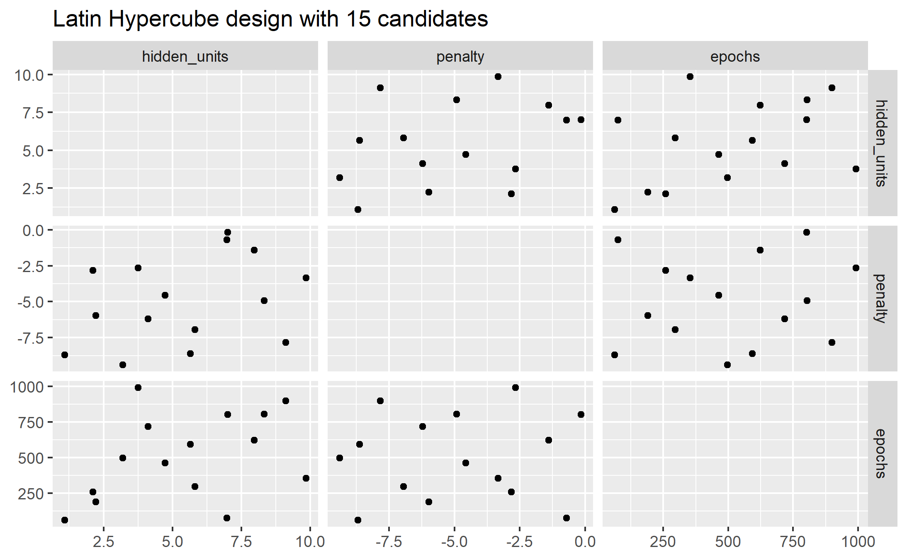

# Grid search

```{r setup13, echo = FALSE, include = FALSE}
knitr::opts_chunk$set(
  # collapse = TRUE
  warning = FALSE,
  message = FALSE
)
library(tidymodels)
library(tidyverse)
library(lubridate)

library(details)
```

**Learning objectives:**

- Use the `{dials}` package to **create tuning grids.**
  - Compare and contrast **regular and non-regular grids.**
  - Use `dials::parameters()` to **examine tuning parameters.**
  - Use `dials::grid_regular()` to **create a regular tuning grid.**
  - Use `dials::grid_*random*()` functions to **create irregular tuning grids.**
- Use `tune::tune_grid()` to **conduct a grid search.**
  - Use the `grid` parameter to **specify tuning grids.**
- **Finalize** a **tuned model.**
  - Use `tune::select_*()` functions to **choose a tuned parameter set.**
  - **Manually specify** a parameter set.
- Improve grid search efficiency.
  - Recognize how `{parsnip}` uses **submodel optimization** to make tuning more efficient.
  - Specify `{tune}` **parallel-processing rules** using the `parallel_over` parameter.
  - Use `finetune::tune_race_anova()` to make tuning more efficient via **racing methods.**

**The call to action:**

Tuning machine learning models can be time consuming and computationally expensive.

Thoughtful choices in the experimental design of searches can make them easier to deal with.

------------------------------------------------------------------------


-   Last week: how to tag arguments using `tune()`.

-   This week: how to optimize the parameters, **a priori**.

-   Next week: **iterative** methods.

## Regular and non-regular grids

Let's consider an example model: an `mlp` neural network model. The parameters marked for tuning are:

-   the number of hidden units,

-   the number of fitting epochs in model training, and

-   the amount of weight decay penalization.

Using `parsnip`, the specification for a regression model fit using the `nnet` package for a multi layer perceptron is:

```{r 13_mlp_spec}
mlp_spec <-
  mlp(hidden_units = tune(),
      penalty = tune(),
      epochs = tune()) %>%
  set_engine("nnet", trace = 0) %>%
  set_mode("regression")
```

The argument **trace = 0** prevents extra logging of the training process. The `parameters()` function can extract the set of arguments with unknown values and set their `dials` objects. `pull_dials_object()` gives the current range of values.

```{r 13_mlp_param_hidden_units}
mlp_param <- parameters(mlp_spec)
mlp_param %>% pull_dials_object("hidden_units")
```

```{r 13_mlp_param_penalty}
mlp_param %>% pull_dials_object("penalty")
```

> For `penalty`, the random numbers are uniform on the log (base 10) scale. The values in the grid are in their natural units.


```{r 13_mlp_param_epochs}
mlp_param %>% pull_dials_object("epochs")
```

### Regular Grids

The `dials` package contains a set of `grid_*()` functions that take the parameter object and produce different types of grids.

```{r 13_grid_regular_2level}
grid_regular(mlp_param, levels = 2) 
```

The `levels` argument is the number of levels per parameter to create. It can also take a named vector of values:

```{r 13_grid_regular_named_vector}
mlp_param %>% 
  grid_regular(levels = c(hidden_units = 3,
                          penalty = 2, 
                          epochs = 2))
```

<p style="color:red;">Regular grids can be computationally expensive to use, especially when there are a large number of tuning parameters. This is true for many models but not all. There are some models whose tuning time decreases with a regular grid. More on this in a moment.</p>

One advantage of a regular grid is that the relationships between the tuning parameters and the model metrics are easily understood. The full factorial nature of designs allows for examination of each parameter separately.

### Irregular Grids

Even with small grids, random values can still result in overlaps. Also, the random grid needs to cover the whole parameter space. 

Even for a sample of 15 candidate points, this plot shows some overlap between points for our example:

```{r 13_grid_random_dataviz, eval=FALSE}
library(ggforce)
set.seed(200)
mlp_param %>%
  # The 'original = FALSE' option keeps penalty in log10 units
  grid_random(size = 15, original = FALSE) %>%
  ggplot(aes(x = .panel_x, y = .panel_y)) +
  geom_point() +
  geom_blank() +
  facet_matrix(vars(hidden_units, penalty, epochs), layer.diag = 2) +
  labs(title = "Random design with 15 candidates")

ggsave(filename = "images/13_grid_random.png")
```


A much better approach is to use designs called

#### Space Filling Designs !!!


They generally find a configuration of points that cover the parameter space with the smallest chance of overlapping. The `dials` package has:

-   Latin hypercube

-   Maximum entropy

As with `grid_random()`, the primary inputs are the number of parameter combinations and a parameter object.

```{r 13_latin_hypercube, eval=FALSE}

library(ggforce)
set.seed(200)
mlp_param %>% 
  grid_latin_hypercube(size = 15, original = FALSE) %>% 
  ggplot(aes(x = .panel_x, y = .panel_y)) + 
  geom_point() +
  geom_blank() +
  facet_matrix(vars(hidden_units, penalty, epochs), layer.diag = 2) + 
  labs(title = "Latin Hypercube design with 15 candidates")

ggsave("images/13_latin_hypercube.png")

```



The default design used by `tune`: maximum entropy design.

## Evaluating the grid


> "To choose the best tuning parameter combination, each candidate set is assessed using data on cross validation slices that were **not** used to train that model. "

The user selects the most appropriate set. It might make sense to choose the empirically **best** parameter combination or bias the choice towards other aspects like simplicity.

------------------------------------------------------------------------

We will use the Chicago CTA data for modeling the number of people (in thousands) who enter the Clark and Lake L station, as ridership.

The date column corresponds to the current date.

The columns with station names (Austin through California) are 14 day lag variables. There are also columns related to weather and sports team schedules.

[](http://www.feat.engineering/figures/Chicago_L_diagram_sb.png)

```{r 13_load_Chicago}
data(Chicago) # from the modeldata package

# also live data via RSocrata and Chicago portal

glimpse(Chicago, width = 5) 
```

Ridership is the dependent variable. Sorted by oldest to newest date, it matches exactly the Clark_Lake lagged by 14 days.

```{r 13_show_14day_lag}
Chicago$ridership[25:27]
Chicago$Clark_Lake[39:41]
```

Ridership is in thousands per day and ranges from 600 to 26,058

```{r 13_Chicago_ridership}
summary(Chicago$ridership)
```

Cross validation folds here are taken on a sliding window

```{r 13_split_resample}
set.seed(33)
split <- rsample::initial_time_split(Chicago) 
Chicago_train <- training(split)
Chicago_test <- testing(split)
  
Chicago_folds <- sliding_period(
  Chicago_train,
  index = date,
  period = "year",
  lookback = 3,
  assess_stop = 1                                
)
```

Training and validation data range

```{r 13_train_range}
range(Chicago_train$date)

```

Testing data range

```{r 13_test_range}
range(Chicago_test$date)

```

```{r 13_resample_visual}
ggplot(Chicago_folds %>% tidy(), 
       aes(x = Resample, y = Row, fill = Data)) +
  geom_tile() 

```

Because of the high degree of correlation between predictors, it makes sense to use PCA feature extraction.

> While the resulting PCA components are technically on the same scale, the lower-rank components tend to have a wider range than the higher-rank components. For this reason, we normalize again to coerce the predictors to have the same mean and variance.

The resulting recipe:

```{r 13_Chicago_recipe}
mlp_rec <-
  recipe(ridership ~ ., 
         data = Chicago_train) %>%
  step_date(date, 
            features = c("dow", "month"),
            ordinal = FALSE) %>%
  step_rm(date) %>% 
  step_normalize(all_numeric(), 
                 -ridership) %>% # remove the dependent
  step_pca(all_numeric(), 
           -ridership, 
           num_comp = tune()) %>%
  step_normalize(all_numeric(), 
                 -ridership) # remove the dependent

mlp_wflow <- 
  workflow() %>% 
  add_model(mlp_spec) %>% 
  add_recipe(mlp_rec)
```

> In `step_pca()`, using zero PCA components is a shortcut to skip the feature extraction. In this way, the original predictors can be directly compared to the results that include PCA components.

Let's create a parameter object to adjust a few of the default ranges.

```{r 13_mlp_param_boundaries}
mlp_param <- 
  mlp_wflow %>% 
  parameters() %>% 
  update(
    epochs = epochs(c(50, 200)),
    num_comp = num_comp(c(0, 20))
  )

rmse_mape_rsq_iic <- metric_set(rmse, 
                                mape, 
                                rsq, 
                                iic)
```

`tune_grid()` is the primary function for conducting grid search. It resembles `fit_resamples()` from prior chapters, but adds

-   grid: An integer or data frame. When an integer is used, the function creates a space-filling design. If specific parameter combinations exist, the grid parameter is used to pass them to the function.

-   param_info: An optional argument for defining the parameter ranges, when grid is an integer.

```{r 13_mlp_reg_tune, eval = FALSE}
set.seed(99)
mlp_reg_tune <-
  mlp_wflow %>%
  tune_grid(
    Chicago_folds,
    grid = mlp_param %>% grid_regular(levels = 3),
    metrics = rmse_mape_rsq_iic
  )

write_rds(mlp_reg_tune, 
          file = "data/13-Chicago-mlp_reg_tune.rds",
          compress = "gz")
```

```{r 13_load_mlp_reg_tune, include=FALSE, eval = FALSE}

if (file.exists("data/13-Chicago-mlp_reg_tune.rds")) {
mlp_reg_tune <-  read_rds("data/13-Chicago-mlp_reg_tune.rds")
} else {
  print("load the mlp_reg_tune code block") 
}

```

There are high-level convenience functions to understand the results. First, the `autoplot()` method for regular grids shows the performance profiles across tuning parameters:

```{r 13_mlp_reg_tune_autoplot, eval= FALSE}
autoplot(mlp_reg_tune) + theme(legend.position = "top")

ggsave("images/13_mlp_reg_tune_autoplot.png",
       width = 12)
```


The best model, per the [index of ideality of correlation](https://yardstick.tidymodels.org/reference/iic.html) (iic), on the validation folds

More study might be warranted to dial in the resolution of the penalty and number of pca components.

To evaluate the same range using (the tune grid default) maximum entropy design with 20 candidate values:

```{r 13_mlp_max_entropy, eval = FALSE}
set.seed(99)
mlp_sfd_tune <-
  mlp_wflow %>%
  tune_grid(
    Chicago_folds,
    grid = 20,
    # Pass in the parameter object to use the appropriate range: 
    param_info = mlp_param,
    metrics = rmse_mape_rsq_iic
  )

write_rds(mlp_sfd_tune, 
          file = "data/13-Chicago-mlp_max_entropy.rds",
          compress = "gz")
```

```{r 13_load_mlp_max_entropy, include=FALSE}

if (file.exists("data/13-Chicago-mlp_max_entropy.rds")) {
mlp_sfd_tune <-  read_rds("data/13-Chicago-mlp_max_entropy.rds")
} else {
  print("load the mlp_max_entropy code block") 
}

```

```{r 13_mlp_max_entropy_plot, eval = FALSE}
autoplot(mlp_sfd_tune)

ggsave("images/13_mlp_max_entropy_plot.png")
```


> Care should be taken when examining this plot; since a regular grid is not used, the values of the other tuning parameters can affect each panel.

```{r 13_mlp_max_entropy_bestiic, eval=FALSE}
show_best(mlp_sfd_tune, metric = "iic") %>% select(-.estimator)
```
```
  hidden_units  penalty epochs num_comp .metric  mean     n std_err .config      
         <int>    <dbl>  <int>    <int> <chr>   <dbl> <int>   <dbl> <chr>        
1            9 7.80e- 3    158       14 iic     0.790     8  0.0439 Preprocessor~
2            4 7.01e- 9    173       18 iic     0.779     8  0.0375 Preprocessor~
3           10 2.96e- 4    155       19 iic     0.777     8  0.0293 Preprocessor~
4            8 2.96e- 6     69       19 iic     0.760     8  0.0355 Preprocessor~
5            5 8.76e-10    199        9 iic     0.756     8  0.0377 Preprocessor~
```
It often makes sense to choose a slightly suboptimal parameter combination that is associated with a simpler model. For this model, simplicity corresponds to larger penalty values and/or fewer hidden units.

## Finalizing the model


Two methods:

-   manually choose parameters, or

-   `select_best()`

```{r 13_select_best_mlp_max_entropyiic, eval=FALSE}
select_best(mlp_sfd_tune, metric = "iic")

# or, a manual selection that corresponds to the regular method

reg_param <- 
  tibble(
    num_comp = 0,
    epochs = 200,
    hidden_units = 5,
    penalty = 1	  # log10
  )

```
```
# A tibble: 1 x 5
  hidden_units penalty epochs num_comp .config              
         <int>   <dbl>  <int>    <int> <chr>                
1            9 0.00780    158       14 Preprocessor06_Model1
```

```{r 13_final_workflow_mlp_max_entropy, eval=FALSE}
final_sfd_wflow <- 
  mlp_wflow %>% 
  finalize_workflow(select_best(mlp_sfd_tune, metric = "rmse")) 

```

Now the model can fit the *entire training* set:

```{r 13_fit_entire_chicago_training, eval=FALSE}
final_sfd_fit <- 
  final_sfd_wflow %>% 
  fit(Chicago_train)
```

This object can now be used to make future predictions on new data.

```{r 13_test_rmse_yardstick, eval=FALSE}
final_sfd_fit %>% 
   predict(new_data = Chicago_test) %>% 
   bind_cols(Chicago_test) %>% 
   rmse(truth = ridership, estimate = .pred)
```

```
# A tibble: 1 x 3
  .metric .estimator .estimate
  <chr>   <chr>          <dbl>
1 rmse    standard        3.01
```

```{r 13_test_performance, eval=FALSE}
final_sfd_fit %>% 
   predict(new_data = Chicago_test) %>% 
   bind_cols(Chicago_test) %>% 
   mutate(weekday = wday(date, 
                         label = TRUE)) %>% 
   ggplot(aes(ridership, 
              .pred, 
              color = weekday)) +
   geom_point() +
   geom_abline(color = "red") +
   scale_color_brewer(type = "qual") +
   coord_fixed() +
   expand_limits(x = 0, y = 0)

ggsave("images/13_test_performance.png")

```


I learned here that the **recipe** must exclude the dependent variable for the `predict()` to run on test data.

## Tools for efficient grid search

A few tricks:


### Submodel optimization

Types of models where, from a single model fit, multiple tuning parameters can be evaluated without refitting:

-   Partial Least Squares (no. of components to retain)

-   Boosting models (no. of boosting iterations, i.e. trees)

-   `glmnet` makes (across the amount of regularization)

-   `MARS` adds a set of nonlinear features (number of terms to retain)

> The `tune` package automatically applies this type of optimization whenever an applicable model is tuned. See also [this vignette](https://tune.tidymodels.org/articles/extras/optimizations.html)

```{r 13_submodel_optimizations}
methods("multi_predict")
```

```{r 13_c5.0_suboptimizer}
parsnip:::multi_predict._C5.0 %>% 
  formals() %>% 
  names()

```

For example, if a C5.0 model is fit to this cell classification data challenge, we can tune the trees. With all other parameters set at their default values, we can rapidly evaluate iterations from 1 to 100 :

```{r 13_c5_submodelopt_demo, eval = FALSE}
data(cells)

cells <- cells %>% select(-case)

cell_folds <- vfold_cv(cells)

roc_res <- metric_set(roc_auc)

c5_spec <- 
  boost_tree(trees = tune()) %>% 
  set_engine("C5.0") %>% 
  set_mode("classification")

set.seed(2)
c5_tune <- c5_spec %>%
  tune_grid(
    class ~ .,
    resamples = cell_folds,
    grid = data.frame(trees = 1:100),
    metrics = roc_res
  )

```

> Even though we fit the model without the submodel prediction trick, this optimization is automatically applied by `parsnip`.

```{r 13_c5_submodelopt_plot, eval = FALSE}
autoplot(c5_tune)

ggsave("images/13_c5_submodel.png")
```


### Parallel processing

backend packages right now are *`doFuture`*, `doMC`, `doMPI`, *`doParallel`*, `doRedis`,`doRNG`, `doSNOW`, and `doAzureParallel`

In `tune_*()`, there are two approaches, often set in `control_grid()` or `control_resamples()`

-   `parallel_over = "resamples` or

-   `parallel_over = "everything"` or

-   `parallel_over = NULL` (the default) chooses "resamples" if there are more than one resample, otherwise chooses "everything" to attempt to maximize core utilization

Note that switching between `parallel_over` strategies is not guaranteed to use the same random number generation schemes. However, re-tuning a model using the same `parallel_over` strategy is guaranteed to be reproducible between runs.

To use them, register the parallel backend first. <p style="color:red;">On a shared server, never never consume all of the cores.</p>

```{r 13_register_backend, eval = FALSE}
all_cores <- parallel::detectCores(logical = FALSE)

library(doParallel)
cl <- makePSOCKcluster(all_cores)
doParallel::registerDoParallel(cl)
```

Be careful to avoid use of variables from the global environment. For example:

```{r 13_parallel_tidy_eval, eval = FALSE}
num_pcs <- 3

recipe(mpg ~ ., data = mtcars) %>% 
  # Bad since num_pcs might not be found by a worker process
  step_pca(all_predictors(), num_comp = num_pcs)

recipe(mpg ~ ., data = mtcars) %>% 
  # Good since the value is injected into the object
  step_pca(all_predictors(), num_comp = !!num_pcs)
```

for the most part, the logging provided by `tune_grid()` will not be seen when running in parallel.

### Benchmarking Parallel with boosted trees

Three scenarios

1.  Preprocess the data prior to modeling using `dplyr`

2.  Conduct the same preprocessing via a `recipe`

3.  With a `recipe`, add a step that has a high computational cost

using variable numbers of worker processes and using the two `parallel_over` options, on a computer with 10 physical cores


For `dplyr` and the simple `recipe`

-   There is little difference in the execution times between the panels.

-   There is some benefit for using `parallel_over = "everything"` with many cores. However, as shown in the figure, the majority of the benefit of parallel processing occurs in the first five workers.

With the expensive preprocessing step, there is a considerable difference in execution times. Using `parallel_over = "everything"` is problematic since, even using all cores, it never achieves the execution time that `parallel_over = "resamples"` attains with just five cores. This is because the costly preprocessing step is unnecessarily repeated in the computational scheme.

> Overall, note that the increased computational savings will vary from model-to-model and are also affected by the size of the grid, the number of resamples, etc. A very computationally efficient model may not benefit as much from parallel processing.

### Racing Methods

The `finetune` package contains functions for racing.

One issue with grid search is that all models need to be fit across all resamples before any tuning parameters can be evaluated. It would be helpful if instead, at some point during tuning, an interim analysis could be conducted to eliminate any truly awful parameter candidates.

In *racing methods* the tuning process evaluates all models on an initial subset of resamples. Based on their current performance metrics, some parameter sets are not considered in subsequent resamples.

As an example, in the Chicago multilayer perceptron tuning process with a regular grid above, what would the results look like after only the first three folds?

We can fit a model where the outcome is the resampled area under the ROC curve and the predictor is an indicator for the parameter combination. The model takes the resample-to-resample effect into account and produces point and interval estimates for each parameter setting. The results of the model are one-sided 95% confidence intervals that measure the loss of the ROC value relative to the currently best performing parameters.

Any parameter set whose confidence interval includes zero would lack evidence that its performance is not statistically different from the best results. We retain 10 settings; these are resampled more. The remaining 10 submodels are no longer considered.


> Racing methods can be more efficient than basic grid search as long as the interim analysis is fast and some parameter settings have poor performance. It also is most helpful when the model does **not** have the ability to exploit submodel predictions.

The `tune_race_anova()` function conducts an Analysis of Variance (ANOVA) model to test for statistical significance of the different model configurations.

```{r 13_tune_race_anova, eval=FALSE}
library(finetune)

set.seed(99)
mlp_sfd_race <-
  mlp_wflow %>%
  tune_race_anova(
    Chicago_folds,
    grid = 20,
    param_info = mlp_param,
    metrics = rmse_mape_rsq_iic,
    control = control_race(verbose_elim = TRUE)
  )

write_rds(mlp_sfd_race, 
          "data/13-Chicago-mlp_sfd_race.rds",
          compress = "gz")
```

```{r 13_load_mlp_sfd_race, include=FALSE, eval = FALSE}

if (file.exists("data/13-Chicago-mlp_sfd_race.rds")) {
mlp_sfd_race <-  read_rds("data/13-Chicago-mlp_sfd_race.rds")
} else {
  print("load the 13_load_mlp_sfd_race code block") 
}

```

```{r 13_plot_mlp_sfd_race, eval = FALSE}
autoplot(mlp_sfd_race)

ggsave("images/13_mlp_sfd_race.png",
       width = 12)
```


```{r 13_tune_race_anova_best, eval = FALSE}
show_best(mlp_sfd_race, n = 6)
```
```
  hidden_units  penalty epochs num_comp .metric .estimator  mean     n
         <int>    <dbl>  <int>    <int> <chr>   <chr>      <dbl> <int>
1            6 3.08e- 5    126        3 rmse    standard    2.47     8
2            8 2.15e- 1    148        9 rmse    standard    2.48     8
3           10 9.52e- 3    157        3 rmse    standard    2.55     8
4            6 2.60e-10     84       12 rmse    standard    2.56     8
5            5 1.48e- 2     94        4 rmse    standard    2.57     8
6            4 7.08e- 1     98       14 rmse    standard    2.60     8
# ... with 2 more variables: std_err <dbl>, .config <chr>
Warning message:
No value of `metric` was given; metric 'rmse' will be used. 
```


## Chapter Summary

-   regular and irregular grids, including space-filling designs

-   build manually or using the family of `grid_*()` functions.

-   `tune_grid()` can evaluate candidate sets of model parameters using resampling.

- autoplot() the tune object for the preferred performance metrics

- show_best() for a list of top models

- fast submodel optimization for some models / parameters on regular grids

-   how to finalize a model, recipe, or workflow to update the parameter values for the final fit

- parallel processing backend capabilities

- consider racing methods to skip poor parameter combinations

Grid search is computationally expensive, but thoughtful choices in the experimental design can make them tractable.

## Meeting Videos

### Cohort 1

`r knitr::include_url("https://www.youtube.com/embed/i4YvRhl7jyk")`

<details>
  <summary> Meeting chat log </summary>
  
```
00:17:09	Andy Farina:	Not sure if everyone saw this, but tomorrow (Tuesday, 07 April) at noon (MDT), the salt lake city  r users group is hosting a talk on Stacked ensemble Modeling using {stacks} https://www.meetup.com/slc-rug/events/275790402/?rv=cr1&_xtd=gatlbWFpbF9jbGlja9oAJDVkMmFjNjc0LTJlOGUtNGJlNS1hYjk5LWM1ZDBjODU5YTEyYQ&_af=event&_af_eid=275790402
00:17:28	Jordan Krogmann:	+1 noice
00:27:10	Conor Tompkins:	Very cool
01:02:28	Asmae Toumi:	I volunteeeeeeeeeerrrrrrrrrrrr
01:02:36	Asmae Toumi:	Tony!
01:02:41	Asmae Toumi:	Or else you’re not getting big data bowl money
01:02:53	Asmae Toumi:	That’s too bad, im keeping your 5k
01:03:25	Asmae Toumi:	I can try and harass someone in the slack
01:03:44	Asmae Toumi:	Lmao
01:05:57	Asmae Toumi:	Bye yall
```
</details>

### Cohort 2

`r knitr::include_url("https://www.youtube.com/embed/dcoZfBaAfBY")`

<details>
  <summary> Meeting chat log </summary>
  
```
00:10:22	Janita Botha:	did anyone join the other cohort's session last week?
00:10:43	kevin :	Yeah I joined for most of it
00:10:56	kevin :	Even got in a question at the end 😎
00:11:40	Janita Botha:	That is awesome. Just had too much going on that day.
00:12:03	kevin :	Always the recording to watch
01:04:34	Luke Shaw:	Gotta go, cheers for the session :)
01:07:20	kevin :	Thanks so much Stephen, I gotta drop as well
01:07:24	kevin :	Great sessions
01:30:42	Amélie Gourdon-Kanhukamwe (she/they):	Gonna drop too, thanks Stephen!
01:30:49	Stephen:	Thanks Amelie!
01:31:13	Janita Botha:	I've really enjoyed this and listening in on your conversation!
01:31:26	Janita Botha:	happy days!
01:31:26	Stephen:	Thanks for coming Janita :) glad you enjoyed!
```
</details>


### Cohort 3

`r knitr::include_url("https://www.youtube.com/embed/FTuti94dgYs")`

<details>
  <summary> Meeting chat log </summary>
  
```
00:33:23	jiwan:	how do we go about visualizing/ making sense of hyperparameters when there's more than 3-4
00:52:32	jiwan:	https://juliasilge.com/blog/shelter-animals/
```
</details>

### Cohort 4

`r knitr::include_url("https://www.youtube.com/embed/dQBu1n6xxWk")`

<details>
  <summary> Meeting chat log </summary>
  
```
00:15:43	Ryan Metcalf:	Quick comment on Neural Networks and Perceptrons. Check out Professor Geoffrey Hinton, University of Toronto. I’m still looking for my book reference.
00:21:32	Ryan Metcalf:	Perceptrons by By Marvin Minsky and Seymour A. Papert, https://mitpress.mit.edu/books/perceptrons
00:39:47	Isabella Velásquez:	https://www.tidyverse.org/blog/2022/03/usemodels-0-2-0/
00:59:46	Steve:	Gotta go, sorry
00:59:48	Steve:	Thanks!
```
</details>

`r knitr::include_url("https://www.youtube.com/embed/WIqEiChlzFg")`

<details>
  <summary> Meeting chat log </summary>
  
```
00:11:54	Brandon Hurr:	https://stackoverflow.com/questions/58962748/opencv-with-multiple-webcams-how-to-tell-which-camera-is-which-in-code
00:23:54	Ryan Metcalf:	https://www.rdocumentation.org/packages/rlang/versions/0.1.6/topics/quosure
00:33:42	Federica Gazzelloni:	https://recipes.tidymodels.org/reference/step_spatialsign.html
```
</details>
