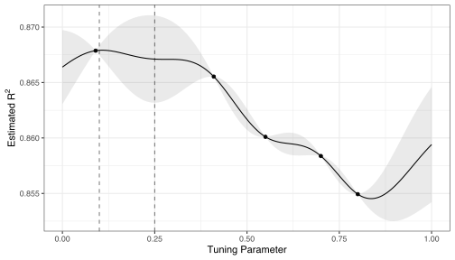
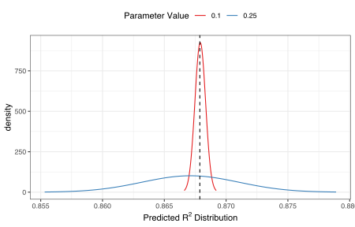
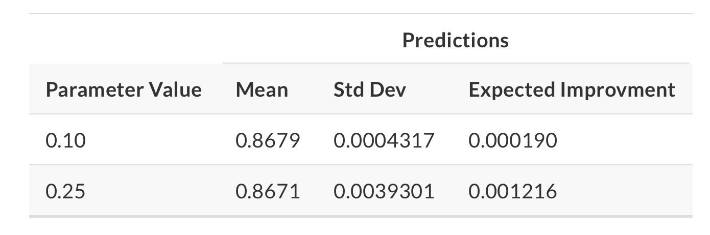
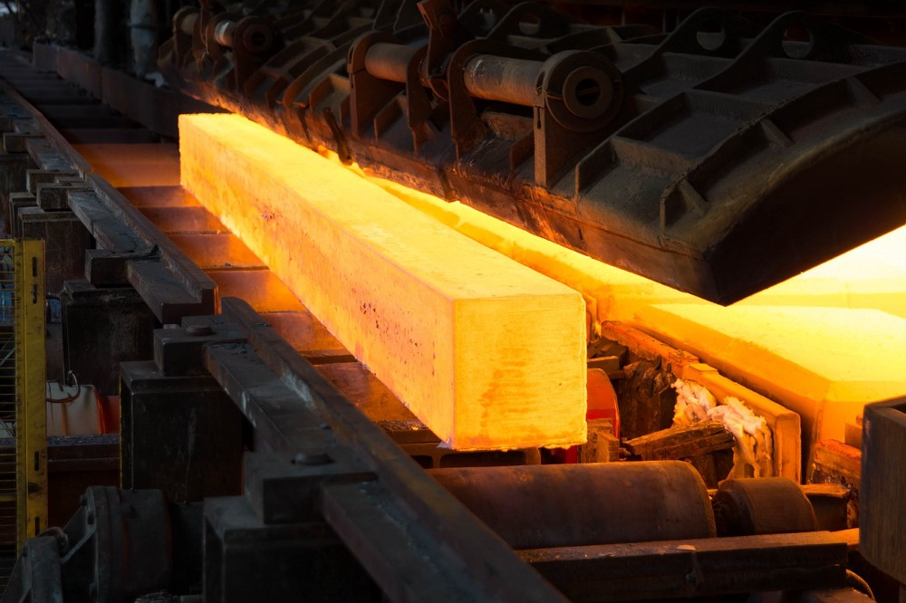
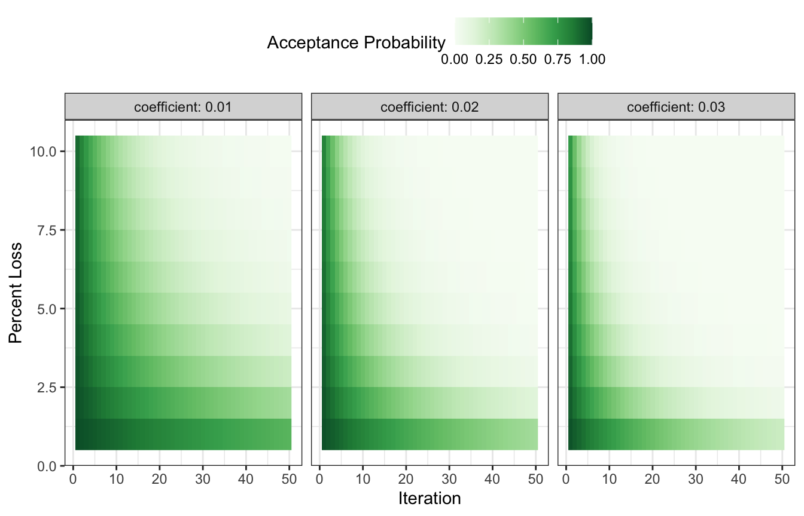
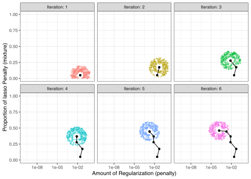

# Iterative search

**Learning objectives:**

- Use `tune::tune_bayes()` to optimize model parameters using **Bayesian optimization.**
  - Describe how a **Gaussian process model** can be applied to parameter optimization.
  - Explain how **acquisition functions** can be expressed as a trade-off between **exploration** and **exploitation.**
  - Describe **expected improvement,** the default acquisition function **used by {tidymodels}.**
- Use `finetune::tune_sim_anneal()` to optimize model parameters using **Simulated annealing.**
  - Describe **simulated annealing search.**

## SVM model as motivating example

We're interested in developing a classification model to classify sex for the palmers penguins dataset using a radial basis function support vector machine (svm).

```{r 14-setup, message = FALSE, warning = FALSE}
library(tidyverse)
library(tidymodels)
library(palmerpenguins)
library(patchwork)
library(finetune)
```
```{r 14-data-setup}
penguins_df <- penguins %>%
  filter(!is.na(sex)) %>% # discarding NA obs
  select(-year, -island) # not useful

splits <- initial_split(penguins_df, strata = sex)

penguins_folds <- vfold_cv(training(splits), v = 5, strata = sex)

set.seed(420)

roc_res <- metric_set(roc_auc) # accuracy, a classification metric
```

Let's fit a radial basis function support vector machine to the palmers penguins and tune the SVM cost parameter (`cost()`) and the σ parameter in the kernel function (`rbf_sigma`):

```{r 14-recipe-model}
svm_rec <- 
  recipe(sex ~ ., data = penguins_df) 

svm_spec <-
  svm_rbf(cost = tune(), rbf_sigma = tune()) %>%
  set_mode("classification") %>%
  set_engine("kernlab")
```

Now, let's set up our `workflow()` and feeding it our svm model

```{r 14-workflow}
svm_wflow <- 
  workflow() %>% 
  add_model(svm_spec) %>% 
  add_recipe(svm_rec)
```

Let's zoom in on the default parameter values for our two tuning parameters:

```{r 14-dials-fun}
cost()
rbf_sigma()
```

We can change them:

```{r 14-svm_param, message = F, warning = F}
svm_param <- 
  svm_wflow %>% 
  parameters() %>% 
  update(rbf_sigma = rbf_sigma(c(-7, -1)))
```

Because the methods that we will go over later need some resampled performance statistics before proceeding, we can use `tune_grid()` function to resample these values:

```{r 14-grid, eval = FALSE, message = F, warning = F}
start_grid <- 
  svm_param %>% 
  update(
    cost = cost(c(-6, 1)),
    rbf_sigma = rbf_sigma(c(-6, -4))) %>% 
  grid_regular(levels = 2)

set.seed(2)

svm_initial <- 
  svm_wflow %>% 
  tune_grid(resamples = penguins_folds, grid = start_grid, metrics = roc_res)
```
```{r 14-grid-save, include = FALSE, eval = FALSE}
saveRDS(svm_initial, here::here("data", "14-svm_initial.rds"))
```
```{r 14-grid-load, include = FALSE}
svm_initial <- readRDS(here::here("data", "14-svm_initial.rds"))
```

```{r 14-collect_metrics}
collect_metrics(svm_initial)
```

We can see that there's one point in which the performance is better. There results can be fed into iterative tuning functions as initial values, which we'll see shortly.

## Bayesian Optimization

Bayesian optimization is one of the techniques that can be used to iteratively search for new tuning parameter values.

Bayesian optimization consists of the following steps:

-   create a model predicting new tuning parameter values based on the previously generated resampling results

-   resampling of the new tuning parameter values

-   create another model that recommends additional tuning parameter values based on the resampling results of the previous step

This process can occur:

-   for a predetermined number of iterations, or

-   until there is no improvement in the results

Let's go over the most commonly used technique for Bayesian optimization, called the **Gaussian process model.**

### Gaussian process model, at a high level

In plain terms, Gaussian processes (GP) models allow us to make predictions about our data by incorporating prior knowledge and fitting a function to the data. With a given set of training points, there are potentially an infinite number of functions. GP shine by giving each of these functions a probability. This generates a probability distribution, which can harnessed.

#### How is it used for tuning?

-   As the name suggests, the Gaussian distribution is central to GP models. We're interested in the multivariate case of this distribution, where each random variable is distributed normally and their joint distribution is also Gaussian.

-   **This collection of random variables in the context of our example is the collection of performance metrics for the tuning parameter candidate values.** The 25 random variables making up the grid for our SVM model is assumed to be distributed as multivariate Gaussian.

-   For the GP model:

    -   the inputs (i.e. predictors) are the tuning parameters, `cost` and `rbf_sigma`

    -   the outcome is the performance metric, ROC AUC

    -   the outputs are predicted mean and variance (of ROC AUC) for the new candidate tuning parameters

        -   note: the predicted variance is mostly driven by how far it is from existing data

    -   A candidate is selected

    -   Performance estimate are calculated for all existing results

This process is iterative, and keeps repeating until number of iterations is exhausted or no improvement occurs.

See Max and Julia's notes for an in-depth appreciation of the mathematical implications of GP, along with [this excellent interactive blog post by researchers at the University of Konstanz](https://distill.pub/2019/visual-exploration-gaussian-processes/#Multivariate). The elegant properties of GP allow us to:

-   compute *new* performance statistics because we obtain a full probability model which reflects the entire distribution of the outcome

-   represent highly non-linear relationships between model performance and the tuning parameters

While it's a powerful technique that can yield good results, it can be complex to set up. The two main considerations are:

-   how to set up the model

-   how to pick the parameter values suggested by the model

-   resources, as it can be computationally expensive

Point 2 is further explored in the next section.

#### Acquisition functions

As we saw previously, GP model generates predicted mean and variance for candidate combinations of parameter values. The next step is picking the parameter combination that could give us the best results. This picking process can be tricky, as **there is a trade-off between the predicted mean and variance for new candidates**. This trade-off is similar to another, the exploration-exploitation trade-off:

-   Exploration: selection is towards "relatively unexplored" areas i.e. where there are fewer (or no) candidate models. This results in candidates having relatively ***higher*** variance, as they are "further" from existing data.

-   Exploitation: selection is based on the best mean prediction. This results in candidates having relatively ***lower*** variance, as it focuses on existing data.

The following is an example consisting of 1 tuning parameter (0,1) where the performance metric is r-squared. The points correspond to the observed candidate values for the tuning parameter. The shaded regions represent the mean +/- 1 standard error.

-   From an exploitation standpoint, one might select a parameter value right next to the observed point - i.e. near left vertical line - as it has the best r-squared.

-   From an exploration standpoint, one might consider the parameter value with the largest confidence interval - i.e. near right vertical line - since it would push our selection towards a region with no observed result. This is known as the *confidence bound approach*.

    Max and Julia note that the latter approach is not often used.

    

This is where *acquisition functions* come in, as they can help us in this process of picking a suitable parameter value. The most commonly used one is ***expected improvement***. Let's illustrate how it works by bringing back the two candidate parameter values we were considering, 0.1 and 0.25:



We can see that the distribution for 0.1 is much narrower (red line), and has the best r-squared (vertical line). So, 0.1 is our current best ***on average***; however, we can see that for parameter value 0.25 there is higher variance and ***more overall probability area above the current best***. What does this mean for our expected improvement acquisition function?



We can see that the expected improvement is significantly higher for parameter value 0.25!

#### The tune_bayes() function

The `tune_bayes()` function sets up Bayesian optimization iterative search. It's similar to `tune_grid()` but with additional arguments. You can specify the maximum number of search iterations, the acquisition function to be used, and whether to stop the search if no improvement is detected. See Max and Julia for details and additional arguments.

Let's keep going with our SVM model. We can use the earlier SVM results as the initial substrate. Once again, we're trying to maximize ROC AUC.

```{r 14-tune, eval = FALSE}
ctrl <- control_bayes(verbose = TRUE) # can also add more arguments, like no_improve

set.seed(420)

svm_bo <-
  svm_wflow %>%
  tune_bayes(
    resamples = penguins_folds, 
    metrics = roc_res, 
    initial = svm_initial, # tune_grid object produced earlier
    param_info = svm_param, # specified earlier too, with our new bounds for rbf_sigma
    iter = 25, # maximum number of search iterations
    control = ctrl
  )
```
```{r 14-save-tune, include = FALSE, eval = FALSE}
saveRDS(svm_bo, here::here("data", "14-svm_bo.rds"))
```
```{r 14-read-tune, include = FALSE}
svm_bo <- readRDS(here::here("data", "14-svm_bo.rds"))
```
Looks like the improvements occurred at iterations 8, 11, 13, 12 and 10. We can pull the best result(s) like so:

```{r 14-show-best}
show_best(svm_bo) # same call as with grid search
```

```{r 14-plot-best}
p1 <- autoplot(svm_bo, type = "performance")
p2 <- autoplot(svm_bo, type = "parameters")

p1 + p2
```

## Simulated annealing

 Simulated annealing is loosely related to annealing in metallurgy.

> When hot, the atoms in the material are more free to move around, and, through random motion, tend to settle into better positions. A slow cooling brings the material to an ordered, crystalline state.
>
> `Page 128, Algorithms for Optimization, 2019.`

If you were to cool rapidly, the atoms would stay wherever they were while the metal was hot and your blade or whatever would be ugly and brittle.

### How it works

At a high level, simulated annealing is an iterative process. It involves:

-   starts with a single candidate value

-   takes a random but constrained walk (*controlled random walk*) in a parameter search space (*local neighborhood*)

-   if the new candidate parameter value is better than the current candidate value - i.e. leads to better performance - then the current value is replaced with this new parameter value

-   the algorithm can still accept worse candidate values sometimes; however it will do so to a lesser extent as:

    -   performance gets worse

    -   iterations increase

    *Why* would it do this? Max and Julia sum it up perfectly:

> "The acceptance probabilities of simulated annealing allows the search to proceed in the wrong direction, at least for the short term, with the potential to find a much better region of the parameter space in the long run."

We can illustrate this graphically:

 We can imagine the green color - the acceptance probability - is the temperature. At the beginning, it's a real hot girl summer, we're throwing it back everywhere, accepting poor solutions left and right. as the temperature cools, cuffing season starts, we are wayyyy more selective. This is how simulated annealing works - poor candidate parameter values have a higher chance of being accepted by the algorithm at the earlier iterations, and the algorithm hones in on the optimal candidate values as performance gets worse in the later iterations.

On a more serious note, you might be wondering how this probability is worked out. See Max and Julia for formal details. On a high level, it's influenced by:

-   iteration number

-   performance

-   user-specified constant:

    -   coefficient that can be changed from the default value of 0.02 in `finetune::control_sim_anneal()`

From earlier, we said simulation annealing searches for values within a search space, called the *local neighborhood*. This "neighborhood" is defined by a radius that fluctuates randomly over a range and around the initial point. Once a candidate is chosen in that neighborhood, it becomes the new "initial point" and a new candidate is selected randomly in the radius range, and so on. The following graph illustrates this process using the penalty parameter of a *glmnet* model.



For models with non-numeric parameters, we can assign a probability for how often the parameter value changes.

One last note: simulation annealing keeps going until there is no best result within a pre-specified number of iterations. Max and Julia note that you should set a *restart threshold* so that the process can restart after it goes through a bad stretch.

### The tune_sim_anneal() function

The `tune_sim_anneal()` function uses the *generalized simulated annealing* method of Bohachevsky, Johnson, and Stein (1986). There are more flavors in the literature, but this is the one that tidymodels uses. Important specifications include:

-   `no_improve`: the number of iterations before it stops if it finds no improved results

-   `restart`: number of iterations where allowing to be bad before starting anew

-   `radius`: radius range on (0, 1) that defines the search space i.e. local neighborhood

-   `flip`: for non-numeric parameters, this is the probability for how often the parameter value changes

-   `cooling_coef`: dictates how quickly the acceptance probability decreases as the we go through iterations. Larger coefficient values means the probability of accepting a bad result will decrease.

Implemention is very similar to grid search and Bayesian optimization. We can print out the best results, and have visual assessments of our search went across iterations.

```{r 14-sim-anneal, eval = FALSE}
ctrl_sa <- control_sim_anneal(verbose = TRUE, no_improve = 10L)

set.seed(1234)

svm_sa <-
  svm_wflow %>%
  tune_sim_anneal(
    resamples = penguins_folds,
    metrics = roc_res,
    initial = svm_initial,
    param_info = svm_param,
    iter = 50,
    control = ctrl_sa
  )
```
```{r 14-save-sim-anneal, include = FALSE, eval = FALSE}
saveRDS(svm_sa, here::here("data", "14-svm_sa.rds"))
```
```{r 14-read-sim-anneal, include = FALSE}
svm_sa <- readRDS(here::here("data", "14-svm_sa.rds"))
```
```{r 14-show-best-sim-anneal}
show_best(svm_sa)
```

Voilààà!

## References

-   **Get started with tidymodels and TidyTuesday Palmer penguins**: <https://juliasilge.com/blog/palmer-penguins/>
-   **A Visual Exploration of Gaussian Processes**: <https://distill.pub/2019/visual-exploration-gaussian-processes/#Multivariate>

## Meeting Videos

### Cohort 1

`r knitr::include_url("https://www.youtube.com/embed/MD0XjJkZkxE")`

<details>
  <summary> Meeting chat log </summary>
  
```
00:18:01	Conor Tompkins:	The cat is behind you
```
</details>

### Cohort 2

`r knitr::include_url("https://www.youtube.com/embed/B2RRopTnwds")`

<details>
  <summary> Meeting chat log </summary>
  
```
00:40:55	Janita Botha:	can you zoom in please?
00:44:58	Janita Botha:	all good
00:45:00	Janita Botha:	:)
00:47:42	Janita Botha:	thanks stephen
00:47:48	Amélie Gourdon-Kanhukamwe (she/they):	Thanks!
00:48:24	Stephen:	https://docs.google.com/spreadsheets/d/1vD4LG4_nhsxSAxXiBi42iKIvZXQtNxgB5C_PUkIZ0wo/edit#gid=0
00:53:14	Janita Botha:	Yes!
00:54:07	Janita Botha:	bye!
00:54:12	Amélie Gourdon-Kanhukamwe (she/they):	Bye!
```
</details>


### Cohort 3

`r knitr::include_url("https://www.youtube.com/embed/a_tg77VOtHk")`

<details>
  <summary> Meeting chat log </summary>
  
```
00:11:21	Daniel Chen:	is this like picking the parameters for a given distribution? like beta(0, 1) vs beta(0.1, 0.9)?
00:12:09	Daniel Chen:	ok nvm this is the svm example right now. I guess that question is for the Bayesian point
00:12:49	Jiwan Heo:	I think so, updating priors to make posterior distribution
00:31:36	Daniel Chen:	the usemodels is mainly a way to help you out with somewhat reasonable defaults
00:35:02	Daniel Chen:	like the "caterpillar plot" to help you see if things converged?
00:35:08	Jiwan Heo:	yea!
00:38:13	Daniel Chen:	i forgot what data is using? the post resamples?
00:38:23	Daniel Chen:	you might need to manually pull that out from the data?
00:44:57	Daniel Chen:	for the bayes stuff. is there a way to change the backend for the bayes calculation? e.g., using STAN or something?
00:47:33	Jiwan Heo:	maybe in the model spec?
00:47:43	Jiwan Heo:	bayes.model = linear_reg() %>%
  set_engine(engine = "stan", 
             prior_intercept = prior.dist, 
             prior = prior.dist) %>%
  set_mode(mode = "regression")
00:49:08	Daniel Chen:	oooh. yeah. okay
00:54:52	Daniel Chen:	yeah i guess this ends up being hard since bayes is anaother layer of things to understand the examples
00:55:07	Daniel Chen:	i do wonder if the SVM example or something can/should be simplified to be used as a chapter 0
00:55:26	Daniel Chen:	I've only really used grid search in the past personally in the past
00:55:36	Daniel Chen:	but i was before tidymodels and all hand coded
00:55:42	Daniel Chen:	expand.grid was a friend :)
01:03:16	Jiwan Heo:	have to jump off, thank you for the presentation!
01:09:27	Daniel Chen:	i'm good for next week
```
</details>

### Cohort 4

`r knitr::include_url("https://www.youtube.com/embed/OefbbZN8WT0")`

<details>
  <summary> Meeting chat log </summary>
  
```
00:30:17	Stephen Charlesworth:	https://www.youtube.com/watch?v=FyyVbuLZav8
00:30:37	Stephen Charlesworth:	https://www.youtube.com/embed/enNgiWuIHAo
```
</details>
