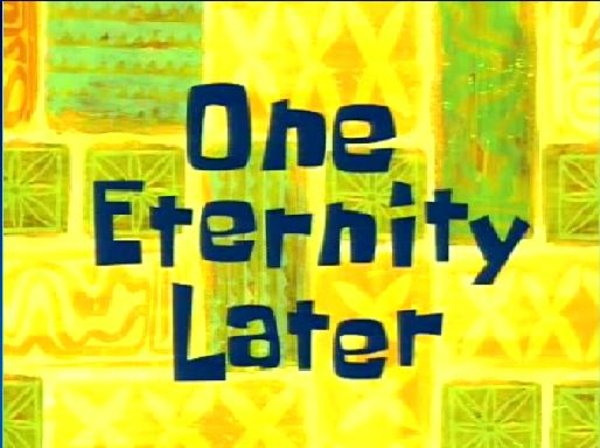

# Screening Many Models

**Learning objectives:**

- Use the `{parsnip}` `Generate parsnip model specifications` addin to create a set of **model specifications.**
- Create a **workflow set** with the `{workflowsets}` package.
  - Describe the purposes of the **workflow set columns.**
  - Create a **workflow set** with a `recipe` preprocessor.
  - Create a **workflow set** with a `{dplyr}` selector preprocesor.
- **Tune** and **evaluate workflow sets.**
  - Use `workflowsets::workflow_map()` to **tune all models** in a workflow set.
  - Use convenience functions such as `workflowsets::rank_results()` to **examine** workflow set tuning results.
  - **Visualize** workflow set tuning results.
- Use `workflowsets::workflow_map` with `{finetune}` to **efficiently screen models** using the **racing approach.**
  - **Compare** the **results of the racing approach** to the **results of the full workflow set screening.**
- **Finalize the best model** from a workflow set.

## Obligatory Setup

Using the [2021 World Happiness Report](https://www.kaggle.com/ajaypalsinghlo/world-happiness-report-2021). Why?

-   Small
-   Interesting

<details>

<summary>

How I felt reading this chapter with `concrete` from `{modeldata}`

</summary>


</details>

```{r 15-setup}
library(tidyverse)
library(tidymodels)
theme_set(theme_minimal(base_size = 16))

df <- 
  here::here('data', 'world-happiness-report-2021.csv') %>%
  read_csv() %>% 
  janitor::clean_names()

df %>% skimr::skim()
```

```{r 15-corrr}
library(corrr)
df_selected <-
  df %>%
  select(
    ladder_score,
    logged_gdp_per_capita,
    social_support,
    healthy_life_expectancy,
    freedom_to_make_life_choices,
    generosity,
    perceptions_of_corruption
  )

cors <-
  df_selected %>% 
  select(where(is.numeric)) %>% 
  corrr::correlate() %>% 
  rename(col1 = term) %>% 
  pivot_longer(
    -col1,
    names_to = 'col2',
    values_to = 'cor'
  ) %>% 
  arrange(desc(abs(cor)))
cors %>% filter(col1 == 'ladder_score')

p_cors <-
  cors %>% 
  filter(col1 < col2) %>% 
  ggplot() +
  aes(x = col1, y = col2) +
  geom_tile(aes(fill = cor), alpha = 0.7) +
  geom_text(aes(label = scales::number(cor, accuracy = 0.1))) +
  guides(fill = "none") +
  scale_fill_viridis_c(option = 'E', direction = 1, begin = 0.2) +
  labs(x = NULL, y = NULL) +
  theme(
    panel.grid.major = element_blank(),
    axis.text.x = element_blank()
  )
p_cors
```

## Creating `workflow_set`s

```{r 15-workflowset}
seed <- 2021
col_y <- 'ladder_score'
col_y_sym <- col_y %>% sym()

set.seed(seed)
split <- df_selected %>% initial_split(strata = !!col_y_sym)
df_trn <- split %>% training()
df_tst  <- split %>% testing()

folds <-
  df_trn %>% 
  vfold_cv(strata = !!col_y_sym, repeats = 5)
folds
```

```{r 15-formulas}
# My weird way of creating formulas sometimes, which can be helpful if you're experimenting with different response variables.
form <- paste0(col_y, '~ .') %>% as.formula()
rec_norm <-
  df_trn %>% 
  recipe(form, data = .) %>% 
  step_normalize(all_predictors())

rec_poly <-
  rec_norm %>% 
  step_poly(all_predictors()) %>% 
  step_interact(~ all_predictors():all_predictors())
rec_poly
```

<details>

<summary>

Code for recipes...

</summary>

```{r 15-models}
library(rules)
library(baguette)
f_set <- function(spec) {
  spec %>% 
    set_mode('regression')
}

spec_lr <- 
  linear_reg(penalty = tune(), mixture = tune()) %>% 
  set_engine('glmnet')

spec_mars <- 
  mars(prod_degree = tune()) %>%
  set_engine('earth') %>% 
  f_set()

spec_svm_r <- 
  svm_rbf(cost = tune(), rbf_sigma = tune()) %>% 
  set_engine('kernlab') %>% 
  f_set()

spec_svm_p <- 
  svm_poly(cost = tune(), degree = tune()) %>% 
  set_engine('kernlab') %>% 
  f_set()

spec_knn <- 
  nearest_neighbor(
    neighbors = tune(), 
    dist_power = tune(), 
    weight_func = tune()
  ) %>% 
  set_engine('kknn') %>% 
  f_set()

spec_cart <- 
  decision_tree(cost_complexity = tune(), min_n = tune()) %>% 
  set_engine('rpart') %>% 
  f_set()

spec_cart_bag <- 
  baguette::bag_tree() %>% 
  set_engine('rpart', times = 50L) %>% 
  f_set()

spec_rf <- 
  rand_forest(mtry = tune(), min_n = tune(), trees = 200L) %>% 
  set_engine('ranger') %>% 
  f_set()

spec_xgb <- 
  boost_tree(
    tree_depth = tune(),
    learn_rate = tune(), 
    loss_reduction = tune(), 
    min_n = tune(), 
    sample_size = tune(), 
    trees = 200L
  ) %>% 
  set_engine('xgboost') %>% 
  f_set()

spec_cube <- 
  rules::cubist_rules(committees = tune(), neighbors = tune()) %>% 
  set_engine('Cubist')
```

</details>

<details>

<summary>

How I felt after creating 10 recipes

</summary>


</details>

We can create `workflow_set`s, combining the recipes that standardizes the predictors with the non-linear models that work best when predictors are all on the same scale.

```{r 15-workflowsets-together}
library(workflowsets)

sets_norm <- 
  workflow_set(
    preproc = list(norm = rec_norm), 
    models = list(
      svm_r = spec_svm_r, 
      svm_p = spec_svm_p, 
      knn = spec_knn
    )
  )
sets_norm
```

Let's apply the quadratic pre-processing to models where it is most applicable.

```{r 15-sets-poly}
sets_poly <- 
  workflow_set(
    preproc = list(poly = rec_poly), 
    models = list(lr = spec_lr, knn = spec_knn)
  )
```

Finally, there are several recipes that don't really need pre-processing. Nonetheless, we need to have a `preproc` step, so we can use `workflowsets::workflow_variables()` for a dummy pre-processing step.

```{r 15-sets-simple}
sets_simple <- 
  workflow_set(
    preproc = list(form),
    models = 
      list(
        mars = spec_mars, 
        cart = spec_cart, 
        cart_bag = spec_cart_bag,
        rf = spec_rf, 
        gb = spec_xgb, 
        cube = spec_cube
      )
  )
sets_simple
```

We can bind all of our `workflow_set`s together.

```{r 15-all-sets}
sets <-
  bind_rows(sets_norm, sets_poly, sets_simple) %>% 
  mutate(across(wflow_id, ~str_remove(.x, '^simple_')))
sets
```

And do the thing! (Observe the elegance.)

```{r 15-load-results, echo=F, include=F, eval=T}
path_res_grid <- here::here('data', '15-res_grid.rds')
do_run <- !file.exists(path_res_grid)
```

```{r 15-do-tune, echo=T, include=T, eval=do_run}
ctrl_grid <-
  control_grid(
    save_pred = TRUE,
    parallel_over = 'everything',
    save_workflow = TRUE
  )

res_grid <-
  sets %>%
  workflow_map(
    seed = seed,
    resamples = folds,
    grid = 3,
    control = ctrl_grid,
    verbose = TRUE
  )
```

<details>

<summary>

How I felt waiting for this to finish running

</summary>



</details>

```{r 15-write-res_grid, echo=F, incude=F, eval=do_run}
write_rds(res_grid, path_res_grid)
```

```{r 15-read-res_grid, echo=F, include=F, eval=T}
res_grid <- read_rds(path_res_grid)
```

## Ranking models

Let's look at our results

```{r 15-ranking_models}
# How many models are there?
n_model <-
  res_grid %>% 
  collect_metrics(summarize = FALSE) %>% 
  nrow()
n_model

res_grid_filt <-
  res_grid %>% 
  # 'cart_bag' has <rsmp[+]> in the `results` column, so it won't work with `rank_results()`
  filter(wflow_id != 'cart_bag')

# Note that xgboost sucks if you don't have good parameters
res_ranks <-
  res_grid_filt %>% 
  workflowsets::rank_results('rmse') %>% 
  # Why this no filter out rsquared already?
  filter(.metric == 'rmse') %>%
  select(wflow_id, model, .config, rmse = mean, rank) %>% 
  group_by(wflow_id) %>% 
  slice_min(rank, with_ties = FALSE) %>% 
  ungroup() %>% 
  arrange(rank)
res_ranks
```

Plot the ranks with standard errors.

```{r 15-plots, echo=F, include=T, eval=T, fig.show=T}
# workflowsets:::autoplot.workflow_set
object <- res_grid_filt %>% filter(wflow_id != 'gb') # %>% filter(.metric == 'rmse')
rank_metric <- 'rmse'
metric <- 'rmse'
select_best <- TRUE
std_errs <- 1
metric_info <- workflowsets:::pick_metric(res_grid_filt, rank_metric)
metrics <- workflowsets:::collate_metrics(object)
res <- 
  object %>% 
  workflowsets::rank_results(rank_metric = rank_metric, select_best = select_best) %>% 
  filter(.metric == !!rank_metric) %>% 
  mutate(across(wflow_id, ~fct_reorder(.x, -rank)))

if (!is.null(metric)) {
  keep_metrics <- unique(c(rank_metric, metric))
  res <- dplyr::filter(res, .metric %in% keep_metrics)
}
num_metrics <- length(unique(res$.metric))
has_std_error <- !all(is.na(res$std_err))
p_ranks <- 
  res %>% 
  ggplot() + 
  aes(x = wflow_id, y = mean, color = wflow_id) %>% 
  geom_point(size = 4) +
  geom_errorbar(
    aes(
      # Not sure why I have to repeat `x` and `color` here, but go on.
      x = wflow_id,
      color = wflow_id,
      ymin = mean - std_errs * std_err, 
      ymax = mean + std_errs * std_err
    ), 
    width = diff(range(res$rank))/75
  ) +
  coord_flip() +
  guides(color = "none") +
  theme(legend.position = 'top') +
  labs(
    x = 'Workflow Rank', y = metric_info$metric,
    title = 'Quadratic SVM wins'
  )
p_ranks
```

If we wanted to look at the sub-models for a given `wflow_id`, we could do that with `autoplot()`.

```{r 15-autoplot}
autoplot(
  res_grid, 
  id = 'norm_svm_p', 
  metric = 'rmse'
)
```

<details>

<summary>

How I feel every time I use `autoplot()`

</summary>


</details>

As shown in the book chapter, this could be a really good use case for `finetune::control_race()` and `workflowsets::workflow_map('tune_race_anova', ...)`

## Finalizing the model

Now we can finalize our choice of model.

```{r 15-stacks, echo=F, include=F, eval=F}
library(stacks)

stack <-
  stacks::stacks() %>% 
  stacks::add_candidates(res_grid)
stack

blend <- stack %>% stacks::blend_predictions()
blend

fit_ens <- blend %>% stacks::fit_members()
fit_ens
```

```{r 15-best-stacks}
wflow_id_best <- 
  res_ranks %>% 
  slice_min(rank, with_ties = FALSE) %>% 
  pull(wflow_id)

wf_best <-
  res_grid %>% 
  extract_workflow_set_result(wflow_id_best) %>% 
  select_best(metric = 'rmse')

fit_best <-
  res_grid %>% 
  extract_workflow(wflow_id_best) %>% 
  finalize_workflow(wf_best) %>% 
  last_fit(split = split)

metrics_best <-
  fit_best %>% 
  collect_metrics()
metrics_best
```

Finally, the canonical observed vs. predicted scatter plot.

```{r 15-preds}
p_preds <-
  fit_best %>% 
  collect_predictions() %>% 
  ggplot() +
  aes(x = !!col_y_sym, y = .pred) +
  geom_abline(linetype = 2) +
  # Big cuz we don't have that many points.
  geom_point(size = 4) +
  tune::coord_obs_pred() +
  labs(x = 'observed', y = 'predicted')
p_preds
```

## Meeting Videos

### Cohort 1

`r knitr::include_url("https://www.youtube.com/embed/Oqla9cWYCak")`

<details>
  <summary> Meeting chat log </summary>
  
```
00:07:17	Jordan Krogmann:	@jon the power of the doge shirt!
00:13:59	Jordan Krogmann:	ggpairs is a great package for this
00:14:20	Conor Tompkins:	I always want to tilt corr matrices a little bit
00:14:22	Asmae Toumi:	eyes emoji
00:14:36	Jon Harmon:	👀
00:26:51	Jon Harmon:	https://github.com/tidymodels/workflowsets/pull/48
00:34:23	Jim Gruman:	gotta step off … thank you Tony!!!
```
</details>

### Cohort 2

`r knitr::include_url("https://www.youtube.com/embed/M71Ey5Ikf4Y")`

<details>
  <summary> Meeting chat log </summary>
  
```
00:08:13	Luke Shaw:	https://www.datakind.org/
00:11:46	Luke Shaw:	https://www.tidyverse.org/blog/2021/05/choose-tidymodels-adventure/
00:12:54	Luke Shaw:	https://www.youtube.com/watch?v=2OfTEakSFXQ
00:44:23	shamsuddeen:	Is ok for me too
```
</details>


### Cohort 3

`r knitr::include_url("https://www.youtube.com/embed/p87Eum6SdD8")`

<details>
  <summary> Meeting chat log </summary>
  
```
00:16:29	Federica Gazzelloni:	https://www.tidymodels.org/start/models/
00:17:29	Federica Gazzelloni:	https://r4ds.had.co.nz/many-models.html
00:31:46	Daniel Chen (he/him):	since there was a talk about "the whole thing" I feel like this set of examples is a good candidate for it all wihtout having to we-write large swaths of things
00:32:54	Ildiko Czeller:	exactly! I feel like some of the package articles do a better job showing the "whole" thing at one place than the book
00:34:28	Daniel Chen (he/him):	the book is more for learning ml and concepts, but since tidymodels is new (to me) i'm always fighting with how I used to do things or how things are done manually
00:35:17	Daniel Chen (he/him):	I also haven't fit a predictive model since dissertation things. so I know for me personally my confusion and struggle is mainly not actually using it regularly
00:36:57	Ildiko Czeller:	for me too I currently do not need predictive models for work so I need to find use cases outside work... which I haven't done yet but plan to
00:38:32	Ben:	I thought it was only me, I can relate to your struggle, its actually a thing. 
00:53:30	Ildiko Czeller:	workflow_map has a default value fn = "tune_grid", which I would prefer always write explicityly. it is a sensible default but it is just weird to read the code without it for me. like we map without specifying a function
00:55:24	Daniel Chen (he/him):	+1
00:58:39	Daniel Chen (he/him):	40 minutes : |
00:59:00	Daniel Chen (he/him):	the verbose = TRUE is probably there so you know it's doing something. and didn't just stall
00:59:09	Ildiko Czeller:	I wonder which of the 10 models makes it so slow. maybe neural net?
00:59:52	Daniel Chen (he/him):	3min * 12models. that's not too bad
01:00:29	Ildiko Czeller:	hmm there are several models taking several minutes there. interesting. it would probably worth it to set up computing in the cloud on a more powerful computer if it is important.
01:01:18	Ildiko Czeller:	yeah it is not too bad to wait once, but if you realise in the end you made a mistake...
01:05:26	Daniel Chen (he/him):	that was a good review of the most confusing chapters
01:11:28	Daniel Chen (he/him):	i have conference stuff next 2 weeks so i'm +1 for break
```
</details>

### Cohort 4

`r knitr::include_url("https://www.youtube.com/embed/URL")`

<details>
  <summary> Meeting chat log </summary>
  
```
LOG
```
</details>
