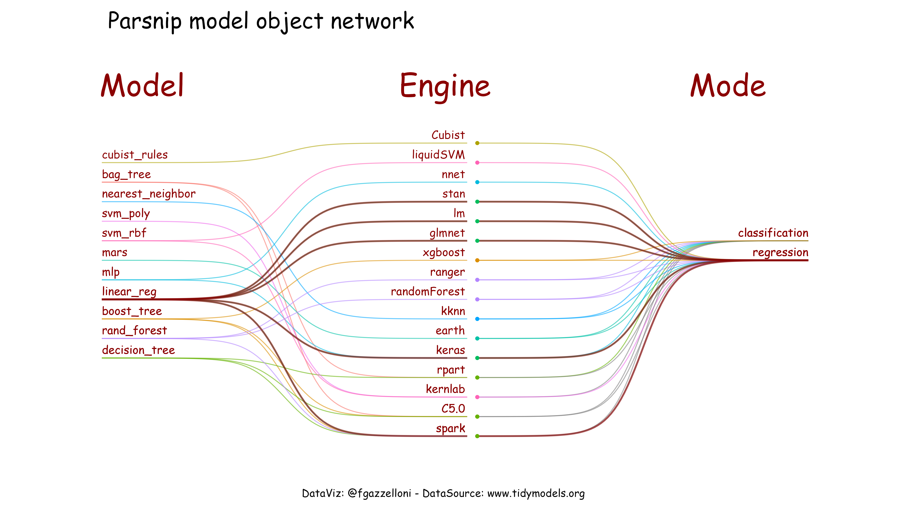

# Notes on chapter 15 Screening many models {-}


**Learning objectives:**


- recap of the model types, modeling analysis and structure of the syntax
- how to set up a workflow set and include more than one workflow set inside a workflow using `workflow_map()` function
- two model screening approach: grid and racing
- finalizing the best model


*Next steps*: Be able to replicate others' studies, here are two examples of reproducible studies: 

- [Estimate of influenza cases using generalized linear, additive and mixed models](https://www.ncbi.nlm.nih.gov/pmc/articles/PMC4514424/)
- [On the Use of Generalized Additive Models in Time-Series Studies of Air Pollution and Health](https://academic.oup.com/aje/article/156/3/193/71628#541888)


------------------------

## Introduction


This section contains some addition to the notes for **Screening many models** chapter. The scope is to focalizing on the modeling procedure and the burden of choosing the most suitable model for our data. In particular, we specify and train models with different engines to decide which one is the best for our data.

It includes a recap of the previous chapters. 

### Questions

Making questions about our data is the best way to identify the key elements to use in the analysis.

Here is a list of some of them:

- What is the question we would like to answer? 
- What are the key factors, and the interaction factors influencing the outcome? 
- Are data enough for answering the question?
- Does resampling would be helpful?
- How does model differ with other predictors?
- ... ?


```{r message=FALSE, warning=FALSE, include=FALSE, paged.print=FALSE}
library(tidyverse)
library(tidymodels)
tidymodels_prefer()


# Helper packages
library(broom.mixed) # for converting bayesian models to tidy tibbles
library(dotwhisker)  # for visualizing regression results


library(modelr)
library(rules)
library(baguette)
```

------------------

## To Recap previous chapters

The last chapters focused on:

- **resampling** and **model comparisons**
- **tuning**
- **grid search**
- **iterative search**

In these notes, we summarize the different types of models and apply the above techniques.

------------------

### Models classification
<details>

<summary>Which model is the best for your data?</summary>


#### All models share two important characteristics: 

- summarize the data
- interpolate the data space

many models are manifolds, or high-d surfaces.

#### Types of models


Three are the most important categories in which models fall:

- **Descriptive models**: To have an idea of the trend of our data. The identification of the differences within data and assumptions are obtained with the application of *theoretical assumptions*, and the analysis of model residuals. 

An example is a **regression line** used to discover some trend in the data (scatterplot with smoothers i.e. "method: LOESS").

- **Inferential models**: To make hypothesis test. 
Specific hypothesis are tested with *probabilistic assumptions* ("statistically significant") and produce some type of probabilistic output.

Examples are **p-value**, **confidence interval**, or **posterior probability**.

- **Predictive models**: To produce predictions. 
The *structure of the prediction* is made to forecast trends for new data.

Examples are **estimations**, **measures of uncertainties**, **error forecastings**, and evaluation of the **prediction methods**. They are subdivided in:

- **mechanistic models**: made of differential equations used to derive a specific model equation, with data used to estimate the unknown parameters of this equation and to make predictions.
- **empirically driven models**: machine learning category models, defined by the structure of the prediction, and evaluated by testing the accuracy of the model on existing data ("K-nearest neighbor (KNN) model","5-nearest neighbor model")


In general a **linear regression model** might fall into any of these three classes of models.


What we want is[^1]: 

> "a simple and understandable picture of the relationship between the input variables and responses." (Breiman, L. 2001b)

[^1]: [source of quote: Statistical Modeling: The Two Cultures](https://projecteuclid.org/journals/statistical-science/volume-16/issue-3/Statistical-Modeling--The-Two-Cultures-with-comments-and-a/10.1214/ss/1009213726.full)

#### Supervised or Unsupervised?

Another classification of models is if they are **supervised** or **unsupervised**. 

- **Supervised**: models with an **outcome variable** with a characteristic **model mode** (Linear regression, neural networks, ...) and they are subdivided in
      
      - Regression
      - Classification

- **Unsupervised**: models made to understand relationships between variables, without an explicit relationship between predictors and an outcome. The models learn patterns, clusters, or other characteristics of the data but **lack an outcome** (Principal component analysis (PCA), clustering, and autoencoders, ...)


#### One more classification

One more classification to be taken into consideration when thinking about modeling some data is about:

- **The model family**: linear model or model-based clustering (i.e. neural networks)
- **The model form**: specified a-priori by the statistician, or chosen by a model-selection procedure, it specifies the variables
- **The fitted model**: optimizes some criterion for the given data, and it estimates for the parameters 

To find the “best” fitted model (i.e., the model with the highest criterion value) we need **multiple random starts**. And for doing it two are the tools to use:
 
- **the grand tour**, which is used to look at *many projections* of the data; (the grand tour can be used to identify multivariate outliers and clusters in the data)
- **linked brushing**, to look at *many sections* of the data with different colours (just like trellis plots: a sequence of graphs, each of which presents a different range of depths)


When a family of models is defined, we can generate a fitted model by finding the model in the family that is the closest to our data. 


What is a **fitted model** ?


> "A fitted model is just the closest model from a family of models"
> `r tufte::quote_footer('--- Max Kuhn and Julia Silge')`


It’s also useful to see what the model doesn’t capture, the so-called **residuals** which are left after subtracting the predictions from the data. 

The residuals are powerful because they allow us to use models to remove striking patterns so we can study the underneath trends, the error pattern and all that is hidden in the data that hasn't been captured by our model.

For example, to decide between a linear or non-linear model, we look at the pattern of the residuals. In general, if the residuals have a normal distribution, this means that we are dealing with a linear model.


#### Linear models and non linear models:

We are about to test **many models** on our data set, and we want to see how they behave whether we use linear or non linear models.

**Linear models** assume a relationship of the form:

      y = a_1 * x1 + a_2 * x2 + ... + a_n * xn

and assume that the residuals, the distances between the observed and predicted values, are generally normal distributed or have a normal distribution.


Types of Linear models:

- Generalized linear models - `stats::glm()`
- Generalized additive models - `mgcv::gam()`
- Penalized linear models - `glmnet::glmnet()`
- Robust linear models - `MASS::rlm()` 
- Trees - `rpart::rpart()`

**Non linear models** are models with a non-linear trend. 

There are some models that require predictors that have been centered and scaled:

- neural networks
- K-nearest neighbors
- support vector machines SVG

while others require a traditional response surface design model expansion (quadratic and two-way interactions).


------------------

### Data analysis process

<details>

<summary>What are the steps to data modeling analysis?</summary>


The data analysis process is made of four steps:


1 - **Exploratory data analysis (EDA)**: it involves data tidying and a graphical visualization of the key variables, to identify possible outcome and predictors.

2 - **Feature engineering**: is the **preprocessing** part of the analysis, it includes data wrangling and formulation made with a `recipe()`.

3 - **Model tuning and selection**: this is the **processing** part of the analysis, with parameters settlement and model selection made with the `parsnip syntax`, which generates a parsnip model object.

4 - **Model evaluation**: This last step evaluates the results of the modeling, metrics and ranks, such as rmse, ROC curve and auc plots.


    The data need to be evaluated following the criterion of final objective.


------------------

### Preprocessing - Feature engineering

In this step of the modeling procedure we set the data and the formulation in line with the results of the exploratory analysis. 
Data visualization has given us the idea of what is the structure and evidenced some indication about the variation and correlation of our data.

#### Splits

<details>

<summary>What proportion of our data will be dedicated to be training the model and which to testing it?</summary>


Data splitting is another very important part of the modeling, in general is done divide the data set in two sub-groups to use one for trying the model and the other for testing it on "new data", eventually for making prediction. Sometimes one more subdivision is allowed, mostly when we need to validate the model before testing it to new data. The sub-groups are:

- training set
- validation set
- test set

To split the data-set we use the `rsample::initial_split()` function. This is a *random* splitting procedure, the original data are subset into smaller sets to be tested with our models.

We can set the seeds to save the unique combination in case we want to replicate the same results.

    set.seed(555)
  
    data_split <- initial_split(data = <your_data>, 
                                prop = <some_prportion>,
                                strata = <variable>)
  
    train_data <- training(data_split)
    test_data  <- testing(data_split)
    
In general, this is done to reduce the dimensions of large data sets, and/or *to test* the model on a `train` set before testing it once again on a smaller sized data set named `test` set to make the prediction. 

The *proportion* argument of the function, establishes the percentage of data to be assigned to each set, while the *strata* argument is to specify in which way we want to stratify the sets. And this means that we specify that we want that each of the subsets need to be assembled with the same proportion of the stratifying variable.
    
In conclusion, the *training* set will be used to fit the model, while the *testing* set will be used to measure the model performance.     


#### Recipes

<details>

<summary>Designing your model with a Recipe[^2]?</summary>


[^2]:[Preprocess your data with recipes](https://www.tidymodels.org/start/recipes/)

Now that we have some testing data to use, we specify how we would like to test these data. 

A **recipe** is the model formula to be applied to our data. 
 
      recipe()

The function allows us for some options such as:

    - step_<functions>()
    - update_role()

Recipes are alternative methods for creating design matrices. 

In general, the modelling functions in R use a standard conversion from formulas to functions:

      y ~ x  ---------------->     y = a_1 + a_2 * x
      
to see what `recipe()` does in practice, or to understand what is happening when applying the function to the formula, we can use the `model_matrix()` function and see what R actually does when apply a formula: [^3]


[^3]: [R4DS - Model](https://r4ds.had.co.nz/model-basics.html#formulas-and-model-families)

```{r}
df <- tibble::tribble(
  ~y, ~x1, ~x2,
  4, 2, 5,
  5, 1, 6
)
modelr::model_matrix(df, y ~ x1)
```

It extrapolates the **intercept** and the **slope** of the data. 

##### How to set a `recipe()`:

The `recipe()` set the formula, then the model will be settled with a `parsnip object` 

    recipe(general formula = ~ . , data = <your data>) %>%
    step_<functions>()


There are several types of `step_<functions>()` :

      ?step_novel     # assignments for Novel Factor Levels
      ?step_dummy     # convert nominal data to numeric
      ?step_zv        # remove variables that contain only a single value
      ?step_normalize # center and scale numeric data
      ?step_center    # center
      ?step_scale     # scale
      ?step_other
      ?step_interact  # create interaction variables
      ?step_ns
      ?step_poly      # create new columns using orthogonal polynomials


In addition to the *step_functions*,  a further function can be added to **update** the roles in the `recipe()`:

      update_role(data, predictor, new_role = "ID")

This is useful if we need to assess the formula with excluding some variables as to be predictors.


When a **recipe** is done and generally, if the original data have been split in *training* and *test* sets, the recipe is done on the training set and then **trained** with a different function the `prep()` function, which is useful also to have a look at the data, it releases the data set after having applied the recipe. 

- `prep()` trains the data in the `recipe()` and returns an updated recipe with the estimates, also it is used to tidy the result of the recipe.

One more important function is `bake()`, this is useful to recall the set before `prep()` and also to be able to apply the `fit()` command and so be able to fit the model it has to be *baked* first to being *fit*

- `bake()` is used to make prediction


In general, they are useful for looking at the results of the application of a `recipe()`.


-------------------

### Processing - Model tuning and selection

<details>

<summary>How to set a parsnip object?</summary>



This is a list of the model names grouped by model engines and modes for selected models. We will test all of these models on our data sets to find the best one.


To process the data with a **parsnip** model object, we apply the **parsnip syntax** with a set of commands and to then `fit()` the model:

- Specify the type of model based on its mathematical structure
        <model_name>() 
- Specify the engine for fitting the model        
        set_engine("<model>")
- When required, declare the mode of the model        
        set_mode("<mode>") 
        

A **Parsnip model object**:

        <model_name>() %>%
              set_engine("<model>") %>%
              set_mode("<mode>") 

Also, the use of `translate()` function at the end of the object, helps understanding the structure of a model. 


#### Authomated Parsnip model objects

How to set up a **parsnip object** choosing model type and engine with automated commands:

      parsnip::parsnip_addin()

This command opens up the viewer pane with **"Write out model specifications"** dashboard for us to set the structure of desired models, as well as:

      usemodels::use_<function>

which allows us to use remind the structure of a model among those available in the package, and gives us some suggestions on how to set the model workflow. We use the function `use_<functions>` which includes 6 different type of models, to pull out the structure base. List of {usemodels} available models structure:

1. cubist
2. earth
3. glmnet  # general linear model 
4. kkn
5. ranger
6. xgboost


Once the type of model has been chosen among all the possibilities in a `parsnip` model object, a model type and an engine can be set. [^4] 
The next step is to accept the suggestions and set the model with other personal features, if needed.

[^4]: [find a parsnip object](https://www.tidymodels.org/find/parsnip/)  


#### Workflow (recipe & model)


The `workflow()` function is a wrapper of our model and recipe. 


    
    glmnet_workflow <- 
      workflow() %>% 
      add_recipe(glmnet_recipe) %>% 
      add_model(glmnet_spec) 


### Resampling and model comparisons

```{r include=FALSE}

library(DiagrammeR)

```


Figure \@ref(fig:diagram) Resampling produces two subsets of the training set.

```{r diagram, echo = FALSE, out.width = NULL, fig.cap = "Graph of the resampling split"}

mermaid("
graph TB 
O[Resampling]---A(analysis set)
O[Resampling]---B(assessment set)
style O fill:#f96
style A fill:#bbf,stroke:#f66,stroke-width:2px,color:#fff,stroke-dasharray: 5 
style B fill:#bbf,stroke:#f66,stroke-width:2px,color:#fff,stroke-dasharray: 5 
",height = '100%', width = '100%'
)
```


<details>

<summary>Why using resampling?</summary>


Resampling means replicating the original data into different combination, it can be with repetition or not.[^6]

[^6]:[General use cases](https://www.tmwr.org/resampling.html)

The resampling methods usually take the **training set** only and iteratively split it into two subsamples, they are somewhat analogous to training and test sets. 

The **analysis set** is to fit the model, while the **assessment set** is to evaluate the model.

> Why using resampling?

**Resampling methods are considered the best practice when comes to evaluating the modeling process**. 

In particular, the advises are:

- to do not use *test set* immediately; the application of the model to the test set for final verification without resamplign methods would lead to re-predicting the training set, and this is, in general, a bad idea for most models [(see article)](https://www.tmwr.org/resampling.html).  

> "many predictive models are capable of learning complex trends from the data"

- mind that re-predicting the *training set* will always result in an artificially optimistic estimate of performance or **overfitting**.


#### Resampling methods:

- **Cross-validation**: points are randomly assigned to roughly equal-sized folds. v-fold cross validation means v number of folds to be cross validated. The assessment sets that are mutually exclusive. 

    rsample_object <- vfold_cv(training_set, 
                          v= number of folds, 
                          strata = variable)
    
To retrieve the sets use these functions:

    rsplit_object_analysis <- analysis()
    rsplit_object_assessment <- assessment()
      
Other types of *cross validation* resampling methods are:

- **Repeated Cross-Validation**: depends on the size or other characteristics of the data. It creates R repetitions of V-fold cross-validation.

      rsample_object_with_rep <- vfold_cv(training_set, 
                                    v= number of folds, 
                                    strata = variable,
                                    repeats = 5)
      
- **Leave-One-Out Cross-Validation (LOO)**: it is better for small samples. The models are fit using n-1 rows, the remaining row is the single performance statistic, which is predicted using the other rows and then pooled

      loo_cv()

- **Monte Carlo Cross-Validation (MCCV)**: the proportion of the data is randomly selected each time, the assessment sets that are not mutually exclusive.

      mc_cv(training_set, prop = prop, times = times)


- **Validation Sets**: when the original pool of data is very large, it is done with a single iteration. 

      validation_split(training_data, prop = 3/4)

- **Bootstrapping**: "out-of-bag" sample. For approximating the sampling distribution of statistics and estimate model performance. It creates samples with replacement, each data point has a 63.2% chance of inclusion in the training set at least once, while the assessment set is made of the training set exclusions from the analysis set. It produces performance estimates with low variance.

      bootstraps(training_data, times = 5)


- **Rolling forecast origin resampling**: to estimate seasonal and other temporal trends. 

      time_slices <- rolling_origin(initial = 6 * 30, 
              assess = 30, 
              skip = 29, 
              cumulative = FALSE)
              
To retrieve it:

      map_dfr(time_slices$splits, ~   analysis(.x))

more readings:

- [article: cross-validation-essentials-in-r](http://www.sthda.com/english/articles/38-regression-model-validation/157-cross-validation-essentials-in-r/)
- [article: vfold_cv](https://rdrr.io/cran/rsample/man/vfold_cv.html)


##### Evaluate peformance with resampling

To evaluate the model, we use:

    fit_resample()
    

It can be applied to:

    model_spec %>% fit_resamples(formula,  resamples, ...)
    model_spec %>% fit_resamples(recipe,   resamples, ...)
    workflow   %>% fit_resamples(          resamples, ...)

Other arguments are:

- control

    `control_resamples(save_pred = TRUE, save_workflow = TRUE)`
    
- verbose
- extract
- save.pred
- summarize

And `collect_metrics()` to retrieve the metrics


##### Parallel processing with `{tune}` package

The models created with the resampling processes are independent of one another and so, **parallel**. 

To do computations faster, in the case of a single computer producing the modeling resamples, the parallel computations could be split across processors inside your computer. 

Parallel processing, applied to different processors, provide linear speed-ups, this means that, the computations are faster.

The number of possible “worker processes” in your computer, is determined by the **parallel package**. (found in `{foreach}` package inside `{tune}`)

To detect the number of physical cores, or the possible number of independent processes that can be simultaneously used inside your computer:

```{r}
parallel::detectCores(logical = FALSE)
#parallel::detectCores(logical = TRUE)
```


Then, to **set the parallel programming platform** on your computer for the first time, you can use `{doMC}`, it provides the needed mechanism to execute loops in parallel (only for mac).

```{r message=FALSE, warning=FALSE, paged.print=FALSE}
# install.packages("doMC")
library(doMC)
registerDoMC(cores = 2)
```

This instructs `fit_resamples()` to run half of the computations on each of two cores. 


To reset the computations to **sequential processing**:

    registerDoSEQ()


Alternatives and [more reading](https://www.jstatsoft.org/article/view/v031i01):

- `{doParallel} package which uses network sockets for all the other systems:

```{r}
# Create a cluster object and then register: 
cl <- parallel::makePSOCKcluster(2)
doParallel::registerDoParallel(cl)
```

Now run `fit_resamples()` and return your computer to its normal state:

      parallel::stopCluster(cl)


- `{future}` package and `do` prefix, it provides a framework for parallelism.


Once a modeling approach is chosen as the best option for our data set, the **next step is to fit again the whole training set** and estimate the model parameters with more data.


A method for retaining the models created with resampling or some of their components is to use:

    control_resamples(
                verbose = FALSE,
                allow_par = TRUE,
                extract = NULL,
                save_pred = FALSE,
                pkgs = NULL,
                save_workflow = FALSE,
                event_level = "first",
                parallel_over = NULL
              )
    
We will apply this inside the **workflow**.

Example Syntax:


    lm_wflow <-  
      workflow() %>% 
      add_recipe(<your_recipe>) %>% 
      add_model(linear_reg() %>% set_engine("lm")) 
    
    lm_fit <- lm_wflow %>% 
      fit(data = <your_train_data>)
    
Fit the resamples with a 10-fold cross-validation method:

    lm_res <- lm_wflow %>%  
      fit_resamples(resamples = vfold_cv(<your_train_data>, v = 10), 
                    control = control_resamples(extract = pull_workflow_fit(lm_fit) %>% tidy()))
    
    
Then, extract the results:

    lm_res$.extracts[[1]][[1]]

all of the results can be flattened and collected using:

    all_coef <- map_dfr(lm_res$.extracts, ~ .x[[1]][[1]])


`.extracts` pulls out the nested information.

##### Comparing models with resampling

To compare models with resampling we set up a `worlflow_set()` made of lists of **preprocessing steps** and **models** we would like to compare:

    preproc <- 
      list(basic = basic_rec, 
           interact = interaction_rec, 
           splines = spline_rec
      )
      
      
    workflow_set(preproc, list(lm = lm_model), cross = FALSE)
    

The result is a collection of resampled summary statistics (e.g. RMSE, accuracy, etc.) for each model.

We use `purrr::workflow_map()` to apply a formula to our `workflow_set()` objects, the results is:

    lm_models %>% 
      workflow_map("fit_resamples", 
      
                   # Options to `workflow_map()`: 
                   seed = <some_seeds>, 
                   verbose = TRUE, # to print the progress
                   
                   # Options to `fit_resamples()`: 
                   resamples = <your_data_folds>, 
                   control = keep_pred
                   
                   )
                   
    collect_metrics(lm_models) %>% filter(.metric == "rmse")
   
    autoplot(lm_models, metric = "rsq")
    
Then decide to add one more model:

    four_models <- 
      as_workflow_set(random_forest = rf_res) %>% 
       bind_rows(lm_models)

    autoplot(four_models, metric = "rsq")


    rsq_indiv_estimates <- 
      collect_metrics(four_models, summarize = FALSE) %>% 
      filter(.metric == "rsq") 
    
    rsq_wider <- 
      rsq_indiv_estimates %>% 
      select(wflow_id, .estimate, id) %>% 
      pivot_wider(id_cols = "id", names_from = "wflow_id", values_from = ".estimate")
    
    corrr::correlate(rsq_wider %>% select(-id), quiet = TRUE)
    
    
    
```{r eval=FALSE, include=FALSE}
rsq_indiv_estimates %>% 
  mutate(wflow_id = reorder(wflow_id, .estimate)) %>% 
  ggplot(aes(x = wflow_id, y = .estimate, group = id, col = id)) + 
  geom_line(alpha = .5, lwd = 1.25) + 
  theme(legend.position = "none") + 
  labs(x = NULL, y = expression(paste(R^2, "statistics")))
```


Finally, define a relevant practical effect size when comparing the results for a specific metric.

#### Hypothesis testing methods

Hypothesis tests and p-values are generated to statistically compare models.


> What’s a p-value?
> If this analysis were repeated a large number of times under the null hypothesis of no differences:
> “... a p-value is the probability under a specified statistical model that a statistical summary of the data would be equal to or more extreme than its observed value.” Wasserstein and Lazar (2016)


The **resample-effect** would be considered either as a: 

- block effect
- random effect

The **ANOVA** model is used to compare the variance of the models and we want to fit it with **random effects** using:

- linear mixed model
- Bayesian hierarchical model

    ANOVA(model1,model2)
  
This kind of comparison is not useful if we want to see the resample-to-resample effect.

To evalutate these differences we need to make a model of the differences, `difference = splines_lm - basic_lm` :
    
    lm(difference ~ 1, data = compare_lm)

or

    t.test(splines_lm, basic_lm, paired = TRUE)
    
This method is complicated if we have more than two model to make comparison with.


#### Bayesian method

Bayesian assumptions:

- **residuals**: independent and follow a Gaussian distribution with zero mean and constant standard deviation of σ
- **estimated regression parameters**: follow a multivariate Gaussian distribution, p-values and confidence intervals
- **prior distribution**: prior parameters distributions
- **posterior distributions**: the final distributions of the model parameters as combinations of the priors and the maximum likelihood estimates.

> To adapt our Bayesian ANOVA model so that the resamples are adequately modeled, we consider a random intercept model

The **{tidyposterior}** package which uses the **Stan software** for specifying and fitting the models via the **{rstanarm}** package, has functions to fit Bayesian models for the purpose of comparing resampled models.

    ?priors

For workflow sets:

    perf_mod()  makes between-workflow comparisons
    
`perf_mod()` determines an appropriate Bayesian model and fits it with the resampling statistics.

The estimation process is iterative such as in **chains** replications.
    
     rsq_anova <- 
              perf_mod(
                    four_models,
                    metric = "rsq",
                    prior_intercept = rstanarm::student_t(df = 1), # example
                    chains = 4,
                    iter = 5000, # how long to run the estimation in each chain
                    seed = 1102
        )


The **posterior of the difference in means** is computed by sampling from the individual posteriors and taking the differences with `contrast_models()` function:

      rqs_diff <- 
            contrast_models(rsq_anova,
                  list_1 = "splines_lm",
                  list_2 = "basic_lm",
                  seed = 1103)


See the results with:

      summary(rqs_diff) %>% 
          select(-starts_with("pract"))

While to see the probability of being practically significant, the **“ROPE estimate”** (for Region Of Practical Equivalence), use the `size` option:

      summary(rqs_diff, size = 0.02) %>% 
          select(contrast, starts_with("pract"))


This is the case when we want to establish the mgnitude of difference and we set it at a level of 2%. `pract_equiv` variable releases this value.
  
```{r eval=FALSE, include=FALSE}
autoplot(rsq_anova, type = "ROPE", size = 0.02)
```


To see the effect of resampling additional resamples were added using repeated cross-validation. 

> How did the posterior distribution change? 


- [bayesian](https://bayesian.org/what-is-bayesian-analysis/)
- [prior](https://towardsdatascience.com/introduction-to-bayesian-linear-regression-e66e60791ea7)

### Tuning parameters - Hyperparameters

<details>

<summary>What is tuning?</summary>


What [**tuning**](https://www.tidymodels.org/start/tuning/) means?

The process of tuning involves the **estimation of the best values for the hyperparameters** obtained by training many models on resampled data sets and exploring how well all these models perform. 

Often found in *machine learning models* and for this reason depending on the previous models.


What is a [Hypeparameter](https://machinelearningmastery.com/difference-between-a-parameter-and-a-hyperparameter/)?

Hypeparameters are important parameters which cannot be directly estimated from the data, and they are refferred to as a tuning parameter because there is no analytical formula available to calculate an appropriate value.

Example of **hyperparameters**:

- the learning rate for training a neural network.
- the C and sigma hyperparameters for support vector machines.
- the k in k-nearest neighbors

to be more specific:

- **mtry**: number of predictors sampled at splits in a tree-based model
- **learn_rate**: learning rate in a boosted tree model 
- **degree of freedom** in a spline function
- **hidden units** to fit neural network classification models


It escludes:

- the **prior distribution** required for **Bayesian analysis**
- the number of trees in *Random forest models* which usually perform well under **default hyperparamenters**


There are different ways to **tuning**, one involves **customization** of specific parameters, another is to use the **`tune()`** function, which verify the range of the selected parameter and tags the parameters for optimization, it is a placeholder function.


> `tune()` will tag the parameter for optimization. 
It configure and process these parameters since they understand their characteristics (e.g. the range of possible values, etc.).
 
 

The parameters to tune are found in **two parameter arguments**

- **main arguments** (trees, min_n, mtry, ...)
- **engine-specific** (infrequently optimized inside the engine - i.e in ranger is regularization.factor, ...)

**Example**: 

    rand_forest(trees = 2000, min_n = 10) %>%                   
          set_engine("ranger", regularization.factor = 0.5)


In general, [exploring models](https://www.tidymodels.org/find/parsnip/) diversity, tuning parameters are found in: 

1- **model title**: **boosting** such as the number of iterations of a series of base models

2- **model type** and **mode**: The number of hidden units (linear combinations of the predictors) and the type of activation function (a nonlinear function) are important structural tuning parameters

3- **model engine**: such as neural networks to estimate the model parameters


So, **What to tune?**

- the threshold 
- the number of degrees of freedom 
- the number of data points 
- the penalty

**Where to tune?**

- The tuning technique can be used inside the **`recipe()`** and so in the preprocessing part, in particular this is done for:

- **principal component analysis**, or partial least squares
- **imputation methods** that estimate missing predictors such as k-nearest neighbors, the number of neighbors can be tuned.


- The tuning technique can be used inside the **model**:

      mlp(hidden_units = tune()) %>% 
              set_engine("keras")


The procedure of tuning includes the interaction with **{dials}** package. 

Once set the `tune()` function, to enumerate the tuning parameters for an object, use:

      dials::parameters()
      
it tells you about the parameters that are to be tuned and highlights issues in case of any further data modification needed.

It contains all the **hyperparameters** as functions:

- hidden_units()
- threshold()
- spline_degree()
- regularization_factor()
- penalty()
- epochs()
- ...


It allows for other functions to update the parameters as needed. 
With `pull_dials_object()` the parameter can be extracted and updated with `parameters()` and `update()` functions.

      parameters(ames_rec) %>% 
        update(threshold = threshold(c(0.8, 1.0)))

check for the objects to have [+] in their summary, otherwise a value of [?] requires more customization.

Then use `finalize()` to set the customization.

 
#### Strategies for parameters optimization:

- pre-define a set of parameter (**grid search**) - how many parameter combinations to evaluate?
- decide for which parameter to choose based on results (**iterative search**), any **nonlinear optimization method** is appropriate
- hybrid, after an initial grid search, apply a sequential optimization starting from the best grid combination

 
More about **optimization methods for tuning**:

> A metric measures the magnitude of any element in the set by evaluating the distance between that element and zero (Thomas and Uminsky)

> Different metrics, as well as general KPIs (key performance indicators), might lead to different decisions about the choice of tuning parameter values.


**Warning**: important is to mind modulating the model complexity, in particular

- adding degrees of freedom in a spline function increases the intricacy of the prediction equation, it might lead to over-interpretation
- increasing the number of hidden units, it might lead to overfitting.
- simply repredicting the training set is a poor approach to model evaluation, the pattern does not repeat in the test set
- rather than using the test set, some form of resampling is required.


 
### Grid

<details>

<summary>What about Grids?</summary>


[credits](https://r-spatial.github.io/stars/reference/st_warp.html)

**How to optimize the parameters?** 

Once we know what to optimize, we can apply the **Grid search**[^7], which is  a way to search for the best parameters representing our data. It specify the possible values of the parameters a priori.

[^7]:[Grid search](https://www.tmwr.org/grid-search.html)

`tune_grid() function is the primary function for conducting grid search. Its functionality is very similar to `fit_resamples()`


**Types of grids**:

1. **regular grid** (combinations of separate sets of parameter values)

It can be used:

      tidyr::crossing()

`crossing()` is a wrapper around `expand_grid()` that de-duplicates and sorts its inputs. It creates a regular grid with inside the hyperparameters customization.

For example for a mlp model:

      crossing(
        hidden_units = 1:3,
        penalty = c(0.0, 0.1),
        epochs = c(100, 200)

or:

      dials::grid_regular(<model>, levels = <level>)

the `level`argument set the number of levels per parameter

      grid_regular(levels = c(hidden_units = 3, 
                              penalty = 2, 
                              epochs = 2)


2. **non-regular grid** (parameter combinations are from a larger set of points). It involves random allocation inside a grid

one way is to use:

      parameters(<model>) %>%
          grid_random(size = <some_size>)

**warning!** in small-to-medium grids, random values can result in overlapping parameter combinations

or forllowing the **space-filling designs** with configurations such as:

- Latin hypercubes `grid_latin_hypercube()`
- maximum entropy designs (represent the maximum level of avg information, through spatial data distribution and actual error estimation in a logistic regression model)
- maximum projection designs
- ...

      parameters(<model>) %>%
          grid_latin_hypercube(size = <size>, original = T/F)


**Example of using `grid_regular()`**: 

call the `tune_grid()`function in a `workflow`. 
The workflow has been updated with parameters customization and the `grid` argument contains this modification.

Let's say that we do `vfold_cv` as resampling method, and have  

          resample <- vfold_cv(<your_data>)
          workflow <- workflow() %>% add_model(<your_model>) %>% add_recipe(<your_recipe>)
          parameters <- workflow %>% prameters()%>% update(<some_hyperparameters>)
          grid <- parameters %>% grid_regular(levels = <some_level>)
          metric <- metric_set(<some_metric>)

1. the grid argument contains the `grid_regular()` 

           tune <- workflow %>%
                      tune_grid(
                          resample,
                          grid = grid,
                          metrics = metric
                        )
          
          autoplot(tune)
          
          show_best(tune) 
          

2. or call the `grid` argument with a fixed number of grids  and param_info`
              
              tune_grid(
                resample,
                grid = <some_numbers>,
                param_info = parameters,
                metrics = metric
                )


Then finally **finalize** the model chosing the best one:

      select_best(tune, metric = metric)


#### Finalizing the model

Next step is to evaluate how well it does on the test set.
The procedure is to:

- set a `tibble()` with new parameters values
- use the select_best()` function or other `select_*` functions

Then **finalize** and **fit**:

      finalize_workflow()

or:

      finalize_recipe()

and then use `fit()` to finally fit it into the entire **training set** that can be used to make future predictions on new data, or **test data**.


#### How to perform a grid search?


> Instead of trying lots of random models, we could be more systematic and generate an evenly spaced grid of points (this is called a grid search).

> `r tufte::quote_footer('--- Hadley Wickham, Dianne Cook and Heike Hofmann')`

Quote from the article [^8] where the authors summarize the fundamental understanding about how a model summarizes data.

[^8]: http://vita.had.co.nz/papers/model-vis.html, https://r4ds.had.co.nz/model-basics.html


#### Tools for grid searching:

1. **Submodel optimization**: reduces time computing the grid search

- **Partial least squares (PLS)**, supervised version of principal component analysis (PCA), creates components that maximize the variation in the predictor, but simultaneously tries to maximize the correlation between these predictors and the outcome.
*Tuning parameter*: the number of PLS components to retain ranges between [1,50] but with `num_comp` many more can be used so that a single fit can be used to evaluate many submodels.

- **Boosting models** make predictions across multiple values for the number of boosting iterations.

- **Regularization methods**, such as the glmnet model, can make simultaneous predictions across the amount of regularization used to fit the model.

- **Multivariate adaptive regression splines (MARS)** adds a set of nonlinear features to linear regression models
*Tuning parameter*: number of terms to retain.

**Example** with boosted C5.0:

This is the model with tuning

    c5_spec <- 
      boost_tree(trees = tune()) %>% 
      set_engine("C5.0") %>% 
      set_mode("classification")

This is the sub-optimization, specifying the number of `trees` in `tune_grid()`, `grid` argument

    set.seed(2)
    c5_spec %>%
      tune_grid(
        class ~ .,
        resamples = cell_folds,
        grid = data.frame(trees = 1:100),
        metrics = roc_res
      )

2. **Parallel processing**: method for decreasing execution time when resampling models, when the preprocessing method is expensive

      tune_*(
          parallel_over("resamples"/"everything")
      )

3. **Benchmarking boosted trees**:

An example is to use three recipes with "none", "light", and "expensive",comutations on parallel_over = "resamples" and "everything", to show different time computing 

Ways of preprocessing:

- preprocess the data prior to modeling 

    data %>% some_dplyr_techniques

- preprocessing via a recipe 

    recipe(fromula, data) %>% step_*()
    
- add an additional step to a recipe 

    recipe(fromula, data) %>% 
        step_*() %>%
        step_*()


4. **Racing methods**


### Iterative search methods:


- [simulated-annealing](https://bookdown.org/max/FES/simulated-annealing.html) for the purpose of feature selection. The goal in this case is to find the strongest (or most predictive) set of features for predicting the response.


---------------

## Grid and Racing methods: What are the differences?

using the ingredients as predictors

How can workflow sets make the large scale testing of models easier?

--------------

## Finalizing with screening many models

<details>

<summary>What is the best model?</summary>


------------------------

## Examples


### 1 - urchins data from tidymodels.org 

This dataset contains the values for *food_regime*, *initial_volume* and the *width* as a result of the food consumption. What we want is the predict the *width* (**outcome**) using the other two variables (**predictors**).

Data source: [urchins](https://www.flutterbys.com.au/stats/tut/tut7.5a.html)


### 2 Example 

[source](https://www.r-bloggers.com/2021/08/text-mining-star-trek-dialogue-and-classifying-characters-using-machine-learning/)


###  3 - concrete example 

[compare models](https://www.tmwr.org/compare.html)

source("concrete_example.R")


-----------

## Resources

The resources for this chapter are: 

- The book: [Tidymodels](https://www.tmwr.org/)
- Build a model: [article](https://www.tidymodels.org/start/models/)
- R4DS book: [R4DS](https://r4ds.had.co.nz/many-models.html)
- Find a model: [parnsip model object](https://www.tidymodels.org/find/parsnip/)
- [An Introduction to Statistical
Learning](https://web.stanford.edu/~hastie/ISLRv2_website.pdf)
- [The Elements of
Statistical Learning](https://web.stanford.edu/~hastie/Papers/ESLII.pdf)

---------------


