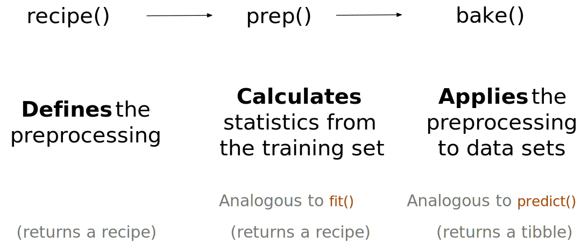
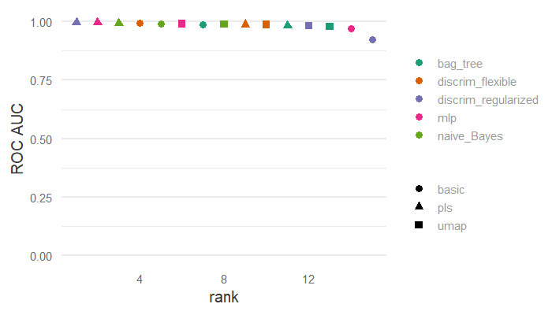

# Dimensionality reduction

**Learning objectives:**

- Create, prep, and bake recipes outside of a workflow to test or debug the recipes.
- Compare and contrast dimensionality reduction techniques (techniques used to create a small set of features that capture the main aspects of the original predictor set).
- Use principal component analysis (PCA) to reduce dimensionality.
- Use partial least squares (PLS) to reduce dimensionality.
- Use independent component analysis (ICA) to reduce dimensionality.
- Use uniform manifold approximation and projection (UMAP) to reduce dimensionality.
- Use dimensionality reduction techniques in conjunction with modeling techniques.

## {recipes} without {workflows}



## Principal Component Analysis (PCA)

```{r 17-prep, include = FALSE}
library(tidymodels)
tidymodels_prefer()
library(beans)
library(corrplot)
library(ggforce)
library(bestNormalize)
library(learntidymodels)
library(embed)

set.seed(1701)
bean_split <- initial_split(beans, strata = class, prop = 3/4)

bean_train <- training(bean_split)
bean_test  <- testing(bean_split)

set.seed(1702)
bean_val <- validation_split(bean_train, strata = class, prop = 4/5)
bean_val$splits[[1]]
#> <Training/Validation/Total>
#> <8163/2044/10207>

tmwr_cols <- colorRampPalette(c("#91CBD765", "#CA225E"))
bean_train %>% 
  # dplyr::filter(class == levels(bean_train$class)[[5]]) %>% 
  select(-class) %>%
  cor() %>% 
  corrplot(col = tmwr_cols(200), tl.col = "black") +
  ggplot2::facet_wrap(~class)

bean_rec <-
  # Use the training data from the bean_val split object
  recipe(class ~ ., data = analysis(bean_val$splits[[1]])) %>%
  step_zv(all_numeric_predictors()) %>%
  step_orderNorm(all_numeric_predictors()) %>% 
  step_normalize(all_numeric_predictors())

bean_rec_trained <- prep(bean_rec)

show_variables <- 
  bean_rec %>% 
  prep(log_changes = TRUE)

bean_validation <- bean_val$splits %>% pluck(1) %>% assessment()
bean_val_processed <- bake(bean_rec_trained, new_data = bean_validation)

plot_validation_results <- function(recipe, dat = assessment(bean_val$splits[[1]])) {
  recipe %>%
    # Estimate any additional steps
    prep() %>%
    # Process the data (the validation set by default)
    bake(new_data = dat) %>%
    # Create the scatterplot matrix
    ggplot(aes(x = .panel_x, y = .panel_y, col = class, fill = class)) +
    geom_point(alpha = 0.4, size = 0.5) +
    geom_autodensity(alpha = .3) +
    facet_matrix(vars(-class), layer.diag = 2) + 
    scale_color_brewer(palette = "Dark2") + 
    scale_fill_brewer(palette = "Dark2")
}
```

- PCA = unsupervised method, finds up to N new features (where N = # features) to explain variation.

```{r 17-pca}
bean_rec_trained %>%
  step_pca(all_numeric_predictors(), num_comp = 4) %>%
  plot_validation_results() + 
  ggtitle("Principal Component Analysis")
```

## Partial Least Squares (PLS)

- Supervised PCA.

```{r 17-pls}
bean_rec_trained %>%
  step_pls(all_numeric_predictors(), outcome = "class", num_comp = 4) %>%
  plot_validation_results() + 
  ggtitle("Partial Least Squares")
```

## Independent Component Anysis (ICA)

- "As statistically independent from one another as possible."
- "It can be thought of as maximizing the 'non-Gaussianity' of the ICA components.

```{r 17-ica}
# Note: ICA requires the "dimRed" and "fastICA" packages.
bean_rec_trained %>%
  step_ica(all_numeric_predictors(), num_comp = 4) %>%
  plot_validation_results() + 
  ggtitle("Independent Component Analysis")
```

## Uniform Manifold Approximation and Projection (UMAP)

- Uses distance-based nearest neighbor to find local areas where data points are more likely related.
- Relationships saved as directed graph w/most points not connected.
- Create smaller feature set such that graph is well approximated.

```{r 17-umap}
library(embed)
bean_rec_trained %>%
  step_umap(all_numeric_predictors(), outcome = "class", num_comp = 4) %>%
  plot_validation_results() +
  ggtitle("Uniform Manifold Approximation and Projection (supervised)")
```

## Modeling

(This is slow so I don't actually run it here.)

```{r 17-modeling, eval = FALSE}
ctrl <- control_grid(parallel_over = "everything")
bean_res <- 
  workflow_set(
    preproc = list(basic = class ~., pls = pls_rec, umap = umap_rec), 
    models = list(bayes = bayes_spec, fda = fda_spec,
                  rda = rda_spec, bag = bagging_pec,
                  mlp = mlp_spec)
  ) %>% 
  workflow_map(
    verbose = TRUE,
    seed = 1703,
    resamples = bean_val,
    grid = 10,
    metrics = metric_set(roc_auc)
  )

rankings <- 
  rank_results(bean_res, select_best = TRUE) %>% 
  mutate(method = map_chr(wflow_id, ~ str_split(.x, "_", simplify = TRUE)[1])) 

rankings %>% 
  ggplot(aes(x = rank, y = mean, pch = method, col = model)) + 
  geom_point(cex = 3) + 
  theme(legend.position = "right") +
  labs(y = "ROC AUC") +
  coord_cartesian(ylim = c(0, 1))
```



## Meeting Videos

### Cohort 1

`r knitr::include_url("https://www.youtube.com/embed/ewNOYUwKwCM")`

<details>
  <summary> Meeting chat log </summary>
  
```
00:24:23	Daniel Chen (he/him):	PCA maximizes the variance
00:41:01	Daniel Chen (he/him):	I guess it depends on what you're using it for? like for a visualization or using PCA for feature engineering
00:42:01	Daniel Chen (he/him):	how useful is tuning the number of PCs? I've always looked at elbow plots or something for that stuff?
00:45:45	Daniel Chen (he/him):	run pca after LASSO! :p
00:45:52	Daniel Chen (he/him):	wait. that doesn't make sense
00:45:53	Daniel Chen (he/him):	nvm
00:49:15	Daniel Chen (he/him):	kind of surprised they didn't show other MDS (multi dimensional scaling) examples since PCA is a special case of MDS
00:50:14	Daniel Chen (he/him):	if you want to give names to "loadings" you'd use factor analysis
00:52:44	Jim Gruman:	thank you Jon!!
00:53:13	Daniel Chen (he/him):	bye everyone!
```
</details>

### Cohort 3

`r knitr::include_url("https://www.youtube.com/embed/pldNcyb4kMg")`

<details>
  <summary> Meeting chat log </summary>
  
```
00:39:34	Ildiko Czeller:	do you know from where the function name plot_top_loadings comes? I have not heard the term loading in the context of PCA before. As far as I understand it plots top most contributing variables/features in each PCA component
00:40:00	Jiwan Heo:	loading is the "weights" in PCA
00:40:46	Jiwan Heo:	the coefficient of the linear combination of variables
00:40:56	Ildiko Czeller:	ahh, makes sense, thanks!
00:56:04	Ildiko Czeller:	I guess difference between PCA and PLS would be bigger if there were some rubbish features as well with high variance but without much predicting power
00:56:21	Jiwan Heo:	PLS is supervised, PCA is unsupervised
00:56:25	Ildiko Czeller:	the first 2 components seem to be basically mirror images of each other
00:57:38	Jiwan Heo:	rubbish features would not get picked up, i'd imagine. If it doesn't impact the outcome
00:58:30	Ildiko Czeller:	yeah, I think that they would not be picked in PLS at all, but might be picked up by PCA because it is unsupervised (?)
00:59:15	Jiwan Heo:	I think so. PCA just picks up any large variance, but in PLS, it has to also move the outcome in some way
01:04:16	Jiwan Heo:	sorry I have to jump off! Thank you for the presentation :)
01:05:45	Ildiko Czeller:	To build an intuition about UMAP i found this interactive website very useful: https://pair-code.github.io/understanding-umap/
```
</details>

### Cohort 4

`r knitr::include_url("https://www.youtube.com/embed/GcWRYbAVCTc")`

<details>
  <summary> Meeting chat log </summary>
  
```
01:10:50	Isabella Velásquez:	Gotta go, but thank you!
01:12:12	Federica Gazzelloni:	https://docs.google.com/spreadsheets/d/1-S1UbKWay_TeR5n9LkztZY2XXrMjZr3snl1srPvTvH4/edit#gid=0
```
</details>
