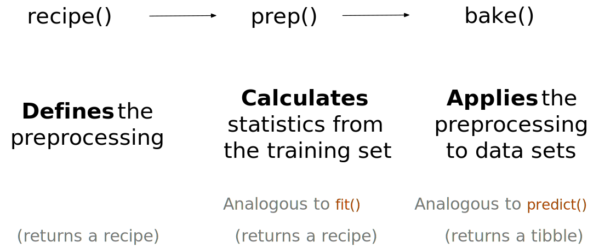
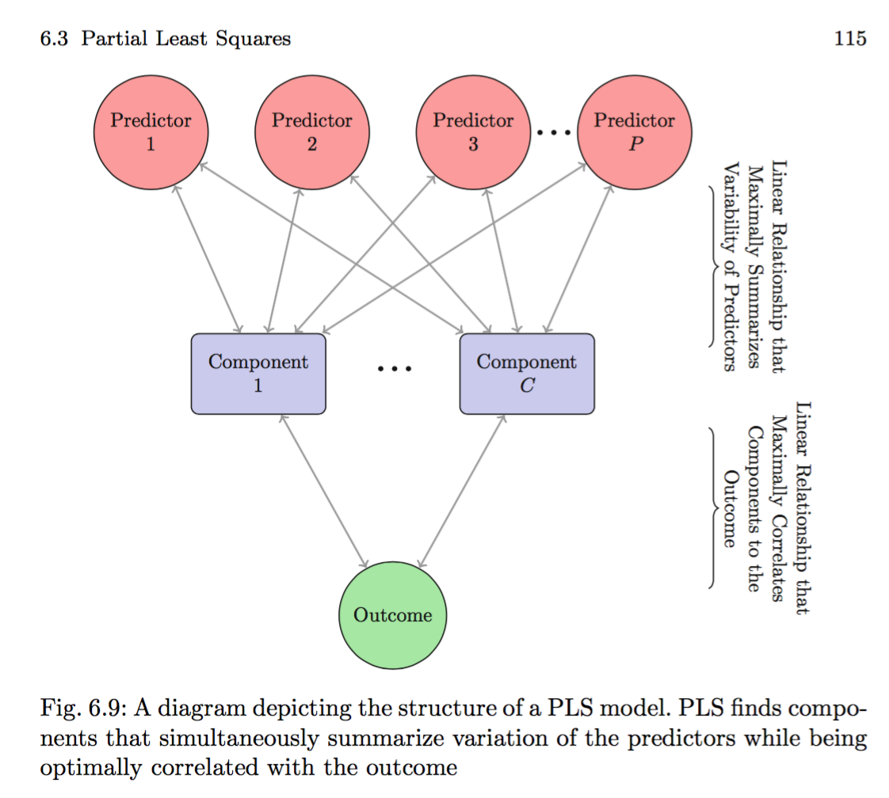

# Dimensionality reduction


**Learning objectives:**

- Create, prep, and bake recipes outside of a workflow to test or debug the recipes.
- Compare and contrast dimensionality reduction techniques (techniques used to create a small set of features that capture the main aspects of the original predictor set).
- Use principal component analysis (PCA) to reduce dimensionality.
- Use partial least squares (PLS) to reduce dimensionality.
- Use independent component analysis (ICA) to reduce dimensionality.
- Use uniform manifold approximation and projection (UMAP) to reduce dimensionality.
- Use dimensionality reduction techniques in conjunction with modeling techniques.

We also:

- Revisit PCA, PLS, ICA, UMAP
- Apply the techniques to a model


## Unsupervised and Surpervised learning


```{r message=FALSE, warning=FALSE, paged.print=FALSE}
library(tidyverse)
library(tidymodels)
library(ggforce)
library(embed)
library(corrplot)
#library(learntidymodels)
library(baguette)
library(discrim)
library(uwot)
library(doMC)
library(patchwork)
library(beans)
registerDoMC(cores = parallel::detectCores())
tidymodels_prefer()

library(beans)
```

## {recipes} without {workflows}




```{r}
head(beans,3);names(beans)
```

See the beans' class as an outcome based on all predictors:

```{r message=FALSE, warning=FALSE}
ggplot(data=beans)+
  geom_histogram(aes(class,fill=class),stat="count")+
  labs(title="Types of beans")
```


The split of the dataset included a third set the **validation set**:


```{r}
set.seed(1701)
bean_split <- rsample::initial_split(beans, strata = class, prop = 3/4)

bean_train <- training(bean_split)
bean_test  <- testing(bean_split)

set.seed(1702)
bean_val <- rsample::validation_split(bean_train, strata = class, prop = 4/5)
bean_val$splits[[1]]
```


We need to check for the **correlation** of the variables:

```{r message=FALSE, warning=FALSE,out.width = '100%'}
library(corrplot)
tmwr_cols <- colorRampPalette(c("#91CBD765", "#CA225E"))

bean_train %>% 
  select(-class) %>% 
  cor() %>% 
  corrplot(col = tmwr_cols(200), tl.col = "black")
```

Here is another way to see the how the predicotrs are correlated, I have used the example in the video of Julia Silge[^1]

[^1]: [video: Dimensionality reduction with tidymodels for the Billboard Top 100 ](https://www.youtube.com/watch?v=kE7H1oQ2rY4)

```{r message=FALSE, warning=FALSE, out.width = '100%' }
library(corrr)
bean_train %>% 
  select(-class) %>% 
  correlate() %>% 
  rearrange() %>%
  network_plot(colours = tmwr_cols(200))
```


The `{bestNormalize}` package has a step: `step_orderNorm()` wich is used to rescale a variable to be more similar to a normal distribution, this is very useful when we need all the variables to be homogeneous for the application of the reducing dimensionality techniques.
      
      bestNormalize::step_orderNorm()
      
As we have a **validation** set (rsplit object), we convert it to a data frame with this function:

      rsample::analysis()

```{r}
# library(bestNormalize)

bean_rec <-
  recipe(class ~ ., data = analysis(bean_val$splits[[1]])) %>%
  step_zv(all_numeric_predictors()) %>%
  bestNormalize::step_orderNorm(all_numeric_predictors()) %>% 
  step_normalize(all_numeric_predictors())
```


```{r}
bean_rec_trained <- prep(bean_rec)
bean_rec_trained
```


The addition of a further step is one of the methods for **modeling optimization**,
re-applying the `prep()` will let you re-estimate the untrained steps. See the example below, where we ask for a further `step_*()` function for a new variable that we potentially add to our recipe.

The variable doesn't exist, it is for an example:

      bean_rec_trained %>% 
        step_dummy(cornbread) %>%  # <- not a real predictor
        prep(verbose = TRUE)


Also, we can add further arguments to the `prep()` function such as `log_changes` for obtaining log-transformation of the variables being prepped.


```{r}
show_variables <- 
  bean_rec %>% 
  prep(log_changes = TRUE)
```


Pull out the **assessment** part of the split:

```{r}
bean_validation <- bean_val$splits %>% 
  pluck(1) %>% 
  assessment()

bean_val_processed <- bake(bean_rec_trained, 
                           new_data = bean_validation)
```


```{r, out.width = '100%'}
library(gridExtra)
p1 <- ggplot(data = bean_validation, aes(area))+
  geom_histogram(bins=30,col="white",fill="purple")+
  labs(title="Original: bean_validation")


p2 <- ggplot(data = bean_val_processed, aes(area))+
  geom_histogram(bins=30,col="white",fill="pink")+
  labs(title="Processed: bean_val_processed")

gridExtra::grid.arrange(p1,p2,ncol=2)
```


Finally, we build a function for plotting the results for the reduced components:

```{r}
library(ggforce)

plot_validation_results <- 
  
  function(recipe, dat = assessment(bean_val$splits[[1]])) {
  
    recipe %>%
    prep() %>%
    bake(new_data = dat) %>%
      
    # Create the scatterplot matrix
    ggplot(aes(x = .panel_x, y = .panel_y, 
               col = class, fill = class)) +
    geom_point(alpha = 0.4, size = 0.5) +
      
    ggforce::geom_autodensity(alpha = .3) +
    ggforce::facet_matrix(vars(-class), layer.diag = 2) + 
      
    scale_color_brewer(palette = "Dark2") + 
    scale_fill_brewer(palette = "Dark2")
}
```


### PCA - Principal Component Analysis

This is the first technique, and it is the starting point for the others as it is unsupervised.
PCA considers the data as in a matrix made of homogeneous elements, and it computes the calculation for making groups with regards of their variance level within each variable. 


- linear
- unsupervised method, finds up to N new features (where N = # features) to explain variation
- account for variance
- it is a method for writing a matrix X of rank r as a sum of r matrices of rank 1: X= M1 + M2 + ... + Mr
- hypothesises correlation among predictors


What is aji ? 

PCj = (aj1 ×Predictor 1)+(aj2 ×Predictor 2)+···+(ajP ×Predictor P)


```{r, cache=TRUE}
pca_val <- bean_rec_trained %>%
  step_pca(all_numeric_predictors(), num_comp = 4) %>%
  plot_validation_results() + # the function
  ggtitle("Principal Component Analysis")

pca_val
```

The next plot involves a comparison of the components. The book uses a function for plotting PCA bars of the major components, with the help of the {learntidymodels} package.

      learntidymodels::plot_top_loadings()

There is another way to turn around the use of this package. I will do it the way Julia Silge did in the [video: Dimensionality reduction with tidymodels for the Billboard Top 100 ](https://www.youtube.com/watch?v=kE7H1oQ2rY4) and make a comparison with PLS further below.


```{r, cache=TRUE}
pca <- bean_rec_trained %>%
  step_pca(all_numeric_predictors(), num_comp = 4) %>% 
  prep() %>% 
  tidy(number=4) %>%
  filter(component%in% paste0("PC",1:4)) %>%
  group_by(component) %>%
  slice_max(abs(value),n=5) %>%
  ungroup() %>%
  ggplot(aes(abs(value),terms,fill=value>0))+
  geom_col(alpha=0.8)+
  facet_wrap(vars(component),scales="free_y") +
  labs(fill="PCA Positive?",
       x="",
       y="")+
  theme_bw()+
  theme(legend.position = "top")
```


### PLS - Partial Least Squares


It is a technique which is very similar to PCA.

PCA is a part of PLS, in the meaning that in addition to PCA, PLS makes use of the **outcome**. It practically makes the components considering the outcome values.


```{r echo=FALSE, fig.align='center', fig.cap='[credits: PARTIAL LEAST-SQUARES REGRESSION: A TUTORIAL](http://home.mit.bme.hu/~horvath/IDA/1-s2.0-0003267086800289-main.pdf)', out.width='100%'}

```

- Supervised PCA
- PLS is developed as a remedy for outlined weak points in some regression methods 
- PLS was done in the late sixties by H. Wold in the field of econometrics
- it is a good alternative to the more classical multiple linear regression and principal component regression methods because it is more robust (the model parameters do not change very much when new calibration samples are taken from the total population)
- used when there are correlated predictors and a linear regression-type solution is desired
- supervised technique, and it will derive components while simultaneously considering the corresponding response
- it strikes a compromise between the objectives of predictor space dimension reduction and a predictive relationship with the response
- partial least squares **classification model** create 0/1 dummy variables for each class and simultaneously model these values as a function of the predictors.
- data need to be centered and scaled


PLS does not calculate all the principal components at once but **considers the residuals**, as we consider the outcome inside the model.

Once calculated the residuals, it derives the coefficients for prediction, which are the independent variables, the sensitivites. 

To understand the calculations made with PLS, let's starts from PCA calculations.

This is a mlr model, y is the outcome, bj are the slopes, and xj are the predictors:

        y = blxl + b2x2 +  . . . + bJrJ + e 
        
        Y = BX + E
        
It decomposes x in scores (t - such as the variance) and their proportions (p), we do not take consideration of the outcome (y) 

        x = t1p'1 + t2p'2 + . . . + tap'a
        
        X = TP

The important part of any regression is its use in predicting the **dependent block** from the **independent block**. 

This is done by decomposing the X block and building up the Y block. The variables of X are replaced by new ones that have better properties (orthogonality).

In matrix structure: 

        y = Xb + e
        e = y - Xb = 0    first consider the residuals = 0
        e = y - Xb        the “least-squares method”
        b = (X'X)^-1 X'y  the solution of “least-squares method”
        
        y1 = Xb1 + e1
        y2 = Xb2 + e2
        ...

It uses an iteration method, calculating:

- probabilities
- normalizing (as the prob are not real prob as they can be greater than 1) it makes a proportion of the first results
- repeating first steps
- and comparing results 

PLS algo:

```{r echo=FALSE, fig.align='center', fig.cap='[credits: PARTIAL LEAST-SQUARES REGRESSION: A TUTORIAL](http://home.mit.bme.hu/~horvath/IDA/1-s2.0-0003267086800289-main.pdf)', out.width='100%'}
knitr::include_graphics(here::here('images/pls_algo.png'))
```


```{r,cache=TRUE}
pls_val <- bean_rec_trained %>%
  recipes::step_pls(all_numeric_predictors(), outcome = "class", num_comp = 4) %>%
  plot_validation_results() + 
  ggtitle("Partial Least Squares")
```

```{r, out.width='100%'}
grid.arrange(pca_val,pls_val)
```


The book foresee the use of {[mixOmics](/packages/release/bioc/html/mixOmics.html)} package, which proposes several sparse multivariate models.

In particular, `mixOmics` offers a wide range of multivariate methods for the exploration and integration of biological datasets with a particular focus on variable selection.
The methods implemented in mixOmics` can also handle missing values without having to delete entire rows with missing data.


```{r eval=FALSE, include=T}
# BiocManager::install("mixOmics")
# browseVignettes("mixOmics")
```

This is the block to compare the components:

```{r,cache=TRUE}
pls <- bean_rec_trained %>%
  recipes::step_pls(all_numeric_predictors(), outcome = "class", num_comp = 4) %>% 
  prep() %>% 
  tidy(number=4) %>%
  filter(component%in% paste0("PLS",1:4)) %>%
  group_by(component) %>%
  slice_max(abs(value),n=5) %>%
  ungroup() %>%
  ggplot(aes(abs(value),terms,fill=value>0))+
  geom_col(alpha=0.8)+
  facet_wrap(vars(component),scales="free_y") +
  labs(fill="PLS Positive?",
       x="Abs. contribution to component",
       y="")+
  theme_bw()+
  theme(legend.position = "top")

```

```{r,cache=TRUE}
library(gridExtra)

grid.arrange(pca,pls,ncol=1)
```

The analysis continue with some **other dimensionality reduction techniques**.

### ICA - Independent Component Analysis

- unsupervised
- components are statistically independent from one another: "As statistically independent from one another as possible."
- "It can be thought of as [maximizing the “non-Gaussianity”](https://www.sciencedirect.com/topics/engineering/non-gaussianity) of the ICA components", which is included in the features of nonlinearity, and nonstationarity in many practical signals processing methods. It generally means non-linearity.

These two packages are needed: {dimRed}, {fastICA}

```{r, cache=TRUE}
bean_rec_trained %>%
  recipes::step_ica(all_numeric_predictors(), num_comp = 4) %>%
  plot_validation_results() + 
  ggtitle("Independent Component Analysis")
```


### UMAP - Uniform Manifold Approximation and Projection

- surpevised or unsupervised
- non-linear dimension reduction
- very powerful
- classification problems such as clusters inside clusters
- sensitive to hyperparameters
- based nearest neighbors + graph network: uses distance-based nearest neighbor to find local areas where data points are more likely related
- relationships saved as directed graph w/most points not connected
- create smaller feature set such that graph is well approximated

1. **Unsupervised UMAP**

```{r,cache=TRUE }
unsup_UMAP <- bean_rec_trained %>%
  embed::step_umap(all_numeric_predictors(), num_comp = 4) %>%
  plot_validation_results() + 
  ggtitle("UMAP unsupervised")
```


2. **Supervised UMAP**

```{r,cache=TRUE}
sup_UMAP <- bean_rec_trained %>%
  embed::step_umap(all_numeric_predictors(), outcome = "class", num_comp = 4) %>%
  plot_validation_results() +
  ggtitle("UMAP supervised")
```

See the differences:

```{r, cache=TRUE, out.width='100%'}
gridExtra::grid.arrange(unsup_UMAP,sup_UMAP,ncol=1)
```


## Modeling mode


A model is a relationship[^2] 

        Y = f(X) 

between two groups of variables, often called dependent Y and independent X.

[^2]:[original tutorial](http://home.mit.bme.hu/~horvath/IDA/1-s2.0-0003267086800289-main.pdf)


The model parameters are called regression coefficients or sensitivities


As an example we consider a **mlr multiple linear regression** model:

        y = blxl + b2x2 + bJrJ + . . . + b,x, + e


- x = independent variables
- y = dependent
- bj = sensitivities   ----> b = (X'X) ^-1 X'y
- e = error (residuals) ----> e = y-Xb
- m = number of independent variables
- n = number of samples


there always have to be at least as many samples as variables, I
it should be n=m if m>n we should delete some variables, and this why reducing dimensions is a good pratice.

One more important thing to remeber is that the data is represented with variance, and the variance will be a key statistic to reduced dimensionality.
 
 
The book explores different models:

1. **single layer neural network** (Single-layer perceptron):  the inputs are fed directly to the outputs via a series of weights
2. **bagged trees**: is used when our goal is to reduce the variance of a decision tree. Here idea is to create several subsets of data from training sample chosen randomly with replacement.
3. **flexible discriminant analysis (FDA)**: package {mda} and {discrim} it is used to assign objects to one group among a number of known groups.
4. **naive Bayes**: is a simple technique for constructing classifiers (models that assign class labels to problem instances)
5. **regularized discriminant analysis (RDA)**: is a generalization of the linear discriminant analysis to determine which variables discriminate between two or more naturally occurring groups.
 
```{r}
library(baguette)
library(discrim)
```
 
The first step is to build the **Parsnip Model Objects** for our models:
 
```{r five_models}
# single layer neural network
mlp_spec <-
  mlp(hidden_units = tune(), penalty = tune(), epochs = tune()) %>%
  set_engine('nnet') %>%
  set_mode('classification')

# bagged trees
bagging_pec <-
  bag_tree() %>%
  set_engine('rpart') %>%
  set_mode('classification')

# flexible discriminant analysis
fda_spec <-
  discrim_flexible(
    prod_degree = tune()
  ) %>%
  set_engine('earth')

# regularized discriminant analysis
rda_spec <-
  discrim_regularized(frac_common_cov = tune(), frac_identity = tune()) %>%
  set_engine('klaR')

# naive Bayes
bayes_spec <-
  naive_Bayes() %>%
  set_engine('klaR')
```
 
 
Then apply a **recipe** with some `step_*()` functions:

- zero variance: will remove variables that contain only a single value
- orderNorm: to rescale a variable to be more similar to a normal distribution
- normalize: normalize numeric data to have a standard deviation of one and a mean of zero

```{r bean_recipe}
bean_rec <-
  recipe(class ~ ., data = bean_train) %>%
  step_zv(all_numeric_predictors()) %>%
  bestNormalize::step_orderNorm(all_numeric_predictors()) %>%
  step_normalize(all_numeric_predictors())
```
 
 
Application to:

1. **PLS**

```{r pls_recipe}
pls_rec <- 
  bean_rec %>% 
  step_pls(all_numeric_predictors(), outcome = "class", num_comp = tune())

```

2. **UMAP**

```{r umap_recipe}
umap_rec <-
  bean_rec_trained %>%
  embed::step_umap(
    all_numeric_predictors(),
    outcome = "class",
    num_comp = tune(),
    neighbors = tune(),
    min_dist = tune()
  )
```
 
 

Then finally, set up the **workflow** with the `workflow_set()` and the `workflow_map()`.

Also need these packages: {klaR},{mda}

```{r workflow, eval=FALSE, include=T, cache=T}
bean_res <- 
  workflow_set(
    preproc = list(basic = class ~., pls = pls_rec, umap = umap_rec), 
    models = list(bayes = bayes_spec, 
                  fda = fda_spec,
                  rda = rda_spec, 
                  bag = bagging_pec,
                  mlp = mlp_spec)
  ) %>% 
  workflow_map(
    verbose = TRUE,
    seed = 1703,
    resamples = bean_val,
    grid = 10,
    metrics = metric_set(roc_auc)
  )
```


Save the models in a `.rda` file to save time.


```{r eval=FALSE, include=T}
saveRDS(bean_res,here::here("data","17-bean_res.RDS"))
```


Then read it back, to have it again as a variable in the environment, and to be able to impute further work on it. In case of any crash of the system such as pausing times, you can always reload the models information without re-run the workflow which is time consuming.

We do not actually read this back in these notes as the `.rda` file is too big for loading it.

```{r file_read,eval=FALSE, include=T}
# load(file = "data/bean_res.rda")
# data(bean_res)
```


This is the first part of the workflow:


```{r workflow_image,echo=FALSE, fig.align='center', fig.cap='bean_res: workflow', out.width='100%'}
knitr::include_graphics(here::here('images/17-workflow.png'))
```

**Estimation of the model metrics**

Now we can rank the models by their **validation set estimates** of the area under the **ROC curve**:


```{r eval=FALSE, include=T}
rankings <- 
  rank_results(bean_res, select_best = TRUE) %>% 
  mutate(method = map_chr(wflow_id, ~ str_split(.x, "_", simplify = TRUE)[1])) 
```

Save the `rankings` results as .RDS file:

```{r save_ranking, eval=FALSE, include=T}
saveRDS(rankings,here::here("data","17-rankings.RDS"))

```

Then read it back, this file is saved in the file `data`

```{r rankings_file}
rankings <- readRDS(file =here::here("data","17-rankings.RDS"))
rankings
```

Select the information you want to see:

```{r}
tidymodels_prefer()

filter(rankings, rank <= 5) %>% 
  dplyr::select(rank, mean, model, method)
```

Finally, see the reults of the metrics ranking:

```{r ranking_plot,out.width='100%'}
rankings %>% 
  ggplot(aes(x = rank, y = mean, pch = method, col = model)) + 
  geom_point(cex = 3) + 
  theme(legend.position = "right") +
  labs(y = "ROC AUC")
```


## Meeting Videos

### Cohort 1

`r knitr::include_url("https://www.youtube.com/embed/ewNOYUwKwCM")`

<details>
  <summary> Meeting chat log </summary>
  
```
00:24:23	Daniel Chen (he/him):	PCA maximizes the variance
00:41:01	Daniel Chen (he/him):	I guess it depends on what you're using it for? like for a visualization or using PCA for feature engineering
00:42:01	Daniel Chen (he/him):	how useful is tuning the number of PCs? I've always looked at elbow plots or something for that stuff?
00:45:45	Daniel Chen (he/him):	run pca after LASSO! :p
00:45:52	Daniel Chen (he/him):	wait. that doesn't make sense
00:45:53	Daniel Chen (he/him):	nvm
00:49:15	Daniel Chen (he/him):	kind of surprised they didn't show other MDS (multi dimensional scaling) examples since PCA is a special case of MDS
00:50:14	Daniel Chen (he/him):	if you want to give names to "loadings" you'd use factor analysis
00:52:44	Jim Gruman:	thank you Jon!!
00:53:13	Daniel Chen (he/him):	bye everyone!
```
</details>


