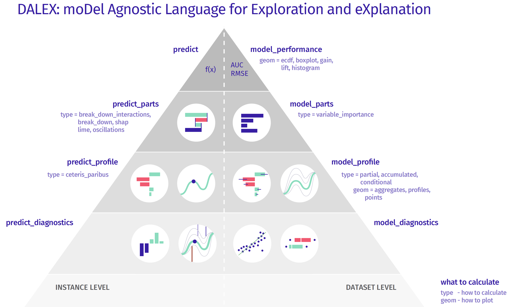
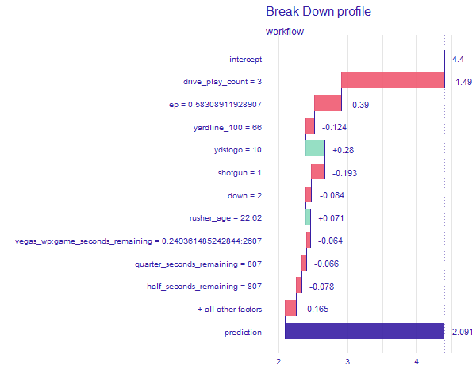
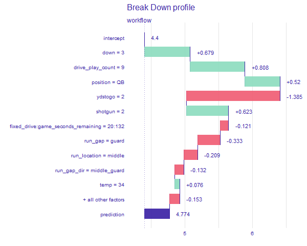
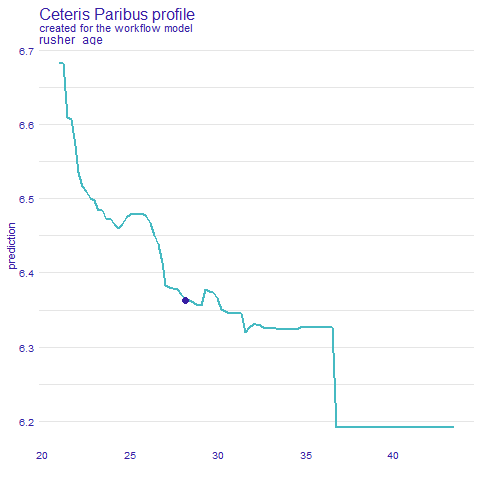
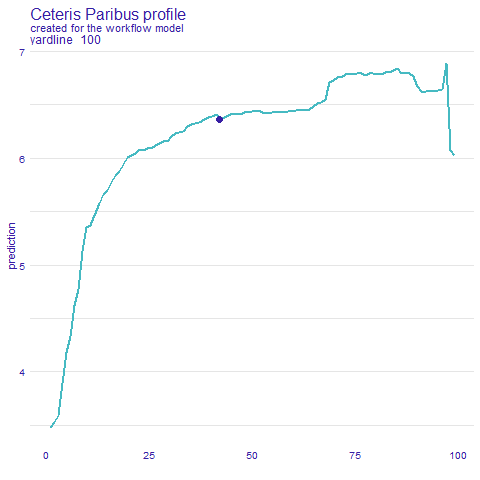
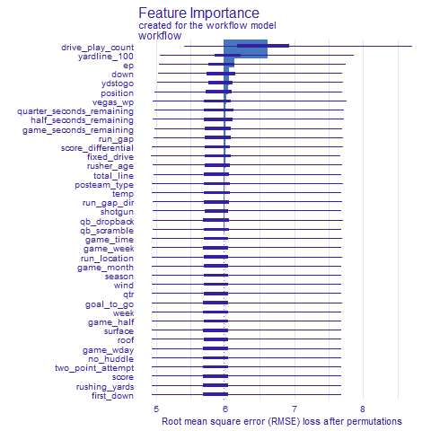
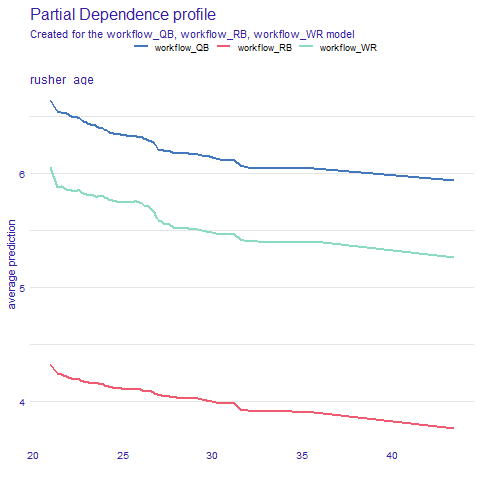
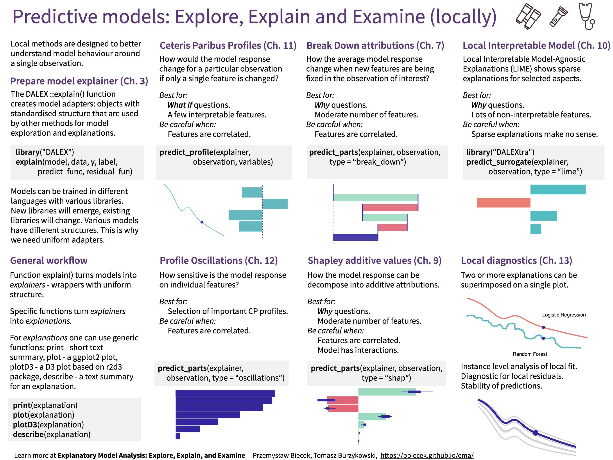

# Explaining models and predictions

**Learning objectives:**

- Recognize some R packages for model explanations.
- Use {DALEX} and {DALEXtra} to produce local model explanations for a model trained using {tidymodels}.
- Use {DALEX} and {DALEXtra} to produce global model explanations for a model trained using {tidymodels}.
- Use {DALEX} and {DALEXtra} to produce partial dependence profiles for a model trained using {tidymodels}.

## Chapter 18 Setup

Load in the data and set up explainer
```{r 18-load-data, warning=FALSE, message=FALSE}
library(tidymodels)
library(skimr)
library(DALEX)
library(DALEXtra)
library(iBreakDown)

rush_model <- readRDS(here::here("data", "18-fit_rush_yards.RDS"))
rush_df <- readRDS(here::here("data", "18-nfl_rush_df.RDS"))

skim(rush_df)

explainer_boost <- 
  explain_tidymodels(
    rush_model, 
    data = rush_df,
    y = rush_df$rushing_yards,
    verbose = TRUE
  )

```
## Overview



## Local Explanations
- Provides information about a prediction for a single observation

- Which variables contribute to this result the most?

- "Break-down" explanations compute the contribution from each feature
  - Results for many explanatory variables can be presented in a limited space
  - Only the additive attributions, misleading for models with interactions
  

  
- Break-down plots with interactions
  - More accurate if the model itself uses interactions
  - Much more time-consuming
  - Interactions is not based on any formal statistical-significance test
  

  
- SHapley Additive exPlanations (SHAP) are based on “Shapley values”
  - "Cooperation is beneficial, because it may bring more benefit than individual actions"
  - Decompose a model’s predictions into contributions that can be attributed additively to different explanatory variables
  - If the model is not additive, then the Shapley values may be misleading
  


```{r 18-local, eval=FALSE}
#Break-down
boost_breakdown <- predict_parts(explainer = explainer_boost,
                                 new_observation = sample_n(rush_df,1))

png(file="images/18_boost_breakdown.png", width = 600)
plot(boost_breakdown)
dev.off()


#Break-dwon Interactions
boost_breakdown2 <- predict_parts(explainer = explainer_boost,
                                 new_observation = sample_n(rush_df,1),
                                 type = "break_down_interactions")

png(file="images/18_boost_breakdown2.png", width = 600)
plot(boost_breakdown2)
dev.off()

#SHAP
boost_breakdown3 <- predict_parts(explainer = explainer_boost,
                                 new_observation = sample_n(rush_df,1),
                                 type = "shap")

png(file="images/18_boost_breakdown3.png", width = 600)
plot(boost_breakdown3)
dev.off()
```

## Local Explanations for Interactions

- "Ceteris-paribus" profiles show how a model’s prediction would change if the value of a single exploratory variable changed
  - Graphical representation is easy to understand and explain
  - Not a valid assumption with highly correlated or interaction variables
  
  
  
  

```{r 18-ceterus, eval=FALSE}
#Ceterus Paribus
boost_paribus <- predict_profile(explainer = explainer_boost,
                                 new_observation = sample_n(rush_df,1),
                                 variables = c("rusher_age", "yardline_100"))

png(file="images/18_boost_paribus.png")
plot(boost_paribus, variables = c("rusher_age"))
dev.off()

png(file="images/18_boost_paribus2.png")
plot(boost_paribus, variables = c("yardline_100"))
dev.off()
```

## Global Explanations

- Which features are most important in driving the predictions aggregated over the whole training set
- Measure how much does a model’s performance change if the effect of a selected explanatory variable(s) is(are) removed
  - If variables are correlated, then models like random forest are expected to spread importance across many variables
  - Dependent on the random nature of the permutations
  
  

```{r 18-global, eval=FALSE}
boost_vip <- model_parts(explainer_boost, loss_function = loss_root_mean_square)

png(file="images/18_boost_vip.png")
plot(boost_vip, max_featuers = 10)
dev.off()
```


## Global Explanations from Local Explanations

- Partial-dependence plots
  - How does the expected value of model prediction behave as a function of a selected explanatory variable?
  - PD profiles are averages of CP profiles
  - Problematic for correlated explanatory variables
  
   
  
```{r 18-global_profile, eval=FALSE}
boost_profile <- model_profile(explainer_boost,
                               N = 1000, 
                               variables = "rusher_age", 
                               groups = "position")

png(file="images/18_boost_profile.png")
plot(boost_profile)
dev.off()
```


## References

[DALEX Github](https://modeloriented.github.io/DALEX/)

[DALEXtra Github](https://github.com/ModelOriented/DALEXtra)

[Exploratory Model Anaylsis](https://ema.drwhy.ai/)



## Meeting Videos

### Cohort 1

`r knitr::include_url("https://www.youtube.com/embed/jk6hHNyrcSo")`

<details>
  <summary> Meeting chat log </summary>
  
```
00:03:12	tan_iphone:	Hullo!
00:05:15	tan_iphone:	I seem to have influenced the ballot ok tho!
00:06:20	tan_iphone:	Boaty mc boat dog
00:13:56	Jon Harmon (jonthegeek):	https://cran.r-project.org/package=nflfastR
00:17:17	Tony ElHabr:	Acronyms are my fav
00:17:21	Tony ElHabr:	*bacronyms
00:17:31	Jon Harmon (jonthegeek):	I think it stands for "I'm a Doctor Who fan."
00:17:59	Jordan Krogmann:	they have the death bots as the logo
00:18:10	Jordan Krogmann:	or whatever... I am a casual doctor fan
00:18:28	Jon Harmon (jonthegeek):	https://dalex.drwhy.ai/
00:24:26	Jon Harmon (jonthegeek):	Rowers in a boat is the explanation I've heard a lot. You can't just be the fastest, you need to also be in sync with the other rowers.
00:24:52	Tony ElHabr:	Is the default shapley? Or is it permutation? And what’s the difference?
00:31:19	Jon Harmon (jonthegeek):	Dunno about anybody else but I had to look up what that meant: ceteris paribus = "all other things being equal."
00:31:38	Tony ElHabr:	This is the same as partial dependence plots?
00:32:45	Tony ElHabr:	Oh, CP is the instance-level equivalent of PDP (used for data-set level)
00:33:46	Jon Harmon (jonthegeek):	"A profile showing how an individual observation’s prediction changes as a function of a given feature is called an ICE (individual conditional expectation) profile or a CP (ceteris paribus) profile."
Yeah, they never definitively explain PDP vs these other terms. I hate to make them rebuild this monster chapter but I think I have thoughts about making some stuff in here clearer!
00:37:52	Tony ElHabr:	i don’t think vip supports catboost 😢
00:39:04	Jon Harmon (jonthegeek):	Wait, do you pronounce it "vip" or "V I P"?
00:39:20	Tony ElHabr:	Yeah v i p
00:39:46	tan_iphone:	very important predictor
00:40:04	tan_iphone:	But wait is there a prequel?
00:40:56	Tony ElHabr:	meme (tweet) for the day: https://twitter.com/benbbaldwin/status/1431300791516663816?s=20
00:42:08	Jon Harmon (jonthegeek):	Dude, you can't send something that requires audio in the middle of a meeting 🙃
01:05:41	tan_iphone:	Lmaoooo I have not nearly read enough of the book to do it
01:05:47	tan_iphone:	Currently at the gym :) cheers folks

```
</details>

### Cohort 3

`r knitr::include_url("https://www.youtube.com/embed/WXZ5DKaK5mQ")`

### Cohort 4

`r knitr::include_url("https://www.youtube.com/embed/URL")`

<details>
  <summary> Meeting chat log </summary>
  
```
LOG
```
</details>
