# Ensembles of models

**Learning objectives:**

- Create a data stack for the `{stacks}` package using `stacks()` and `add_candidates`.
- Fit a **meta-learning model** using `blend_predictions()`.
- Fit the **member models** using `fit_members()`.
- Test the results of an ensemble model.

## Ensembling

- Aggregating predictions of multiple models together to make one prediction.
- We've already seen some ensembling within 1 type of model:
  - Random forest
  - Bagging & boosting
  
- **Model stacking** allows for aggregating many different types of models (lm + rf + svm, ...), to assemble a new model, which generates a new prediction, informed by its *members*.

## Ensembling with `stacks`!

{width=25%}

https://stacks.tidymodels.org/articles/basics.html

Model stacking process:

1. Define some models, using all the knowledge we have from this book. We call them *candidate models/members*.
2. Initialize the ensemble with `stacks::stacks()`, and add the members to it, using `stacks::add_members()`
3. Blend the predictions of the members, using `stacks::blend_predictions()` (linear combination of each member's predictions)
4. Now that we know how to blend members, `fit` the members one more time on the whole training set, and `predict` on testing set.

## Define some models

- Ensembles are formed from model definitions, which are `workflow`s that contain model recipe & spec (that has been tuned or fit_resample'd).
- The book recommends the racing tuning method.


- You’ll need to save the assessment set predictions and workflow utilized in your `tune_grid()`, or `fit_resamples()` objects by setting the control arguments `save_pred = TRUE` and `save_workflow = TRUE`. 

- If a model has hyperparameters, then you'd be creating multiple candidate models.


## Initialize and add members to stack.

- Data stacks are tibbles (with some extra attributes) that contain the response value as the first column, and the assessment set predictions for each candidate ensemble member.

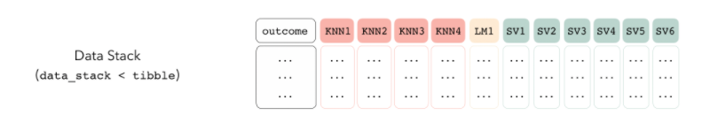

```{r 20-stack_setup, eval=FALSE}
tree_frogs_model_st <- # example from stacks vignette
  stacks() %>%
  add_candidates(knn_res) %>%
  add_candidates(lin_reg_res) %>%
  add_candidates(svm_res)

tree_frogs_model_st
#> # A data stack with 3 model definitions and 11 candidate members:
#> #   knn_res: 4 model configurations
#> #   lin_reg_res: 1 model configuration
#> #   svm_res: 6 model configurations
#> # Outcome: latency (numeric)

as_tibble(tree_frogs_model_st)
#> # A tibble: 429 x 12
#>    latency knn_res_1_1 knn_res_1_2 knn_res_1_3 knn_res_1_4 lin_reg_res_1_1
#>      <dbl>       <dbl>       <dbl>       <dbl>       <dbl>           <dbl>
#>  1     142      -0.496      -0.478      -0.492      -0.494           114. 
#>  2      79      -0.381      -0.446      -0.542      -0.553            78.6
#>  3      50      -0.311      -0.352      -0.431      -0.438            81.5
#>  4      68      -0.312      -0.368      -0.463      -0.473            78.6
#>  5      64      -0.496      -0.478      -0.492      -0.494            36.5
#>  6      52      -0.391      -0.412      -0.473      -0.482           124. 
#>  7      39      -0.523      -0.549      -0.581      -0.587            35.2
#>  8      46      -0.523      -0.549      -0.581      -0.587            37.1
#>  9     137      -0.287      -0.352      -0.447      -0.456            78.8
#> 10      73      -0.523      -0.549      -0.581      -0.587            38.8
#> # … with 419 more rows, and 6 more variables: svm_res_1_1 <dbl>,
#> #   svm_res_1_4 <dbl>, svm_res_1_3 <dbl>, svm_res_1_5 <dbl>, svm_res_1_2 <dbl>,
#> #   svm_res_1_6 <dbl>
```

## Blend, fit, predict

- `blend_predictions()` performs LASSO regularization to combine the outputs from the stack members to come up with one final prediction.
- Candidates with non-zero coefficients are kept.

```{r 20-stack_blend, eval=FALSE}
tree_frogs_model_st <-
  tree_frogs_data_st %>%
  blend_predictions()
```

- There's an `autoplot()` function available, to see what's going on.
- If you don't like what you're seeing, you can try `blend_predictions()` again, and setting your own penalty argument.

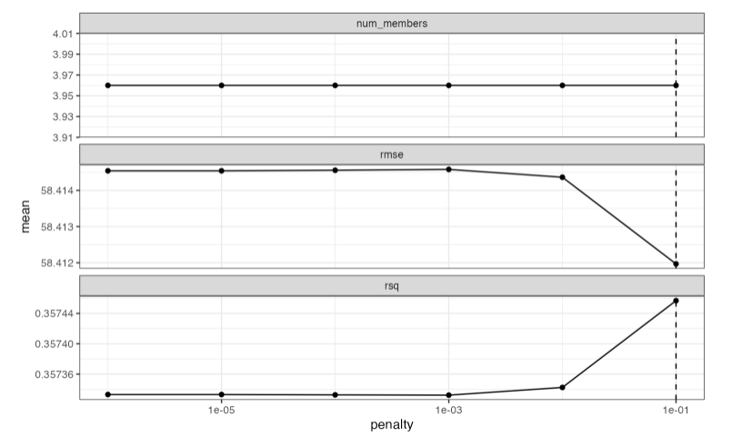

- Essentially, what you have, is a linear combination of each member's prediction, to create one final prediction.

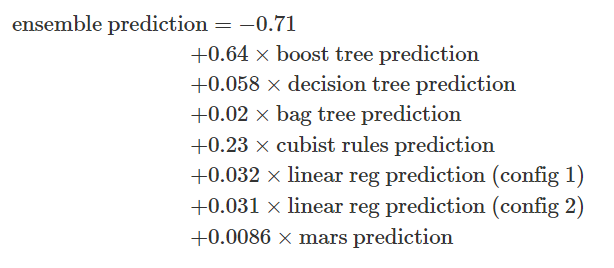

- With this "instruction" on how to combine candidate models, we fit the whole training set

```{r 20-stack_fit_members, eval=FALSE}
tree_frogs_model_st <-
  tree_frogs_model_st %>%
  fit_members()
```

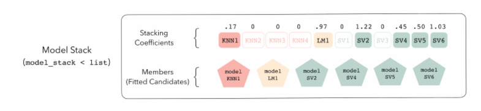

- And predict on testing set

```{r 20-stack_predict, eval=FALSE}
tree_frogs_test <- 
  tree_frogs_test %>%
  bind_cols(predict(tree_frogs_model_st, .))
```

## Case Study - Patient Risk Profiles

This dataset contains 100 simulated patient's medical history features and the predicted 1-year risk of 14 outcomes based on each patient's medical history features. The predictions used real logistic regression models developed on a large real world healthcare dataset.

This data has been made available as #TidyTuesday dataset for week 43 - 2023
(<https://github.com/rfordatascience/tidytuesday/blob/master/data/2023/2023-10-24/readme.md>)

### Loading necessary libraries
```{r message=FALSE,warning=FALSE}
library(tidyverse)
library(tidymodels)
tidymodels::tidymodels_prefer()
```

### Loading data
```{r message=FALSE,warning=FALSE}
tuesdata <- tidytuesdayR::tt_load('2023-10-24')
raw <- tuesdata$patient_risk_profiles
# raw%>%glimpse
```


```{r eval=FALSE}
raw[1:2,]
```

### Have a look at the data

Rearranging the data to have all the `age group` information as a column, then we count it to see all groups.
```{r}
raw %>%
  column_to_rownames("personId") %>%
  pivot_longer(cols=contains("age group:"),
               names_to = "age_group_id",values_to = "age_group")%>%
  filter(!age_group==0)%>%
  count(age_group_id)
```
The same thing is done for the `predicted risk`.
```{r}
raw %>%
  pivot_longer(cols = contains("predicted risk"), 
               names_to = "predicted_risk_id",
               values_to = "predicted_risk")%>%
  count(predicted_risk_id)
```
### Data wrangling

We transform the data into a more human-readable format, following the best practices for datasets.

Ensuring that each variable has its own column, each observation has its own row, and each type of observational unit forms a table.

```{r}
dat <- raw %>%
    pivot_longer(cols = contains("predicted risk"), 
               names_to = "predicted_risk_id",
               values_to = "predicted_risk")%>%
    pivot_longer(cols=contains("age group:"),
               names_to = "age_group_id",
               values_to = "age_group")%>%
    filter(!age_group==0)%>%
    select(-age_group)%>%
    pivot_longer(cols = contains("Sex"), 
               names_to = "Sex_id",
               values_to = "Sex") %>%#count(Sex_id,Sex)
  filter(!Sex==0)%>%
  select(-Sex)%>%# dim
  pivot_longer(cols = contains("in prior year"), 
               names_to = "Cause_id",
               values_to = "Cause")%>%
  filter(!Cause==0)%>%
  select(-Cause)%>%
   mutate(age_group_id=gsub("age group: ","",age_group_id),
         Sex_id=gsub("Sex = ","",Sex_id),
         Cause_id=gsub(" exposures in prior year","",Cause_id),
         predicted_risk_id=gsub("predicted risk of ","",predicted_risk_id),
         )%>%
  mutate(personId=as.factor(personId))
  
  
dat %>% head  
```

```{r}
dat %>%
  #count(predicted_risk_id)
  filter(str_detect(predicted_risk_id,"Dementia"))%>% head
```

### Data to use in the Model

Let's use the `raw data` which provides dummy variables.

```{r}
dementia <- raw %>%
  select(contains("Dementia"))%>%
  cbind(raw%>%select(!contains("Dementia")))%>%
  janitor::clean_names()
```

### Spending Data

```{r}
set.seed(24102023)
split <- initial_split(dementia,prop = 0.8)
train <- training(split)
test <- testing(split)
folds <- vfold_cv(train)
```


### Preprocessing and Recipes
```{r}
normalized_rec <- recipe(predicted_risk_of_dementia ~ ., train) %>%
  update_role("person_id",new_role = "id") %>%
  step_normalize(all_predictors()) %>%  
  step_corr(all_predictors())%>%
  step_zv(all_predictors())
```

```{r}
normalized_rec%>%
  prep()%>%
  juice()%>%
  head
```

### Make many models

> Warning: All model specifications are the models used in Chapter 15. These models are not necessarily the first choice for this dataset but are used for educational purposes to build a diverse selection of different model types in order to select the best one.

We use 10 models:

1- Linear Regression: `linear_reg_spec`
2- Neural Network: `nnet_spec`
3- Mars (Motivation, Ability, Role Perception and Situational Factor): `mars_spec`
4A- Support Vector Machine: `svm_r_spec`
4B- Support Vector Machine poly: `svm_p_spec`
5- K-Nearest Neighbor:  `knn_spec`
6- CART (Classification And Regression Tree): `cart_spec`
7- Bagging CART: `bag_cart_spec`
8- Random Forest: `rf_spec`
9- XGBoost: `xgb_spec`
10- Cubist: `cubist_spec`

```{r}
library(rules)
library(baguette)

linear_reg_spec <- 
   linear_reg(penalty = tune(), 
              mixture = tune()) %>% 
   set_engine("glmnet")

nnet_spec <- 
   mlp(hidden_units = tune(), 
       penalty = tune(), 
       epochs = tune()) %>% 
   set_engine("nnet", MaxNWts = 2600) %>% 
   set_mode("regression")

mars_spec <- 
   mars(prod_degree = tune()) %>%  #<- use GCV to choose terms
   set_engine("earth") %>% 
   set_mode("regression")

svm_r_spec <- 
   svm_rbf(cost = tune(), 
           rbf_sigma = tune()) %>% 
   set_engine("kernlab") %>% 
   set_mode("regression")

svm_p_spec <- 
   svm_poly(cost = tune(), 
            degree = tune()) %>% 
   set_engine("kernlab") %>% 
   set_mode("regression")

knn_spec <- 
   nearest_neighbor(neighbors = tune(), 
                    dist_power = tune(), 
                    weight_func = tune()) %>% 
   set_engine("kknn") %>% 
   set_mode("regression")

cart_spec <- 
   decision_tree(cost_complexity = tune(), 
                 min_n = tune()) %>% 
   set_engine("rpart") %>% 
   set_mode("regression")

bag_cart_spec <- 
   bag_tree() %>% 
   set_engine("rpart", times = 50L) %>% 
   set_mode("regression")

rf_spec <- 
   rand_forest(mtry = tune(), 
               min_n = tune(), 
               trees = 1000) %>% 
   set_engine("ranger") %>% 
   set_mode("regression")

xgb_spec <- 
   boost_tree(tree_depth = tune(), 
              learn_rate = tune(), 
              loss_reduction = tune(), 
              min_n = tune(), 
              sample_size = tune(), 
              trees = tune()) %>% 
   set_engine("xgboost") %>% 
   set_mode("regression")

cubist_spec <- 
   cubist_rules(committees = tune(), 
                neighbors = tune()) %>% 
   set_engine("Cubist") 
```


Here we update the nnet paramameters to a specified range.

```{r}
nnet_param <- 
   nnet_spec %>% 
   extract_parameter_set_dials() %>% 
   update(hidden_units = hidden_units(c(1, 27)))
```

### Build the Workflow


First `workflow_set` with the `normalized_rec`. This will be applied to part of the models.
```{r}
normalized <- 
   workflow_set(
      preproc = list(normalized = normalized_rec), 
      models = list(SVM_radial = svm_r_spec, 
                    SVM_poly = svm_p_spec, 
                    KNN = knn_spec, 
                    neural_network = nnet_spec)
      )
normalized
```
Update the `workflow_set` with the `nnet_param`.
```{r}
normalized <- 
   normalized %>% 
   option_add(param_info = nnet_param, 
              id = "normalized_neural_network")
normalized
```

#### Add a no pre-processing recipe

Add a simple recipe using `workflow_variables()` function to search for the response variable relationship across all predictors without preprocessing steps.

Set the second `workflow_set` with the `no_pre_proc` recipe. This will be applied to the remaining part of the models.
```{r}
model_vars <- 
   workflow_variables(outcomes = predicted_risk_of_dementia, 
                      predictors = everything())

no_pre_proc <- 
   workflow_set(
      preproc = list(simple = model_vars), 
      models = list(MARS = mars_spec, 
                    CART = cart_spec, 
                    CART_bagged = bag_cart_spec,
                    RF = rf_spec, 
                    boosting = xgb_spec, 
                    Cubist = cubist_spec)
      )
no_pre_proc
```


#### All Workflows
```{r}
all_workflows <- 
   bind_rows(no_pre_proc, normalized) %>% 
   # Make the workflow ID's a little more simple: 
   mutate(wflow_id = gsub("(simple_)|(normalized_)", "", wflow_id))
all_workflows
```

### Tuning: Grid and Race

Set up a parallel processing set to use all cores in your computer and faster the computation.
```{r eval=FALSE}
doParallel::registerDoParallel()
```

```{r eval=FALSE}
grid_ctrl <-
   control_grid(
      save_pred = TRUE,
      parallel_over = "everything",
      save_workflow = TRUE
   )

grid_results <-
  
   all_workflows %>% 
  
  workflow_map(
      seed = 24102023,
      resamples = folds,
      # warning this is for educational purposes
      grid = 5, # grid should be higher
      control = grid_ctrl
   )

# saveRDS(grid_results,file="data/grid_results.rds")
# grid_results <- readRDS("data/grid_results.rds")
```

```{r eval=FALSE}
grid_results %>% 
   rank_results() %>% 
   filter(.metric == "rmse") %>% 
   select(model, .config, rmse = mean, rank)
```

<center>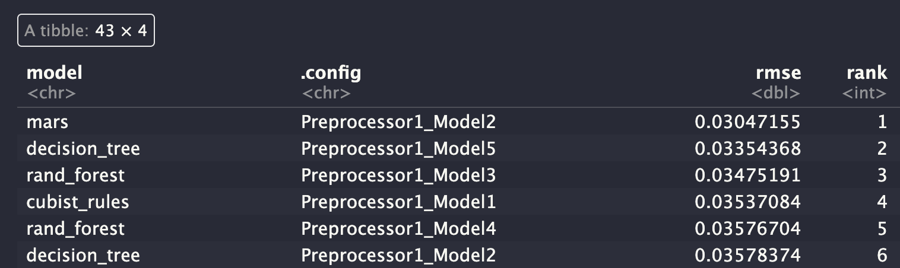</center>


```{r eval=FALSE}
autoplot(
   grid_results,
   rank_metric = "rmse",  # <- how to order models
   metric = "rmse",       # <- which metric to visualize
   select_best = TRUE     # <- one point per workflow
) +
   geom_text(aes(y = mean-0.02, 
                 label = wflow_id), 
             angle = 90, 
             hjust = 1) +
   lims(y = c(-0.05, 0.1)) +
   theme(legend.position = "none")
```

<center>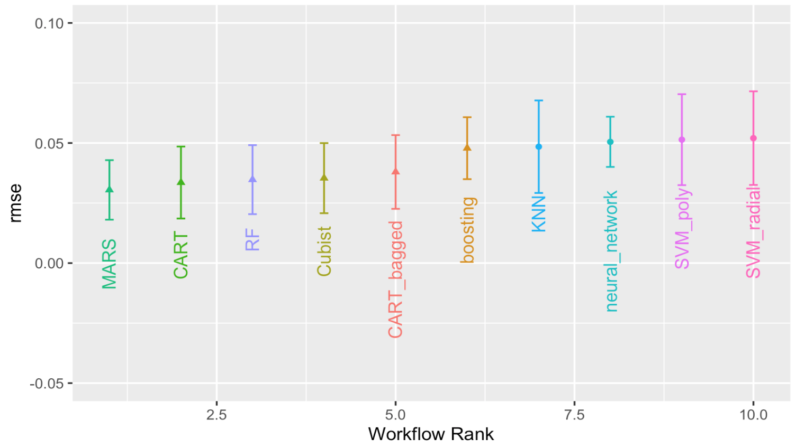</center>

```{r eval=FALSE}
autoplot(grid_results, id = "Cubist", metric = "rmse")
```

<center>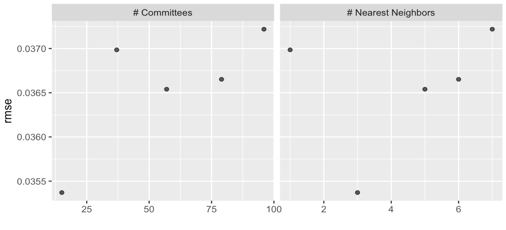</center>

#### Racing

```{r eval=FALSE}
library(finetune)

race_ctrl <-
   control_race(
      save_pred = TRUE,
      parallel_over = "everything",
      save_workflow = TRUE
   )

race_results <-
   all_workflows %>%
   
  workflow_map(
      "tune_race_anova",
      seed = 1503,
      resamples = folds,
      # warning this is for educational purposes
      grid = 5, # grid should be higher
      control = race_ctrl
   )

# saveRDS(race_results,file="data/race_results.rds")
# race_results <- readRDS("data/race_results.rds")
```


```{r eval=FALSE}
autoplot(
   race_results,
   rank_metric = "rmse",  
   metric = "rmse",       
   select_best = TRUE    
) +
   geom_text(aes(y = mean - 0.02, 
                 label = wflow_id), 
             angle = 90, 
             hjust = 1) +
   lims(y = c(-0.05, 0.1)) +
   theme(legend.position = "none")
```

<center>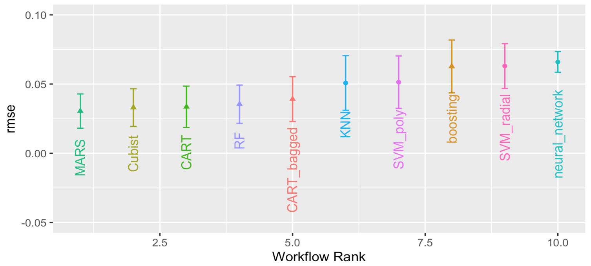</center>

### Stacking (Ensembles of models)

```{r eval=FALSE}
library(stacks)
#?stacks
dementia_stack <- 
  stacks() %>% 
  add_candidates(race_results)
```


```{r eval=FALSE}
set.seed(25102023)
ens <- blend_predictions(dementia_stack)
autoplot(ens)
```

<center>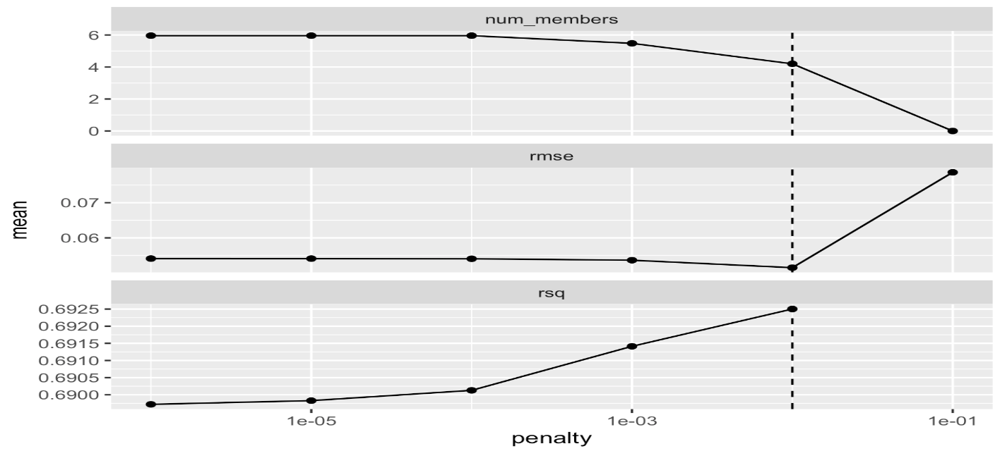</center>

```{r eval=FALSE}
ens
```

<center>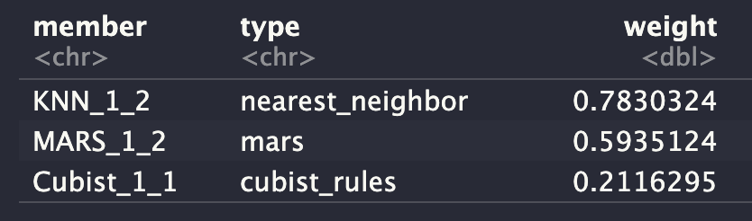</center>

```{r eval=FALSE}
set.seed(25102023)
ens2 <- blend_predictions(dementia_stack, 
                         penalty = 10^seq(-2, -0.5, length = 20))
autoplot(ens2)
```

<center>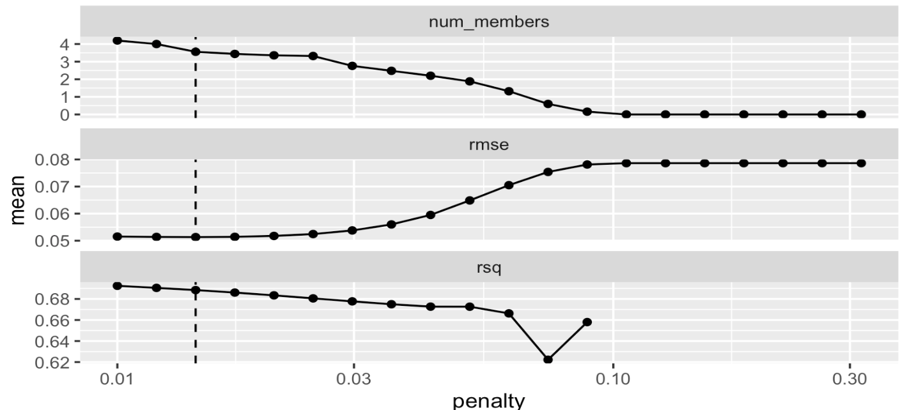</center>

Let's check which model provide the largest contributions to the ensemble.

```{r eval=FALSE}
autoplot(ens2, "weights") +
  geom_text(aes(x = weight + 0.01, 
                label = model), hjust = 0) + 
  theme(legend.position = "none") +
  lims(x = c(-0.01, 1))
```

<center>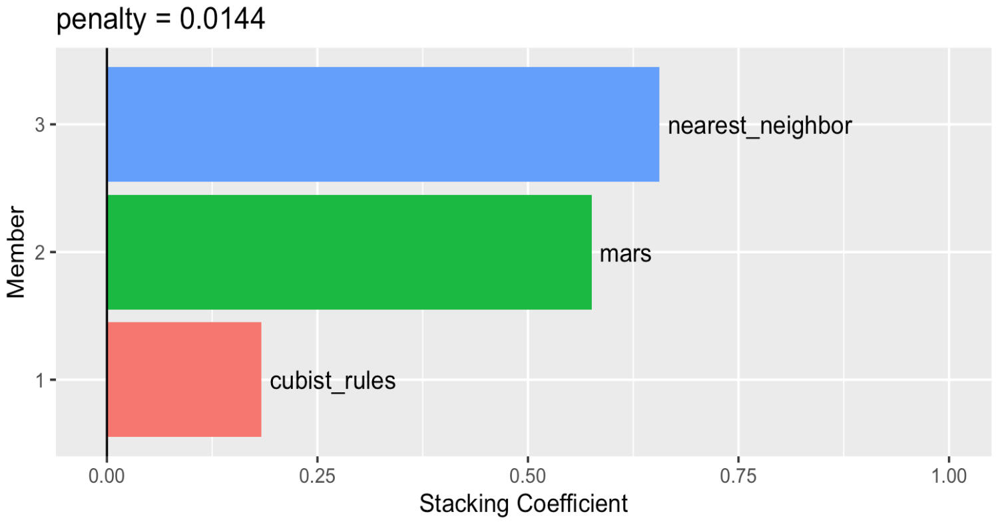</center> 

```{r eval=FALSE}
ens_fit <- fit_members(ens2)
```

```{r eval=FALSE}
reg_metrics <- metric_set(rmse, rsq)

ens_test_pred <- 
  predict(ens_fit, test) %>% 
  bind_cols(test)

ens_test_pred %>% 
  reg_metrics(predicted_risk_of_dementia, .pred)
```

<center>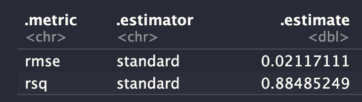</center> 

## Meeting Videos

### Cohort 1

`r knitr::include_url("https://www.youtube.com/embed/J8rZ1u4PhM8")`

`r knitr::include_url("https://www.youtube.com/embed/Pdm9G8nfR1g")`

`r knitr::include_url("https://www.youtube.com/embed/bUECbzZuIDY")`

<details>
  <summary> Meeting chat log </summary>
  
```
# 2021-05-25 Preview with Asmae Toumi
00:07:45	tan-iphone:	timed with an audience
00:08:00	tan-iphone:	did you get the cursive IDE set up?
00:11:00	Tony ElHabr:	yup! victor mono is the secret
00:18:44	tan-iphone:	foreach
00:18:47	tan-iphone:	or future or something
00:18:53	Marschall Furman (he/him):	parallel package
00:19:55	Jim Gruman:	all_cores <- parallelly::availableCores(omit = 1)
future::plan("multisession", workers = all_cores) # on Windows
00:47:55	tan-iphone:	"you'll learn when you grow up"

# 2021-06-01 Preview with Tony ElHabr
00:08:56	Jon Harmon:	Like tensorflow but very few insane installation issues: https://github.com/mlverse/torch
00:23:46	Daryn Ramsden:	Is it multinom_reg because there’s a logistic regression under the hood?
00:25:18	Jon Harmon:	I think so, as far as google is telling me.
00:27:19	Asmae Toumi:	Max’s quote: “One other note that is in the upcoming ensemble chapter about racing and stacking... the stack can only use the candidates that had the complete set of resamples done. With racing, it works fast by avoiding using all of the resamples for candidates that show poor performance. If the racing method quickly gets down to one tuning parameter set, that is the only candidate that can be added to the data stack (since it has the whole set of resamples.”
00:27:26	Pavitra:	Why is there a rank jump from 2  to 12?
00:27:51	Jon Harmon:	By model. It's showing the top 2 of each.
00:28:00	Daryn Ramsden:	ohhhh
00:28:35	Jon Harmon:	Er not by model per se but by... some combo....
00:28:41	Daryn Ramsden:	So models ranked 3-11 are also rf?
00:31:58	Asmae Toumi:	i’d be curious to see the stacks results without tune race anova
00:33:16	Jon Harmon:	beepr always reminds me of this silliness that I had running a year and a half ago or so when Max had mentioned {tune} somewhere but the repo was still private... and it exactly solved something I was working on so I wanted to know as soon as it was public:
tune_check <- httr::GET(
  url = "https://github.com/tidymodels/tune"
)
while (httr::status_code(tune_check) == 404) {
  Sys.sleep(15*60)
  tune_check <- httr::GET(
    url = "https://github.com/tidymodels/tune"
  )
}
beepr::beep(8)
00:58:21	Asmae Toumi:	Tony hive forever
00:58:48	Asmae Toumi:	Can you send the code and data? I want to understand it better too
01:00:11	Pavitra:	Ledell
01:00:13	Asmae Toumi:	Erin LeDell is a legend
01:00:22	Asmae Toumi:	It was so funny
01:01:53	Pavitra:	Thank you Tony!! This was awesome
01:01:54	Jim Gruman:	thank you!!
01:02:00	Andrew G. Farina:	Thank you Tony!

# 2021-10-05 Presentation with Simon Couch
00:18:39	Jon Harmon (jonthegeek):	It's fun watching Simon's reactions to Asmae's presentation
00:25:40	Tony ElHabr:	“the literature says” = max says
00:26:00	tan:	"the tidyverse says" = Hadley says
00:29:06	Jon Harmon (jonthegeek):	Current {stacks} version has elasticnet as default, not just lasso, Max! <- note to the future
00:49:53	Simon Couch:	https://github.com/tidymodels/stacks/issues/91
00:52:28	Bryan Shalloway:	There is parsnip::null_model() that you can use for comparing against the mean... not sure if it's possible to specify something *slightly* more sophisticated there...
00:52:47	tan:	itsmesleepknee
00:52:55	Jim Gruman:	thank you Asmae and Simon!!!
00:54:47	Tony ElHabr:	See y’all next time… whenever that is
00:56:55	Pavitra-Dallas:	Thanks asmae and Simon 🤗🤗🤗
00:59:13	tan:	thanks folks!
```
</details>

`r knitr::include_url("https://www.youtube.com/embed/j2jWX8_1tYY")`

<details>
  <summary> Meeting chat log: SLICED Discussion </summary>
```
00:37:14	Bryan Shalloway:	Curious if test set is a random sample? Or if it is segment time?
```
</details>

### Cohort 3

`r knitr::include_url("https://www.youtube.com/embed/SBl2ccerzwo")`

<details>
  <summary> Meeting chat log </summary>
  
```
00:11:22	Daniel Chen:	hi. sorry i'm late
00:12:14	Federica Gazzelloni:	hello
00:14:27	Daniel Chen:	it's retraining all the indibidual models again?
00:14:32	Daniel Chen:	before adding the weights?
00:19:51	Federica Gazzelloni:	hello Jiwan you are stack 🙂
00:45:17	Daniel Chen:	lm_form_fit %>% extract_fit_engine() %>% vcov()
#>             (Intercept)  Longitude   Latitude
#> (Intercept)     212.621  1.6113032 -1.4686377
#> Longitude         1.611  0.0168166 -0.0008695
#> Latitude         -1.469 -0.0008695  0.0330019
00:45:23	Daniel Chen:	https://www.tmwr.org/models.html#use-the-model-results
```
</details>

### Cohort 4

`r knitr::include_url("https://www.youtube.com/embed/GT-ZlDra8jk")`

<details>
  <summary> Meeting chat log </summary>
  
```
00:39:59	Federica Gazzelloni:	https://www.sciencedirect.com/topics/computer-science/ensemble-modeling#:~:text=Ensemble%20modeling%20is%20a%20process,prediction%20for%20the%20unseen%20data.
00:44:04	Federica Gazzelloni:	https://towardsdatascience.com/ensemble-models-5a62d4f4cb0c
00:45:25	Isabella Velásquez:	Ship it!
```
</details>
