--- 
title: "Tidy Modeling with R Book Club"
author: "The R4DS Online Learning Community"
date: "`r Sys.Date()`"
site: bookdown::bookdown_site
documentclass: book
bibliography: book.bib
biblio-style: apalike
link-citations: yes
github-repo: r4ds/bookclub-tmwr
description: "This is the product of the R4DS Online Learning Community's Tidy Modeling with R Book Club."
---

# Welcome {-}

This is a companion for the book [Tidy Modeling with R](https://www.tmwr.org/) by Max Kuhn and Julia Silge.
This companion is available at [r4ds.io/tmwr](https://r4ds.io/tmwr).

This website is being developed by the [R4DS Online Learning Community](https://rfordatasci.com). Follow along, and [join the community](https://r4ds.io/join) to participate.

This companion follows the [R4DS Online Learning Community Code of Conduct](https://r4ds.io/conduct).

## Book club meetings {-}

- Each week, a volunteer will present a chapter from the book.
  - **This is the best way to learn the material.**
- Presentations will usually consist of a review of the material, a discussion, and/or a demonstration of the principles presented in that chapter.
- More information about how to present is available in the [github repo](https://github.com/r4ds/bookclub-tmwr).
- Presentations will be recorded, and will be available on the [R4DS Online Learning Community YouTube Channel](https://r4ds.io/youtube).

<!--chapter:end:index.Rmd-->

# Software for modeling

**Learning objectives:**

- **Recognize the principles** around which the `{tidymodels}` packages were designed.
- Classify models as **descriptive, inferential,** and/or **predictive.**
- Define **descriptive model.**
- Define **inferential model.**
- Define **predictive model.**
- Differentiate between **supervised** and **unsupervised** models.
- Differentiate between **regression** and **classification** models.
- Differentiate between **quantitative** and **qualitative** data.
- Understand the **roles that data can have** in an analysis.
- Apply the **data science process.**
- Recognize the **phases of modeling.**

>The utility of a model hinges on its ability to be *reductive*. The primary influences in the data can be captured mathematically in a useful way, such as in a relationship that can be expressed as an equation.

<blockquote>  There are two reasons that models permeate our lives today: an abundance of software exists to create models and it has become easier to record data and make it accessible. </blockquote>

## The pit of success

`{tidymodels}` aims to help us fall into the Pit of Success:

> The Pit of Success: in stark contrast to a summit, a peak, or a journey across a desert to find victory through many trials and surprises, we want our customers to simply fall into winning practices by using our platform and frameworks.

- **Avoid confusion:** Software should facilitate proper usage.
- **Avoid mistakes:** Software should make it easy for users to do the right thing.

Examples of creating a pit of success (discussed in more details later)

-   internal consistency
-   sensible defaults
-   fail with meaningful error messages rather than silently producing incorrect results

## Types of models

- **Descriptive models:** Describe or illustrate characteristics of data.
- **Inferential models:** Make some statement of truth regarding a predefined conjecture or idea.
  - Inferential techniques typically produce some type of probabilistic output, such as a p-value, confidence interval, or posterior probability.
  - Usually delayed feedback between inference and actual result.
- **Predictive models:** Produce the most accurate possible prediction for new data. *Estimation* ("How much?") rather than *inference* ("Will it?").
  - **Mechanistic models** are derived using first principles to produce a model equation that is dependent on assumptions.
    - Depend on the assumptions that define their model equations.
    - Unlike inferential models, it is easy to make data-driven statements about how well the model performs based on how well it predicts the existing data
  - **Empirically driven models** have more vague assumptions, and are derived directly from the data.
    - No theoretical or probabilistic assumptions are made about the equations or the variables
    - The primary method of evaluating the appropriateness of the model is to assess its accuracy using existing data

<sub>1. Broader discussions of these distinctions can be found in Breiman ([2001b](https://www.tmwr.org/software-modeling.html#ref-breiman2001)) and Shmueli ([2010](https://www.tmwr.org/software-modeling.html#ref-shmueli2010))</sub>

## Terminology

-   **Unsupervised models** are used to understand relationships between variables or sets of variables without an explicit relationship between variables and an outcome.
    -   Examples: PCA, clustering, autoencoders.
-   **Supervised models** have an outcome variable.
    -   Examples: linear regression, decision trees, neural networks.
    -   **Regression:** numeric outcome
    -   **Classification:** ordered or unordered qualitative values.
-   **Quantitative** data: numbers.
-   **Qualitative** (nominal) data: non-numbers.
    -   *Qualitative data still might be coded as numbers, e.g. one-hot encoding or dummy variable encoding*
-   Data can have different roles in analyses:
    -   **Outcomes** (labels, endpoints, dependent variables): the value being predicted in supervised models.
    -   **Predictors** (independent variables): the variables used to predict the outcome.
    -   Identifiers

Choosing a model type will depend on the type of question we want to answer / problem to solve and on the available data, among other things.

## The data analysis process

1.  Cleaning the data: investigate the data to make sure that they are applicable to the project goals, accurate, and appropriate
2.  Understanding the data: often referred to as exploratory data analysis (EDA). EDA brings to light how the different variables are related to one another, their distributions, typical ranges, and other attributes.
    -   "How did I come by *these* data?"
    -   "Is the data *relevant*?"
3.  Develop clear expectations of the goal of your model and how performance will be judged ([Chapter 9](https://www.tmwr.org/performance.html))
    -   "What is/are the *performance metrics or realistic goal/s* of what can be achieved?"

::: {style="text-align:center;"}

:::

## The modeling process

::: {style="text-align:center;"}

:::

-   **Exploratory data analysis:** Explore the data to see what they might tell you. (See previous)
-   **Feature engineering:** Create specific model terms that make it easier to accurately model the observed data. Covered in [Chapter 6](https://www.tmwr.org/recipes.html#recipes).
-   **Model tuning and selection:** Generate a variety of models and compare performance.
    -   Some models require **hyperparameter tuning**
-   **Model evaluation:** Use EDA-like analyses and compare model performance metrics to choose the best model for your situation.

The final model may be used for a conclusion and/or produce predictions on new data.

## Meeting Videos

### Cohort 1

`r knitr::include_url("https://www.youtube.com/embed/jrBiEppKt_0")`

<details>
  <summary> Meeting chat log </summary>
  
  ```
00:10:57	Andrew G. Farina:	Sorry guys, I have a sleeping baby in the room, so I am stuck with only chat tonight. Looking forward to the discussion though.
00:11:10	mayagans:	Hi baby!!!
00:11:31	mayagans:	(Hi everyone else too — Im also in a loud house right now super stoked for this!)
00:11:38	Jim Gruman:	Hello everyone
00:11:39	Tony ElHabr:	the chat is where all of the fun happens anyways!
00:11:59	Tan Ho:	Obviously!
00:12:01	Scott Nestler:	It's been way too long since I've seen many of you.  Hope everyone is doing well.  I'm excited for this.
00:12:04	Jeremy:	Yep, I’ve got a puppy who believes she’s an attack dog going crazy so I’ll probably mute for a while
00:12:36	Tyler Grant Smith:	on kid bath duty for the start of this
00:15:16	Yoni Sidi:	It’s a gitbook!
00:15:37	Tan Ho:	It's a book about a book
00:15:40	Tan Ho:	classic Jon
00:15:46	Joe Sydlowski:	Metabook
00:15:54	Scott Nestler:	Very meta.
00:16:03	Tony ElHabr:	presentation + book seems like it is prime for a package
00:16:17	Tony ElHabr:	counting on jon to jump on that idea
00:26:44	shamsuddeen:	The utility of a model hinges on its ability to be reductive. What is the meaning of this from the book?
00:28:03	Tony ElHabr:	I think that means "a model should be interpretable"
00:28:28	Tony ElHabr:	yeah, "simpler" is a better word
00:28:41	Yoni Sidi:	Sparse model means less overfitting
00:28:41	shamsuddeen:	sure
00:29:15	Gabriela Palomo:	Perhaps it may also mean that a model uses a bunch of data and simplifies it in an equation or model? 
00:29:29	Jacob Miller:	As someone who is an intermediate user of caret, how useful would it be to switch completely over to tidymodels and not revert back to caret? Or are there benefits to using both consistently?
00:29:56	Gabriela Palomo:	So in a way it's simpler to understand as well vs seeing all the raw data
00:30:09	Tony ElHabr:	i feel you have much more "low-level" control with tidymodels
00:30:36	Scott Nestler:	I had a similar question to Jacob's, but with regard to mle & mle3.
00:31:01	Tan Ho:	Caret is broader but tidymodels is deeper (see yesterday's xkcd :P)
00:31:10	Arjun’s iPhone:	you can mix tidymodels and caret.... preprocess using tidymodels and feed it to caret
00:32:12	Scott Nestler:	TYPO ALERT.  I meant mlr and mlr3.
00:32:18	Asmae Toumi:	Agreed with David. For example, weighted RMSE stuff is only on caret (for now) and there’s a GitHub issue reply by max basically saying its too hard to add to tidy models right now. Either way tidy models seems the way to go to not be behind in say, 2 years, when its well developed
00:32:20	Conor Tompkins:	My understanding is that caret is deprecated. It still works, but tidymodels is where its at now. Like dplyr in 2015. Not 100% coverage compared to base R or data.table, but heading in the right direction fast.
00:32:25	Maria:	Yes, usemodels is great!
00:32:38	Conor Tompkins:	Yeah not officially depreacted
00:34:30	mayagans:	My only comment is that I love how many people are here!!!! I can only imagine the range of domain expertise in this “room” - I HATE ice breakers but do people want to throw in the chat what domain they want to write models in/why they’re reading this book? Im a pharma person but Im also obsessed with music analytics :) I look forward to seeing how presenters apply their chapters!
00:34:43	Connor Krenzer:	The book says in the Empirically driven models section: "No theoretical or probabilistic assumptions are made about the sales numbers or the variables that are used to define similarity. In fact, the primary method of evaluating the appropriateness of the model is to assess its accuracy using existing data. If the structure of this type of model was a good choice, the predictions would be close to the actual values."

How does the significance of the model's variables play into the above? Let's take linear regression for example. Does this mean we are only supposed to care about R-square instead of p-values?
00:34:51	Yoni Sidi:	https://github.com/topepo/workflowsets
00:35:41	Asmae Toumi:	Sure Maya, great idea, my domain is healthcare/medtech and for fun, sports analytics!
00:36:44	Jordan Krogmann:	Live and die by the pun :)
00:37:04	Kevin Kent:	@Maya - I originally learned ML stuff in sklearn but do 80% of my work in R, so I’d like to move that all over to tidy models. I work in healthcare technology, in the devops area
00:37:26	Tony ElHabr:	good question Connor. i think it depends on your intention. for an inferential model, the variables and p values matter more, but that's not to say that your model's R2 is "allowed" to be really bad. for a predictive model, it would all be about maximizing R2
00:37:38	Yoni Sidi:	Modeling and simulation in pharma
00:37:59	Conor Tompkins:	I don’t use modeling professionally, would like to get there. I use R to avoid using Excel. Very interested in sports data and civic hacking
00:38:12	Scott Nestler:	I guide many students in capstone projects building models in all kinds of domains.  Much of my own work is in sports analytics, either for fun or with some of our teams here on campus.
00:38:24	Tony ElHabr:	electricity markets. sports for fun
00:38:36	Jonathan Trattner:	Undergrad studying computational neuroscience!
00:38:43	Jonathan Trattner:	I can volunteer for the tidyverse primer!
00:38:45	Jim Gruman:	Im in industry/agriculture - marketing/geospatial/IoT events/survival
00:38:46	Maria:	I also in healthcare/research 
00:38:58	Tyler Grant Smith:	im a predictive modeling actuary working in p&c insurance
00:39:02	Vasant M:	@Connor Krenzer yes, the less you use p-values as a metric to assess models the better. R-square is one metric, but not always the most reliable one to use. For instance r-square doesn’t mean anything for non-linear models. I would rather depend on model accuracy to guide model building
00:39:05	Jonathan Trattner:	Sounds good (:
00:39:08	Tan Ho:	I work in homebuilding, so finance-ish data - and work on fantasy football data as well
00:39:13	Stephen - Computer - No Mic:	Degree in Health Data Analytics - currently working on an automated trading algorithm (which is built with tidymodels)
00:39:29	Aashish Cheruvu:	I’m a student and I’m interesting in healthcare analytics and tech
00:39:38	Miles Ott (he/him/his):	Hi everyone! Excited to be here :)I am a stats/data science prof at Smith College and my work/research stuff is in social network analysis and sampling applied to public health
00:39:43	Vasant M:	I am Bioinformatician - Work in Biomedical research, currently doing Lipidomics in Sleep Mediccine
00:39:51	shamsuddeen:	Student interested in natural language processing
00:39:55	Andrew G. Farina:	I am a grad candidate currently, trying to build a solid base in modeling to use in the future.
00:39:56	Stephen - Computer - No Mic:	I have been using R to run a text messaging campaign for the Senate run-offs in Georgia recently
00:40:13	Tim Moloney:	I work in environmental consulting, do a lot of geospatial and/or statistics analyses with R
00:40:19	Adrienne St Clair:	Hi all, I'm a botanist and work in plant conservation in public parks. I am a nascent data nerd and want to learn all I can about data analysis. 
00:40:21	Conor Tompkins:	I am currently using tidymodels to build a model to predict house sale prices in Pittsburgh
00:40:34	Jonathan Leslie:	I work in data science consulting...I work with businesses/government agencies to design data science projects.
00:40:43	Vasant M:	@Stephen that’s very cool.
00:40:45	ErickKnackstedt:	Business intelligence developer in the mental health/mindfulness space, no real modeling experience really excited to learn tidymodels
00:40:53	Andrew G (he/him):	I work in App Analytics. Will be starting a new gig in app/game analytics soon. Historically modeling on the job has been few and far between so I’m looking forward to understanding best practices, workflow, etc…
00:41:23	Ben Gramza:	Hi I'm Ben, I just graduated with a stats degree (and thus am unemployed and without a domain). I've done some work with COVID survey data and redistricting/gerrymandering in the past. I also keep up with the sports analytics scene in my free time. 
00:41:53	Giovani Ferreira:	Tech Team Leader here, data hobbyist, usually very interested in NLP and Topic Modelling, decided to use this bookclub to level my modelling skills
00:42:25	Jacob Miller:	Senior studying stats, done actuarial consulting internships, and planning on grad school in stats. Sports analytics is the hobby/passion
00:43:01	mayagans:	Aaaahhh so many cool domains!! Everyone is a bad ass wow - I selfishly hope everyone talks ties in the content with their passions and maybe Ill even know something about #SPORTS by the time we’re done LOL
00:44:00	Stephen - Computer - No Mic:	Thanks @ Vasant !
00:44:21	Conor Tompkins:	Deployment seems very domain specific
00:44:38	Conor Tompkins:	Tech stack = domain
00:45:57	David Severski:	Oh, do I have thoughts on cloudy… ;P
00:46:04	David Severski:	S/cloudy/cloudyr/
00:46:32	Jordan Krogmann:	https://github.com/wlandau/targets
00:46:39	tim:	To get some more background in machine learning, in addition to learning tidymodels, any suggestions for books? I was thinking Applied Predictive Modeling - but keep changing my mind and need something to stick to. I guess it uses caret too? So that might be useful.
00:47:36	mayagans:	……Is Yoni in an aquarium of pizzas?
00:48:07	Tan Ho:	asking the important questions :D
00:48:16	Scott Nestler:	Responding to Tim's question … I'm currently working my way through Machine Learning with R, the tidyverse, and mlr (Rhys).
00:48:25	Vasant M:	@Tim Statistical Learning  PDF link http://www.ime.unicamp.br/~dias/Intoduction%20to%20Statistical%20Learning.pdf
00:48:34	Connor Krenzer:	@tim I hear Introduction to Statistical Learning is a classic
00:49:06	Vasant M:	@Tim if you like a course https://www.edx.org/course/statistical-learning
00:49:15	Tony ElHabr:	i'm just glad we won't have to nag people to volunteer to do presentations since we have so many participants lol
00:49:21	ErickKnackstedt:	https://dtkaplan.github.io/SM2-bookdown/preface-to-this-electronic-version.html
00:49:38	tim:	Thanks, this is awesome! Now I just need to pick something and stick with it, haha
00:49:38	ErickKnackstedt:	That book is legit 
00:49:59	Jonathan Leslie:	@Tim I second the recommendation for Introduction to Statistical Learning. It’s a great overview of different modelling approaches and how to interpret model outputs.
00:50:18	Miles Ott (he/him/his):	nice to meet you all!
00:50:19	David Severski:	Have a great one, everyone!
00:50:24	Jordan Krogmann:	thanks take it ea y
00:50:28	Yoni Sidi:	Bye and thanks for all the fish
00:50:29	Tan Ho:	Cheers gang!
00:50:32	Aashish Cheruvu:	Bye everyone and thank you
00:50:33	mayagans:	Thanks Jon!!
00:50:36	Maria:	Cheers!
00:51:03	Arjun’s iPhone:	p
```
</details>

### Cohort 2

`r knitr::include_url("https://www.youtube.com/embed/nHZu-as7O7w")`

<details>
  <summary> Meeting chat log </summary>
  
  ```
00:06:50	Stephen Holsenbeck:	https://docs.google.com/spreadsheets/d/1vD4LG4_nhsxSAxXiBi42iKIvZXQtNxgB5C_PUkIZ0wo/edit#gid=0
00:08:48	Amélie Gourdon-Kanhukamwe:	Questions (if forgotten): name (pronunciation), location, fun fact about yourself, why are you here?
00:21:23	Carmen Santana:	when the pandemic is over you should come to Portugal, great wine here!!
00:21:50	Kevin Kent:	There was a wine ratings tidytuesday a while ago  https://github.com/rfordatascience/tidytuesday/tree/master/data/2019/2019-05-28
00:21:50	shamsuddeen:	Hahhaha, yes. Specially Porto wine -:)
00:22:30	Layla Bouzoubaa:	Yes to portugal
00:22:37	Layla Bouzoubaa:	Thanks, Kevin!
00:26:36	Stephen Holsenbeck:	https://github.com/r4ds/bookclub-tmwr
00:28:15	Amélie Gourdon-Kanhukamwe:	I love Portugal too, but other fun fact: I am non-wine drinking French.
00:28:49	Layla Bouzoubaa:	😱
01:02:53	Kevin Kent:	I really like fast ai’s chapter on ethics - https://github.com/fastai/fastbook/blob/master/03_ethics.ipynb (free by the way)
01:03:14	Carmen Santana:	thanx
01:03:44	Layla Bouzoubaa:	Thank you, kevin
01:04:14	Layla Bouzoubaa:	Yes, let’s add it to google doc
01:07:34	Amélie Gourdon-Kanhukamwe:	Possibly after FE too?
01:08:45	Layla Bouzoubaa:	After
01:08:48	Layla Bouzoubaa:	Agree with auust
01:08:51	Kevin Kent:	After is ok with me
01:11:03	Layla Bouzoubaa:	There was also rstudio conf from last year from googlebrain for ethics to predict lending
01:14:55	shamsuddeen:	Cheers guys
```
</details>

### Cohort 3

`r knitr::include_url("https://www.youtube.com/embed/h8aGFPVj3C8")`

<details>
  <summary> Meeting chat log </summary>
  
  ```
00:13:08	Morgan Grovenburg:	Daniel I love your Blue's Clues background!
00:13:34	Daniel Chen:	( : #steve
00:13:56	Morgan Grovenburg:	I miss Steve!
00:17:58	priyanka gagneja:	nice
00:36:34	Daniel Chen:	e.g., mechanistic model is maybe how gasses are absorbed in our cells at depth (in scuba diving) -- buhlmann decompression algorithm: https://en.wikipedia.org/wiki/B%C3%BChlmann_decompression_algorithm
00:37:00	Daniel Chen:	^ not sure, but that was the first thing that came to mind about something that is purely based on physical properties
00:39:13	Chris Martin:	Similarly - mechanistic models made me think of models (may be systems of differential equations ...) of the chemical reactions taking place in the Earth's atmosphere.
00:41:01	Daniel Chen:	for those who do not know "one-hot encoding" is the engineering/computer science term for "dummy variables" in statistics -- that took me a long time to realize
00:41:36	Morgan Grovenburg:	Thank you Daniel! I had no idea!
00:42:10	priyanka gagneja:	I need to run early today . See you all later
00:43:24	Chris Martin:	Thanks, yes a new term to me too!
00:46:53	Daniel Chen:	one-hot encoding is what they use in sci-kit learn in python. it confused the heck out of me when I was trying to learn how to fit models there
00:57:33	Morgan Grovenburg:	I got to go. Thanks Ildiko!
00:59:22	Daniel Chen:	https://github.com/r4ds/bookclub-tmwr
01:00:32	Daniel Chen:	i can do next week
01:00:40	Ildiko Czeller:	https://github.com/r4ds/bookclub-tmwr/blob/main/README.md
01:02:58	Daniel Chen:	see/talk to everyone on slack :)
```
</details>

<!--chapter:end:01-software_for_modeling.Rmd-->

```{r setup tidyverse primer, include = FALSE}
# Not positive if the book will compile without this, so I'm including it just
# to be safe.
library(tidyverse)
```

# A tidyverse primer

**Learning objectives:**

-   List the [**`tidyverse` design principles.**](#tidyverse-design-principles)
-   Explain what it means for the [`tidyverse` to be **designed for humans.**](#design-for-humans)
-   Describe how [**reusing existing data structures** can make functions easier to work with.](#reusing-existing-data-structures)
-   Explain what it means for a set of functions to be [**designed for the pipe.**](#designed-for-the-pipe)
-   Explain what it means for function to be [**designed for functional programming.**](#designed-for-functional-programming)
-   List some [**differences between a `tibble` and a base `data.frame`.**](#tibbles-vs.-data-frames)
-   Recognize how to [**use the `tidyverse` to read and wrangle data.**](#how-to-read-and-wrangle-data)

## Tidyverse design Principles {#tidyverse-design-principles}

The `tidyverse` has [four core design principles](https://design.tidyverse.org/unifying-principles.html):

1.  **Human centered:** Designed to promote human usability.
2.  **Consistent:** Learning how to use one function or package is as similar as another.
3.  **Composable:** Easily breakdown data challenges into smaller components with exploratory tools to find the best solution.
4.  **Inclusive:** Fostering a community of like-minded users (e.g. \#*rstats*)

## Design for Humans - Overview 

> "Programs must be written for people to read, and only incidentally for machines to execute."
>
> \- Hal Abelson


Credit: [Nielson Norman Group](https://www.nngroup.com/articles/design-thinking/)

**Motivation** - [Avoiding Norman Doors](https://design.tidyverse.org/unifying-principles.html)

What are the equivalent of Norman Doors in programming?

`r knitr::include_url("https://www.youtube.com/embed/yY96hTb8WgI")`

## Design for Humans and the Tidyverse {#design-for-humans}

The `tidyverse` offers packages that are easily readable and understood by humans. It enables them to more easily achieve their programming goals.

Consider the `mtcars` dataset, which comprises fuel consumption and 10 aspects of autombile design and performance from 1973-1974. Previewing the first six rows of the data, we see:

```{r head, echo = FALSE}
head(mtcars)
```

If we wanted to arrange these in ascending order based on the `mpg` and `gear` variables, how could we do this?

------------------------------------------------------------------------

The function `arrange()`, in the `dplyr` package of the `tidyverse`, takes a data frame and column names as such:

```{r arrange, eval = FALSE}
arrange(.data = mtcars, gear, mpg)
```

------------------------------------------------------------------------

`arrange()`, and other tidyverse functions, use **names that are descriptive and explicit.** For general methods, there is a **focus on verbs,** as seen with the functions `pivot_longer()` and `pivot_wider()` in the `tidyr` package.

## Reusing existing data structures {#reusing-existing-data-structures}

> "You don't have to reinvent the wheel, just attach it to a new wagon."
>
> \- Mark McCormack

There are many different data types in R, such as matrices, lists, and data frames.[^a_tidyverse_primer-1] A typical function would take in data of some form, conduct an operation, and return the result.

[^a_tidyverse_primer-1]: For a more detailed discussion, see Hadley Wickham's [*Advanced R*](https://adv-r.hadley.nz/vectors-chap.html)

`tidyverse` functions most often operate on data structures called tibbles.

-   Traditional data frames can represent different data types in each column, and multiple values in each row.

-   Tibbles are a special data frame that have additional properties helpful for data analysis.

    -   Example: list-columns

------------------------------------------------------------------------

```{r tidyverse-resample}
boot_samp <- rsample::bootstraps(mtcars, times = 3)
boot_samp
class(boot_samp)
```

------------------------------------------------------------------------

The above example shows how to create bootstrap resamples of the data frame mtcars. It returns a tibble with a `splits` column that defines the resampled data sets.

This function **inherits data frame and tibble methods so other functions that operate on those data structures can be used.**

## Designed for the pipe {#designed-for-the-pipe}

The pipe operator, `%>%`, comes from the [`magrittr`](https://magrittr.tidyverse.org) package by [Stefan Milton Bache](http://stefanbache.dk), and is used to chain together a sequence of R functions. More specifically, **the pipe operator uses the value of the object on the left-hand side of the operator as the first argument on the operator's right-hand side.**

The pipe allows for highly readable code. Consider wanting to sort the `mtcars` dataset by the number of gears (`gear`) and then select the first ten rows. How would you do that?

------------------------------------------------------------------------

```{r no pipe arrange slice}
cars_arranged <- arrange(mtcars, gear)
cars_selected <- slice(cars_arranged, 1:10)

# more compactly
cars_selected <- slice(arrange(mtcars, gear), 1:10)
```

Using the pipe to substitute the left-hand side of the operator with the first argument on the right-hand side, we can get the same result as follows:

```{r pipe arrange slice}
cars_selected <- mtcars %>%
  arrange(gear) %>%
  slice(1:10)
```

------------------------------------------------------------------------

This approach with the pipe works because all the functions **return the same data structure (a tibble/data frame) which is the first argument of the next function.**

**Whenever possible, create functions that can be incorporated into a pipeline of operations.**

## Designed for Functional Programming {#designed-for-functional-programming}

Functional Programming is an approach to replace iterative (i.e. for) loops. Consider the case where you may want two times the square root of the `mpg` for each car in `mtcars`. You could do this with a for loop as follows:

```{r for loop sqrt }
n <- nrow(mtcars)
roots <- rep(NA_real_, n)
for (car in 1:n) {
  roots[car] <- 2 * sqrt(mtcars$mpg[car])
}
```

You could also write a function to do the computations. In functional programming, it's important that the function **does not have any side effects and the output only depends on the inputs.** For example, the function `my_sqrt()` takes in a car's mpg and a weight by which to multiply the square root.

```{r my-sqrt}

my_sqrt <- function(mpg, weight) {
  weight * sqrt(mpg)
}

```

Using the [`purrr`](http://purrr.tidyverse.org/) package, we can forgo the for loop and use the `map()` family of functions which use the basic syntax of `map(vector, function)`. Below, we are applying the `my_sqrt()` function, with a weight of 2, to the first three elements of `mtcars$mpg`. User supplied functions can be declared by prefacing it with `~` (pronounced "twiddle").

-   By default, `map()` returns a list.

    -   If you know the class of a function's output, you can use special suffixes. A character output, for example, would used by `map_chr()`, a double by `map_dbl()`, and a logical by `map_lgl()`.

```{r map sqrt}
map(
  .x = head(mtcars$mpg, 3),
  ~ my_sqrt(
    mpg = .x,
    weight = 2
  )
)
```

-   `map()` functions can be used with 2 inputs, by specifying `map2()`

    -   Requires arguments `.x` and `.y`

```{r map2 sqrt}
map2(
  .x = head(mtcars$mpg, 3),
  .y = c(1,2,3),
  ~ my_sqrt(
    mpg = .x,
    weight = .y
  )
)
```

## Tibbles vs. Data Frames {#tibbles-vs.-data-frames}

A `tibble` is a special type of data frame with some additional properties. Specifically:

-   **Tibbles work with column names that are not syntactically valid variable names**.

```{r tibble syntax}
data.frame(`this does not work` = 1:2,
           oops = 3:4)

tibble(`this does work, though` = 1:2,
       `woohoo!` = 3:4)
```

-   **Tibbles prevent partial matching of arguments** to avoid accidental errors

```{r accidental matching tibble}
df <- data.frame(partial = 1:5)
tbbl <- tibble(partial = 1:5)

df$part

tbbl$part
```

-   **Tibbles prevent dimension dropping**, so subsetting data into a single column will never return a vector.

```{r subsetting vector conversion}
df[, "partial"]

tbbl[, "partial"]
```

-   **Tibbles allow for list-columns**, which can be a powerful tool when working with the `purrr` package.

```{r tibble list columns}

template_list <- list(a = 1, b = 2, c = 3, d = 4, e = 5)

data.frame(col = 1:5, list_col = template_list)

tibble(col = 1:5, list_col = template_list)

```

## How to read and wrangle data {#how-to-read-and-wrangle-data}

The following example shows how to use the `tidyverse` to read in data (with the `readr` package) and easily manipulate it (using the `dplyr` and `lubridate` packages). We will walk through these steps during our meeting.

```{r read wrangle data, message = FALSE}
library(tidyverse)
library(lubridate)

url <- "http://bit.ly/raw-train-data-csv"

all_stations <- 
  # Step 1: Read in the data.
  readr::read_csv(url) %>% 
  # Step 2: filter columns and rename stationname
  dplyr::select(station = stationname, date, rides) %>% 
  # Step 3: Convert the character date field to a date encoding.
  # Also, put the data in units of 1K rides
  dplyr::mutate(date = lubridate::mdy(date), rides = rides / 1000) %>% 
  # Step 4: Summarize the multiple records using the maximum.
  dplyr::group_by(date, station) %>% 
  dplyr::summarize(rides = max(rides), .groups = "drop")
```

```{r preview all stations}
head(all_stations, 10)
```

> "This pipeline of operations illustrates why the tidyverse is popular. A series of data manipulations is used that have simple and easy to understand user interfaces; the series is bundled together in a streamlined and readable way. The focus is on how the user interacts with the software. This approach enables more people to learn R and achieve their analysis goals, and adopting these same principles for modeling in R has the same benefits."
>
> \- Max Kuhn and Julia Silge in *Tidy Modeling with R*

## Further Reading

- [Design of Everyday Things - Don Norman](https://www.amazon.com/Design-Everyday-Things-Revised-Expanded/dp/0465050654) 
- [Tidyverse Design Principles - The Tidyverse Team](https://design.tidyverse.org/)
- [Visualization Analysis and Design](https://www.amazon.com/Visualization-Analysis-Design-AK-Peters/dp/1466508914)  - A really great primer on visualization design from a human-centered perspective. Draws on research in cognitive science and presents a high-level framework for designing visualizations to support decision making.

From [Tidyverse Design Principles Chapter 2](https://design.tidyverse.org/unifying-principles.html):

- [The Unix philsophy](https://homepage.cs.uri.edu/~thenry/resources/unix_art/ch01s06.html)
- [The Zen of Python](https://www.python.org/dev/peps/pep-0020/)
- [Design Principles Behind Smalltalk](https://refs.devinmcgloin.com/smalltalk/Design-Principles-Behind-Smalltalk.pdf)

## Meeting Videos

### Cohort 1

`r knitr::include_url("https://www.youtube.com/embed/M7xmKrXuyDQ")`

<details>
    <summary> Meeting chat log </summary>
   
```
00:07:43    Daniel Chen:    hi Jon. hi everyone. first time here :)
00:08:03    Jon Harmon (jonthegeek):    Welcome!
00:09:27    KakShA Ekam DallasSK:   the gang is here..except for tyler
00:09:31    KakShA Ekam DallasSK:   and his kid
00:10:01    David Severski: The 4 seasons of hex bin stickers. LOL
00:10:11    Tan Ho: MiniTyler doesn't need help with the tidyverse
00:10:44    KakShA Ekam DallasSK:   that's right..he just wanted to learn bangbang
00:11:11    Tan Ho: hey, there's Tyler!
00:11:23    pavitra:    yay!!
00:12:36    Daniel Chen:    i feel like more people have cameras on and respond here than any other zoom meeting i've been in all year...
00:12:50    Tony ElHabr:    haha I second that
00:13:03    Tan Ho: we're all frens here :)
00:17:25    Tony ElHabr:    i will not hate on using mtcars i will not hate on using mtcars i will not hate on using mtcars
00:17:30    Tan Ho: Ooh! A use case for the <details> block
00:17:41    Tan Ho: shush, no dataset snobbery
00:17:54    Darya Vanichkina:   Yup, details is so helpful for easily hiding stuff in Rmd
00:18:06    Jon Harmon (jonthegeek):    Ooooh, good call on details, let's make it clear how to do that in the instructions! (I'm still partly here).
00:18:25    Yoni Sidi:  Shameless plug {details} https://github.com/yonicd/details
00:18:48    Tan Ho: ohhh dang
00:18:53    Tan Ho: installing now, I use that all the time
00:19:24    mayagans:   Ooooooh it makes a collapsible div?? That is sick nasty!
00:19:29    pavitra:    wow, details is very cool
00:19:34    David Severski: Funny, I was just exposed to details in GH issues earlier today. :)
00:20:03    Yoni Sidi:  Seamless integration to rmd with it’s own knitter chunk engine…ok I’m done plugging
00:20:15    Vasant M:   Ah yes details! That’s why I recall your name @yoni Sidi
00:20:31    Tony ElHabr:    lol i have also been having this weird data frame print out issue
00:20:55    Darya Vanichkina:   I wonder why…
00:21:27    Tan Ho: must be new tibble package related issue
00:22:17    Yoni Sidi:  What print problem?
00:22:22    Daniel Chen:    fyi: not all things that work on tibbles will work on data.frame
00:22:36    Tony ElHabr:    things like "[90m" get printed out instead of "#"
00:22:53    Gabriela Palomo:    and viceversa data.frame -> tibbles
00:22:55    Tan Ho: https://r4ds.github.io/bookclub-tmwr/reusing-existing-data-structures.html
00:23:39    Tony ElHabr:    jonathan brought the jokes tonight
00:23:42    Tony ElHabr:    always love that
00:23:47    Jon Harmon (jonthegeek):    Thinking of %>% as "and then" is very useful. Learning to read code in a way that makes sense is super super helpful!
00:24:24    Yoni Sidi:  Ironically Tony You can look at the print method for data.frames in details to see how I got around it
00:24:38    Tony ElHabr:    hmm will do Yoni
00:25:08    Tyler Grant Smith:  for small loops and especially if youve preallocated the for loop is probably faster
00:25:10    Daniel Chen:    to fix the "[90m" stuff you need to put:
options(crayon.enabled = FALSE)
either in your renvion or on the top of the knited file
at the
00:25:25    Yoni Sidi:  :+1:
00:25:36    Tony ElHabr:    thx y'all. will try that out!
00:26:03    Darya Vanichkina:   To evaluate the speed you can use microbenchmark::microbenchmark(<code here>) - I tend to use it when picking from stackoverflow
00:26:23    Tan Ho: ope TIL that's called a twiddle
00:26:28    Vasant M:   i thought ~ is tilde
00:26:34    Jon Harmon (jonthegeek):    bench::mark is another option (by Jim Hester)
00:26:38    Tan Ho: today-I-learned
00:27:03    Daniel Chen:    yes it's an annononyoms fuunction
00:27:05    Vasant M:   Statistician here and I call it tilde
00:27:07    Tan Ho: I always called it a lambda
00:27:09    Daniel Chen:    the twittle is a shortcut for the lambda
00:27:27    Tan Ho: Hadley renames things outta nowhere for no reason
00:27:28    Tan Ho: grah
00:27:32    Jon Harmon (jonthegeek):    Good to hear that, Vasant! But it isn't just Hadley!
00:27:34    Tan Ho: insert pooh meme
00:27:49    mayagans:   And twittle is writing a model in twitter
00:27:51    Vasant M:   Ya! I think it’s the atlantic/pacific divide
00:28:01    Tony ElHabr:    zoom really missed the boat by not allowing images to be embedded in chat
00:28:08    Darya Vanichkina:   .x is also hidden from the global environment (i.e. it exists but is not visible in the environment, from memory (?)
00:28:11    Jon Harmon (jonthegeek):    https://hsm.stackexchange.com/questions/7999/why-do-mathematicians-call-twiddle#:~:text=Tilde%20is%20from%20Spanish%20tildar,pretty%20apt%20name%20for%20it.
00:28:30    mayagans:   Im still trying to find the JB quote about loops
00:28:32    Tyler Grant Smith:  i prefer giving arguments in the ... to map when possible rather than making a partial lambda.  opinions?
00:28:33    Yoni Sidi:  Wait … isn’t ~ $/sim$?
00:28:59    Darya Vanichkina:   Tyler, can you give an example?
00:29:05    Tan Ho: > JB quote about loops
someone has to write a for loop, but it doesn't have to be you!
00:29:13    mayagans:   Lol yes thank you tan so good
00:29:20    Tony ElHabr:    yea tyler. ellipses as the default, and partial only minimally
00:29:57    Tan Ho: yeah, where possible I write map, map-args, function, static args, but not always possible with argument order
00:30:04    Tyler Grant Smith:  so for the given example.  map(1:5, my_sqrt, weight = 2)
00:30:25    Tan Ho: tbh Tyler started it
00:32:15    Kevin Kent: Yeah I like the … static arg style too.
00:32:54    Darya Vanichkina:   And if we have more than one arg would it be (ex_ weight = 2, height = 3, randomarg = 4)?
00:33:03    Daniel Chen:    to tyler, re ... : the ... works, but you can't map a vector of values with it (can't do: map(1:5, my_sqrt, weight = 11:15) ). that's what map2 and pmap are for.
00:33:16    Tan Ho: LIVE CODE
00:33:18    Tan Ho: YAY
00:33:26    Joe Sydlowski:  The correct window setup too!
00:33:29    Tony ElHabr:    insert environment pane comment
00:33:32    Tan Ho: BOOO
00:33:40    Tan Ho: BOOOOOOOOO
00:33:41    Tyler Grant Smith:  yep daniel
00:34:05    Tyler Grant Smith:  and Darya, yes
00:34:09    David Severski: Source goes on the right. Console on left. Change my mind. ;P
00:34:17    Tan Ho: oh nooooo
00:34:18    mayagans:   Thats chaos
00:34:25    atoumi: this is absolutely the correct layout
00:34:30    mayagans:   ^^^
00:34:32    Tan Ho: where's daryn I need backup
00:34:34    Darya Vanichkina:   @atoumi I agree
00:34:36    mayagans:   Queen has spoken
00:34:37    Kevin Kent: haha. My eyes would get crossed with source on the right
00:34:40    Tyler Grant Smith:  that hurts my brain to think about
00:34:40    Daniel Chen:    i have to say it's the "wrong env pane setup" when you're teaching (new learners) becuase students ask "mine don't look like that". unless you take out time from the lesson to show them how to customize it
00:34:57    Darya Vanichkina:   @Daniel I actually do that at the start of every workshop
00:35:13    David Severski: Now it’s time for the RMarkdown notebook output to console/in-line debate.  :D
00:35:26    Darya Vanichkina:   Because that allows me to stick EVERYTHING into the bottom right pane, and have source take up the entire left of the screen
00:35:28    Tan Ho: i assume we don't need to have a lightmode darkmode fight?
00:35:39    Tony ElHabr:    i think we are all on the dark side, right?
00:35:43    atoumi: Output to console and darkmode because we care about our eyes
00:35:44    Scott Nestler:  That might be something we all agree on.
00:35:46    Tony ElHabr:    RIGHT Y'ALL?
00:35:47    Darya Vanichkina:   Also, I think it’s a discussion, not a fight …
00:35:59    Tan Ho: shush
00:36:00    David Severski: For teaching, Studio Cloud or a dockerized version is my goto setup.
00:36:08    Tan Ho: we don't pull punches with dark mode
00:36:50    David Severski: Yay! Rsthemes!
00:36:53    mayagans:   Blindeddd by the lightttt
00:37:07    Darya Vanichkina:   I’m Carpentries-trained/based, so I still tend to want people to walk away with something they can work with on their own data later
00:37:11    Darya Vanichkina:   Although it does take time
00:37:21    Tony ElHabr:    makes sense Darya
00:37:40    Daniel Chen:    i run into horizontal space issues when i make the font bigger when i have to teach, but that usually ends up being workshop dependent.
00:37:43    Joe Sydlowski:  I never noticed that before!
00:38:25    Darya Vanichkina:   Surprisingly, I recently had a horrific workshop (geospatial python with DL, via zoom - install issues every session), and the post-workshop survey learners STILL said they wanted us to fix installs (instead of a docker-based VM solution)
00:38:43    Darya Vanichkina:   [I am still setting up a viable docker/VM for next year]
00:39:11    Daniel Chen:    for python, can  you use a binder instance for workshops?
00:39:27    Darya Vanichkina:   I needed GPUs
00:39:33    Daniel Chen:    :(
00:40:00    Daniel Chen:    conda environment.yml files aren't able to install the binaries?
00:40:28    Connor Krenzer: Could you use the map() function on this dataset?
00:40:29    mayagans:   Your python talk is gonna get you booted from this chat (lol jk xoxo)
00:40:32    David Severski: I kinda hate the warning messages the new dplyr spits out about groups (yes, I know they’re configurable).
00:40:34    Jordan Krogmann:    Great job!
00:40:37    Tony ElHabr:    discussion of python install issues in an R meeting? how fitting
00:40:54    Yoni Sidi:  Great job Jonathan!
00:40:54    Tan Ho: i threw the option into my rprofile once and have never had problems again
00:41:02    Darya Vanichkina:   @mayagans/@Tony I think it’s more a teaching issue
00:41:08    Darya Vanichkina:   And I definitely use/teach both
00:41:10    Tony ElHabr:    yeah, global Rprofile option ftw
00:41:19    Tony ElHabr:    don't get me wrong, i love python too
00:41:26    Tony ElHabr:    i just like to joke haha
00:41:28    David Severski: I do to, but I use a lot of renv these days, so I’m always going into environments where my rprofile isn’t active
00:45:14    Vasant M:   Especially when you apply a lot of different functions (models) , being explicit is better
00:45:19    Tan Ho: https://imgur.com/WdcWnKz
00:45:54    Connor Krenzer: Is there a reason why you would use map() instead of vapply()?
00:46:52    Daniel Chen:    vapply lets you specify the output types and how many elements in each list element.
map only returns a list.
00:47:28    Daniel Chen:    that's map vs map_*
map will return a list
00:48:25    David Severski: And the easy path to parallelization with `furrr` is so nice.
00:49:01    Darya Vanichkina:   @David agreed
00:49:56    Yoni Sidi:  https://github.com/hrbrmstr/freebase
00:51:02    David Severski: He really called it freebase? :P
00:51:06    Darya Vanichkina:   Thanks, everyone!
00:51:08    David Severski: Bye!
```
</details>

### Cohort 2

`r knitr::include_url("https://www.youtube.com/embed/Rb3JNuL7KC4")`

<details>
    <summary> Meeting chat log </summary>
   
```
00:08:44	Carmen Santana:	Hello, my connection is terrible
00:08:47	Carmen Santana:	but Ana told me that she need to work today and will join next week
00:09:12	Stephen Holsenbeck:	ok ✅ thanks for letting us know!
00:22:45	Layla Bouzoubaa:	Can you send the url of this thread?
00:23:01	Layla Bouzoubaa:	I’m going to use this for teaching :D
00:23:38	Kevin Kent:	https://twitter.com/andrewheiss/status/1359583543509348356?s=20
00:23:45	Layla Bouzoubaa:	Thank you!!
00:26:59	shamsuddeen:	arrange(.data = mtcars, gear, mpg), why do we have .? before data
00:28:59	Stephen Holsenbeck:	that's just how the argument is specified in arrange. R allows periods in object names, so you can have an object named simply . if you wanted
objects named with a preceding period are considered "hidden". they won't show up in the environment inspector but they are actually present in the environment and be called from the console
00:32:57	Luke Shaw:	In reality do you try to always use the namespace "::" syntax when calling functions? I sometimes do, but often don't...
00:33:38	Stephen Holsenbeck:	I do
00:33:53	Carmen Santana:	I only use it when I know I have  functions with the same name in different packages
00:34:16	Roberto Villegas-Diaz:	I personally like to use `::`, as I build packages for my research group and some verbs (function names) are very similar to others
00:34:21	August:	yes, I think its good practice. Practicularly if you are using a lot of packages 
00:34:40	Amélie Gourdon-Kanhukamwe:	I tend to if I know this is code I will share, so that helps the collaborator / reader to know which of the many libraries I have loaded, it is coming from.
00:36:07	Roberto Villegas-Diaz:	I use this line a lot `%>%` <- magrittr::`%>%` 😅
00:36:19	Stephen Holsenbeck:	🙂 same
00:41:13	Roberto Villegas-Diaz:	Thanks for the tip on snippets! 🎉
00:42:51	Stephen Holsenbeck:	✅
00:48:52	Layla Bouzoubaa:	booo
00:53:24	Amélie Gourdon-Kanhukamwe:	That sounds about right.
00:59:50	shamsuddeen:	arrange(.data = x, .by_group = )
01:07:04	shamsuddeen:	dplyr::select(station = stationname, date, rides) , do you prefer this approach or use library(packagename) ?
01:09:21	August:	I've got to go, hope you all enjoy the rest of your Sundays :D 
01:09:43	Stephen Holsenbeck:	likewise August! happy v day!
01:10:52	Layla Bouzoubaa:	Bye everyone!! Need to hop off, happy valentines! <3
01:11:08	Stephen Holsenbeck:	bye, happy Valentine's to you too!
01:12:23	Roberto Villegas-Diaz:	Thanks for presenting Kevin! Stay safe everyone!
01:12:29	Amélie Gourdon-Kanhukamwe:	Yes, thank you!
01:12:35	Carmen Santana:	Thanks Kevin!
01:12:40	shamsuddeen:	Thanks Kevin !!
01:12:51	shamsuddeen:	See you
```
</details>

### Cohort 3

`r knitr::include_url("https://www.youtube.com/embed/KSrc17CHEDg")`

<details>
    <summary> Meeting chat log </summary>
   
```
00:13:03	Daniel Chen (he/him):	https://r4ds.github.io/bookclub-tmwr/a-tidyverse-primer.html
00:20:33	Jake Scott:	I used to have to read the docs every single time for gather and spread. The pivot verbs have saved my life many times!
00:21:40	priyanka gagneja:	I somehow see the shared screen too small, is there a way to make it bigger ?
00:22:14	Jake Scott:	You can click on the three dots at the corner of it, and then click "pin". At least that's what I did!
00:22:25	edgar zamora:	^^same
00:22:33	priyanka gagneja:	Perfect thanks
00:22:38	Chris Martin:	I was confused by gather and spread too! I didn't realise they were the same as the pivot functions even though I use them!
00:39:14	Jake Scott:	That is going to save me so much time, I had no idea about that!
00:39:19	Morgan Grovenburg:	Same!!!
00:40:05	Chris Martin:	Yeah, I had wondered how to get round that issue ...
00:40:16	Chris Martin:	Now I know!
00:40:35	Jake Scott:	I always commented out the pipe above too, which wasn't the worst in the world, but def slowed things down
00:44:10	Ildiko Czeller:	the conflicted package can be used for explicit preferences for some functions
00:44:29	Jake Scott:	MASS versus dplyr is always an epic battle between which filter() and select() I want to use, since they mask each other
00:45:37	Hannah:	If you want to see the order in which packages were loaded you can check `searchpaths()`.
00:46:01	Toryn Schafer:	Advanced R  has a section on the order of namespaces/package environments: https://adv-r.hadley.nz/environments.html#special-environments
00:49:11	Ildiko Czeller:	%T>%
00:49:20	Ildiko Czeller:	those are not exported I think
00:49:29	jiwan:	%in% ?
00:49:47	Ildiko Czeller:	%in% is a base I thing I think
00:49:56	Hannah:	%in% is a base operator
00:50:07	jiwan:	gotcha
00:50:09	Ildiko Czeller:	%% notes any "infix" operator
00:51:48	Hannah:	well done!
00:52:41	jiwan:	thx for presenting!
00:54:16	Morgan Grovenburg:	Are those DOTA 2 mouse pads?
00:54:54	Daniel Chen (he/him):	yes :)
00:55:30	Morgan Grovenburg:	Sweet
01:03:01	Hannah:	I haven't used it yet but recently came across this package for working with pipelines: https://github.com/MilesMcBain/breakerofchains - it lets you run the code up to the line of the cursor
01:04:24	Ildiko Czeller:	I think data.frame is only "preferred" if your script relies on one of the behaviors that tibble "corrects"
```
</details>

<!--chapter:end:02-a_tidyverse_primer.Rmd-->

```{r setup-03, include=F, echo=F}
knitr::opts_chunk$set(
  # collapse = TRUE
  warning = FALSE,
  message = FALSE
)
library(details)
```

# A review of R modeling fundamentals

**Learning objectives:**

-   Specify model terms using the **R formula syntax.**
-   List **conveniences for modeling** that are supported by the R formula syntax.
-   Use `anova()` to **compare** models.
-   Use `summary()` to **inspect** a model.
-   Use `predict()` to **generate new predictions** from a model.
-   List the **three purposes** that the R model formula serves.
-   Recognize how the **design for humans** rubric is applied to `{tidymodels}` packages.
-   Use `broom::tidy()` to **standardize the structure** of R objects.
-   Use the `{tidyverse}` along with base modeling functions like `lm()` to **produce multiple models at once.**

## R formula syntax {#r-formula-syntax}

We'll use the `trees` data set provided in `{modeldata}` (loaded with `{tidymodels}`) for demonstration purposes. Tree girth (in inches), height (in feet), and volume (in cubic feet) are provided. (Girth is somewhat like a measure of diameter.)


```{r library-theme-03}
library(tidyverse)
library(tidymodels)
theme_set(theme_minimal(base_size = 14))
```

```{r trees-03}
data(trees)

trees <- as_tibble(trees)
trees
```

Note that there is an analytical way to calculate tree volume from measures of diameter and height.


We observe that `Girth` is strongly correlated with `Volume`

```{r trees-correlation-03, eval=F, echo=F, include=F}
trees %>% 
  mutate(across(Girth, list(`2` = ~.x^2))) %>% 
  corrr::correlate()
```

```{r trees-correlation-b-03}
trees %>% 
  corrr::correlate()
```

Shame on you `r emo::ji('wink')` if you didn't guess I would make a scatter plot given a data set with two variables.

```{r trees-plot-03}
trees %>% 
  ggplot(aes(x = Girth, y = Height)) + 
  geom_point(aes(size = Volume))
```

------------------------------------------------------------------------

We can fit a linear regression model to predict `Volume` as a function of the other two features, using the formula syntax to save us from some typing.

```{r reg_fit-03}
reg_fit <- lm(Volume ~ ., data = trees)
reg_fit
```

<details>

<summary>How would you write this without the formula syntax?</summary>


</details>

------------------------------------------------------------------------

If we want to get fancy with our pipes (`%>%`), then we should wrap our formula with `formula()`.

This due to the way `.` is interpreted by (`%>%`). The (`%>%`) passes the object on the left-hand side (lhs) to the first argument of a function call on the right-hand side (rhs).   

> Often you will want lhs to the rhs call at another position than the first. For this purpose you can use the dot (.) as placeholder. For example, y %>% f(x, .) is equivalent to f(x, y) and z %>% f(x, y, arg = .) is equivalent to f(x, y, arg = z). - [magrittr/pipe](https://magrittr.tidyverse.org/reference/pipe.html)

This would be confusing since within `lm()`, the `.` is interpreted as "all variables aside from the outcome". This is why we explicitly call `formula()`. This allows us to pass the data object (`trees`) with the pipe to the `data` argument, below, not to the actual formula.

```{r lm-03}
trees %>% lm(formula(Volume ~ .), data = .)
```

Interaction terms are easy to generate.

```{r inter_fit-03}
inter_fit <- lm(Volume ~ Girth * Height, data = trees)
inter_fit
```

Same goes for polynomial terms. The use of the identity function, `I()`, allows us to apply literal math to the predictors.

```{r poly_fit-03}
poly_fit <- lm(Volume ~ Girth + I(Girth^2) + Height, data = trees)
poly_fit 
```

```{r poly_fit3-03}
poly_fit3 <- lm(Volume ~ (.)^2, data = trees)
poly_fit3
# There are only two predictors in this model so this produces the same results as 
# inter_fit but if there were 3 there would be three individual 
# effects and the combination of those effects as interaction depending on if the third 
# variable is continuous or categorical
```

Excluding columns is intuitive.

```{r no_heigh_fit-03}
no_height_fit <- lm(Volume ~ . - Height, data = trees)
no_height_fit
```

The intercept term can be removed conveniently. *This is just for illustrative purposes only. Removing the intercept is rarely done. In this particular case, it may make sense as it is impossible for a tree to have negative volume*

```{r no_intercept_fit-03}
no_intercept_fit <- lm(Volume ~ . + 0, data = trees)
no_intercept_fit
```

------------------------------------------------------------------------

To illustrate another convenience provided by formulas, let's add a categorical column.

```{r trees2-03}
trees2 <- trees
set.seed(42)
trees2$group = sample(toupper(letters[1:4]), size = nrow(trees2), replace = TRUE)
trees2
```

Encoding the categories as separate features is done auto-magically with the formula syntax.

```{r dummy_fit-03}
dummy_fit <- lm(Volume ~ ., data = trees2)
dummy_fit
```

Under the hood, this is done by `model.matrix()`.

```{r matrix-03}
model.matrix(Volume ~ ., data = trees2) %>% head(10)
```

To visualize the inclusion of a polynomial:

```{r dummy_fit3-03}
dummy_fit3 <- lm(Volume ~ (.)^3, data = trees2)
dummy_fit3
```

### Recap

Purposes of R model formula:

-   The formula defines the columns that are used by the model.

-   The standard R machinery uses the formula to encode the columns into an appropriate format.

-   The roles of the columns are defined by the formula.

## Inspecting and developing models

Being the sound analysts that we are, we should check if the assumptions of linear regression are violated. The `plot()` generic function has a specific method for `lm` objects that generates various diagnostic plots.

A short recap of the 4 main diagnostic plots produced by `plot()` of a model object.  

- *Residuals vs Fitted* - to see if residuals have non-linear patterns. Good sign if you see equally spread residuals around a horizontal line without distinct patterns  
- *normal Q-Q* plot to see if both sets of residuals are identical, if the line is straight then sets come from normal distributions  
- *Scale Location* plot to see if residuals are spread evenly along ranges of predictors  
  - good to check for assumptions of homoscedasticity (equal variance)  
- *Residual vs Leverage* plot helps to identify an influential cases (cases that don't get along with the trend of the majority). these are identified by where residuals are located off the Cook's distance line.

```{r base_plot-03}
par(mfrow = c(1, 2))
plot(reg_fit, which = c(1, 2))
```

```{r par_tweak-03, echo=F, include=F}
par(mfrow = c(1, 1))
```

The second plot does not show any strong violation of the normality assumption. However, the first plot shows a violation of the linearity assumption (that there is a linear relationship between the response variable and the predictors). If the assumption were satisfied, the smooth red line would be like a straight horizontal line at y=0.

Note that there is a `{ggplot2}` way to generate the same plots.

```{r ggfortify-03}
library(ggfortify)

autoplot(reg_fit, which = c(1, 2))
```

------------------------------------------------------------------------

<details>

<summary>But what about the coefficients?</summary>


</details>

</details>

```{r summary-03}
summary(reg_fit)
```

Use `{broom}` for a tidy version.

```{r broom-03}
library(broom)

reg_fit %>% tidy()
reg_fit %>% glance() %>% glimpse()
```

------------------------------------------------------------------------

<details>

<summary>`{purrr}` and `{dplyr}` can help you scale up your modeling process.</summary>


</details>

We can compare all of the models we made before.

```{r glance-03}
list(
  'reg' = reg_fit,
  'inter' = inter_fit,
  'poly' = poly_fit,
  'no_height' = no_height_fit,
  'no_intercept' = no_intercept_fit
) %>% 
  map_dfr(glance, .id = 'id') %>% 
  select(id, adj.r.squared) %>% 
  arrange(desc(adj.r.squared))
```

We observe that the polynomial fit is the best.

We can create models for each `group` in `trees2`.

```{r tidy-03}
reg_fits <-
  trees2 %>%
  group_nest(group) %>% 
  mutate(
    fit = map(data, ~ lm(formula(Volume ~ .), data = .x)),
    # converts model object's coefficients to a dataframe
    tidied = map(fit, tidy), 
    # row summary of a model
    glanced = map(fit, glance),
    # returns a tibble of additional metrics like Cooks distance, lower and upper bounds 
    # of fitted values, standard errors of fitted values
    augmented = map(fit, augment) 
  )

.select_unnest <- function(data, ...) {
  data %>% 
    select(group, ...) %>% 
    unnest(...)
}

reg_fits %>% .select_unnest(tidied)
reg_fits %>% .select_unnest(glanced)
reg_fits %>% .select_unnest(augmented)
```

## More of `{base}` and `{stats}`

R's `{base}` and `{stats}` libraries have lots of built-in functions that help perform statistical analysis. For example, `anova()` can be used to compare two regression models quickly.

```{r anova-03}
anova(reg_fit, poly_fit)
```

We observe that the second order term for `Girth` does indeed provide significant explanatory power to the model. (Formally, we reject the null hypothesis that the second order term for `Girth` is zero.)

<details>

<summary>What is ANOVA?</summary>


</details>

```{r anscombe-03, echo=F, include=F, eval=F}
ff <- y ~ x
mods <- setNames(as.list(1:4), paste0("lm", 1:4))
for(i in 1:4) {
  ff[2:3] <- lapply(paste0(c("y","x"), i), as.name)
  mods[[i]] <- lmi <- lm(ff, data = anscombe)
}

op <- par(mfrow = c(2, 2), mar = 0.1+c(4,4,1,1), oma =  c(0, 0, 2, 0))
for(i in 1:4) {
  ff[2:3] <- lapply(paste0(c("y","x"), i), as.name)
  plot(ff, data = anscombe, col = "red", pch = 21, cex = 1.2, xlim = c(3, 19), ylim = c(3, 13))
  abline(mods[[i]], col = "blue")
}
mtext("Anscombe's 4 Regression data sets", outer = TRUE, cex = 1.5)
par(op)
```

------------------------------------------------------------------------

Use base R statistical function when someone tries to test your statistics knowledge.

> Question: If $U_1$ and $U_2$ are i.i.d. (independent and identically distributed) $Unif(0,1)$ random variables, what is the distribution of $U_1 + U_2$?

```{r hw03-q13}
set.seed(42)
n <- 10000
u_1 <- runif(n)
u_2 <- runif(n)
.hist <- function(x, ...) {
  hist(x, probability = TRUE,...)
  lines(density(x), col = "blue", lwd = 2, ...)
}

layout(matrix(c(1,2,3,3), 2, 2, byrow = TRUE))
.hist(u_1)
.hist(u_2)
.hist(u_1 + u_2)
```

> Answer: Evidently it's triangular.

------------------------------------------------------------------------

There are probably lots of functions that you didn't know you even needed.

```{r clean-03, echo=F, include=F}
# If the whole book is knitted, `df` might be assigned in a previous chapter, throwing off the following example error.
rm('df')
```

```{r add_column-03, error=T}
add_column <- function(data) {
  # Whoops! `df` should be `data`
  df %>% mutate(dummy = 1)
}

trees %>% add_column()
```

`df()` is the density function for the F distribution with `df1` and `df2` degrees of freedom

```{r density_function-03}
df
```

## Why Tidy Principles and `{tidymodels}`?

[The `{tidyverse}` has four guiding principles](https://design.tidyverse.org/unifying-principles.html#human-centered) which `{tidymodels}` shares.

-   It is **human centered**, i.e. the `{tidyverse}` is designed specifically to support the activities of a human data analyst.

    -   Functions use sensible defaults, or use no defaults in cases where the user must make a choice (e.g. a file path).
    -   `{recipes}` and `{parnsip}` enable data frames to be used every where in the modeling process. Data frames are often more convenient than working with matrices/vectors.

-   It is **consistent**, so that what you learn about one function or package can be applied to another, and the number of special cases that you need to remember is as small as possible.

    -   Object orientated programming (mainly S3) for functions such as `predict()` provide a consistent interface to the user.
    -   `broom::tidy()` output is in a consistent format (data frame). List outputs provided by package-specific functions vary.

-   It is **composable**, allowing you to solve complex problems by breaking them down into small pieces, supporting a rapid cycle of exploratory iteration to find the best solution.

    -   `{recipes}`, `{parsnip}`, `{tune}`, `{dials}`, etc are separate packages used in a tidy machine learning development workflow. It may seem inconvenient to have so many packages to perform specific tasks, but such a paradigm is helpful for decomposing the whole model design process, often making problems feel more manageable.

-   It is **inclusive**, because the tidyverse is not just the collection of packages, but it is also the community of people who use them.

    -   Although the `{tidyverse}` and `{tidymodels}` are opinionated in their design, the developers are receptive to public feedback.

## Meeting Videos

### Cohort 1

`r knitr::include_url("https://www.youtube.com/embed/Je7RoEIR54g")`

<details>
  <summary> Meeting chat log </summary>
  
  ```
00:06:11	Jonathan Trattner:	I second that
00:08:03	Tan Ho:	Time to find and send memez
00:09:11	Tan Ho:	You all have seen Hadley cat vibing, right?
00:09:18	Jon Harmon (jonthegeek):	https://www.vivino.com/mcpherson-cellars-la-herencia/w/2270344?ref=nav-search&cart_item_source=text-search
00:10:00	Jon Harmon (jonthegeek):	https://twitter.com/RCoderWeb/status/1351282600086810634
00:10:18	David Severski:	Any chance you could get a bit closer to your mic, Tony? Audio is a bit poor on my end.
00:10:43	Jon Harmon (jonthegeek):	I muted the one that was crackling, I think.
00:10:50	Maya Gans:	Friendly reminder to please mute :)
00:10:54	Maya Gans:	Oh you beat me thanks
00:13:16	Jon Harmon (jonthegeek):	New base pipe makes this all... weird. But they have a way to do it now, at least!
00:13:53	Jon Harmon (jonthegeek):	trees |> my_data => lm(Volume ~ ., data = my_data)
00:13:55	Jordan Krogmann:	I haven't played around with the base pipe yet
00:14:17	Tan Ho:	=> ???
00:14:24	Jordan Krogmann:	that is going to take some re-learning
00:14:27	David Severski:	Is there a comprehensive guide to R’s formula syntax? Always found learning I(), + , *, etc. kind of scattered through bits of documentation.
00:14:28	Jon Harmon (jonthegeek):	Kinda a lambda function... thing.
00:14:31	Jordan Krogmann:	"=>"?
00:14:53	Maya Gans:	I thought `I` was “asis” - is it different inside the context of lm?
00:14:56	Jon Harmon (jonthegeek):	But don't get hung up on that 'cuz it's still in development, RStudio will make it clear when it's time :)
00:15:36	Jon Harmon (jonthegeek):	@David: Hmm, I haven't seen a formula cheat sheet, but there HAS to be one out there...
00:17:35	Tyler Grant Smith:	https://cran.r-project.org/doc/contrib/Paradis-rdebuts_en.pdf page 57
00:18:12	Yoni Sidi:	There is a  Belgian flavored cheatsheet, but not going to share anything from said site
00:19:20	Jon Harmon (jonthegeek):	Yeahhhh, no thanks! The Paradis book has a good guide in there, it'd be nice to pull that out... so let's do that in the notes for this chapter!
00:20:45	David Severski:	Shout out to gglm for better lm plots with ggplot! http://graysonwhite.com/gglm/
00:21:02	luifrancgom:	Also ggplot2::geom_qq(): https://ggplot2.tidyverse.org/reference/geom_qq.html
00:21:24	Tan Ho:	Belgian...flavoured...
00:21:37	Tan Ho:	ohhhhh
00:21:39	Jon Harmon (jonthegeek):	Reference to a litigious website.
00:21:43	Tan Ho:	I was thinking of waffles
00:21:58	tim:	Now I'm thinking about waffles
00:22:15	Yoni Sidi:	+1 on waffles
00:22:30	Jon Harmon (jonthegeek):	https://github.com/hrbrmstr/waffle
00:22:39	David Severski:	Gotta be a minority here but pancakes > waffles. ;)
00:22:55	Jon Harmon (jonthegeek):	My wife's pancakes > waffles.
00:23:07	Tan Ho:	crepes?
00:23:10	Maya Gans:	Insert {stacks} pun
00:23:20	Yoni Sidi:	blinches>pancakes
00:24:32	Conor Tompkins:	What is the difference between modeling each subgroup separately vs. adding the subgroup as a term in a model that contains all the subgroups?
00:24:32	Yoni Sidi:	Side note, you can pass arguments to the broom arguments on the res of the function in map
00:24:41	Yoni Sidi:	*rhs
00:27:30	Andrew G. Farina:	I think the biggest difference is robustness. modeling each subgroup lets you know how well the model fits that subgroup. Adding in a variable (subgroup) will tell you how much variance is accounted for by the subgroup. Does that make sense?
00:28:05	DX:	Hi I am new to the book club. Where can we find this book?
00:28:24	Ben Gramza:	https://www.tmwr.org/base-r.html
00:28:28	DX:	Thanks
00:28:31	Scott Nestler:	I used to get confused about 'anova' and 'aov' but they are very different.  'aov' fits a model (by calling lm) whereas 'anova' is a generic function that analyzes a fitted model (or models).
00:28:36	Joe Sydlowski:	One reason I've used subgroups instead of a categorical variable is when I want to do feature selection with the subgroups. If you use a categorical variable than each level is confined to the same predictors
00:29:00	Maya Gans:	Thats a super useful distinction @Scott !
00:31:03	Conor Tompkins:	Andrew, Joe, thanks. I think I see what the benefit is.
00:31:51	Jon Harmon (jonthegeek):	If someone wants to pipe up and summarize what Andrew and Joe explained, that'd be great :D
00:32:22	luifrancgom:	jajajaja
00:32:40	Jon Harmon (jonthegeek):	btw data is also a function, so... be careful :)
00:33:08	Yoni Sidi:	Last week me can confirm
00:33:15	Maya Gans:	I love using single letters and t always gets me too
00:33:18	Scott Nestler:	Many years ago, a common way to estimate a standard normal distribution was to sum 12 Uniform(0,1) distributions and then subtract 6.
00:33:19	luifrancgom:	interesting from utils (data)
00:33:23	Jon Harmon (jonthegeek):	For following along: r4ds.io/tmwr is this study guide... thing... that we're making
00:34:09	Jon Harmon (jonthegeek):	And I use extremely specific variable names. RStudio autocomplete means you only have to type the full thing once, and then people know what you mean.
00:34:48	Tan Ho:	trying to grok joe's comments for my non-statsy self: fitting one model with a categorical variable means you have one coefficient for each feature and the difference between categories is explained by the coefficient for the category. Fitting one model for each level of the categorical variable means you get different coefficients for a feature based on the subgroup of data
00:35:31	Yoni Sidi:	It also depends if you incl the intercept
00:36:23	Yoni Sidi:	w and wo it changes the meaning of the coefficients
00:36:48	Conor Tompkins:	Sounds like subgrouping lets you turn non-tree models into a model with more tree-ish logic
00:38:02	Andrew G. Farina:	I think that is a good way to think about it. If you had multiple models and were comparing fit. A linear model may fit one group better then the others, while a poly model may fit another group better.
00:38:12	luifrancgom:	Thank you Tony
00:38:13	Jordan Krogmann:	nice work!
00:38:16	Andrew G. Farina:	Tony that was great
00:38:17	Scott Nestler:	I learned a new term from reading this chapter. In the Advanced R book, we talked about R being "lazy," but didn't know what the opposite of that was.  Apparently, the word is "eager."
00:38:40	Maya Gans:	Thanks Tony!!!
00:38:40	darynr:	Good job, Tony
00:38:48	Tan Ho:	YAY TONY
00:38:50	Jonathan Trattner:	thanks Tony!
00:39:01	Jonathan Leslie:	Thanks, Tony!
00:39:01	Jim Gruman:	thank you Tony
00:39:03	Conor Tompkins:	Thanks Tony!
00:39:14	caroline:	Thank you Tony
00:43:12	Tan Ho:	"There are houses" /fin
00:43:40	Scott Nestler:	There are actually a bunch of Ames housing data set memes out there.
00:44:21	Jonathan Trattner:	https://gallery.shinyapps.io/ames-explorer/
00:44:44	Jonathan Trattner:	doesn't map stuff though
00:44:54	Jonathan Trattner:	so leaflet is still an option!
00:45:32	David Severski:	Gotta run here. Thanks everyone!
00:45:59	Jordan Krogmann:	Thanks jon and tony later!
```
</details>

### Cohort 2

`r knitr::include_url("https://www.youtube.com/embed/gqhvjvFxwlo")`

<details>
  <summary> Meeting chat log </summary>
  
  ```
00:08:16	Kevin Kent:	Welcome Carlo! Where are you living now?
00:08:29	Carlo Medina:	im based in nyc currently
00:08:44	Kevin Kent:	Nice! I grew up there. Currently in Boston
00:26:54	Kevin Kent:	Yeah I was thinking along the lines of August’s explanation as well. I bet it captures the formula expression in the context of the data environment.
00:27:16	Kevin Kent:	Like a quosure
00:27:38	August:	You know we're just reading that chapter xD
00:27:47	Kevin Kent:	:) advr you mean?
00:28:39	August:	yep, Monday class. Its getting cognitively complex. 
00:28:57	Kevin Kent:	Sweet! I had to diagram that out to make any sense of it
00:29:46	Kevin Kent:	Not sure if this is 100% accurate, but if you all  could improve on it that would be awesome. Helped me think through it https://docs.google.com/drawings/d/1cSQreGTUabMhRy9Vx2hYGJdJTdVRqTzOUtaJJvvb3mw/edit?usp=sharing
00:32:02	Stephen Holsenbeck:	looks right
00:38:42	Luke Shaw:	reminds me of Simpsons paradox
00:41:23	August:	This blog explains interactions pretty well: https://statisticsbyjim.com/regression/interaction-effects/
00:41:32	Carmen:	thanks!
00:41:39	Amélie Gourdon-Kanhukamwe (she/they):	Page 27 of the this pre-print, my collaborator has reported an interaction as Kevin suggests: https://psyarxiv.com/ajv4q/
00:44:36	Stephen Holsenbeck:	💡 thank you!
00:44:46	Stephen Holsenbeck:	thanks August!
00:53:10	Kevin Kent:	That groupB, c etc binary coding is a good example of one hot encoding
00:53:31	Kevin Kent:	(From our discussion last week)
00:53:56	Kevin Kent:	N - 1 binary variables for n levels in the factor
00:54:18	Stephen Holsenbeck:	Yes! 👆
00:55:50	Carlo Medina:	might be a little late on the interaction stuff and why we have negative betas for girth and height:

one way to think about regression is Kevin's point is to have other variables fixed. thus given the regression result of V=69-5.85G =1.2H + 0.13GH (1)

to do this, we can do differentiation with respect to a variable:  say dV/dH to check how change in H affects change in V. 

when we derive eqn (1) we get dV/dH=-1.2+0.13G this implies that H's effect on Volume is "dependent" on the value of the girth you are currently at. (e.g. if you have a girth of 10 vs a girth of 20, a unit increase in height translates to 0.1 volume per length and  1.4 volume per length, respectively 

given that our starting girth is 8.3, the dV/dH should be positive even if we have a -1.2 fixed term. sorry might be a little too long, but i hope that helps. :)
00:57:54	Stephen Holsenbeck:	That does! a good refresher on differentiation and a reminder that it underlies the mathematics of regression
01:00:08	Kevin Kent:	Broom is an incredible package
01:05:39	Carlo Medina:	is group_nest syntactic sugar for group_by() %>% nest() ? :O #TIL
01:09:01	Kevin Kent:	I think that’s right Carlo. I have never used it - I find the tibble of tibbles approach interesting but I usually split into a list for this type of thing.. But I think this could make it easier to run multiple models and retain original metadata
01:09:24	Kevin Kent:	I want to try it this way and see if it makes the workflow cleaner
01:11:10	Kevin Kent:	I often lose the name of the group when I map across a list of dfs and then do other transformations to each output.
01:16:12	Luke Shaw:	The .hist function was a good example of what shamsuddeen found last time - it would have been bad to call it "hist" as it would have conflicted with the function that already existed
01:16:36	Kevin Kent:	Ah ah. That’s an awesome connection. Thanks Luke
01:17:06	Kevin Kent:	I think I usually call things like “my_hist” or something like that. This seems more professional or something haha
01:17:26	Shamsuddeen:	Yah, luke. Thats good connection
01:19:38	Amélie Gourdon-Kanhukamwe (she/they):	This may answer: https://stackoverflow.com/questions/802050/what-is-opinionated-software
01:19:50	Stephen Holsenbeck:	👆
01:20:22	Shamsuddeen:	Oh nice
01:21:06	Kevin Kent:	Yeah, I think its largely about, as august mentioned, clear and comprehensive set of design standards that are “enforced” in each of the packages in the tidyverse
01:21:45	Kevin Kent:	And those standards emanate from a philosophy about how programs should be designed. Basically agreeing with august
```
</details>

### Cohort 3

`r knitr::include_url("https://www.youtube.com/embed/nNvjk3qtHUo")`

<details>
  <summary> Meeting chat log </summary>
  
```
00:12:03	Ildiko Czeller:	not modeling related, but girth was a new word for me :)
00:22:04	Hannah Frick:	it's doing 2-way interactions for all in the ()
00:23:57	Toryn Schafer:	lm(mpg ~ (.)^2, data = mtcars)
00:25:57	Hannah Frick:	and then all 3-way interactions: m(mpg ~ (.)^3, data = mtcars)
00:26:08	Hannah Frick:	*lm
00:36:24	Chris Martin:	I think this was the example for + 0
00:37:11	Jake Scott:	Thank you! I think seeing it like that makes it make more sense, at least for me. Also thanks to Toryn for explaining!
00:37:40	Ildiko Czeller:	+1! thank you both. (it is a shame we cannot like posts here :) )
00:43:57	Hannah Frick:	you specify like a matix with c(rows, columns)
00:56:15	Ildiko Czeller:	does anova makes sense if one models predictors are not a superset of the other model predictors?
00:58:41	Jake Scott:	I think it would make sense just insofar as we care whether the fit is different between model 1 or model 2. Like maybe model 1 is Y ~ X and model 2 is Y ~ Z. I believe we could use ANOVA to see we get different fits. Not sure it is the primary way to discern that, but I think it'd work no? I may have to hit the books to refresh myself!
00:59:23	Hannah Frick:	anova is for nested models only if I recall correctly
00:59:31	Toryn Schafer:	Would have to double check, but no, I think the models need to be nested (predictors a subset of the larger model)
01:00:15	Ildiko Czeller:	i need to refresh a lot of stats :) it is not clear to me when /why you would use anova or just compare r^2
01:00:28	Toryn Schafer:	ANOVA has the p-value haha
01:00:37	Ildiko Czeller:	or maybe anova tells you if a smaller r^2 is smaller enough
01:01:15	Jake Scott:	The mighty p-value. But yes I am rusty so not sure- if you say it has to be nested, my guess is you're correct!
01:01:27	Chris Martin:	Thanks Edgar
01:02:51	Toryn Schafer:	Ildiko, yes it will tell you if the increase in R^2 is significant (remember R^2 always increases with more predictors)
01:04:10	Ildiko Czeller:	thank you Toryn, makes sense!
```
</details>

<!--chapter:end:03-a_review_of_r_modeling_fundamentals.Rmd-->

# (PART\*) Basics {-}

# The Ames housing data

**Learning objectives:**

- Explain why **exploratory data analysis** is an essential component of any modeling project.
- Recognize the **Ames housing data** - variables, context, and past cleaning.
- Explain when it makes sense to **log-transform data.**

## Pittsburgh: a parallel real world example

[Conor Tompkins](https://twitter.com/conor_tompkins) presented a fantastic overview of home sale price modeling by taking us through his recent project on Pittsburgh home sale price modeling, including discussions about his **exploratory data analysis**, motivations behind **log-transforming** sale data, and thoughts about **inflation-adjusting** historical sale prices. 

You can check out the discussion and presentation in the Cohort 1 meeting video for this week!

Code Repository here: https://github.com/conorotompkins/model_allegheny_house_sales

Shiny app: https://conorotompkins.shinyapps.io/house_sale_estimator/

## Meeting Videos

### Cohort 1

`r knitr::include_url("https://www.youtube.com/embed/rdRj64rrLsM")`

<details>
  <summary> Meeting chat log </summary>
  
  ```
00:11:41    Tyler Grant Smith:  does jon sound far away
00:11:44    Jonathan Trattner:  yes
00:11:58    Yoni Sidi:  Austin is far away
00:12:04    Tan Ho: very!
00:12:23    Conor Tompkins: https://conorotompkins.shinyapps.io/house_sale_estimator/
00:12:26    Jon Harmon (jonthegeek):    I ran out of USB slots temporarily so I'm using my crappy microphone for a bit.
00:26:41    Yoni Sidi:  what were the original motivations on cleaning the data, was it preset task driven or strictly data driven? 
00:27:59    Tan Ho: oops sorry :P
00:28:35    Juan Guillermo: Hi everyone
00:28:42    Jon Harmon (jonthegeek):    Welcome, Juan!
00:28:57    Juan Guillermo: thanks!
00:28:59    Darya Vanichkina:   With school districts vs council districts, how does that work? I.e. can school districts span counties, and does it make sense to adjust house price based on whether or not the house is in a good school district? [not US-based, so not 100% sure how it works on the ground]
00:29:46    Jon Harmon (jonthegeek):    I don't know about Pittsburgh, but school districts & council districts are completely unrelated in Austin.
00:29:46    Jonathan Trattner:  Did you save and document each of those iterations in the data cleaning set? Or were you just going through it looking for what you wanted?
00:30:06    Tan Ho: YAY JON
00:30:12    Jonathan Trattner:  Congrats!!
00:30:38    Jon Harmon (jonthegeek):    Thanks, it's exciting!
00:37:56    Tony ElHabr:    Conor, did you think about including additional data sets, such as Zillow's forecasts?
00:38:04    Asmae Toumi:    skimr is awesome, it can generate all sorts of summaries. you can also pipe it after a group_by
00:38:19    Darya Vanichkina:   It also works on the command line!
00:38:32    Darya Vanichkina:   Which is really impressive when working on cloud/HPC
00:39:12    David Severski: Zillow is pretty tight fisted about scraping their estimates.
00:39:28    pavitra:    is esquisse comparable with skimr? 
00:40:30    pavitra:    cool.. thanks!
00:40:43    Kevin Kent: Ohh esquisse is sketch in French. That makes sense
00:41:05    Jon Harmon (jonthegeek):    And now French speakers can laugh at me, Pavitra, AND Yoni's pronunciation!
00:41:44    pavitra:    well, I pronounced it like a total desi - "eskqueeeeez"..you cannot top that, Jon!
00:42:11    Asmae Toumi:    Really happy I tuned it tonight, didn’t know of priceR package to inflation adjust prices. Ive been doing it manually lol
00:42:24    Jon Harmon (jonthegeek):    yeah, that's great even on its own for sure!
00:42:45    Jon Harmon (jonthegeek):    He said GitHub so we need to make him give us the URL so we can put it in the book.
00:42:48    Tan Ho: I've been making use of CANSIM to access stats Canada data on stuff, i'm sure there's something comparable
00:43:03    pavitra:    does this dataset include demographics also? 
00:43:06    Tan Ho: https://github.com/stevecondylios/priceR
00:43:27    Joe Sydlowski:  I feel like I put a lot of blind trust in packages like that. How much do you validate the functions when you find a new package?
00:43:31    Jon Harmon (jonthegeek):    @pavitra I don't think this one did.
00:43:42    Asmae Toumi:    Speaking of hockey bruins currently kicking Pittsburgh’s ass right now
00:43:55    Tan Ho: boston home prices kicking everyone's ass rn
00:44:00    Asmae Toumi:    lmaooooo
00:44:07    Yoni Sidi:  def check the code and the level of unit testing
00:44:39    Tyler Grant Smith:  wouldnt neighborhod effect vary qith year of sale....gentrification etc
00:44:42    Jonathan Trattner:  It is on CRAN for whatever that’s worth
00:44:49    Yoni Sidi:  that's not worth much
00:44:54    Tan Ho: He's also in the R4DS slack channel
00:44:58    Yoni Sidi:  on CRAN means they passed cmd check 
00:45:05    Jonathan Trattner:  Well yeah
00:45:09    Jonathan Trattner:  But it also has some nice tests
00:45:12    Tony ElHabr:    yoni is going to need to interview him before he approves of the package
00:45:15    David Severski: A little basic looking. https://github.com/stevecondylios/priceR/blob/master/R/adjust_for_inflation.R#L298-L321
00:45:22    Jonathan Trattner:  Using api for world bank
00:46:08    David Severski: I tend to use indices direct from FRED for a lot of my own inflation conversion work.
00:46:31    Jon Harmon (jonthegeek):    Yeah, it definitely depends how important exact numbers are to you.
00:46:50    Kevin Kent: I guess inflation would be a feature you’d have to forecast out if you wanted to get predictions for the future? But still noodling on that.
00:47:07    Tyler Grant Smith:  it definitely is
00:47:29    Jon Harmon (jonthegeek):    It looks like that package allowed for future inflation.
00:47:41    Jon Harmon (jonthegeek):    (Conor commented out that part, but it showed in his code)
00:48:53    Kevin Kent: Oh nice. I feel like I run into that a lot in forecasting contexts - needing to be careful about the features and how uncertain they are in the future.
00:49:41    Scott Nestler:  An aside since we have some sports fans in the group. Pine-Richland is where Phil Jurkovic, the former ND backup QB (who's now the starter at BC) is from.
00:49:54    Asmae Toumi:    nice
00:52:29    Tyler Grant Smith:  id definitely consider esp since a lot of pricing is done as $/sqft
00:52:38    David Severski: I wonder if lot sizes would discretize cleanly. Lot sizes tend to bin, right?
00:52:44    Tyler Grant Smith:  did you engineer something like that
00:52:58    Jarad Jones:    To go along with Jon’s question about log transforming…..how would you all decide to do that or not?
00:53:38    Scott Nestler:  How did you collapse factor variables?  With fct_lump_n() or something else?
00:53:46    David Severski: Jarad - Plotting out the distributions is something I try to do consistently, then look to transforms to get close-er to a normal distribution.
00:54:18    Tyler Grant Smith:  not just log transform but box cox transforms more generally
00:54:22    Kevin Kent: I’d say it also depends on the assumptions of the model, and if they require normally distributed features.
00:54:22    Darya Vanichkina:   Yes, like David - eyeball it :(
00:54:34    Tony ElHabr:    yup. non negative is big use case
00:54:38    Asmae Toumi:    In the words of the iconic Andrew German, “Log transform, kids. And don’t listen to people who tell you otherwise.”
00:54:45    Darya Vanichkina:   Box Cox or Yeo Johnson
00:54:46    Asmae Toumi:    link:https://statmodeling.stat.columbia.edu/2019/08/21/you-should-usually-log-transform-your-positive-data/
00:54:56    Tyler Grant Smith:  i would talk but i have lots of loud kids around me
00:55:05    David Severski: “And trust me about the sunscreen…” ;)
00:55:33    Asmae Toumi:    Don’t forget the two finger rule for sunscreen also
00:55:37    Darya Vanichkina:   Kevin, I think that because we could be comparing models which do/do not require normally distributed residuals I’d transform (and then compare)
00:55:42    Arjun Paudel:   anytime you have a big tail
00:55:55    Tony ElHabr:    also, if you're combining two predictions, I think log-transformed has good theoretical properties
00:56:13    Kevin Kent: Yeah that makes sense
00:56:47    Jarad Jones:    That’s helpful, thanks!
00:56:52    Scott Nestler:  That student was trying to maximize their leverage.
00:57:05    Jon Harmon (jonthegeek):    They left and came back to the assignment but it's sometimes hard to see that.
00:57:13    Darya Vanichkina:   It doesn’t - but you’re usually comparing the performance of the two
00:57:18    Darya Vanichkina:   Right?
00:57:43    Tony ElHabr:    yeah, I don't think it really needs it. but never hurts to try multiple methods
00:57:52    Tony ElHabr:    tyler is the truth teller
00:58:00    Tony ElHabr:    he got the kids to calm down for long enough
00:58:27    Tyler Grant Smith:  yes that is one reason to do it
00:58:34    Tyler Grant Smith:  theyre in the bath now
00:58:39    pavitra:    for scientific assays, the dilutions are so large in range, I absolutely need to log-transform the data to make any sense of it
00:58:46    Jon Harmon (jonthegeek):    ^^^
00:59:00    Tony ElHabr:    also, you look smarter if you log transform
00:59:04    Darya Vanichkina:   LOL
00:59:07    Tony ElHabr:    your audience will think you know what you're doing
00:59:10    shamsuddeen:    lol
00:59:16    Kevin Kent: Lol fantastic
00:59:33    pavitra:    john murdoch
00:59:33    Darya Vanichkina:   I loved the RStudio conf talk where the FT journalist pros/cons of it
00:59:47    Darya Vanichkina:   Yes, there are also “normal people”…
01:00:23    Tyler Grant Smith:  lognormal people
01:01:35    Scott Nestler:  1 Full and 7 Half ???
01:02:13    Jonathan Trattner:  Maybe they’re complementary halves?
01:02:13    Tyler Grant Smith:  shower in the bedroom but i cant be bothered to go to another room for #2
01:03:39    Tan Ho: doesn't your house have a three-urinal men's washroom separate from a three-stall women's washroom?
01:03:40    Darya Vanichkina:   If possible, please, I’d love some documentation for all of the .R scripts on GitHub to make your thought process/prototyping clearer….
01:03:43    Asmae Toumi:    Is this on GitHub? I have a small aesthetic suggestion for the leaflet map so that the labels are on top of the color
01:04:15    Jon Harmon (jonthegeek):    I believe it is and we'll make him share it in the channel/in the bookdown :)
01:04:17    Darya Vanichkina:   I think it’s here? https://github.com/conorotompkins/model_allegheny_house_sales
01:04:28    Tan Ho: Yup, that's the one
01:04:43    Asmae Toumi:    thanks
01:05:00    Darya Vanichkina:   Sorry, need to run - thank you, everyone!
01:05:13    pavitra:    has connor already developed any models on this data?
01:05:13    Jon Harmon (jonthegeek):    See ya Darya!
01:05:26    Tan Ho: https://github.com/conorotompkins/model_allegheny_house_sales/tree/main/scripts/model @pavitra
01:05:28    Jon Harmon (jonthegeek):    @pavitra: Yup! he predicts the price based on those settings.
01:05:47    pavitra:    oh boy! neat
01:06:33    David Severski: Gotta run now. Thanks for the talk and the conversation!
01:07:30    Jon Harmon (jonthegeek):    A numeric value between 0 and 1 or an integer greater or equal to one. If it's less than one then factor levels whose rate of occurrence in the training set are below threshold will be "othered". If it's greater or equal to one then it's treated as a frequency and factor levels that occur less then threshold times will be "othered".
01:09:13    Jon Harmon (jonthegeek):    A logical. Should the step be skipped when the recipe is baked by bake.recipe()? While all operations are baked when prep.recipe() is run, some operations may not be able to be conducted on new data (e.g. processing the outcome variable(s)). Care should be taken when using skip = TRUE as it may affect the computations for subsequent operations
01:11:30    Jim Gruman: thankyou Conor
01:11:40    Kevin Kent: Nice job! Was helpful to talk through code and the concepts represented in it.
01:11:44    Tan Ho: thank you! that was awesome!
01:11:48    Jonathan Leslie:    Thanks, Conor!
01:11:51    caroline:   Thank you Conor
01:11:52    Joe Sydlowski:  Thanks Conor!
01:11:56    Laurens Put:    Thank you
01:11:59    Asmae Toumi:    Conor that was awesome. I hope it ends up on tidytuesday
01:12:00    Jarad Jones:    Nice job Conor, the whole end product is pretty impressive for a first shiny app!
01:12:00    pavitra:    thanks a lot, Connor..i think you finished the purpose of the book
```
</details>

### Cohort 2

`r knitr::include_url("https://www.youtube.com/embed/HD5c51e4QeM")`

<details>
  <summary> Meeting chat log </summary>
  
  ```
00:07:46	Janita Botha:	I am new here! My name is Janita (she/they) and I am a PhD student in sensory science. Not a programmer but need Tidy models to work for me... I've caught up with the YouTube videos of the other cohorts
00:08:15	Janita Botha:	Also, I am based it New Zealand. It is 7AM on a Monday morning here
00:08:24	Roberto Villegas-Diaz:	Welcome!
00:08:33	Stephen Holsenbeck:	wow!
00:09:05	shamsuddeen:	Welcome Janita, you are welcome.
00:09:15	August:	Hi Janita, Welcome to the best cohort :D
00:18:53	Luke Shaw:	In answer to the question on differences between the Ames data sets, I think it's explained here:
00:18:57	Luke Shaw:	https://github.com/topepo/AmesHousing/blob/master/R/make_ames.R
00:20:46	August:	I really love dlookr for exploratory data analysis: https://github.com/choonghyunryu/dlookr and skimr for initial views of data structures https://cran.r-project.org/web/packages/skimr/vignettes/skimr.html.  
00:21:35	Kevin Kent:	Thanks august. I’ve never heard of dlookr
00:23:52	shamsuddeen:	a logarithmic transform may also stabilize the variance in a way that makes inference more legitimate.
00:24:36	Janita Botha:	As far as I understand it also reduces the impact of outliers on modelling
00:29:29	rahul bahadur:	Yes, One assumption of linear regression is that variance is constant. If this is not met, a log transform might help in keeping the variance constant.
00:34:33	Kevin Kent:	This is the code for the book https://github.com/tidymodels/TMwR
00:35:59	shamsuddeen:	pathological distributions
00:36:41	Kevin Kent:	“The Cauchy distribution is often used in statistics as the canonical example of a "pathological" distribution since both its expected value and its variance are undefined”
00:37:02	Kevin Kent:	https://en.wikipedia.org/wiki/Cauchy_distribution
00:37:34	Kevin Kent:	https://en.wikipedia.org/wiki/Pathological_(mathematics)
00:41:15	Kevin Kent:	https://statisticsbyjim.com/regression/multicollinearity-in-regression-analysis/
00:46:01	Janita Botha:	Yes! "Getting used to it" is such a good way of saying it
00:46:43	shamsuddeen:	Yes, that’s right
00:50:58	Kevin Kent:	Principal component analysis (PCA) would be one approach to reduce correlated predictors to a smaller group of predictors
00:51:19	Carlo M:	specifically for multicollinearity: the easiest mental model I have is to take it to the 'extreme' case. Suppose you have y ~ x1 + x2, and you have x1 and x2 perfectly correlated, e.g. x2 = 2*x1 (x2 is perfectly calculable with that relationship). then, it's possible to just do the following y ~ x1 + (2*x1) => y~3x1. That is, one can just do y ~ x1 (via model parsimony)
00:52:15	Carlo M:	you're welcome :)
00:57:32	Janita Botha:	All good
00:57:35	Janita Botha:	:)
00:57:42	shamsuddeen:	Thank you all
00:57:59	rahul bahadur:	Thanks
00:58:43	Janita Botha:	Thanks....
```
</details>

### Cohort 3

You can check out the EDA script presented by Jiwan Heo [here](./data/04-the_ames_housing_data_eda.Rmd). 

`r knitr::include_url("https://www.youtube.com/embed/Jn66GVDGLrc")`

<details>
  <summary> Meeting chat log </summary>
  
```
00:03:49	Daniel Chen:	https://r4ds.github.io/bookclub-tmwr/
00:08:31	jiwan:	https://cran.r-project.org/web/packages/AmesHousing/AmesHousing.pdf
00:17:34	Daniel Chen:	can you show qqplot of the transforemed plot?
00:18:27	Daniel Chen:	it should be qqnorm(VALUES)
00:18:48	Daniel Chen:	http://www.sthda.com/english/wiki/qq-plots-quantile-quantile-plots-r-base-graphs
00:24:18	Chris Martin:	No, audio or video from me today I'm afraid …
00:33:15	Toryn Schafer:	Thanks for the demo, Jiwan, have to head out early!
00:47:41	Hannah Frick:	I also need to leave a littel early, thanks for the live demo - always interesting to see people explore datasets!
00:53:53	Chris Martin:	Thanks for the demo!
00:56:44	Chris Martin:	I some times end up coming back to EDA after doing some modelling. So, try not to worry too much about covering everything in an initial EDA.
00:58:48	Chris Martin:	Thanks everyone
```
  
</details>

<!--chapter:end:04-the_ames_housing_data.Rmd-->

# Spending our data

**Learning objectives:**

- Use {rsample} to **split data into training and testing sets.**
- Identify cases where **stratified sampling** is useful.
- Understand the **difference** between `rsample::initial_time_split()` and `rsample::initial_split()`.
- Understand the **trade-offs** between too little training data and too little testing data.
- Define a **validation set** of data.
- Explain why data should be split at the **independent experimental unit** level.

## Spending our data 

The task of creating a useful model can be daunting. Thankfully, one can do so step-by-step. It can be helpful to sketch out your path, as Chanin Nantasenamat has done so:  


We're going to zoom into the data splitting part. As the diagram shows, it is one of the earliest considerations in a model building workflow. The **training set** is the data that the model(s) learns from. It's usually the majority of the data (~ 80-70% of the data), and you'll be spending the bulk of your time working on fitting models to it. 

The **test set** is the data set aside for unbiased model validation once a candidate model(s) has been chosen. Unlike the training set, the test set is only looked at once. 

Why is it important to think about data splitting? You could do everything right, from cleaning the data, collecting features and picking a great model, but get bad results when you test the model on data it hasn't seen before. If you're in this predicament, the data splitting you've employed may be worth further investigation.

## Common methods for splitting data 

Choosing how to conduct the split of the data into training and test sets may not be a trivial task. It depends on the data and the purpose. 

The most common type of sampling is known as random sampling and it is done readily in R using the [rsample](https://rsample.tidymodels.org) package with the `initial_split()`function. For the [Ames housing dataset](https://www.tmwr.org/ames.html), the call would be:

```{r setup-05, message=FALSE}
library(tidymodels)
set.seed(123)
data(ames)
ames_split <- initial_split(ames, prop = 0.80)
ames_split
```

The object `ames_split` is an `rsplit` object. To get the training and test results you can call on `training()` and `test()`:

```{r train-test-05}
ames_train <- training(ames_split)
ames_test  <- testing(ames_split)
```

## Class imbalance 
In many instances, random splitting is not suitable. This includes datasets that contain *class imbalance*, meaning one class is dominated by another. Class imbalance is important to detect and take into consideration in data splitting. Performing random splitting on a dataset with severe class imbalance may cause the model to perform badly at validation. You want to avoid allocating the minority class disproportionately into the training or test set. The point is to have the same distribution across the training and test sets. Class imbalance can occur in differing degrees:

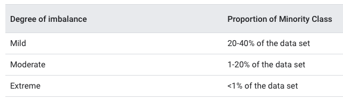

Splitting methods suited for datasets containing class imbalance should be considered. Let's consider a #Tidytuesday dataset on [Himalayan expedition members](https://github.com/rfordatascience/tidytuesday/blob/master/data/2020/2020-09-22/readme.md), which Julia Silge recently explored [here](https://juliasilge.com/blog/himalayan-climbing/) using **{tidymodels}**. 

```{r skim-05, message=FALSE}
library(tidyverse)
library(skimr)
members <- read_csv("https://raw.githubusercontent.com/rfordatascience/tidytuesday/master/data/2020/2020-09-22/members.csv") 

skim(members)
```

Let's say we were interested in predicting the likelihood of survival or death for an expedition member. It would be a good idea to check for class imbalance: 

```{r janitor-05, message=FALSE}
library(janitor)

members %>% 
  tabyl(died) %>% 
  adorn_totals("row")
```

We can see that nearly 99% of people survive their expedition. This dataset would be ripe for a sampling technique adept at handling such extreme class imbalance. This technique is called *stratified sampling*, in which "the training/test split is conducted separately within each class and then these subsamples are combined into the overall training and test set". Operationally, this is done by using the `strata` argument inside `initial_split()`:

```{r more-split-05}
set.seed(123)
members_split <- initial_split(members, prop = 0.80, strata = died)
members_train <- training(members_split)
members_test <- testing(members_split)
```


### Stratified sampling simulation

With simulation we can see the effect of stratification: we expect that the expected value does not change with stratification but the variance is lower.

```{r simulate-stratified}
simulate_stratified_sampling <- function(prop_in_dataset, n_resample = 50,
                                         n_rows = 1000, seed = 45678) {
  set.seed(seed)
  
  data_to_split <- tibble(died = c(
    rep(1, floor(n_rows * prop_in_dataset)),
    rep(0, floor(n_rows * (1 - prop_in_dataset)))
  ))
  
  samples <- map_dfr(seq_len(n_resample), ~{
    initial_split(data_to_split) %>% 
      testing() %>% 
      summarize(died_pct = mean(died))
  }) 
  
  stratified_samples <- map_dfr(seq_len(n_resample), ~{
    initial_split(data_to_split, strata = died) %>% 
      testing() %>% 
      summarize(died_pct = mean(died))
  }) 
  
  rbind(
    samples %>% mutate(stratified = FALSE),
    stratified_samples %>% mutate(stratified = TRUE)
  ) %>% 
    group_by(stratified) %>% 
    summarize(mean = mean(died_pct), var = var(died_pct))
}
```


rsample does not stratify if class imbalance is [more extreme than 10%](https://rsample.tidymodels.org/reference/initial_split.html#arguments) 

```{r stratified-b}
simulate_stratified_sampling(0.09)
```

Stratified sampling happens:

```{r stratified-c}
simulate_stratified_sampling(0.11)
```


## Continuous outcome data 

For continuous outcome data (e.g. costs), a stratified random sampling approach would involve conducting a 80/20 split within each quartile and then pool the results together. For the [Ames housing dataset](https://www.tmwr.org/ames.html), the call would look like this:

```{r more-split-b-05}
set.seed(123)
ames_split <- initial_split(ames, prop = 0.80, strata = Sale_Price)
ames_train <- training(ames_split)
ames_test  <- testing(ames_split)
```

## Time series data 

For time series data where you'd want to allocate data to the training set/test set depending on a sorted order, you can use `initial_time_split()` which works similarly to `initial_split()`. The `prop` argument can be used to specify what proportion of the first part of data should be used as the training set. 

```{r time-train-test-05}
data(drinks)
drinks_split <- initial_time_split(drinks)
train_data <- training(drinks_split)
test_data <- testing(drinks_split)
```

The `lag` argument can specify a lag period to use between the training and test set. This is useful if lagged predictors will be used during training and testing. 

```{r lag-train-test-05}
drinks_lag_split <- initial_time_split(drinks, lag = 12)
train_data_lag <- training(drinks_lag_split)
test_data_lag <- testing(drinks_lag_split)
c(max(train_data_lag$date), min(test_data_lag$date))
```

## Multi-level data 

It's important to figure out what the **independent experimental unit** is in your data. In the Ames dataset, there is one row per house and so houses and their properties are considered to be independent of one another. 

In other datasets, there may be multiple rows per experimental unit (e.g. as in patients who are measured multiple times across time). This has implications for data splitting. To avoid data from the same experimental unit being in both the training and test set, split along the independent experimental units such that X% of experimental units are in the training set. 

Example:

```{r heights-05}
# data source: http://www.bristol.ac.uk/cmm/learning/mmsoftware/data-rev.html#oxboys
child_heights <- read_delim(here::here("data/Oxboys.txt"), col_names = FALSE, delim = " ") %>%
  set_names(c("child_id", "age_norm", "height", "measurement_id", "season"))
head(child_heights)
```

Depending on the modeling problem we may want to split the data to train and test set in a way that data points for children remain together. You can do this with the following code. 

```{r heights-split-05}
child_heights_split <- child_heights %>% 
  group_nest(child_id) %>%
  initial_split()

child_heights_train <- training(child_heights_split) %>% 
  unnest(data)
```

For other task it might be more suitable to split along measurement id and all childrens' last measurement will be the test set.

## What proportion should be used?

```{r tweetrmd, include = F}
library(tweetrmd)
```

```{r split-size-tweet, echo = F}
include_tweet("https://twitter.com/asmae_toumi/status/1356024351720689669?s=20")
```


Some people said the 80/20 split comes from the [Pareto principle/distribution](https://en.wikipedia.org/wiki/Pareto_principle) or the [power law](https://en.wikipedia.org/wiki/Power_law). Some said because it works nicely with 5-fold cross-validation (which we will see in the later chapters). 


I believe the point is to use enough data in the training set to allow for solid parameter estimation but not too much that it hurts performance. 80/20 or 70/30 seems reasonable for most problems at hand, as it's what is widely used. Max Kuhn notes that a test set is almost always a good idea, and it should only be avoided when the data is "pathologically small".


## Summary

Data splitting is an important part of a modeling workflow as it impacts model validity and performance. The most common splitting technique is random splitting. Some data, such as time-series or multi-level data require a different data splitting technique called stratified sampling. The `rsample` package contains many functions that can perform random splitting and stratified splitting. 

We will learn more about how to remedy certain issues such as class imbalance, bias and overfitting in Chapter 10. 
 
### References

- Tidy modeling with R by Max Kuhn and Julia Silge: https://www.tmwr.org/splitting.html
- Feature Engineering and Selection: A Practical Approach for Predictive Models by Max Kuhn and Kjell Johnson: https://bookdown.org/max/FES/
- Handle class imbalance in #TidyTuesday climbing expedition data with tidymodels: https://juliasilge.com/blog/himalayan-climbing/
- Data preparation and feature engineering for machine learning: https://developers.google.com/machine-learning/data-prep/construct/sampling-splitting/imbalanced-data
- How to Build a Machine Learning Model by Chanin Nantasenamat: https://towardsdatascience.com/how-to-build-a-machine-learning-model-439ab8fb3fb1

## Meeting Videos

### Cohort 1

`r knitr::include_url("https://www.youtube.com/embed/Bbv-Ev8E4DE")`

<details>
  <summary> Meeting chat log </summary>
  
  ```
00:09:24	Jon Harmon (jonthegeek):	Oops typo! Tan shouldn't have accepted that!
00:10:05	Tan Ho:	umm
00:10:18	Tyler Grant Smith:	I never take notes, but if I did, I wish I would take them like this
00:10:24	Jon Harmon (jonthegeek):	Certainly can't be MY fault for TYPING it.
00:10:32	Tan Ho:	what typo are we talking about?
00:10:36	Tony ElHabr:	you don't need docs if you got diagrams like this
00:10:43	Jon Harmon (jonthegeek):	"too list training data"
00:10:55	Tan Ho:	also...is "data spending" a hadleyism?
00:10:57	Tyler Grant Smith:	I also object to this order
00:11:11	Jonathan Trattner:	@Jon My professor always gets mad at R for doing what she tells it to instead of what she wants it to do
00:11:12	Jon Harmon (jonthegeek):	I think it's a Maxim. And I like it.
00:11:17	Tyler Grant Smith:	preprocessing needs to be done after the split
00:11:31	Tyler Grant Smith:	some of it does anyway...
00:11:40	Jonathan Trattner:	Does PCA Tyler?
00:11:58	Tyler Grant Smith:	yes, I would say so
00:12:35	Jonathan Trattner:	👍🏼
00:12:47	Jon Harmon (jonthegeek):	We'll talk about processing in the next chapter :)
00:12:56	Tony ElHabr:	pre-processing is done after the splitting in the normal tidy workflow. I guess the diagram was just "wrong"?
00:13:38	Jon Harmon (jonthegeek):	It can make sense to do the processing before splitting if you don't have a nice system like recipes to make sure they're processed the same.
00:14:07	Tyler Grant Smith:	it can make sense to be wrong too :)
00:14:15	Jonathan Trattner:	Also if you can reduce the dimensionality of it before hand, would it not make sense to do that first and split the simpler data?
00:14:29	Jon Harmon (jonthegeek):	The idea is you should treat your test data the same as you'd treat new data.
00:14:54	Jon Harmon (jonthegeek):	If you do it before the split, you might do something that's hard to do or might include it in an ~average, etc, and thus leak into the training data.
00:15:12	Jonathan Trattner:	That makes sense, thanks!
00:15:16	Jarad Jones:	Class imbalance, perfect! I was hoping to go over how to decide between upsampling or downsampling
00:15:39	Jon Harmon (jonthegeek):	We won't do much there yet, he goes into it more in 10 I think.
00:15:59	Jon Harmon (jonthegeek):	But feel free to ask Asmae about it!
00:16:12	Jarad Jones:	Haha, shoot, will have to wait a bit then
00:17:02	Tyler Grant Smith:	question for later:  for what types models is upsampling/downsampling suggested/necessary?  I find in xgboost, for example, that I rarely need to do it.  or at least that it doesn't make the model results any better
00:18:09	Maya Gans:	+1 this question ^^^
00:18:13	Conor Tompkins:	Tabyl is such a useful function
00:18:29	Tyler Grant Smith:	janitor as a whole is fantastic
00:18:45	Jordan Krogmann:	janitor::clean_names() mvp
00:18:56	Jonathan Trattner:	Huge facts ^^
00:18:58	Tyler Grant Smith:	^
00:19:03	Jon Harmon (jonthegeek):	Correction: He briefly mentions upsampling in the next chapter.
00:19:09	arjun paudel:	is it prob or prop? I thought the argument for initial_split was prop
00:19:25	Scott Nestler:	Yes!  We recently did a "Blue Collar Data Wrangling" class with coverage of janitor and plumber.
00:19:29	Tony ElHabr:	the upsampling/downsampling question is a good one. I think frameworks that use boosting/bagging may not need it, but it's always worth testing
00:20:07	Tony ElHabr:	the downside is not using stratification
00:20:36	Tan Ho:	always log, always stratify
00:20:37	Tan Ho:	got it
00:22:14	Tan Ho:	*looks around nervously*
00:22:51	Jordan Krogmann:	I mean youre not going to not log
00:23:12	Jordan Krogmann:	*waiting for the number of counter articles*
00:24:00	Jon Harmon (jonthegeek):	Woot, I have a PR accepted in this book now (for a minor typo at the end of this chapter) :)
00:24:01	Tyler Grant Smith:	I gotta imagine that stratified sampling and random sampling converge as n->inf
00:24:23	Tony ElHabr:	law of large numbers
00:24:25	Tyler Grant Smith:	and it happens probably pretty quickly
00:24:43	Jon Harmon (jonthegeek):	Yeah, I guess a downside would be if you stratify so much that it doesn't make sense and causes rsample to complain.
00:25:12	Jon Harmon (jonthegeek):	There's a minor change starting next chapter, not yet merged: https://github.com/tidymodels/TMwR/pull/106/files
00:27:55	Tyler Grant Smith:	i frequently work with data like this
00:28:18	Conor Tompkins:	It would be interesting to have a table of model types and how they react to things like missingness, class imbalance, one-hot encoding etc. so you can choose the appropriate model for the specific weirdness of your data.
00:28:36	Tony ElHabr:	so at what point do you use longitudinal model over something else
00:29:31	Jordan Krogmann:	student re-enrollment cycle... how does the last term impact future terms
00:31:14	Tony ElHabr:	memes in the wild
00:31:17	Tony ElHabr:	i'm here for it
00:31:20	Jon Harmon (jonthegeek):	Yup! And there's a whole thing about the fact that each question a student answers technically influences the next one, even if they don't get feedback.
00:32:57	Scott Nestler:	I recall learning (many years ago) about using 3 sets -- Training, Test, and Validation.  Training to train/build models, Validation to assess the performance of different (types of) models on data not used to train them, and then Test to fine-tune model parameters once you have picked one.  The splits were usually something like 70/15/15 or 80/10/10.  This didn't seem to be discussed in this chapter.  Any idea why?
00:33:37	Jon Harmon (jonthegeek):	We'll talk about validation later, I think. There's a minute of it. Gonna talk about this out loud in a sec...
00:34:43	Tyler Grant Smith:	5.3 What about a validation set?
00:35:49	Tony ElHabr:	If you do cross-validation, the CV eval metric is effectively your validation
00:35:50	Jonathan Trattner:	What about cross-validation on the training set? Is that different than what we’re discussing now?
00:35:53	Tony ElHabr:	and your training
00:36:10	Tyler Grant Smith:	ya...split first train-validate and test   and then split train-validate into train and validate
00:36:42	Jarad Jones:	I think cross-validation is used during model training on the training set
00:37:08	Ben Gramza:	I actually watched a "deep-learning" lecture on this today. The guy said that a validation set is used to select your parameters/hyperparameters, then you test your tuned model on the test set. 
00:40:11	Tony ElHabr:	validation makes more sense when you're comparing multiple model frameworks too. the best one on the validation set is what is ultimately used for the test set
00:41:45	Jordan Krogmann:	i think it comes into play when you are hyperparameter tuning for a single model
00:44:21	Ben Gramza:	yeah, for example if you are using a K-nearest neighbor model, you use the validation set on your models with K=1, 2, 3, … . You select the best performing K from the validation set, then test that on the test set. 
00:46:22	Joe Sydlowski:	Good question!
00:46:28	Jordan Krogmann:	i do it on all of it
00:46:45	Jordan Krogmann:	annnnnnnnnnd i am probably in the wrong lol
00:50:20	Jordan Krogmann:	yuup otherwise you will cause leakage
00:57:41	Tyler Grant Smith:	i suppose I need to add inviolate to my day-to-day vernacular
00:58:52	Jon Harmon (jonthegeek):	I'm noticing myself say that over and over and I don't know why!
00:59:50	Tony ElHabr:	i had to google that
01:05:17	Conor Tompkins:	Great job asmae!
01:05:22	Jonathan Trattner:	^^^
01:05:28	Tony ElHabr:	Pavitra getting ready for recipes
01:05:37	Jordan Krogmann:	great job!
01:05:42	Joe Sydlowski:	Thanks Asmae!
01:05:46	Andy Farina:	That was great Asmae, thank you!
01:05:47	Pavitra Chakravarty:	🤣🤣🤣🤣
01:05:56	caroline:	Thank you Asmae :)
01:05:59	Pavitra Chakravarty:	great presentation Asmae
```
</details>

### Cohort 2

`r knitr::include_url("https://www.youtube.com/embed/GnNMkKxidl4")`

<details>
  <summary> Meeting chat log </summary>
  
  ```
00:07:17	Janita Botha:	Sorry I'm late... Been slow booting up...
00:08:46	Amélie Gourdon-Kanhukamwe (she/they):	https://supervised-ml-course.netlify.app/
00:08:58	shamsuddeen:	Thank you
00:09:07	Stephen Holsenbeck:	thanks!
00:22:06	Janita Botha:	Just a side warren... I find the focus on testing vs training data in tidymodels very frustrating since the field that I am in focusses more on inferential statistics because we tend to have relatively small sample sizes for the large amount of variance we encounter
00:22:52	Janita Botha:	In other words in my field my data is ususally better "spent" as traininig data...
00:38:09	Louis Carlo Medina:	Thanks Rahul! yeah, I think I conflated oversampling with strata. I think I remember the strata now, where you actually sample within groups as opposed to the group as a whole.
00:38:29	shamsuddeen:	Yes, !
00:41:00	rahul bahadur:	No worries.
00:42:26	Mikhael Manurung:	It should be random regardless whether strata is specified or not
00:43:00	rahul bahadur:	For stratified random sampling, the strata are created first and then random samples are taken from it
00:43:31	shamsuddeen:	Why don’t we stratified all the time?
00:44:14	rahul bahadur:	it is not needed when the data is balanced. However, you can
00:44:16	shamsuddeen:	The book says: “There is very little downside to using stratified sampling. “
00:44:40	shamsuddeen:	Ah, I see.  Stratified is for imbalance data
00:44:52	shamsuddeen:	Thanks raul.
00:45:01	Stephen Holsenbeck:	stratification should basically be the default
00:45:06	shamsuddeen:	*rahul
00:45:36	Stephen Holsenbeck:	If you go completely random, your classes in the test set may not match the category distributions in the dataset
00:45:45	August:	https://otexts.com/fpp2/accuracy.html
00:45:48	Stephen Holsenbeck:	same with the training set
00:46:02	August:	this is a good diagram for time series cross validation
00:46:34	August:	Training test at top of section
00:46:46	Janita Botha:	@Amelie that is a really good question - you should add that to the questions for Julia and Max
00:47:11	Louis Carlo Medina:	^+1. Hyndman et al's texts for timeseries stuff are really good
00:47:43	rahul bahadur:	Yes, Hyndman has good timeseries
00:49:43	shamsuddeen:	From the book.
00:49:44	shamsuddeen:	Too much data in the training set lowers the quality of the performance estimates.
00:49:52	shamsuddeen:	too much data in the test set handicaps the model’s ability to find appropriate parameter estimates.
00:50:14	shamsuddeen:	What is difference between performance estimates and parameter estimates.?
00:51:26	Janita Botha:	https://otexts.com/fpp3/
00:51:35	rahul bahadur:	Parameter estimates, in case of regression for example, would be the beta estimates
00:51:38	Amélie Gourdon-Kanhukamwe (she/they):	Performance estimates = grossly statistics assessing the quality of the model, such as MSE, percentage correct, area under the curve
00:51:45	rahul bahadur:	Performance estimates = MSE
00:51:47	Amélie Gourdon-Kanhukamwe (she/they):	And yes, as Rahul
00:52:08	Janita Botha:	I shared the link above
00:52:13	Kevin Kent:	Modeltime - https://cran.r-project.org/web/packages/modeltime/vignettes/getting-started-with-modeltime.html
00:52:32	Amélie Gourdon-Kanhukamwe (she/they):	Thanks Janitha
00:55:56	Kevin Kent:	https://physionet.org/
00:59:34	Amélie Gourdon-Kanhukamwe (she/they):	https://cran.r-project.org/web/packages/anomalize/vignettes/anomalize_quick_start_guide.html
00:59:38	August:	https://cran.r-project.org/web/packages/anomalize/anomalize.pdf
00:59:58	August:	https://cran.r-project.org/web/packages/anomalize/vignettes/anomalize_methods.html
```
</details>

### Cohort 3

`r knitr::include_url("https://www.youtube.com/embed/Dxf3kgIkbpI")`

<details>
  <summary> Meeting chat log </summary>
  
```
00:23:04	Daniel Chen (he/him):	I don't know why it's 10%
00:23:23	Daniel Chen (he/him):	it seems like a good heuristic?
00:29:33	Daniel Chen (he/him):	(Strata below 10% of the total are pooled together.)
00:54:00	Ildiko Czeller:	https://spatialsample.tidymodels.org/reference/spatialsample.html
```
</details>


<!--chapter:end:05-spending_our_data.Rmd-->

# Feature engineering with recipes

**Learning objectives:**

- Define **feature engineering.**
- List **reasons** that feature engineering might be **beneficial.**
- Use the {recipes} package to **create a simple feature engineering recipe.**
- Use selectors from the {recipes} package to **apply transformations to specific types of columns.**
- List some **advantages of using a recipe** for feature engineering.
- Describe **what happens when a recipe is prepared** with `recipes::prep()`.
- Use `recipes::bake()` to **process a dataset.**
- Recognize how to use `recipes::step_unknown()`, `recipes::step_novel()`, `recipes::step_other()` to **prepare factor variables.**
- Explain how `recipes::step_dummy()` **encodes qualitative data in a numeric format.**
- Recognize techniques for dealing with large numbers of categories, such as feature hashing or encoding using the {embed} package (as described in [this talk by Alan Feder at rstudio::global(2021)](https://rstudio.com/resources/rstudioglobal-2021/categorical-embeddings-new-ways-to-simplify-complex-data/)).
- Recognize methods for **encoding ordered factors.**
- Use `recipes::step_interact()` to add **interaction terms** to a recipe.
- Understand why **some steps might only be applicable to training data.**
- Recognize the **functions from `{recipes}` and `{themis}`** that are **only applied to training data** by default.
- Recognize that `{recipes}` includes functions for **creating spline terms,** such as `step_ns()`.
- Recognize that `{recipes}` includes functions for **feature extraction,** such as `step_pca()`.
- Use `themis::step_downsample()` to **downsample** data.
- Recognize other **row-sampling steps** from the `{recipes}` package.
- Use `recipes::step_mutate()` and `recipes::step_mutate_at()` for general `{dplyr}`-like transformations.
- Recall that the `{textrecipes}` package exists for **text-specific feature-engineering steps.**
- Understand that the functions of the `{recipes}` package **use training data** for all preprocessing and feature engineering steps to prevent leakage.
- Use `{recipes}` to **prepare data for traditional modeling functions.**
- Use `tidy()` to **examine a recipe** and its steps.
- Refer to columns with **roles** other than `"predictor"` or `"outcome"`.

## Meeting Videos

### Cohort 1

`r knitr::include_url("https://www.youtube.com/embed/KmLKhIBrQPk")`

<details>
  <summary> Meeting chat log </summary>
  
  ```
00:06:28	Tyler Grant Smith:	getting kind of scruffy jon
00:07:22	Jim Gruman:	{purr}
00:07:37	Jim Gruman:	{purrr}
00:18:31	Tony ElHabr:	is this thing on?
00:18:39	Jonathan Trattner:	The chat?
00:18:43	Jon Harmon (jonthegeek):	I know, it's so quiet over here!
00:19:05	Tony ElHabr:	quiet chat is making me nervous
00:19:27	Jonathan Trattner:	I’ll make some noise
00:19:38	Jonathan Trattner:	🔈
00:20:06	Tyler Grant Smith:	it would be good (in the bookdown) to have a comparison of stratified vs non-stratified sampling for this example.  with a comparison of the distributions
00:20:07	Tony ElHabr:	ugh I read chapter 7
00:21:38	Asmae Toumi:	Wait what does all_nominal do, missed it
00:21:51	Jon Harmon (jonthegeek):	Selects all columns that... what she's saying :D
00:21:54	Asmae Toumi:	Oh ok nvmd
00:22:30	yonis:	We basically we to make to create a design matrix for the regression
00:22:40	Joe Sydlowski:	For clarity to Jon's answer it won't include numeric vars, right?
00:22:52	Tony ElHabr:	right
00:23:06	Jon Harmon (jonthegeek):	all_numeric() is its counterpart
00:23:59	Conor Tompkins:	step_dummy() drops the reference level, I think
00:24:46	yonis:	That is tricky. the reference level isn’t lined up with how base r is defined so you need to be careful with that
00:25:47	yonis:	I ran a logistic regression and got into all kinds of trouble with how recipe was defining the ref level
00:27:11	arjun paudel:	does it not set the reference level based on order of factor levels? that was my understanding
00:27:29	arjun paudel:	if you want a specific level as you reference, you reorder your factor
00:27:49	Conor Tompkins:	That is my understanding as well Arjun
00:29:17	Conor Tompkins:	I use step_relevel to set the reference level
00:30:15	yonis:	https://recipes.tidymodels.org/reference/step_relevel.html
00:30:20	Tyler Grant Smith:	why are the counts almost monotonic, but not monotonic?
00:31:42	Conor Tompkins:	This is a great table to show this
00:35:44	Scott Nestler:	I don't follow the mention of one-hot encoding in the book. Why would you use that instead of binary encoding like was just shown here.
00:36:37	Asmae Toumi:	I say Tilda, is that right?
00:38:01	Tony ElHabr:	one-hot: like removing the intercept term in your regression with a univariate categorical variable. so you get coefficients for each term
00:38:16	Conor Tompkins:	The winner of the big data bowl determines the pronunciation, I think
00:38:27	Asmae Toumi:	Lmaooooooo
00:38:32	Tan Ho:	asmae v tony, fightttt
00:38:53	Joe Sydlowski:	The benefit of one hot encoding is that you don't need to know (or explain) what the reference variable is when interpreting the coefficients. Not ever model can use one hot encoding though
00:39:04	Scott Nestler:	@ Tony: But wouldn't that create the linear dependency problem as is discussed in the text?
00:39:35	Scott Nestler:	Thanks, Joe.  Got it.  That makes sense.
00:40:26	Tony ElHabr:	i think you're right about that Scott. or maybe my analogy was just bad
00:41:06	Conor Tompkins:	Are there best practices for determining the appropriate reference level? I typically use the most common level
00:42:39	Scott Nestler:	ICA is my favorite type of feature extraction to use.  Makes use of higher-level moments than PCA, resulting in components that are truly statistically independent, not just uncorrelated.
00:43:04	arjun paudel:	@Conor, what level you want as reference is entirely based on context of the problem, I don't think one standard way of determining the reference level would make sense
00:43:37	Asmae Toumi:	conor I pick mine in a way that makes interpretation easier for ppl who digest the findings
00:44:05	Scott Nestler:	Agree with Arjun and Asmae; it depends on the variable and ease of interpretation.
00:44:16	Tony ElHabr:	any kind of thought put into reference level is probably better than alphabetical imo
00:44:55	Tony ElHabr:	Scott, do you have a good reference on ICA?
00:45:57	Jordan Krogmann:	Has anyone had to create the "bake" function in sql?  Let me tell you it's less than fun for new records hitting your model...
00:46:12	Scott Nestler:	Book by Hyvarinen, Karhunen, Oja is one standard.  Book by Stone is more approachable.  I have a presentation on it that I developed too.  Happy to share.
00:46:25	Daniel Chen:	how is the recipie object implemented? is it a dataframe with an attribute table that defines whether or not a variable is a predictor or response?
00:47:22	Jon Harmon (jonthegeek):	There's a tibble in there, but it has a lot going on. I... can't remember details, it's been a bit since I dug into it.
00:48:47	Daniel Chen:	s3 objects are just lists with an attr defined, right?
00:50:16	Jon Harmon (jonthegeek):	They're not necessarily lists.
00:50:33	Tony ElHabr:	attributes are the magic to S3
00:50:48	Tony ElHabr:	but right, not necessarily lists
00:50:49	Tan Ho:	deep, dark magic
00:50:52	Jon Harmon (jonthegeek):	If I remember right, recipes are lots o' attributes.
00:50:56	Tyler Grant Smith:	sounds like someone wants to write dbrecipes
00:51:04	Tony ElHabr:	sounds like ETL
00:51:15	Asmae Toumi:	dbrecipes omg
00:51:46	Conor Tompkins:	Luv 2 engineer data
00:51:53	Tan Ho:	"do all the work for you" eh
00:52:35	arjun paudel:	hahaa
00:52:56	arjun paudel:	i meant you don't have to prep or bake it yourself
00:53:13	Jordan Krogmann:	lol, I guess I was looking for a reason to lose sleep @tyler
00:53:28	Tony ElHabr:	step_drop_table in dbrecipes could be disastrous
00:54:46	Conor Tompkins:	step_rm_rf
00:54:49	Tony ElHabr:	tidymodels before workflows was an experience
00:55:14	Tan Ho:	it's superseded by bake NULL
00:55:49	Tony ElHabr:	every time i typed juice() i felt disgusting
00:56:00	Asmae Toumi:	lmfao
00:56:29	Conor Tompkins:	Workflow feels like the %>% for tidymodels
00:58:17	Asmae Toumi:	hahahahahahah
00:58:36	Tyler Grant Smith:	no congrats for tan
00:58:39	Tony ElHabr:	thanks y'all
00:59:03	Jordan Krogmann:	Thanks pavitra!
00:59:06	Jordan Krogmann:	great job
00:59:10	Daniel Chen:	my prelims are next week xDDD
00:59:14	Asmae Toumi:	I made parsnip puree this weekend it was sooooooooooo good, so much better than mashed potatoes
00:59:24	Tony ElHabr:	tony, tan, tyler, t-rex
00:59:26	Tony ElHabr:	all the same
00:59:47	Asmae Toumi:	Jordan should go since he’s gonna be busy soon writing dbrecipes
01:00:48	Asmae Toumi:	YESSSSSSSSSSSSSSSSS
01:00:54	Asmae Toumi:	My impact!!!!!
01:01:15	Jordan Krogmann:	lol thanks a lot Asmae!
01:01:45	Tony ElHabr:	thanks so much Pavitra!
01:01:50	Tony ElHabr:	great presentation
01:01:54	Jonathan Trattner:	Great job Pavitra!
01:02:00	Conor Tompkins:	Thanks Pavitra!
01:02:00	Andrew G. Farina:	Thank you Pavitra, that was a busy chapter!
01:02:09	Jonathan Trattner:	I’ll deff be asking about prep and bake again (:
01:03:11	Scott Nestler:	I'm surprised that "mise en place" didn't make an appearance in this chapter.
01:03:12	Jonathan Trattner:	I’ll play with it a little bit but thanks!
01:04:48	Daniel Chen:	it'll be less weird when we get to workflow
01:05:09	Jonathan Trattner:	Thank you!
01:06:40	Jordan Krogmann:	Thanks gonna drop guys, it's been great!
```
</details>

### Cohort 2

`r knitr::include_url("https://www.youtube.com/embed/72A9yfMSCq0")`

<details>
  <summary> Meeting chat log </summary>
  
  ```
00:18:37	Kevin Kent:	I found out the other day that you can group tabs in chrome
00:18:51	shamsuddeen:	yes
00:18:57	Stephen Holsenbeck:	yes! such a great new feature, I love it
00:18:59	Luke Shaw:	Yes Kevin! I'm a big fan
00:19:10	shamsuddeen:	Now, feature comes in today in Chrome
00:19:12	Kevin Kent:	https://blog.google/products/chrome/manage-tabs-with-google-chrome/
00:19:37	Amélie Gourdon-Kanhukamwe (she/they):	Ah, me too just last week, which means I feel even less bad running dozens at a time!
00:20:21	shamsuddeen:	All tab, are automatically group in dropdown. Only available in Chrome Beta. - :)
00:20:30	shamsuddeen:	Released this feature today
00:20:53	Layla Bouzoubaa:	👀
00:30:20	Layla Bouzoubaa:	https://recipes.tidymodels.org/reference/step_YeoJohnson.html
00:32:00	Amélie Gourdon-Kanhukamwe (she/they):	Discretization is reducing numerical variables into ordinal ones, with equal width or equal frequency of bins. My understanding is equal width is preferred.
00:33:38	Amélie Gourdon-Kanhukamwe (she/they):	And that would be because some techniques don't cope would be fully continuous variables, for example Naïve Bayes (as per my understanding after learning machine learning with Weka).
00:34:16	Luke Shaw:	interesting, thanks :)
00:34:18	Stephen - Computer - No Mic:	Interesting, thank you Amelie
00:39:13	Luke Shaw:	I love janitor::clean_names() for fixing that kind of thing
00:39:57	Luke Shaw:	hmmmm there must be a way I agree!
00:40:45	Stephen - Computer - No Mic:	mutate(data, col = gsub("\\+", col, "p"))
00:41:11	Stephen - Computer - No Mic:	or mutate(data, col = stringr::str_replace(col, "\\+", "p"))
00:42:01	Amélie Gourdon-Kanhukamwe (she/they):	Actually, I retract the part about Naïve Bayes *needing* discretization, sorry. Can't name with certainty a classifier that needs discretizing specifically for now, but it is believed to help performance (it didn't much on my only project playing with ML).
00:42:04	Kevin Kent:	One gotcha I’ve come across with making dummy variables or one-hot encoding is that the test set has levels of a dummified variable that the train set didn’t have. Argument for having or other methods I think
00:42:20	Kevin Kent:	*sometimes has
00:43:13	Kevin Kent:	**hashing or other methods
00:43:32	Amélie Gourdon-Kanhukamwe (she/they):	But see eg: https://link.springer.com/content/pdf/10.1007/s10994-008-5083-5.pdf
00:52:38	Amélie Gourdon-Kanhukamwe (she/they):	What if you do this Layla? simple_ames$var_info
00:52:57	Stephen - Computer - No Mic:	Hey shamsuddeen,

I didn't get any issue using the pipe:
recipe(Sale_Price ~ Neighborhood + Gr_Liv_Area + Year_Built + Bldg_Type,
       data = ames_train) %>%
  step_log(Gr_Liv_Area, base = 10) %>% 
  step_dummy(all_nominal()) %>% 
  prep(training = ames_train)
00:53:00	Amélie Gourdon-Kanhukamwe (she/they):	Only if you want to see the list of var?
00:53:22	Stephen - Computer - No Mic:	The prep function takes the recipe as it's first argument
00:53:38	Stephen - Computer - No Mic:	So piping it in to the first argument (as is default with a piple) works fine
00:55:07	shamsuddeen:	Ok, thank you for looking at this. Below is an example that does not works.
00:55:12	shamsuddeen:	simple_ames <- ames_train %>% 
  recipe(Sale_Price ~ Neighborhood + Gr_Liv_Area + Year_Built + Bldg_Type) %>%
  step_log(Gr_Liv_Area, base = 10) %>% 
  step_dummy(all_nominal())
00:55:19	shamsuddeen:	The above works
00:55:35	Stephen - Computer - No Mic:	Yes
00:55:41	shamsuddeen:	The one below does not works
00:55:42	shamsuddeen:	simple_ames <- ames_train %>% 
            prep(simple_ames)
00:56:19	Stephen - Computer - No Mic:	Yeah, simple_ames has not been created yet
00:56:27	Stephen - Computer - No Mic:	You're assigned it in the step
00:56:32	Stephen - Computer - No Mic:	So it can't be used in the step
00:56:40	Stephen - Computer - No Mic:	You've*
00:57:19	Stephen - Computer - No Mic:	The variable simple_ames must exist in the environment by assignment before it can be used in code
00:57:48	shamsuddeen:	But I call them in series
00:57:53	shamsuddeen:	Like below
00:57:58	shamsuddeen:	simple_ames <- ames_train %>% 
  recipe(Sale_Price ~ Neighborhood + Gr_Liv_Area + Year_Built + Bldg_Type) %>%
  step_log(Gr_Liv_Area, base = 10) %>% 
  step_dummy(all_nominal())
00:58:03	shamsuddeen:	simple_ames <- ames_train %>% 
            prep(simple_ames)
00:58:10	Stephen - Computer - No Mic:	Ok
00:58:20	Stephen - Computer - No Mic:	So you're passing in simple_ames as the recipe for prep
00:58:21	shamsuddeen:	The Ames has been created in the first place
00:58:26	Stephen - Computer - No Mic:	So to make that work:
00:58:53	Stephen - Computer - No Mic:	simple_ames <- ames_train %>% 
            {prep(simple_ames, training = .)}
00:59:08	Stephen - Computer - No Mic:	The ames_train data has to be the second argument
00:59:22	Stephen - Computer - No Mic:	So you have to use the brackets and the . to pipe it into that second spot
00:59:29	shamsuddeen:	Yay…it works
00:59:39	shamsuddeen:	Thanks
01:00:10	shamsuddeen:	But, why in recipe we use not this format?
01:00:33	Stephen - Computer - No Mic:	It's just the order of arguments, one moment I'll see if I can find an article on it
01:01:49	Luke Shaw:	Harking back to a previous Q by Layla on name_repair error for the values in a column, I think the function janitor::make_clean_names(col) should do it - cleans the values of the column inputted
01:02:10	shamsuddeen:	Yea, janitor can do that
01:02:27	Stephen - Computer - No Mic:	shamsuddeen:
https://magrittr.tidyverse.org/#the-argument-placeholder
01:02:33	shamsuddeen:	Today session is full of questions -:)
01:02:49	Stephen - Computer - No Mic:	And this: 
https://thatdatatho.com/tutorial-about-magrittrs-pipe-operator-and-placeholders/
01:03:22	Kevin Kent:	This fits with my mental model but not what we saw in august’s session https://stackoverflow.com/questions/62189885/what-is-the-difference-among-prep-bake-juice-in-the-r-package-recipes
01:08:14	Stephen - Computer - No Mic:	This is really helpful 👆
01:08:41	shamsuddeen:	Yes,  it makes much much sense
01:09:45	Kevin Kent:	People often forgot about the role of domain expertise in feature engineering. I’ve found that it helps prediction a lot and you come up with features that you or an algorithm would have never considered.
01:10:03	Layla Bouzoubaa:	Thanks, Luke!!
01:10:12	Kevin Kent:	Especially when you have a large number of possible data sets and features
01:11:04	Stephen - Computer - No Mic:	Definitely
01:13:09	Luke Shaw:	Would step_other cope better with the gotcha Kevin mentioned before? Of a value in test not seen in train
01:13:24	Janita Botha:	Yes we can keep gping!
01:14:05	Kevin Kent:	I think as long as the new level isn’t in the top n in the test set @luke
01:15:15	Kevin Kent:	The model I was using just outputted it as a warning but I think the consequence is that it kind of ignored that new level, which isn’t ideal
01:15:39	Luke Shaw:	Ah yeah that makes sense, thanks :) In that scenario I guess it a fairly big problem that something common in test data was never seen in train
01:16:14	Kevin Kent:	yeah. and particularly challenging with categorical data…but I think embeddings might be the best way to address that for categorical data
01:19:25	Luke Shaw:	Thanks August! :)
01:19:38	shamsuddeen:	Thanks August
01:20:02	Kevin Kent:	Thanks! Great discussion and presentatio
01:20:05	Kevin Kent:	*presentation
01:22:54	Janita Botha:	Lol
01:22:59	Janita Botha:	We call iy autumn
01:23:00	Layla Bouzoubaa:	Thanks everyone!
```
</details>

### Cohort 3

`r knitr::include_url("https://www.youtube.com/embed/wSLqq89_utQ")`

<details>
  <summary> Meeting chat log </summary>
  
```
00:30:17	Toryn Schafer (she/her):	It says on the juice help page that it is superseded by bake
00:30:47	Ildiko Czeller:	https://recipes.tidymodels.org/articles/Ordering.html
00:51:31	Ildiko Czeller:	step_pca(matches("(SF$)|(Gr_Liv)"), num_comp = 2)
00:52:01	jiwan:	https://juliasilge.com/blog/best-hip-hop/ Julia Silge has a nice blog post on PCA
01:01:52	jiwan:	?step_normalize(
```
</details>

<!--chapter:end:06-feature_engineering_with_recipes.Rmd-->

# AI Ethics {-}

Cohort 2 had a discussion of AI Ethics at this point in the club.

## Meeting Videos

### Cohort 2

`r knitr::include_url("https://www.youtube.com/embed/DDCpyJ_ibic")`

<details>
  <summary> Meeting chat log </summary>
  
  ```
00:04:27	Luke Shaw:	Hey all :) My internet is a bit unstable so will be off-video
00:17:45	Amélie Gourdon-Kanhukamwe:	If you have not seen it, Coded Bias is now available to stream, at least in the US, possibly in the UK too: https://www.codedbias.com/ (feaures Joy Buolamwini and many others, Klein too - Data Feminism).
00:18:45	Stephen Holsenbeck:	🌟🙏 awesome! thank you for the recommendation!
00:20:34	Amélie Gourdon-Kanhukamwe:	That paper for example found exactly what Kevin is describing, classifying on gender although it was not in the data, because of underlying relationships: https://arxiv.org/abs/2004.07173
00:21:10	rahul bahadur:	To add to @Kevin's point Apple Card's algo had the problem of providing lower credit limits to women. In their defense they didn't include 'sex' in their model. But, the effects were latent in other variables.
00:21:40	Amélie Gourdon-Kanhukamwe:	👆🏻
00:23:24	Layla Bouzoubaa:	🤘🏼
00:32:27	Amélie Gourdon-Kanhukamwe:	Thanks Shamsuddeen, Timnit Gebru is someone I enjoy the critical and ethical perspective of, so that looks great!
00:33:37	Kevin Kent:	Should Layla or Luke share next?
00:33:53	Layla Bouzoubaa:	Oh sorry, I just went ahead
00:33:59	Layla Bouzoubaa:	Luke did I just cut you lol
00:34:02	Kevin Kent:	Haha oh that’s what I thought would happen
00:34:09	Amélie Gourdon-Kanhukamwe:	Left is a euphemism Shamsuddeen :-)
00:34:29	Layla Bouzoubaa:	:)
00:34:30	Kevin Kent:	No worries, cool. Thanks! Just didn’t want to take up the whole time
00:34:30	Luke Shaw:	You didn't cut me out :)
00:35:03	Kevin Kent:	brb
00:36:28	Kevin Kent:	back
00:39:29	shamsuddeen:	can we synthetic data to closed any representation bias?
00:39:57	Amélie Gourdon-Kanhukamwe:	No worries
00:40:09	Amélie Gourdon-Kanhukamwe:	* Ignore above
00:40:35	Kevin Kent:	I thought this was a such a cool histogram
00:40:54	Kevin Kent:	Images in the binned bars
00:49:09	Kevin Kent:	I loved this simulation - one thing I was thinking of too is that there are long-term costs to biased algorithms and aren’t just about immediate costs and revenue. Like if the company is perceived as being discriminatory, people might boycott the products.
00:49:36	Luke Shaw:	yeah this is cool
00:50:57	Amélie Gourdon-Kanhukamwe (she/they):	I was reading on decolonizing STEM education today, and incidentally found this which is relevant for today's discussion, although I only managed to skim it: https://www.nature.com/articles/d41586-020-00274-3 It does resonate with some of the points in Layla's notes (eg, counterfactuals)
00:51:43	Kevin Kent:	Thanks for sharing!
00:52:03	Amélie Gourdon-Kanhukamwe (she/they):	I llike that it has specific steps.
00:52:11	Kevin Kent:	I’ve also been meaning to read the for the longest time https://www.amazon.com/Weapons-Math-Destruction-Increases-Inequality/dp/0553418815
00:52:56	Amélie Gourdon-Kanhukamwe (she/they):	And "Algorithms of oppression" too (also need to find time for it
00:54:14	Amélie Gourdon-Kanhukamwe (she/they):	https://nyupress.org/9781479837243/algorithms-of-oppression/
00:54:25	Kevin Kent:	👍
00:59:14	Kevin Kent:	I think a lot of these models are trained using Wikipedia as the corpus so you can definitely see how a dataset that is created in a crowdsourced method can have bias in it
00:59:29	Luke Shaw:	I have to go on the hour (a few mins) - really fascinating conversations! We don't need to go the stuff I mentioned - didn't have anything to present just were there for a discussion.
01:01:43	Kevin Kent:	Sorry about that Luke, I kind of lost track of time in my part. But Im definitely going to read your reocmendatio
01:02:18	Luke Shaw:	Thanks for the discussion all, see you next week. Can any recommendations in the slack or google sheets please :D
01:02:55	Stephen Holsenbeck:	Will do, did you have stuff you wanted to present on Data Feminism?
01:04:52	shamsuddeen:	Layla, you working on ethics ?
01:04:58	Janita Botha:	This was awesome!
01:05:06	Amélie Gourdon-Kanhukamwe (she/they):	Just heard of this in relation to white methods: https://www.zedbooks.net/shop/book/decolonizing-methodologies/
01:05:52	Amélie Gourdon-Kanhukamwe (she/they):	Uni of Bristol has a data ethics journal club too, open outside. Will fetch the link.
01:07:29	Kevin Kent:	Depthless is a true auto-antonym
01:07:36	Amélie Gourdon-Kanhukamwe (she/they):	http://www.bristol.ac.uk/golding/events/2021/data-ethics-club---february-3.html
01:07:55	Stephen Holsenbeck:	same
01:08:07	Amélie Gourdon-Kanhukamwe (she/they):	Same same
01:08:19	Stephen Holsenbeck:	share in the slack 🙂
01:08:36	Kevin Kent:	Please :)
01:10:40	Amélie Gourdon-Kanhukamwe (she/they):	Sorry for the plug, but if you have Twitter, I have a critical data science list: https://twitter.com/i/lists/1321784589464068097
01:12:37	Amélie Gourdon-Kanhukamwe (she/they):	Angela Saini's Superior is a good general one on how science can be used in racist ways, for awareness (including the IBM nazi past).
01:12:59	Janita Botha:	Thank you!
01:16:22	rahul bahadur:	Thanks Everyone
01:16:28	Janita Botha:	bye!
```
</details>

<!--chapter:end:06extra-ai_ethics.Rmd-->

# Fitting models with parsnip

**Learning objectives:**

- Identify ways in which **model interfaces can differ.** x
- **Specify a model** in `{parsnip}`. x
- **Fit a model** with `parsnip::fit()` and `parsnip::fit_xy()`. x
- Describe how `{parsnip}` **generalizes model arguments.** x
- Use `broom::tidy()` to **convert model objects to a tidy structure.** x
- Use `dplyr::bind_cols()` and the `predict()` methods from `{parsnip}` to **make tidy predictions. **
- **Find interfaces to other models** in `{parsnip}`-adjacent packages. 

<details>
  <summary> Modeling Map </summary>
  
  

- __Chapter Setup Below__

```{r set-up-07, warning=FALSE, message=FALSE}
# load parsnip, recipes, rsample, broom...
library(tidymodels)
library(AmesHousing)

# attach data
data(ames)

# log scale price
ames <- mutate(ames, Sale_Price = log10(Sale_Price))

# train/test
set.seed(123)
ames_split <- initial_split(ames, prob = 0.80, strata = Sale_Price)
ames_train <- training(ames_split)
ames_test  <-  testing(ames_split)
```  

</details>


<br>

## Create a Model


### Different Model Interfaces

  


<br>

- Model Interfaces
  - Different Implementations = Different Interfaces
  - _Linear Regression_ can be implemented in many ways
    - Ordinary Least Squares
    - Regularized Linear Regression 
    - ...

<br>

- __{stats}__
  - takes formula
  - uses `data.frame`

```{r lm-interface, eval=FALSE}
lm(formula, data, ...)
```

<br>


- __{glmnet}__ 
  - Has x/y interface
  - Uses a matrix

```{r glmnet-interface, eval=FALSE}
glmnet(x = matrix, y = vector, family = "gaussian", ...)
```

<br>
<br>

### Model Specification


- __{tidymodels}/{parsnip}__ - Philosophy is to unify & make interfaces more predictable.
  - Specify model type (e.g. linear regression, random forest ...)
    - `linear_reg()`
    - `rand_forest()`
  - Specify engine (i.e. package implementation of algorithm)
    - `set_engine("some package's implementation")`
  - declare mode (e.g. classification vs linear regression)
    - use this when model can do both classification & regression
    - `set_mode("regression")`
    - `set_mode("classification")`
    
  
<br>

- __Bringing it all together__

```{r model-spec}
lm_model_spec <- 
  linear_reg() %>% # specify model
  set_engine("lm") # set engine


lm_model_spec
```


<br>
<br>


### Model Fitting

From above we will use our existing model specification


<br>

- `fit()`
  - any nominal or categorical variables will be split out into dummy columns
  - _most_ formula methods also turn do the same thing
- `fit_xy`
  - delays creating dummy variable and has underlying model function

```{r model-fit}
# create model fit using formula
lm_form_fit <- 
  lm_model_spec %>% 
  fit(Sale_Price ~ Longitude + Latitude, data = ames_train)


# create model fit using x/y
lm_xy_fit <- 
  lm_model_spec %>% 
  fit_xy(
    x = ames_train %>% select(Longitude, Latitude),
    y = ames_train %>% pull(Sale_Price)
    )

```

<br>
<br>


### Generalized Model Arguments


- Like the varying interfaces, model parameters differ from implementation to implementation
- two level of model arguments
  - __main arguments__ - Parameters aligned with the mathematical vehicle
  - __engine arguments__ - Parameters aligned with the package implementation of the mathematical algorithm


```{r package-param-comparisions, echo=FALSE}
tribble(
 ~argument,     ~ranger,  ~randomForest, ~sparklyr,
  "sampled predictors",    "mtry", "mtry", "feature_subset_strategy",
  "trees",    "num.tress", "ntree", "num_trees",
  "data points to split",    "min.node.size", "nodesize", "min_instances_per_node"
) %>% 
  knitr::kable()
```

<br>

  

```{r parsnip-param-comparisions, echo=FALSE}
tribble(
 ~argument,              ~parsnip,
  "sampled predictors",  "mtry",  
  "trees",               "trees",
  "data points to split","min_n"  
) %>% 
  knitr::kable()
```


<br>


<br>


+ The `translate()` provides the mapping from the parsnips interface to the each individual package's implementation of the algorithm.

```{r model-package-differences}
# stats implementation
linear_reg() %>% 
  set_engine("lm") %>% 
  translate()


# glmnet implementation
linear_reg(penalty = 1) %>% 
  set_engine("glmnet") %>% 
  translate()
```


## Use Model results


Now that we have a fitted model we will need to pull some summary information from it we will use two extremely _fun_ functions from the `{broom}` package to help us out (`tidy()` & `glance()`). 


+ `tidy()` - Has a bunch of versatility, but for our context it can take our model object and return our model coefficients into a nice tibble.

```{r broom-tidy}
broom::tidy(lm_form_fit) %>% 
  knitr::kable()
```

<br>

+ `glance()` - allows us in this context to convert our model's summary statistics into a `tibble`

```{r broom-glance}
broom::glance(lm_form_fit) %>% 
  knitr::kable()
```


## Make Predictions


- __Rules to Live by__: 
  - Returns a tibble
  - Column names are ... erh Predictable
  - Return the same number of rows as are in the data set
    - some predict functions omit observations with `NA` values.  Which is great if that's what you intend, but if you aren't expecting that behavior you would have to find out the hard way.


```{r predict-new-data}
# create example test set
ames_test_small <- ames_test %>% slice(1:5)

# predict on test set
predict(lm_form_fit, new_data = ames_test_small) %>% 
  knitr::kable()
```

<br>

- Combining `bind_cols` with our predict function we can merge our predictions back to the test set.

```{r combine-07}
# add predictions together with actuals
ames_test_small %>%
  select(Sale_Price) %>%
  bind_cols(predict(lm_form_fit, ames_test_small)) %>%
  # Add 95% prediction intervals to the results:
  bind_cols(predict(lm_form_fit, ames_test_small, type = "pred_int")) %>% 
  knitr::kable()
```

## {tidymodels}-Adjacent Packages

- Opinions can be shared, other modeling packages can use the same opinion to replicate a workflow. The `{discrim}`^[Discrim Package [Link](https://github.com/tidymodels/discrim)] package adds a new set of mathematical models to our arsenal of tools.
  - `discrim_flexible()` `%>%` - Mathematical Model or if we are using my terrible analogy the car body
    - `set_engine("earth")` - The package we want to approximate our discriminat analysis

```{r adjacent-packages, warning=FALSE, message=FALSE}
# devtools::install_github("tidymodels/discrim") # to install
# load package
library(discrim)

# create dummy data
parabolic_grid <-
  expand.grid(X1 = seq(-5, 5, length = 100),
              X2 = seq(-5, 5, length = 100))

# fit model from discrim
fda_mod <-
  discrim_flexible(num_terms = 3) %>% 
  set_engine("earth") %>%
  fit(class ~ ., data = parabolic)

# assigning predictions to data frame
parabolic_grid$fda <-
  predict(fda_mod, parabolic_grid, type = "prob")$.pred_Class1

# plotting prediction
library(ggplot2)
ggplot(parabolic, aes(x = X1, y = X2)) +
  geom_point(aes(col = class), alpha = .5) +
  geom_contour(data = parabolic_grid, aes(z = fda), col = "black", breaks = .5) +
  theme_bw() +
  theme(legend.position = "top") +
  coord_equal()
```


## Summary

- __Create a Common Interface__ - All models are comprised of some core components
  - mathematical model
  - engine implementation
  - mode if needed
  - Arguments
    - Main - algorithm specific (trees, mtry, penalty)
    - Engine - Package/Engine specific  (e.g. verbose, num.threads, ...)
- __Predictable Behavior__
  - tibble in, tibble out
  - same number of observations returned for `predict()`

## Meeting Videos

### Cohort 1

`r knitr::include_url("https://www.youtube.com/embed/97VLayRdu-A")`

<details>
  <summary> Meeting chat log </summary>
  
  ```
00:15:40	Tan Ho:	YESSS
00:15:58	Tan Ho:	(@ the drake meme)
00:21:51	Tyler Grant Smith:	space advantage
00:23:32	Asmae :	what's that
00:24:28	Jim Gruman:	http://www.feat.engineering/categorical-trees.html on dummies or no-dummies with trees
00:24:37	Tony ElHabr:	amazing meme
00:24:48	Tony ElHabr:	I am physically applauding
00:25:03	Scott Nestler:	Some additional discussion regarding fit_xy() at tidyverse.org/blog/2019/04/parsnip-internals, related to possible range of mtry variables when you don't know number of predictors before recipe is prepped.
00:25:56	Scott Nestler:	Is there a typo in the book after tables toward end of 7.1 where it talks about common argument names?  It mentions num_n but I think they meant min_n.  What do others think?  Or is num_n actually used?
00:26:30	Conor Tompkins:	Scott I think Jon made a PR to fix that typo
00:26:53	Scott Nestler:	Thx.  I hadn't checked yet.  Just caught it in a quick read right before we started.
00:31:15	Scott Nestler:	There are actually 30 different model types and engines at https://www.tidymodels.org/find/parsnip/ that work with parsnip.
00:43:55	Tony ElHabr:	yay volunteers
00:44:48	Andy Farina:	Thanks Jordan, excellent presentation
```
</details>

### Cohort 3

`r knitr::include_url("https://www.youtube.com/embed/-wG0XrZe00U")`

<details>
  <summary> Meeting chat log </summary>
  
```
00:15:22	Ildiko Czeller:	> linear_reg()
Linear Regression Model Specification (regression)

> linear_reg() %>% set_mode("classification")
Linear Regression Model Specification (classification)
00:17:00	Edgar Zamora:	https://www.tidymodels.org/find/parsnip/
00:22:51	Toryn Schafer (she/her):	model.matrix
00:26:52	Ildiko Czeller:	Hi Daniel! good to see you
00:27:14	Daniel Chen:	hello hello!
00:29:02	Daniel Chen:	I forgot there was an article/help page of all the supported engines
00:30:04	Daniel Chen:	ooh they moved the things around: this is the page to help you find arguments: https://www.tidymodels.org/find/parsnip/
00:30:40	Daniel Chen:	that page has the model/engine parsnip param name and original param name
00:31:03	Ildiko Czeller:	thanks!
00:34:36	Daniel Chen:	you just need to be careful with the column names after `tidy` since they don't always mean the same thing for each model output.

but it makes the column names consistent so you can combine tables
00:45:18	jiwan:	Error in parsnip::rand_forest(verbose = TRUE) : 
  unused argument (verbose = TRUE)
00:45:48	Daniel Chen:	unused arguments usually get ignored. maybe you get a warning?
00:54:29	Daniel Chen:	bye all!
```
</details>

<!--chapter:end:07-fitting_models_with_parsnip.Rmd-->

# A model workflow

**Learning objectives:**

- Explain why a **model workflow** includes preprocessing, fitting, and post-processing.
  - Describe parts of the modeling process that **occur before the model is fit.**
  - Describe parts of the modeling process that **occur after the model is fit.**
- Use the `{workflows}` package to **create a simple workflow.**
  - **Add a model** to a workflow.
  - **Add a formula** to a workflow.
  - **Fit** a workflow.
  - Use a workflow to **predict new data.**
  - **Update** a workflow.
- Use `{recipes}` with `{workflows}`.
  - **Add a recipe** to a workflow.
  - Use `workflows::pull_*()` to **extract objects from fitted workflows.**
- Describe how a workflow that uses a formula decides how to pre-process data.
  - Describe how workflows **using tree-based models** pre-process factor predictors.
  - **Add a special formula** to a workflow with the `formula` argument to `workflows::add_model()`.
- Describe workflow steps that are **not yet included** in `{tidymodels}`.

## Workflows

A single object to wrap the pre-processing and model fitting.


[Link to drawing](https://docs.google.com/drawings/d/1TbasFufN0y2vmj83Gn5u3IUx7Fsov0Ls3_Vqr6ns8FU/edit)

Workflows help you manage fewer objects and call fewer functions to achieve your goal.

## Demonstration

```{r setup-08, message=FALSE}
library(tidyverse)
library(tidymodels)
tidymodels_prefer()
set.seed(123)
```


A previous Tidy Tuesday dataset is used for demonstration. References:

- [Tidy Tuesday description](https://github.com/rfordatascience/tidytuesday/blob/master/data/2020/2020-01-28/readme.md)
- [Data source](https://data.sfgov.org/City-Infrastructure/Street-Tree-List/tkzw-k3nq)

```{r 08_read_sf_trees}
sf_trees <- readr::read_csv('https://raw.githubusercontent.com/rfordatascience/tidytuesday/master/data/2020/2020-01-28/sf_trees.csv')
kableExtra::kable(head(sf_trees, 10)) %>% kableExtra::scroll_box(width = '100%')
```

The goal will be to predict dbh which means diameter at breast height.

### Some data exploration and cleaning

```{r skim_sf_trees}
kableExtra::kable(skimr::skim(sf_trees)) %>% kableExtra::scroll_box(width = '100%')
# DataExplorer::create_report(sf_trees)
```


```{r sf_trees_cleaning}
trees_cleaned <- sf_trees %>%
  rename(diam = dbh, date_planted = date) %>%
  filter(!is.na(diam)) %>%
  filter(!is.na(legal_status)) %>%
  filter(latitude <= 40 & longitude >= -125) %>%
  filter(diam <= 100 & diam > 0) %>%
  filter(site_order >= 0) %>%
  select(-plot_size)

kableExtra::kable(skimr::skim(trees_cleaned)) %>% kableExtra::scroll_box(width = '100%')
```

```{r sf_trees_eda_plots}
ggplot(trees_cleaned, aes(x = diam)) +
  geom_histogram() +
  scale_x_log10()

ggplot(trees_cleaned, aes(x = date_planted, y = diam)) +
  geom_bin2d() +
  geom_smooth()
```

## Modeling with workflows

```{r common_modeling_setup_08}
trees_split <- initial_split(trees_cleaned %>% mutate(diam = log10(diam)), prop = 0.8)
trees_training <- training(trees_split)
trees_testing <- testing(trees_split)
```

```{r sf_trees_first_workflow}
trees_recipe <- recipe(trees_training, diam ~ .) %>%
  update_role(tree_id, address, new_role = "id") %>%
  step_indicate_na(date_planted) %>%
  # really dummy imputation
  step_mutate(date_planted = if_else(!is.na(date_planted), date_planted, as.Date('1950-01-01'))) %>%
  step_other(all_nominal_predictors(), threshold = 0.01) %>%
  step_dummy(all_nominal_predictors())

linear_model_spec <- linear_reg() %>% set_engine("lm")

tree_workflow_lm <- workflow() %>%
  add_model(linear_model_spec) %>%
  add_recipe(trees_recipe)
```

```{r sf_trees_fit_and_examine}
fitted_workflow_lm <- tree_workflow_lm %>% fit(trees_training)

tidy(extract_recipe(fitted_workflow_lm), 3)
tidy(extract_fit_parsnip(fitted_workflow_lm))
```

```{r sf_trees_predict_and_eval}
trees_testing$pred_lm <- predict(fitted_workflow_lm, trees_testing)$.pred

rmse(trees_testing, diam, pred_lm)
```

### Different model, same recipe

```{r sf_trees_rf_predict_and_eval}
rand_forest_spec <- rand_forest(
  mode = 'regression',
  mtry = 3,
  trees = 50,
  min_n = 10
) %>% 
  set_engine('ranger')

tree_workflow_rf <- tree_workflow_lm %>%
  update_model(rand_forest_spec)

fitted_workflow_rf <- tree_workflow_rf %>% fit(trees_training)

trees_testing$pred_rf <- predict(fitted_workflow_rf, trees_testing)$.pred

rmse(trees_testing, diam, pred_lm)
rmse(trees_testing, diam, pred_rf)
```


### Same model, different preprocessing

```{r sf_trees_formula}
formula_predictions <- tree_workflow_lm %>%
  remove_recipe() %>% 
  add_formula(diam ~ is.na(date_planted) + longitude) %>%
  fit(trees_training) %>%
  predict(trees_testing)

rmse_vec(trees_testing$diam, formula_predictions$.pred)
```

## Managing many workflows

```{r managing_many_workflows}
rand_forest_spec <- rand_forest(
  mode = 'regression',
  mtry = 2,
  trees = 25,
  min_n = 10
) %>% 
  set_engine('ranger')
tree_workflows <- workflow_set(
  preproc = list(
    "variables" = workflow_variables(diam, c(longitude, latitude, site_order)),
    "simple_formula" = diam ~ is.na(date_planted) + longitude + latitude,
    "trees_recipe" = trees_recipe
  ),
  models = list(
    "lm" = linear_model_spec,
    "rf" = rand_forest_spec
  )
)

tree_workflows
```

```{r using_workflow_sets}
tree_predictions <- tree_workflows %>%
  rowwise() %>%
  mutate(fitted_wf = list(fit(info$workflow[[1]], trees_training))) %>%
  mutate(pred = list(predict(fitted_wf, trees_testing)))

tree_predictions %>%
  mutate(rmse = rmse_vec(trees_testing$diam, pred$.pred))
```


## Notes

- how the formula is used will depend on the model specification
- If a modeling package uses the formula not only for pre-processing or has a syntax not supported by `model.matrix` you can specify a formula in `add_model`
- Later the `{workflows}` package will contain tools to help with post processing, such as creating hard predictions from class probabilities.


## Meeting Videos

### Cohort 1

`r knitr::include_url("https://www.youtube.com/embed/0vgcdWw3k6E")`

<details>
  <summary> Meeting chat log </summary>
  
  ```
00:13:53	Tyler Grant Smith:	i used skimr today on a dataset with 77 million rows and 200 columns...it took a while
00:14:14	Tan Ho:	The official R soundtrack https://www.youtube.com/watch?v=-9BzWBufH1s
00:14:19	Tyler Grant Smith:	that would have been smart...oh well
00:14:35	Ben Gramza:	https://www.kaggle.com/yamaerenay/spotify-dataset-19212020-160k-tracks
00:16:21	Tony ElHabr:	i'm blind
00:16:31	Asmae Toumi:	pAIN
00:16:42	Jordan Krogmann:	the humanity
00:16:54	Scott Nestler:	I just turned off my Vitamin D sunlamp.
00:17:01	Jordan Krogmann:	coobalt
00:17:03	Jordan Krogmann:	= love
00:17:14	Tony ElHabr:	bad programmers use light mode so they can see their bugs
00:17:15	Tyler Grant Smith:	thanks
00:17:16	Jim Gruman:	monokai
00:17:31	Tan Ho:	correct pane layout tho
00:17:34	Tan Ho:	much appreciate
00:17:37	Asmae Toumi:	Absolutely not
00:17:48	Jim Gruman:	console, upper right...
00:21:20	Jon Harmon (jonthegeek):	Is there actually no chat, or does zoom just not show it to me when I'm late?
00:21:28	Tony ElHabr:	it doesn't show
00:21:29	Tan Ho:	you don't see it if you're late
00:21:40	Jordan Krogmann:	yeah there were some comments up top
00:21:53	Jon Harmon (jonthegeek):	Ok. That's funny, since I can see the full log after the meeting.
00:26:25	Tony ElHabr:	steps like step_meanimpute will only do work on the training data, so you avoid data leakage
00:26:31	Jordan Krogmann:	+1
00:29:57	Asmae Toumi:	I do it with insurance costs a lot because I don’t want to throw out the information in claims with 0$
00:30:58	Asmae Toumi:	My internet is bad but I do use an offset
00:31:30	Jim Gruman:	step_YeoJohnson and step_BoxCox would be better choices
00:32:11	Tyler Grant Smith:	^
00:32:37	Tony ElHabr:	are they always better tho?
00:35:38	Tyler Grant Smith:	well yeo johnson is a generalization og log1p
00:36:22	Tony ElHabr:	ah right. google verifies this is true
00:36:39	Pavitra Chakravarty:	thanks Jon
00:36:41	Tyler Grant Smith:	sure?
00:36:46	Tyler Grant Smith:	no idea me neither
00:42:31	Jordan Krogmann:	tidy is black magic
00:43:40	Tony ElHabr:	how do we feel about super long function names like `pull_workflow_prepped_recipe()`
00:44:39	Jordan Krogmann:	%<>% update_formula() would overwrite it
00:45:28	Conor Tompkins:	Long specific functions are better than “bake” and “juice” IMO
00:45:58	Tony ElHabr:	yeah i agree
00:46:15	Scott Nestler:	Back to the log(0) issue.  Transformations like log(x+c) where c is a positive constant "start value" can work--and can be indicated even when no value of x is zero--but sometimes they destroy linear relationships.
00:46:26	Scott Nestler:	Here's the other method I recall seeing (in Hosmer, Lemeshow, & Sturdivant's Logistic Regression book):   A good solution is to create two variables. One of them equals log(x) when x is nonzero and otherwise is anything; it's convenient to let it default to zero. The other, let's call it zx, is an indicator of whether x is zero: it equals 1 when x=0 and is 0 otherwise.
00:47:31	Scott Nestler:	These terms contribute a sum βlog(x)+β0zx to the estimate. When x>0, zx=0 so the second term drops out leaving just βlog(x). When x=0, "log(x)" has been set to zero while zx=1, leaving just the value β0. Thus, β0 estimates the effect when x=0 and otherwise β is the coefficient of log(x).
00:47:57	Scott Nestler:	Found a reference to it here:  https://stats.stackexchange.com/questions/4831/regression-transforming-variables
00:54:16	Asmae Toumi:	Resampling is my chapter *cracks knuckles*
00:54:28	Asmae Toumi:	nooooope
00:54:39	Scott Nestler:	rf_fit_rs <- 
  rf_wf %>% 
  fit_resamples(folds)
00:55:26	Conor Tompkins:	Right Scott, that will contain the results of the fit
00:55:49	Conor Tompkins:	If you keep the .pred, that is
00:56:20	Jordan Krogmann:	Asmae, time to voluntell someone!
00:56:32	Asmae Toumi:	Let me play the music of my people
00:56:37	Asmae Toumi:	I nominateeeeeeeeeeeeeeee
00:56:40	Tan Ho:	JOE
00:56:41	Asmae Toumi:	JOE
00:56:45	Asmae Toumi:	WE DID IT JOE
00:56:52	Jordan Krogmann:	lol
00:57:10	Asmae Toumi:	https://www.youtube.com/watch?v=dP6_pYYWAT8
00:57:11	Asmae Toumi:	This is the song
00:57:50	Asmae Toumi:	asorry
00:57:51	Asmae Toumi:	https://www.youtube.com/watch?v=-9BzWBufH1s
00:57:52	Jon Harmon (jonthegeek):	https://www.youtube.com/watch?v=-9BzWBufH1s
00:57:53	Asmae Toumi:	THIS IS IT
00:58:52	Jordan Krogmann:	Thanks!
00:59:04	Asmae Toumi:	Goodnight gang
```
</details>

### Cohort 3

`r knitr::include_url("https://www.youtube.com/embed/J29iQXGmw8w")`

<details>
  <summary> Meeting chat log </summary>
  
```
00:06:03	Daniel Chen (he/him):	hello. i'm here. just finishing up stuff before meeting
00:06:44	Ildiko Czeller:	welcome Federica. is this your first tidymodels bookclub?
00:15:21	Federica Gazzelloni:	@Ildiko hello yes, just jumped in. Thanks!
00:16:05	Toryn Schafer (she/her):	Welcome!
00:16:40	Daniel Chen (he/him):	Q: the bake() gives you the data after all those step_() functions from recipies?
00:17:39	Toryn Schafer (she/her):	Yes, I think that’s right, Daniel. From the help page the value of bake() is: “A tibble, matrix, or sparse matrix that may have different columns than the original columns in new_data.”
00:22:45	Daniel Chen (he/him):	what is the response/y variable for this dataset?
00:28:36	Daniel Chen (he/him):	oh I see it's `diam`
00:41:56	Federica Gazzelloni:	@Toryn thanks very interesting
00:45:24	Federica Gazzelloni:	Hello @Daniel 
00:45:37	Daniel Chen (he/him):	so working with workflow_sets still needs you to drop into rowwise? there's no function to fit those models for you?
00:45:49	Daniel Chen (he/him):	hello @Federica!
00:47:27	Toryn Schafer (she/her):	In the book they used map instead of rowwise, but yeah doesn’t seem to be one function: map(info, ~ fit(.x$workflow[[1]], ames_train))
00:54:39	Federica Gazzelloni:	need to go, very good job! see you next time hopefully
01:07:43	Ildiko Czeller:	https://www.tidymodels.org/learn/develop/
01:08:24	Ildiko Czeller:	https://hardhat.tidymodels.org/
01:09:07	Ildiko Czeller:	https://tidymodels.github.io/model-implementation-principles/
```
</details>

<!--chapter:end:08-a_model_workflow.Rmd-->

# Judging model effectiveness

**Learning objectives:**

- Explain why **measures of model fit** to actual data **are important** even for purely inferential models.
- Use `{yardstick}` to compute regression metrics.
  - Recognize `{yardstick}` function output.
  - Create a metric set with `yardstick::metric_set()`.
- Use `{yardstick}` to compute binary classification metrics.
  - Describe the common arguments for `{yardstick}` classification metrics.
  - Visualize a binary classification model fit using `{yardstick}` and `{ggplot2}`.
- Use `{yardstick}` to compute multi-class classification metrics.
  - Extend an explicitly binary metric such as `sensitivity()` to multiple classes using `{yardstick}`.
- Combine `{yardstick}` metrics with `dplyr::group_by()`.
  - Visualize a model fit for different groups using `{yardstick}`, `{dplyr}`, and `{ggplot2}`

## Measures of Model Fit
- Empirical Validation: a quantitative approach for estimating effectiveness
- Focused on how close our predictions come to the observed data
- Optimization of statistical characteristics of the model does not imply that the model fits the data well
- Choice of which metrics to examine can be critical


## Disclaimers
- These examples are to demonstrate metric evaluation not good data science!
- Explore the full set of metrics available through `{yardstick}`
- Talk through use cases for different metrics


## Regression Metrics

Load in the Data
```{r load-ames}
library(tidymodels)
library(glmnet)
library(ranger)
set.seed(1123)
data(ames)

ames <- ames %>%
  mutate(
    under_budget = as.factor(if_else(Sale_Price<=160000,1,0)),
    Sale_Price = log10(Sale_Price))

```

```{r best-models-setup, eval=FALSE}
#Cross-fold validation
ames_folds <- vfold_cv(ames, v = 5)

#Create Recipe
ames_recipe <- 
  recipe(formula = Sale_Price ~ Gr_Liv_Area + Full_Bath + Half_Bath + Lot_Area + Neighborhood + Overall_Cond,
         data = ames) %>%
  step_dummy(all_nominal())

#Set the model and hyperparameters
ames_spec <- 
  linear_reg(penalty = tune(), mixture = tune()) %>% 
  set_mode("regression") %>% 
  set_engine("glmnet")

#Create workflow
ames_workflow <- 
  workflow() %>%
  add_recipe(ames_recipe) %>%
  add_model(ames_spec)

#Create metric set of all regression metrics
ames_tune <-
  tune_grid(
    ames_workflow,
    metrics =
      metric_set(rmse, rsq, rsq_trad, mae, mpe, mape, smape, mase, ccc, rpiq, rpd, huber_loss, huber_loss_pseudo, iic),
    resamples = ames_folds,
    grid = grid_latin_hypercube(penalty(), mixture(), size = 8)
  )

#Pick the best model for each metric and pull out the predictions
best_models <- 
  tibble(
    metric_name = c('rmse', 'rsq', 'rsq_trad', 'mae', 'mpe', 'mape', 'smape', 'mase',
                    'ccc','rpiq', 'rpd', 'huber_loss', 'huber_loss_pseudo', 'iic')) %>% 
  mutate(metric_best = map(metric_name, ~select_best(ames_tune, .x)),
         wf_best = map(metric_best, ~finalize_workflow(ames_workflow, .x)),
         fit_best = map(wf_best, ~fit(.x, data = ames)),
         df_pred = map(fit_best, ~ames %>% bind_cols(predict(.x, new_data = ames)) %>% select(Sale_Price, .pred))) %>%
  select(-c(wf_best, fit_best)) %>% 
  unnest(cols = c(metric_name, metric_best, df_pred))

#Plot!
best_models %>% 
  mutate(metric_desc = factor(
    metric_name, 
    levels = c('rmse', 'rsq', 'rsq_trad', 'mae', 'mpe', 'mape', 'smape', 'mase',
               'ccc','rpiq', 'rpd', 'huber_loss', 'huber_loss_pseudo', 'iic'),
    labels = c('rmse\nwhen you cannot afford\n to have a big error', 
               'rsq\nwhen you want a measure\n of consistency/correlation\n and not accuracy', 
               'rsq_trad\n r-sq not constrained\n between 0 and 1',
               'mae\nwhen large errors are not\n exponentially\n worse than small errors', 
               'mpe\nwhen you want an easy way\n to calculate accuracy', 
               'mape\nwhen you want to use mpe\n with a better\n representation of error', 
               'smape\nwhen you want to use\n mape expressed as a %', 
               'mase\nwhen you need a scale\n independent metric\n for time-series data',
               'ccc\nwhen you want to measure\n the distance from \nperferct linearity',
               'rpiq\nwhen you need a different\n measue of consistency/correlation\n and not accuracy', 
               'rpd\nwhen you need a different\n measue of consistency/correlation\n and not accuracy', 
               'huber_loss\nwhen you need a loss\n function less sensitive to outliers', 
               'huber_loss_pseudo\nwhen you need\n a smoothed version of huber_loss', 
               'iic\nwhen you need an\n alternative to the traditional\n correlation coefficient'))) %>% 
  ggplot(aes(x = Sale_Price, y = .pred)) + 
  geom_abline(lty = 2) + 
  geom_point(alpha = 0.5) + 
  labs(y = "Predicted Sale Price (log10)", x = "Sale Price (log10)") +
  coord_obs_pred() +
  facet_wrap(~metric_desc, ncol = 2) +
  theme_minimal() +
  theme(panel.spacing = unit(2, "lines"),
        strip.text.x = element_text(size = 8))
```


```{r best-models-load, include=FALSE}
best_models <- readRDS(here::here("data", "09-best_models.rds"))
```

```{r best-models}
best_models %>% select(metric_name, penalty, mixture) %>% distinct()
```

## Binary Classification Metrics

Note: This code might take several minutes (or longer) to run.

```{r binary-classification-setup, eval=FALSE}
#Cross-fold validation
ames_folds_binary <- vfold_cv(ames, v = 5)

#Create Recipe
ames_recipe_binary <- 
  recipe(formula = under_budget ~ Gr_Liv_Area + Full_Bath + Half_Bath + Lot_Area + Neighborhood + Overall_Cond,
         data = ames)

#Set the model and hyperparameters
ames_spec_binary <- 
    rand_forest(mtry = tune(), trees = tune(), min_n = tune()) %>% 
  set_mode("classification") %>% 
  set_engine("ranger")

#Create workflow
ames_workflow_binary <- 
  workflow() %>%
  add_recipe(ames_recipe_binary) %>%
  add_model(ames_spec_binary)

#Create metric set of all binary metrics
ames_tune_binary <-
  tune_grid(
    ames_workflow_binary,
    metrics =
      metric_set(sens,spec,recall,precision,mcc,j_index,f_meas,accuracy,
                 kap,ppv,npv,bal_accuracy,detection_prevalence),
    resamples = ames_folds_binary,
    grid = grid_regular(
      mtry(range = c(2, 6)),
      min_n(range = c(2, 20)),
      trees(range = c(10,100)),
      levels = 10
    )
  )

#Pick the best model for each metric and pull out the predictions
best_models_binary <- 
  tibble(
    metric_name = c('recall','sens','spec', 'precision','mcc','j_index','f_meas','accuracy',
                    'kap','ppv','npv','bal_accuracy','detection_prevalence')) %>% 
  mutate(metric_best = map(metric_name, ~select_best(ames_tune_binary, .x)),
         wf_best = map(metric_best, ~finalize_workflow(ames_workflow_binary, .x)),
         fit_best = map(wf_best, ~fit(.x, data = ames)),
         df_pred = map(fit_best, ~ames %>% bind_cols(predict(.x, new_data = ames)) %>% select(under_budget, .pred_class))) %>%
  select(-c(wf_best, fit_best)) %>% 
  unnest(cols = c(metric_name, metric_best, df_pred))

# Plot!
best_models_binary %>%
  mutate(metric_desc = factor(
    metric_name, 
    levels = c('recall','sens','spec', 'precision','mcc','j_index','f_meas','accuracy',
               'kap','ppv','npv','bal_accuracy','detection_prevalence'),
    labels = c('recall\nhow many observations out \nof all positive observations \nhave we classified as positive',
               'sens\nhow many observations out \nof all positive observations \nhave we classified as positive',
               'spec\nhow many observations out \nof all negative observations \nhave we classified as negative', 
               'precision\nhow many observations \npredicted as positive are \nin fact positive',
               'mcc\ncorrelation between \npredicted classes and ground truth',
               'j_index\nbalance between \nsensitivity and specificity',
               'f_meas\nbalance between \nprecision and recall',
               'accuracy\nhow many observations,\n both positive and negative,\n were correctly classified',
               'kap\nhow much better is your model\n over the random classifier\n that predicts based on class frequencies',
               'ppv\nhow many observations\n predicted as positive\n are in fact positive',
               'npv\nhow many predictions\n out of all negative\n predictions were correct',
               'bal_accuracy\nbalance between\n sensitivity and specificity',
               'detection_prevalence\nhow many positive\n predictions were correct of\n all the predictions'))) %>% 
  group_by(metric_desc, under_budget, .pred_class) %>% 
  summarise(bin_count = n()) %>% 
  ungroup() %>% 
  ggplot(aes(x = under_budget, y = .pred_class, fill = bin_count, label = bin_count)) +
  scale_fill_binned() +
  geom_tile() +
  geom_label() +
  coord_fixed() +
  facet_wrap(~metric_desc, ncol = 2) +
  theme_minimal() +
  theme(panel.spacing = unit(2, "lines"),
        strip.text.x = element_text(size = 8))
```


## References

[Regression Classification Metrics](https://www.h2o.ai/blog/regression-metrics-guide/)

[Binary Classification Metrics](https://towardsdatascience.com/the-ultimate-guide-to-binary-classification-metrics-c25c3627dd0a)

[Tidymodels Function Reference](https://yardstick.tidymodels.org/reference/index.html)

[Custom Metrics](https://yardstick.tidymodels.org/articles/custom-metrics.html)

## Meeting Videos

### Cohort 1

`r knitr::include_url("https://www.youtube.com/embed/xvJRRmEG1yc")`

<details>
  <summary> Meeting chat log </summary>
  
  ```
00:14:27	Jonathan Trattner:	Is there supposed to be sound?
00:16:42	Jonathan Trattner:	I love how R’s parent S is up next
00:24:03	Asmae Toumi:	Amazing
00:24:49	Scott Nestler:	This whole chapter reminds me of a classic 2010 paper from my professor and friend Galit Shmueili, "To Explain or to Predict?"  https://projecteuclid.org/journals/statistical-science/volume-25/issue-3/To-Explain-or-to-Predict/10.1214/10-STS330.full
00:25:48	Scott Nestler:	Correction … her last name is Shmueli (had an extra 'i' in there).
00:26:08	Andy Farina:	This chapter reminded me of a quote I have heard numerous times from my advisor over the past few years…”All models are wrong, some are useful”
00:26:24	Jon Harmon (jonthegeek):	Hehe, yup!
00:28:11	Ben Gramza:	I seem to hear that George Box quote 10000000 times a year
00:28:42	Conor Tompkins:	map() go brrrrr
00:30:25	Conor Tompkins:	Would be cool to create a raster of the density of the points, and find the differences between models
00:30:45	Jon Harmon (jonthegeek):	I'm a little skeptical, we'll have to dig into that code!
00:31:30	Scott Nestler:	Something doesn't seem right.  Some of these metrics should *not* come up with the same results.
00:35:49	Conor Tompkins:	Can you expect higher RMSE in general for higher priced homes? Ie $3 million. Is it better to use a percentage error term if that is the case?
00:54:24	Jonathan Trattner:	Gotta head out now. Thanks Joe! Great job!
00:58:20	Asmae Toumi:	Cool thanks
00:59:54	Tyler Grant Smith:	like rock is correct pronunciation
01:02:10	Scott Nestler:	A macro-average will compute the metric independently for each class and then take the average (hence treating all classes equally), whereas a micro-average will aggregate the contributions of all classes to compute the average metric.
01:02:21	Scott Nestler:	The weighted macro computes them independently, but weights them by number of observations, rather than equally.  Usually better than regular macro when there are class imbalances.
01:06:47	Andy Farina:	Excellent Joe, thank you!
```
</details>

### Cohort 3

`r knitr::include_url("https://www.youtube.com/embed/jvN0YP37Xlg")`

<details>
  <summary> Meeting chat log </summary>
  
```
00:13:11	Ildiko Czeller:	my connection is unstable, i am here but without video for now
00:57:20	jiwan:	https://community.rstudio.com/t/predict-a-class-using-a-threshold-different-than-the-0-5-default-with-tidymodels/56273
00:58:29	Toryn Schafer (she/her):	https://www.rdocumentation.org/packages/probably/versions/0.0.6/topics/make_class_pred
00:59:06	Toryn Schafer (she/her):	https://cran.r-project.org/web/packages/probably/vignettes/where-to-use.html
00:59:42	Ildiko Czeller:	https://probably.tidymodels.org/reference/append_class_pred.html
01:01:41	Toryn Schafer (she/her):	https://adv-r.hadley.nz/fp.html
```
</details>

<!--chapter:end:09-judging_model_effectiveness.Rmd-->

# Review of chapters 4-9 {-}

For this week, Cohort 1 met with the authors, Max Kuhn and Julia Silge!

## Meeting Videos

### Cohort 1

`r knitr::include_url("https://www.youtube.com/embed/xygnYlku-w4")`

<details>
  <summary> Meeting chat log </summary>
  
  ```
00:04:25	Janita Botha:	I am gatcrashing, if that's oke?
00:04:56	Jim Gruman:	Welcome Janita
00:05:45	Jon Harmon (jonthegeek):	Everyone is welcome!
00:05:54	Tan Ho:	R song when
00:07:26	Conor Tompkins:	We can’t risk not recording this one
00:14:21	Jon Harmon (jonthegeek):	When you do a 5-fold CV on say a dataset of 100 elements (80 for testing and 20 for the estimation for each fold), do you create 5 sets of 20 elements and then just randomize the way you create the resampling CV datasets?
00:17:05	Conor Tompkins:	Out of sample can mean different things for continuous vs. categorical variables
00:17:53	Julia Silge:	https://applicable.tidymodels.org/
00:19:56	Jordan Krogmann:	stats::filter
00:19:59	Jordan Krogmann:	for time series
00:20:53	Emil Hansen:	check_range() might also be nice to check for range of new observations https://recipes.tidymodels.org/reference/check_range.html
00:21:42	Tony ElHabr:	I thought we were about to get a max v Julia fight
00:21:47	Tony ElHabr:	get your popcorn ready
00:26:34	Tyler Grant Smith:	you might use transformed forms of the original set of predictors
00:27:00	arjun paudel:	you could use portion of original predictors and pca components
00:30:07	Daniel Chen (he/him):	that sounds like the python 2 -> 3 transision xD
00:30:25	Jordan Krogmann:	tidypredict??
00:32:06	Conor Tompkins:	shinyapps.io works for basic stuff
00:33:06	Jordan Krogmann:	@julia/max how do  you handle the pipeline aspect of feature transformations in a sql database
00:33:25	Tony ElHabr:	maybe use GitHub actions?
00:33:35	Asmae Toumi:	I will blog the hell out of my process when the time comes (soon!)
00:33:39	Jordan Krogmann:	it is an extreme pain to do some transformations as a sql f unction for new data
00:33:41	Conor Tompkins:	Max what is your dog’s name?
00:35:26	Asmae Toumi:	shaaaaaade
00:35:45	Jonathan Leslie:	We use AWS to host shiny apps inside ECS (elastic container service?). Happy to discuss with anyone off-line if you’re curious.
00:35:52	Asmae Toumi:	Bye Julia!!!! Thank you!!!!
00:35:56	Conor Tompkins:	Thanks!
00:35:58	Daniel Chen (he/him):	bye Julia!
00:35:59	rahul bahadur:	Thanks Julia
00:35:59	Jonathan Trattner:	Thank you!!
00:36:08	Jordan Krogmann:	lator tator
00:36:13	pavitra:	thanks Julia!
00:36:19	Tyler Grant Smith:	42!
00:36:21	Daniel Chen (he/him):	42!
00:36:25	Tan Ho:	It's not 42
00:36:25	Daniel Chen (he/him):	:D
00:36:29	Tony ElHabr:	6669
00:36:31	Daniel Chen (he/him):	4242
00:36:41	Tan Ho:	834 I think?
00:36:45	Emil Hansen:	I would not trust 2020!
00:37:05	Max Kuhn:	https://twitter.com/TechRonic9876/status/1247743194038546432
00:37:40	Tan Ho:	lolol I was in the area code
00:38:02	Jordan Krogmann:	birth year
00:38:05	Jordan Krogmann:	everytime
00:38:40	Tyler Grant Smith:	but what do you seed your random seed generator with...
00:39:00	Jordan Krogmann:	birth year number... inception
00:39:07	Conor Tompkins:	@max what is the simplest feature engineering step that has given you the most performance gain?
00:39:43	Tan Ho:	^ bonus points for something aside from "log transform everything"
00:40:31	Jordan Krogmann:	https://datachef.co/
00:41:20	pavitra:	normalize
00:41:47	Tyler Grant Smith:	preprocess
00:41:49	Emil Hansen:	My mental model is:
recipe() -> define
prep() -> estimate
bake() -> apply
00:42:58	Joe Sydlowski:	Are the MARS models the only models with feature selection in tidymodels today? Do you have any concerns with using the feature selection in MARS when resampling?
00:43:15	pavitra:	once I discovered workflow I was delighted to not mess with bake and prep
00:43:48	Jon Harmon (jonthegeek):	Can you talk about the design process of metric sets as functionals, e.g. ames_metrics <- metric_set(rmse, rsq, mae), then calling ames_metrics(...)? The idea of using functionals is interesting, but what are the actual practical advantages?
00:47:05	Tony ElHabr:	it is quite elegant
00:49:26	Jon Harmon (jonthegeek):	https://github.com/tidymodels/workflows/issues
00:53:19	Tyler Grant Smith:	I like both modeltime and fable...
00:54:13	Jon Harmon (jonthegeek):	Three questions really. Firstly what package system do you think works better for time series in a tidymodels workflow for time series, Modeltime, fable, or other? Second question, this is possibly just my experience, but I often feel time series is poorly taught/documented by comparison (excluding FPP) to other techniques. I was wondering how you might think this could be improved upon, and how tidy models system may contribute to better understanding and comparison? A third question (cheeky sorry) a lot of time-series focuses on model fit, however, sometime we want to investigate potential uplifts based on the presence or absence of features across multiple future forecasts. In which case causal inference can be a useful option, is this something we would be able to do in tidy models?
00:57:13	arjun paudel:	is there ever a reason to normalize dummy variables?
00:57:37	Conor Tompkins:	Kenneth can you mute
00:58:20	Tan Ho:	there was a mars question
00:58:30	Tan Ho:	> Are the MARS models the only models with feature selection in tidymodels today? Do you have any concerns with using the feature selection in MARS when resampling?

- Joe
00:59:06	Jordan Krogmann:	I think workflows is the future
00:59:07	Tyler Grant Smith:	is there a way to do mean (target) encoding in recipes?
01:00:35	Conor Tompkins:	Is that like putting tune() inside a step_?
01:00:59	Jordan Krogmann:	anything on deployment @#max
01:02:33	arjun paudel:	I saw "workflowsets" mentioned in tidyAPM repo...is it making to CRAN anytime soon?
01:02:37	Tyler Grant Smith:	@conor no, it wouldn't really be tuned. It is learned from the data
01:03:21	Tyler Grant Smith:	:thumbsup:
01:04:22	Tyler Grant Smith:	does workflowsets process in parallel?
01:05:36	Jordan Krogmann:	thanks max!
01:05:37	Jim Gruman:	Thank You!!!
01:05:39	Conor Tompkins:	Thanks max!
01:05:40	Joe Sydlowski:	Thanks Max!
01:05:41	Jonathan Trattner:	Thank you so much!!
01:05:43	rahul bahadur:	Thanks Max
01:05:47	Tan Ho:	Thank you :D
01:05:50	Asmae Toumi:	Thanks max!!!!!!!!!!!!!!
01:05:51	pavitra:	this was amazing! thanks max and Julia!
01:05:55	Jonathan Leslie:	Thanks, Max
01:05:56	arjun paudel:	Thank you!!
01:05:56	Andy Farina:	Thank you!
  ```

<!--chapter:end:09rev-review_basics.Rmd-->

# (PART\*) Tools for Creating Effective Models {-}

# Resampling for evaluating performance

**Learning objectives:**

- Recognize why **naive performance estimates can often fail.**
  - Explain the difference between **low bias models** and **high bias models.**
- Use **resampling** to **divide a training set** into an **analysis set** and an **assessment set.**
  - Use **cross-validation** to resample a training set.
  - Compare **repeated cross-validation, leave-one-out cross-validation,** and ***Monte Carlo* cross-validation.**
  - **Divide** a "not testing" set into a **single training set** and a **single validation set.**
  - Use **bootstrap resampling** to **divide a training set** into an **analysis set** and an **assessment set.**
  - Use **rolling forecast origin resampling** to **divide a training set** into an **analysis set** and an **assessment set.**
- Use **resampling** to **estimate model performance.**
  - Use **`tune::fit_resamples()`** to **fit multiple models** for a resampled dataset.
  - Use **`tune::collect_metrics()`** to **measure model performance.**
  - Use **`tune::collect_predictions()`** to **analyze model predictions.**
- Use **parallel processing** to **speed up resample fitting.**
- **Save model objects** created during resampling.

## Why?


As mentioned in chapter 5, we do not touch the test set until a
candidate model(s) has been chosen. We need to test the performance of
the candidate model(s). This can be done with resampling.

## Resubstitution approach

In chapter 8, we fit a linear model to the training set. This is
candidate model \#1.

```{r setup-10, message = F}
library(tidymodels)
data(ames)

ames <- mutate(ames, Sale_Price = log10(Sale_Price))

set.seed(123)
ames_split <- initial_split(ames, prop = 0.80, strata = Sale_Price)
ames_train <- training(ames_split)
ames_test  <-  testing(ames_split)

ames_rec <- 
  recipe(Sale_Price ~ Neighborhood + Gr_Liv_Area + Year_Built + Bldg_Type + 
           Latitude + Longitude, data = ames_train) %>%
  step_log(Gr_Liv_Area, base = 10) %>% 
  step_other(Neighborhood, threshold = 0.01) %>% 
  step_dummy(all_nominal()) %>% 
  step_interact( ~ Gr_Liv_Area:starts_with("Bldg_Type_") ) %>% 
  step_ns(Latitude, Longitude, deg_free = 20)

lm_model <- linear_reg() %>% set_engine("lm")

lm_wflow <- 
  workflow() %>% 
  add_model(lm_model) %>% 
  add_recipe(ames_rec)

lm_fit <- fit(lm_wflow, ames_train)
```

We can fit a random forest model the training data, and this random
forest model will be candidate \#2.

```{r rf-10}
rf_model <- 
  rand_forest(trees = 1000) %>% 
  set_engine("ranger") %>% 
  set_mode("regression")

rf_wflow <- 
  workflow() %>% 
  add_formula(
    Sale_Price ~ Neighborhood + Gr_Liv_Area + Year_Built + Bldg_Type + 
      Latitude + Longitude) %>% 
  add_model(rf_model) 

rf_fit <- rf_wflow %>% fit(data = ames_train)
```

We can compare the performance of these two candidate models by

```{r estimate-10}
estimate_perf <- function(model, dat) {
  # Capture the names of the objects used
  cl <- match.call()
  obj_name <- as.character(cl$model)
  data_name <- as.character(cl$dat)
  data_name <- gsub("ames_", "", data_name)
  
  # Estimate these metrics:
  reg_metrics <- metric_set(rmse, rsq)
  
  model %>% 
    predict(dat) %>% 
    bind_cols(dat %>% select(Sale_Price)) %>% 
    reg_metrics(Sale_Price, .pred) %>% 
    select(-.estimator) %>% 
    mutate(object = obj_name, data = data_name)
}

```

Resubstitution errors for the linear model:

```{r call-estimate-10}
estimate_perf(lm_fit, ames_train)
```

Resubstitution errors for the random forest model:

```{r call-estimate-b-10}
estimate_perf(rf_fit, ames_train)
```

We can see that the random forest model performs significantly better
(2+ times as better). We can choose the random forest model as our only
candidate model. We can test its performance on the test set:

```{r call-estimate-c-10}
estimate_perf(rf_fit, ames_test)
```

The random forest model, which previously performed well on the training
set, is significantly worse on the test set. Just out of curiosity, we
can see how the linear model performs on the test set:

It's interesting that the linear model performs similarly (bad) for the
training and test sets, while the random forest did not. This is because
linear models are considered *high bias* models and random forest models
are *low bias*:

> In this context, bias is the difference between the true data pattern
> and the types\
> of patterns that the model can emulate. Many black-box machine
> learning models have low bias. Other models (such as linear/logistic
> regression, discriminant analysis, and others) are not as adaptable
> and are considered high-bias models.
> `r tufte::quote_footer('--- Max Kuhn and Julia Silge')`

Re-predicting the training set is bad for performance evaluation. We
need to use resampling methods.

## Resampling methods

This diagram from the *Hands-on machine learning in R* from Boehmke &
Greenwell illustrates how resampling fits into the general modeling
workflow:

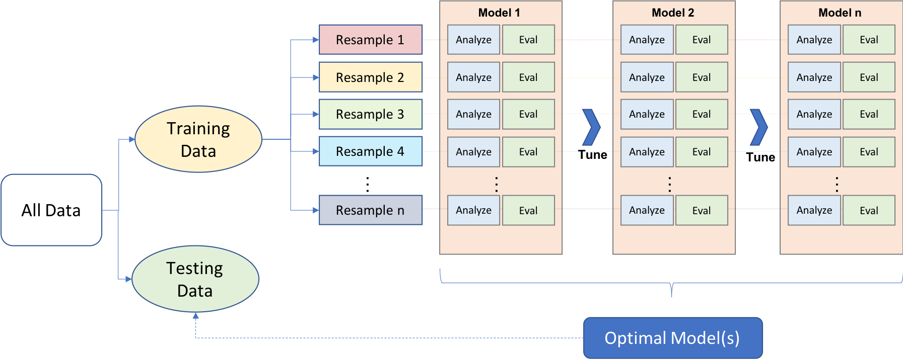

We can see that in resampling:

\- happens **after** the data split into training and test sets

\- some data is used for analyzing (analysis set), and some for
evaluation (evaluation or assessment set, we'll use assessment set from
now on)

\- this is an iterative as it can be repeated many times - it only
applies to the training data

Effectively,

\- the model is fit with the analysis set

\- the model is evaluated with the evaluation set

The overall, final performance evaluation for the model is the average
of the performance metrics of the *n* evaluation sets.

The way in which these analysis and evaluation sets are created define
what the resampling techniques are specifically. We'll go through the
common ones:

-   cross-validation

-   repeated cross-validation

-   leave-one-out cross-validation

-   monte-carlo cross-validation

### Cross-validation

Cross-validation is one of the most popular resampling techniques. There
are several flavors

#### V-fold cross-validation

V-fold cross-validation involves the random splitting of the training
data into approximately equal-sized "folds". The diagram below
illustrates v-fold cross validation with v set to 3 folds.

 We can see that the training data points have
been randomly assigned to roughly equal-sized folds (in this case,
exactly equal) and that the assessment set for each fold is 2/3 of the
training data. Max and Julia note that while 3-fold CV is good to use
for illustrative purposed, it is not good in practice - in practice,
rather 5- or 10- fold CV is preferred.

```{r folds-10}
set.seed(55)
ames_folds <- vfold_cv(ames_train, v = 10)
ames_folds
```

The output contains info on how the training data was split: \~2000 are
in the analysis set, and \~220 are in the assessment set. You can
recuperate these sets by calling `analysis()` or `assessment()`.

In chapter 5, we introduced the idea of stratified sampling, which is
almost always useful but particularly in cases with class imbalance. You
can perform V-fold CV with stratified samplying by using the `strata`
argument in the `vfold_cv()` call.

#### Repeated cross validation

V-fold CV introduced above may produce noisy estimates. A technique that
averages over more than *V* statistics may be more appropriate to reduce
the noise. This technique is repeated cross-validation, where we create
*R* repeats of V-fold CV. Instead of averaging over V statistics, we are
now averaging over *V x R* statistics:

```{r folds-b-10}
vfold_cv(ames_train, v = 10, repeats = 5) 
```

#### Leave-one-out cross validation

M & J say it sucks, so I'm skipping this lol.

#### Monte Carlo cross validation (MCCV)

It's like V-fold CV in the sense that training data is allocated to the
assessment set with some fixed proportion. The difference is the
resampling objects generated by MCCV are not mutually exclusive as the
same data points can appear in the assessment set multiple times.

```{r mccv-10}
mc_cv(ames_train, prop = 9/10, times = 20)
```

### Validation sets

Another way you can assess the performance of your candidate model(s) -
before moving forward to the test set - is to use a validation set. This
might be an attractive option if you have big data. As the diagram below
shows, the validation set is independent of the training data.


You can create your validation set by calling on `validation_split()`
and setting the proportion desired. There is also a `strata` argument to
conduct stratified sampling.

```{r validation-10}
set.seed(12)
val_set <- validation_split(ames_train, prop = 3/4)
val_set
```

### Boostrapping

Bootstrapping can be used to estimate model performance. It's good to be
aware that while it does produce lower variance compared to other
resampling methods, it has "significant pessimistic bias". It also works
differently than other resampling methods. In the diagram below, we can
see that the analysis set is always equal to the size of the whole
training set, and we can also see that the same points can be selected
multiple times. The assessment sets contain the data points that were
not previously included in the analysis sets. Furthermore, these
assessment sets are not of the same size, as we're about to see when we
call `bootstraps()`.

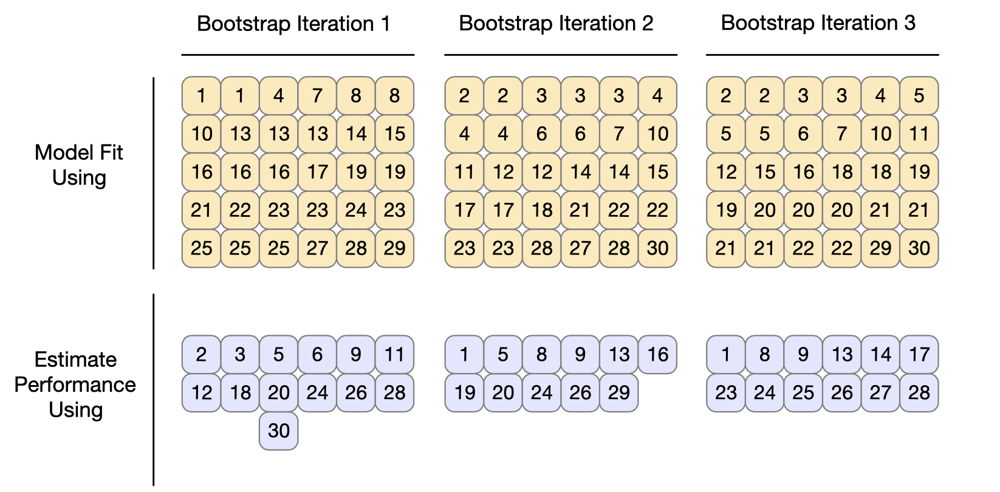 Operationally, performing
bootstrap resampling involves specifying the number of bootstrap samples
via the `times` argument. There is also a `strata` argument for
conducting stratified sampling.

```{r bootstraps-10}
bootstraps(ames_train, times = 5)
```

### Rolling forecasting origin resampling

Resampling with time series data needs a special setup as random
sampling can ignore important trends such as seasonality. Rolling
forecast resampling involves specifying the size of the analysis and
assessment sets, and each iteration after the first one skips by a set
number as the diagram illustrates below (with a skip of 1 as an
example):


This time series resampling is done with `rolling_origin`. You can
specify the number of samples to be used for analysis with `initial`,
the number of samples used for each assessment resample with `assess`,
and `cumulative` set to true if you want the analysis resample to grow
beyong the size specified with `initial`. Additional arguments include
the `skip` and `lag`.

```{r rolling-10, eval = F}
rolling_origin(data, initial = 5, assess = 1, cumulative = TRUE, skip = 0, lag = 0)
```

## Estimating performance

To recap, the resampling methods above estimate overall model
performance using the predictions from the assessment sets. The
**{tune}** package (included in tidymodels package) contains a function
called `fit_resamples` (which is akin to `fit()`) that computes a set of
performance metrics across resamples (or just one, as is the case with a
validation set). The call requires either a parsnip model specification
or a `workflows::workflow`, and `rset` object (as created with
`rsample::vfold_cv` for example). You can also specify the performance
metrics you want with the `metrics` argument or stick with the defaults.
The `control` argument can be used to view/retain/save outputs if
further tuning is desired. Your call might look like:

```{r resamples-10, eval = F}
rf_res <-
  rf_wflow %>% 
  fit_resamples(resamples = ames_folds, control = keep_pred)
```

The output (not viewed here because it's thicc) can be manipulated in a
number of ways to view just what you need. You can for example run
`tune::collect_metrics(rf_res)` to see just the performance metrics.

For more on how the outputs can be used for diagnostics and further
model evaluation refer to section 10.3 in the book.

## Parallel processing

Parallel processing can speed up the computations done by the tune
package (introduced in the last section via `fit_resamples` and
`collect_metrics`). Speed can be improved when processing uses fewer
than the number of physical cores. To enable this, *parallel backend R
packages* need to be configured. These packages and operating system
specific instructions are outlined in section 10.4.

## Saving the resampled objects

By default, the models created during resampling are not saved since
most users are interested in the performance metrics that they generate.
But, sometimes, you might realize that a specific model is the better
suited one and so you need fit again to the whole training set. There is
a method of saving the models created during resampling. You can save
them whole or just certain components.

In the book, M & J walk us through a linear regression model example
where they save the model results.

## Meeting Videos

### Cohort 1

`r knitr::include_url("https://www.youtube.com/embed/Zj1wPdglYIA")`

<details>
  <summary> Meeting chat log </summary>
  
  ```
00:10:27	pavitra:	hahaha..look at Jon resampling his wine 
00:10:38	Jonathan Trattner:	HAH
00:10:44	pavitra:	1-fold CV
00:11:16	pavitra:	that's bad..jon's test and train sets are the same
00:11:36	pavitra:	HAHAHA...
00:12:05	pavitra:	Let me grab my IPA. Tan, get your Milk stout
00:12:30	Tan Ho:	bahaha bottoms up!
00:13:23	Tan Ho:	*awkward eyes meme*
00:13:30	pavitra:	lmao
00:30:59	Tyler Grant Smith:	i feel like this deserves experimental support to compare 50 fold cv vs 5fold x10
00:34:35	pavitra:	gotcha…
00:42:34	pavitra:	is this bootstrapping with replacement?
00:43:42	Jon Harmon (jonthegeek):	63.2% 36.8%
00:43:54	pavitra:	2 SDs
00:44:34	Conor Tompkins:	@max why is it those numbers
00:45:24	Tan Ho:	(or just doubleclick the function lol)
00:45:42	Jonathan Trattner:	Both of those are GAME changers
00:45:43	Tyler Grant Smith:	ive lost the ink on my f2 key i use it so much
00:45:46	Jonathan Trattner:	wowowow
00:45:49	Tan Ho:	er, wait, ctrl-click?
00:45:51	pavitra:	yeah - I just discovered "go to function definition" in the code menu myself
00:46:31	Jonathan Trattner:	Productivity boost 🤯
00:46:42	Tan Ho:	it's a trap! - admiral ackbar
00:46:52	Tan Ho:	(you can end up digging too deep)
00:47:16	pavitra:	tyler is an expert at time series
00:54:03	Tyler Grant Smith:	this seems to be contrary to how hyndman defines it
00:58:01	pavitra:	isn't there a way to dynamically tune your hyperparameters such that it can do it for the defined range and you can see the performance using the control?
00:59:14	Jim Gruman:	time series resampling at the tidymodels web site covers `sliding_window()` `sliding_index()` and `sliding_period()` functions. Maybe the book 10.2.4 rolling forecasting could be a little more clear about all three methods
00:59:31	Tyler Grant Smith:	reading the documentation for rolling_origin i think that graphic represents cumulative=FALSE not TRUE.  This agrees with the books code
01:06:24	Jon Harmon (jonthegeek):	lm_res$.extracts[[1]][[1]]
01:07:34	Tyler Grant Smith:	may not be tidy but thats code im used to!
01:09:44	Jonathan Trattner:	Go, Jon, go!
01:10:44	Jim Gruman:	thank you Jon!!!!!
01:10:52	Tyler Grant Smith:	step_interact( ~ Gr_Liv_Area:starts_with("Bldg_Type_"))     neat i didnt know you could do that
01:12:29	Tyler Grant Smith:	my models are all organic non-gmo
01:17:36	Joe Sydlowski:	For Conor's question: http://uc-r.github.io/mars
01:17:47	Jonathan Trattner:	Thanks, Jon! Have a great night, everyone!
01:18:14	Joe Sydlowski:	There's a plot with model selection for the autoplot in MARs that shows the metrics 
01:18:19	pavitra:	thanks Jon
01:18:19	Conor Tompkins:	Thanks Jon!
```
</details>

### Cohort 3

`r knitr::include_url("https://www.youtube.com/embed/h9nWpsAHFuw")`

<details>
  <summary> Meeting chat log </summary>
  
```
00:21:50	Ildiko Czeller:	https://stats.stackexchange.com/a/386608 about why boostrap resample is pessimistic
```
</details>

<!--chapter:end:10-resampling_for_evaluating_performance.Rmd-->

# Comparing models with resampling

**Learning objectives:**

- Calculate **performance statistics** for **multiple models.**
  - Recognize that **within-resample correlation** can impact model comparison.
  - Define **practical effect size.**
- **Compare models** using **differences** in metrics.
- Use {tidyposterior} to compare models using Bayesian methods.

## Calculate performance statistics

```{r metric-calculation, eval = FALSE}
my_cool_model_rsq <- my_cool_model %>% 
  collect_metrics(summarize = FALSE) %>% 
  filter(.metric == "rsq") %>% 
  select(id, my_cool_model = .estimate)

## Repeat that for more models, then:
rsq_estimates <- my_cool_model_rsq %>% 
  inner_join(my_other_model_rsq) %>% 
  inner_join(my_other_other_model_rsq)
```

## Calculate performance statistics: {workflowsets}

We'll take a closer look at this, but workflowsets makes this stuff way cleaner!

```{r metric-calculation-workflowsets, eval = FALSE}
lm_models <- workflowsets::workflow_set(
  preproc = list(
    basic = basic_recipe,
    interact = interaction_recipe,
    splines = spline_recipe
  ),
  models = list(lm = lm_model),
  cross = FALSE
) %>% 
  workflowsets::workflow_map(
    fn = "fit_resamples", 
    # Options to `workflow_map()`: 
    seed = 1101, verbose = TRUE,
    # Options to `fit_resamples()`: 
    resamples = ames_folds, control = keep_pred
  )

collect_metrics(lm_models) %>% 
  filter(.metric == "rsq")
```

## Within-resample correlation

- **Within-resample correlation:** some folds are easier to predict than others

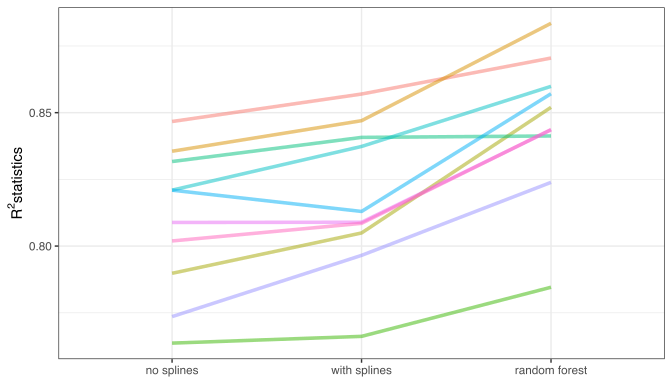

> "If the resample-to-resample effect was not real, there would not be any parallel lines."
> - Max Kuhn & Julia Silge

*ie,* the lines don't cross **that** much, so there's an effect.

## Practical effect size

- It's a good idea to think about how big of a difference matters to you.
- Maybe a change will be statistically significant, but is it worth the trouble of deploying a new model?

## Simple Comparison

Use difference to cancel out the resample-to-resample effect.

```{r compare-lm, eval = FALSE}
compare_lm <- rsq_estimates %>% 
  mutate(difference = `with splines` - `no splines`)

lm(difference ~ 1, data = compare_lm) %>% 
  tidy(conf.int = TRUE) %>% 
  select(estimate, p.value, starts_with("conf"))
```

## Bayesian methods

```{r full-bayesian-process, eval = FALSE}
library(tidyposterior)
library(rstanarm)

rqs_diff <- ames_folds %>% 
  bind_cols(rsq_estimates %>% arrange(id) %>% select(-id)) %>% 
  perf_mod(
    prior_intercept = student_t(df = 1),
    chains = 4,
    iter = 5000,
    seed = 2
  ) %>% 
  contrast_models(
    list_1 = "with splines",
    list_2 = "no splines",
    seed = 36
  )

summary(rqs_diff, size = 0.02) %>% # 0.02 is our practical effect size.
  select(contrast, starts_with("pract"))
#> # A tibble: 1 x 4
#>   contrast                   pract_neg pract_equiv pract_pos
#>   <chr>                          <dbl>       <dbl>     <dbl>
#> 1 with splines vs no splines         0       0.989    0.0113
```

## Meeting Videos

### Cohort 1

`r knitr::include_url("https://www.youtube.com/embed/2A1QIp6IFYE")`

<details>
  <summary> Meeting chat log </summary>
  
  ```
00:14:48	Tony ElHabr:	seed = 1101
00:14:52	Tony ElHabr:	what a hipster
00:15:11	pavitra:	I see a subliminal binary message
00:17:41	Tony ElHabr:	1101 -> D in hex
00:18:08	pavitra:	D for dark magicks
00:39:59	Jonathan Leslie:	I’m heading off. Thanks, Jon…really nice presentation!
00:45:54	Jim Gruman:	thank you Jon!!!
00:47:45	Andy Farina:	Thank you Jon, great presentation and addition of workflow sets
```
</details>

### Cohort 3

`r knitr::include_url("https://www.youtube.com/embed/oyc5T8fh5r0")`

<details>
  <summary> Meeting chat log </summary>
  
```
00:12:38	Daniel Chen:	it's essentially doing the multiple recipes and collecting the model metrics for you across all your preprocessing steps/models
00:12:40	Daniel Chen:	?
00:14:29	Daniel Chen:	fn 	

The function to run. Acceptable values are: tune::tune_grid(), tune::tune_bayes(), tune::fit_resamples(), finetune::tune_race_anova(), finetune::tune_race_win_loss(), or finetune::tune_sim_anneal().
00:15:00	Daniel Chen:	seems like there's only a few functions that are availiable to be used
00:16:36	Daniel Chen:	but they're using the string instead of quoted form because they're matching on string to see which functions are allowed: https://github.com/tidymodels/workflowsets/blob/main/R/workflow_map.R#L101
00:16:53	Ildiko Czeller:	makes sense, thanks
00:16:55	Toryn Schafer (she/her):	Thanks, Daniel!
00:32:13	Daniel Chen:	i guess they're using tidyposterior, instead of tidymodels. so i guess that's what's adding to the confusion
00:35:06	Daniel Chen:	cross 	

A logical: should all combinations of the preprocessors and models be used to create the workflows? If FALSE, the length of preproc and models should be equal.
00:49:17	jiwan:	tune_grid(
  object,
  preprocessor,
  resamples,
  ...,
  param_info = NULL,
  grid = 10,
  metrics = NULL,
  control = control_grid()
)
00:50:04	Daniel Chen:	https://tune.tidymodels.org/reference/tune_grid.html
00:50:52	jiwan:	A data frame of tuning combinations or a positive integer. The data frame should have columns for each parameter being tuned and rows for tuning parameter candidates. An integer denotes the number of candidate parameter sets to be created automatically
```
</details>

<!--chapter:end:11-comparing_models_with_resampling.Rmd-->

# Model tuning and the dangers of overfitting

```{r setup12, echo = FALSE, include = FALSE}
library(patchwork)
library(tidyverse)
library(tidymodels)
```

**Learning objectives:**

- Recognize examples of **tuning parameters.**
  - Recognize hyperparameters for **machine learning models.**
  - Recognize tuning parameters for **preprocessing techniques.**
  - Recognize structural parameters for **classical statistical models.**
  - Recognize examples of **parameters** that **should *not* be tuned.**
- Explain how **different metrics** can lead to **different decisions** about the choice of tuning parameter values.
- Explain how **poor parameter estimates** can lead to **overfitting** of training data.
- Recognize **strategies for optimizing tuning parameters.**
  - Compare and contrast **grid search** and **iterative search.**
- Use `tune::tune()` and the `{dials}` package to **optimize tuning parameters.**

## What is a Tuning Parameter?

An unknown structural or other kind of value that has significant impact on the model but *cannot be directly estimated from these data*

### Examples

- Machine Learning (hyperparameters)
  - Boosting: number of boosting iterations
  - ANN: number of hidden units and type of activation function
  - Modern Gradient Descent: Learning rates, momentus, and iterations
  - Random Forest: number of predictors, number of trees, number of data points

- Preprocessing (tuning parameters)
  - PCA: number of extracted components
  - Imputation (uses KNN): number of neighbors

- Statistical Models (structural parameters)
  - Binary Regression (logistic regression): probit, logit link
  - Longitudinal Models: correlation and covariance structure of the data

## When not to tune

- Prior distribution (Bayesian analysis)
- Number of Trees (Random Forest and Bagging) 
  - Does not need tuning--instead focus on stability

## Decisions, Decisions...

```{r dataset, echo = TRUE}
data(ames, package = "modeldata")
ames <- ames %>% mutate(Sale_Price = log10(Sale_Price)) 

set.seed(63)
ames_split <- initial_split(ames, prop = 0.80, strata = Central_Air)
ames_train <- training(ames_split)
ames_test <- testing(ames_split)

set.seed(63)
rs <- vfold_cv(ames_train, repeats = 10)
```

```{r plot_ames-12, echo = FALSE}
ames_train %>% 
  ggplot() +
  aes(x = Year_Remod_Add, y = Sale_Price, color = Central_Air) +
  geom_point() +
  labs(title = "Central Air According to Sale Price and Remodel Year", subtitle = "Using ames_train dataset")
```

## What Metric Should We Use?

Which link function should we use...does it matter?

- logistic regression using a logit
- probit
- complementary log-log

```{r llhood-12, warning  = FALSE, echo = FALSE}
llhood <- function(...) {
  logistic_reg() %>% 
    set_engine("glm", ...) %>% 
    fit(Central_Air ~ Sale_Price + Year_Remod_Add, data = ames_train) %>% 
    glance() %>% 
    select(logLik)
}

bind_rows(
  llhood(),
  llhood(family = binomial(link = "probit")),
  llhood(family = binomial(link = "cloglog"))
) %>% 
  mutate(link = c("logit", "probit", "c-log-log"))  %>% 
  arrange(desc(logLik)) %>% 
  kableExtra::kbl(caption = "Likelihood Statistics") %>%
  kableExtra::kable_classic(full_width = F, html_font = "Cambria")
```

```{r lloss-12, echo = FALSE}
lloss <- function(...) {
  perf_meas <- metric_set(roc_auc, mn_log_loss)
    
  logistic_reg() %>% 
    set_engine("glm", ...) %>% 
    fit_resamples(Central_Air ~ Sale_Price + Year_Remod_Add, rs, metrics = perf_meas) %>% 
    collect_metrics(summarize = FALSE) %>%
    select(id, id2, .metric, .estimate)
}
```

```{r resampled-12, eval=FALSE, include=FALSE, echo = FALSE}
resampled_res <- 
  bind_rows(
    lloss()                                    %>% mutate(model = "logitistic"),
    lloss(family = binomial(link = "probit"))  %>% mutate(model = "probit"),
    lloss(family = binomial(link = "cloglog")) %>% mutate(model = "c-log-log")     
  ) %>%
  # Convert log-loss to log-likelihood:
  mutate(.estimate = ifelse(.metric == "mn_log_loss", -.estimate, .estimate)) %>% 
  group_by(model, .metric) %>% 
  summarize(
    mean = mean(.estimate, na.rm = TRUE),
    std_err = sd(.estimate, na.rm = TRUE) / sum(!is.na(.estimate)), 
    .groups = "drop"
  )

saveRDS(resampled_res, file = here::here("data", "12-resample_results.rds"))
```

```{r load-resampled-12, echo = FALSE}
resampled_res <- readRDS(file = here::here("data", "12-resample_results.rds"))
```

If we just look at the log-likelihood statistic, the logistic link function appears to be statistically (significantly) better than the probit and complementary log-log link functions.

However, if we use the area under the ROC curve, we see that there is no significant difference between the three link functions. When we plot the three link functions, we also see that they are not substantially different in predicting whether a house has central air.

```{r logistic-12, echo = FALSE}
logistic <- glm(Central_Air ~ Sale_Price + Year_Remod_Add, data = ames_test, family = binomial)
logistic_slope <- coef(logistic)[3]/(-coef(logistic)[2])
logistic_intercept <- coef(logistic)[1]/(-coef(logistic)[2]) 
probit <- glm(Central_Air ~ Sale_Price + Year_Remod_Add, data = ames_test, family = binomial(link = "probit"))
probit_slope <- coef(probit)[3]/(-coef(probit)[2])
probit_intercept <- coef(probit)[1]/(-coef(probit)[2]) 
cloglog <- glm(Central_Air ~ Sale_Price + Year_Remod_Add, data = ames_test, family = binomial(link = "cloglog"))
cloglog_slope <- coef(cloglog)[3]/(-coef(cloglog)[2])
cloglog_intercept <- coef(cloglog)[1]/(-coef(cloglog)[2]) 
```

```{r plots-12, echo = FALSE}
p1 <- resampled_res %>% 
  filter(.metric == "mn_log_loss") %>% 
  ggplot(aes(x = mean, y = model)) + 
  geom_point() + 
  geom_errorbar(aes(xmin = mean - 1.96 * std_err, xmax = mean + 1.96 * std_err),
                width = .1) + 
  labs(y = NULL, x = "log-likelihood")

p2 <- resampled_res %>% 
  filter(.metric == "roc_auc") %>% 
  ggplot(aes(x = mean, y = model)) + 
  geom_point() + 
  geom_errorbar(aes(xmin = mean - 1.96 * std_err, xmax = mean + 1.96 * std_err),
                width = .1) + 
  labs(y = NULL, x = "Area Under the ROC Curve")

p3 <- ames_test %>% 
  ggplot() +
  aes(x = Year_Remod_Add, y = Sale_Price, color = Central_Air) +
  geom_point() +
  geom_abline(slope = logistic_slope, intercept = logistic_intercept) +
  geom_abline(slope = probit_slope, intercept = probit_intercept, linetype = 2) +
  geom_abline(slope = cloglog_slope, intercept = cloglog_intercept, linetype = 3)

(p1 + p2) / p3
```

## Can we make our model *too* good?

**Overfitting** is always a concern as we start to tune hyperparameters.

tip from the book: `Using out of sample data is the solution for detecting when a model is overemphasizing the training set`

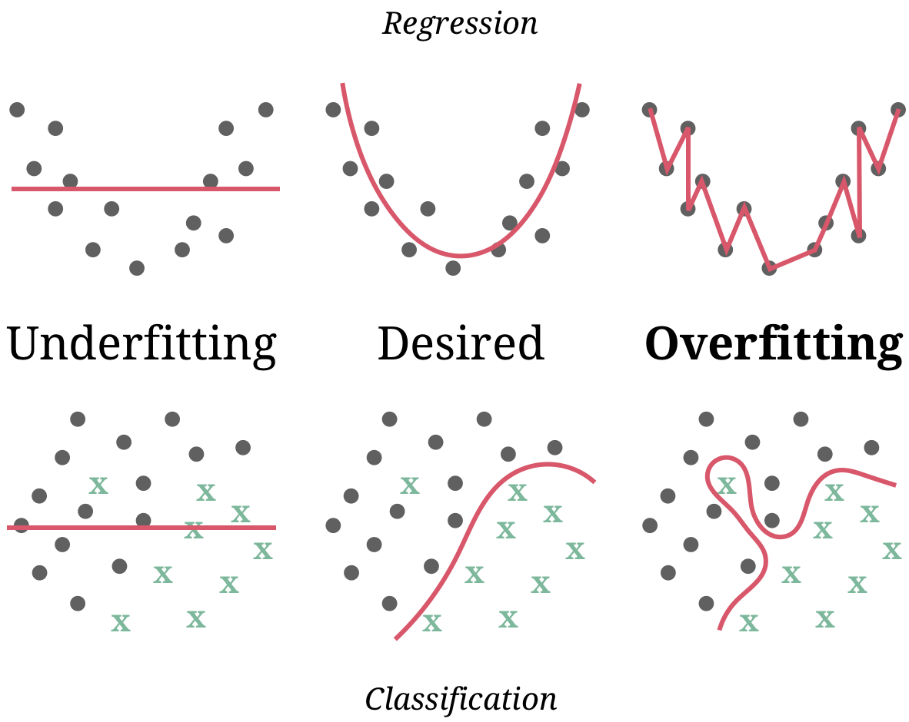

Image Credit (https://therbootcamp.github.io/ML_2019Oct/_sessions/Recap/Recap.html#8)

## Tuning Parameter Optimization Strategies

- Grid Search (Space Filled Grid)


- Random Search (Global Search)


- Iterative Search (Global Search)

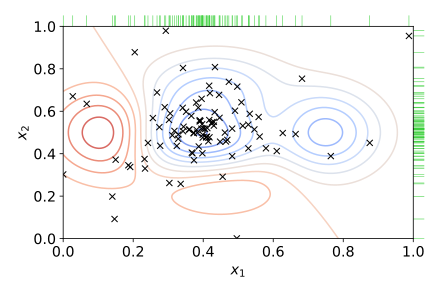

image credits: (https://en.wikipedia.org/wiki/Hyperparameter_optimization)

## Tuning Parameters in tidymodels `{dials}`

Parsnip Model Specifications

- Main Arguments (rand_forest)
- engine-specific (ranger)

Good starting points (tidymodels website):

- [reference docs](https://www.tidymodels.org/find/parsnip/#models)
- [searchable table](https://www.tidymodels.org/find/parsnip/#model-args) 

## Let's try an example:

See if we can predict the home sale price in our ames dataset 

1. Start with a recipe
```{r rf-recipe-12, echo= TRUE}
ames_recipe <- recipe(Sale_Price ~ Neighborhood + Gr_Liv_Area + Year_Remod_Add + Bldg_Type, 
                      data = ames_train)
```

## Build our random forest model:

random forest model
```{r rf-model-12, echo = TRUE}
rf_spec <- rand_forest() %>% 
  set_engine("ranger") %>% 
  set_mode("regression") 
```

Main Arguments `args()`:
```{r rf-args-12, echo = TRUE}
args(rand_forest)
```

engine specific arguments: 
```{r ranger-help-12, eval = FALSE}
?ranger::ranger()
```

## Add tuning parameters:

We can add main arguments (mtry, min_n) and engine specific arguments (regularization.factor)
```{r rf-tuned-12, echo = TRUE}
rf_spec_tuned <- rand_forest(mtry = tune(), trees = 2000, min_n = tune()) %>% 
  set_engine("ranger", regularization.factor = tune("reg")) %>% 
  set_mode("regression") 
```

`tune()` returns an expression. This tags the parameters for optimization within the tidymodels framework

```{r rf-params-12, echo = TRUE}
parameters(rf_spec_tuned)
```

The notation `nparam[+]` indicates a complete numeric parameter, `nparam[?]` indicates a missing value that needs to be addressed.

## Updating tuning parameters:

To see what we need to update/ finalize, we can call the function in the `{dials}` package
```{r rf-mtry-12, echo = TRUE}
mtry()
```

We can also use the `{dials}` package to see the tuning range
```{r min_n-12, echo = TRUE}
min_n()
```

To update/finalize or adjust the hyperparameters we can use the `update()` function to update in-place:

```{r update-params-12, echo = TRUE}
parameters(rf_spec_tuned) %>% 
  update(mtry = mtry(c(1, 4)))
```

We see that mtry is now a complete numeric parameter

## Finalizing tuning parameters:

The update function may not be useful if a recipe is attached to a workflow that adjusts the number of columns. Instead of `update()` we can use the `finalize()` function.

```{r updated_params-12, echo = TRUE}
updated_params <- workflow() %>% 
  add_model(rf_spec_tuned) %>% 
  add_recipe(ames_recipe) %>% 
  parameters() %>% 
  finalize(ames_train)

updated_params
```

With the `finalize()` function, mtry was completed based on the number of predictors in the training dataset

```{r pull_dials_object-12, echo = TRUE}
updated_params %>% pull_dials_object("mtry")
```

## What is next?

The parameter object we just explored knows the range of the parameters. the `{dials}` package contains a number of `grid_*()` functions that takes the parameter object as input to produce different types of grids. Chapter 13 will explore this further.

## Meeting Videos

### Cohort 1

`r knitr::include_url("https://www.youtube.com/embed/EarVQUj4XbQ")`

<details>
  <summary> Meeting chat log </summary>
  
  ```
00:11:27	Jon Harmon (jonthegeek):	usethis::use_package("patchwork")
00:23:12	Jon Harmon (jonthegeek):	@jim Which chapter are you going to present: 13? 14? 15? 😊
00:27:52	Jim Gruman:	:) sure, 13 sounds good
00:29:42	Jon Harmon (jonthegeek):	Woot!
00:29:57	Jordan Krogmann:	1, 1000, 5000 is the correct answer
00:31:11	Jon Harmon (jonthegeek):	Ok, Jim! You're PRed into the README, no take-backsies!
00:33:44	Tan Ho:	fixed sorry
00:35:29	Tony ElHabr:	i'm sorry but are these python generated graphs?
00:35:33	Tony ElHabr:	unforgiveable
00:36:06	Tan Ho:	gg
00:36:12	Tan Ho:	i'm out
00:36:54	Jon Harmon (jonthegeek):	Ok, after Jim everyone who's here will have gone at least once! Except wait Tan never actually went did he?????
00:37:45	Tony ElHabr:	CALL HIM OUT
00:38:03	Jon Harmon (jonthegeek):	TAN WHAT CHAPTER ARE YOU PRESENTING??? 14, right?
00:39:01	Tan Ho:	*awkwardly looking around after going MIA from the book club since chapter 9*
00:39:43	Tony ElHabr:	as long as tan gives us a killer review at the end of this all, then i'll give him a pass
00:40:03	Jon Harmon (jonthegeek):	Fair! Tan *is* the master of the review week!
00:40:21	Jon Harmon (jonthegeek):	I pinged Max on the Slack to see if we should do a review after 14, or after 15, or later, or what.
00:40:55	Tony ElHabr:	how can we do a proper review if we never stop learning?
00:41:14	Tan Ho:	I might  be more apt to do 15, I think?
00:41:23	Jon Harmon (jonthegeek):	Yeah, this one is tricky 'cuz I'm not sure when it ends 🙃
00:41:53	Tony ElHabr:	tan picks chapter 15 so he can have 3 weeks to prep :P
00:42:02	Tan Ho:	two weeks to catch up and one week to prep!
00:42:21	Tan Ho:	okay I lied twenty days to catch up and one day to prep, let's be honest
00:42:46	Tony ElHabr:	21 days to catch up cuz you're going to live code
00:42:51	Tan Ho:	fair!
00:42:56	Tan Ho:	that part don't scare me
00:54:23	Jordan Krogmann:	Thanks andy!
00:54:23	Tan Ho:	if 16 isn't written by the time I present we can probably just review lol
```
</details>

### Cohort 3

`r knitr::include_url("https://www.youtube.com/embed/fe3uixT_USg")`

<details>
  <summary> Meeting chat log </summary>
  
```
00:36:03	Federica :	finalize() with {dial}  take a parameter object and modify the unknown parts
00:44:40	Daniel Chen (TA), NYC:	https://dials.tidymodels.org/
00:49:04	jiwan:	i think you're muted, couldn't hear you
00:52:24	Federica :	I was wondering about the regularization_factor()
00:54:21	jiwan:	These parameters are auxiliary to random forest models that use the "ranger" engine. They correspond to tuning parameters that would be specified using set_engine("ranger", ...).
00:59:27	jiwan:	dials::mtry()
# Randomly Selected Predictors (quantitative)
Range: [1, ?]
01:00:29	jiwan:	regularization.factor = tune("reg")
01:00:42	jiwan:	regularization.factor = tune()
01:03:32	jiwan:	> dials::regularization_factor
function (range = c(0, 1), trans = NULL) 
{
    new_quant_param(type = "double", range = range, inclusive = c(TRUE, 
        TRUE), trans = trans, default = 1, label = c(regularization_factor = "Gain Penalization"), 
        finalize = NULL)
}
```
</details>

<!--chapter:end:12-model_tuning_and_the_dangers_of_overfitting.Rmd-->

# Grid search

```{r setup13, echo = FALSE, include = FALSE}
knitr::opts_chunk$set(
  # collapse = TRUE
  warning = FALSE,
  message = FALSE
)
library(tidymodels)
library(tidyverse)
library(lubridate)

library(details)
```

**Learning objectives:**

- Use the `{dials}` package to **create tuning grids.**
  - Compare and contrast **regular and non-regular grids.**
  - Use `dials::parameters()` to **examine tuning parameters.**
  - Use `dials::grid_regular()` to **create a regular tuning grid.**
  - Use `dials::grid_*random*()` functions to **create irregular tuning grids.**
- Use `tune::tune_grid()` to **conduct a grid search.**
  - Use the `grid` parameter to **specify tuning grids.**
- **Finalize** a **tuned model.**
  - Use `tune::select_*()` functions to **choose a tuned parameter set.**
  - **Manually specify** a parameter set.
- Improve grid search efficiency.
  - Recognize how `{parsnip}` uses **submodel optimization** to make tuning more efficient.
  - Specify `{tune}` **parallel-processing rules** using the `parallel_over` parameter.
  - Use `finetune::tune_race_anova()` to make tuning more efficient via **racing methods.**

**The call to action:**

Tuning machine learning models can be time consuming and computationally expensive.

Thoughtful choices in the experimental design of searches can make them easier to deal with.

------------------------------------------------------------------------


-   Last week: how to tag arguments using `tune()`.

-   This week: how to optimize the parameters, **a priori**.

-   Next week: **iterative** methods.

## Regular and non-regular grids

Let's consider an example model: an `mlp` neural network model. The parameters marked for tuning are:

-   the number of hidden units,

-   the number of fitting epochs in model training, and

-   the amount of weight decay penalization.

Using `parsnip`, the specification for a regression model fit using the `nnet` package for a multi layer perceptron is:

```{r 13_mlp_spec}
mlp_spec <-
  mlp(hidden_units = tune(),
      penalty = tune(),
      epochs = tune()) %>%
  set_engine("nnet", trace = 0) %>%
  set_mode("regression")
```

The argument **trace = 0** prevents extra logging of the training process. The `parameters()` function can extract the set of arguments with unknown values and set their `dials` objects. `pull_dials_object()` gives the current range of values.

```{r 13_mlp_param_hidden_units}
mlp_param <- parameters(mlp_spec)
mlp_param %>% pull_dials_object("hidden_units")
```

```{r 13_mlp_param_penalty}
mlp_param %>% pull_dials_object("penalty")
```

> For `penalty`, the random numbers are uniform on the log (base 10) scale. The values in the grid are in their natural units.


```{r 13_mlp_param_epochs}
mlp_param %>% pull_dials_object("epochs")
```

### Regular Grids

The `dials` package contains a set of `grid_*()` functions that take the parameter object and produce different types of grids.

```{r 13_grid_regular_2level}
grid_regular(mlp_param, levels = 2) 
```

The `levels` argument is the number of levels per parameter to create. It can also take a named vector of values:

```{r 13_grid_regular_named_vector}
mlp_param %>% 
  grid_regular(levels = c(hidden_units = 3,
                          penalty = 2, 
                          epochs = 2))
```

<p style="color:red;">Regular grids can be computationally expensive to use, especially when there are a large number of tuning parameters. This is true for many models but not all. There are some models whose tuning time decreases with a regular grid. More on this in a moment.</p>

One advantage of a regular grid is that the relationships between the tuning parameters and the model metrics are easily understood. The full factorial nature of designs allows for examination of each parameter separately.

### Irregular Grids

Even with small grids, random values can still result in overlaps. Also, the random grid needs to cover the whole parameter space. 

Even for a sample of 15 candidate points, this plot shows some overlap between points for our example:

```{r 13_grid_random_dataviz, eval=FALSE}
library(ggforce)
set.seed(200)
mlp_param %>%
  # The 'original = FALSE' option keeps penalty in log10 units
  grid_random(size = 15, original = FALSE) %>%
  ggplot(aes(x = .panel_x, y = .panel_y)) +
  geom_point() +
  geom_blank() +
  facet_matrix(vars(hidden_units, penalty, epochs), layer.diag = 2) +
  labs(title = "Random design with 15 candidates")

ggsave(filename = "images/13_grid_random.png")
```

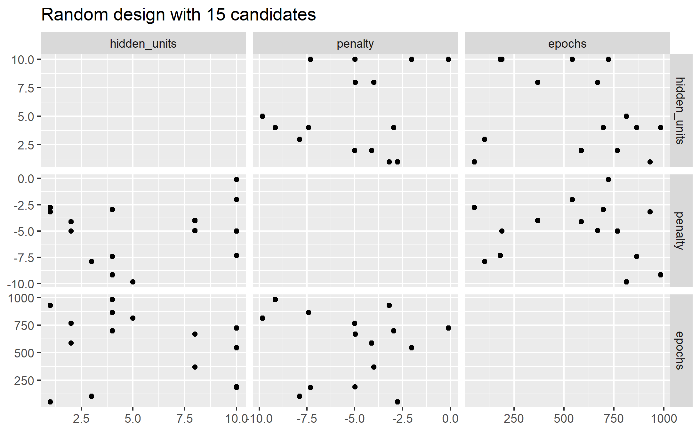

A much better approach is to use designs called

#### Space Filling Designs !!!


They generally find a configuration of points that cover the parameter space with the smallest chance of overlapping. The `dials` package has:

-   Latin hypercube

-   Maximum entropy

As with `grid_random()`, the primary inputs are the number of parameter combinations and a parameter object.

```{r 13_latin_hypercube, eval=FALSE}

library(ggforce)
set.seed(200)
mlp_param %>% 
  grid_latin_hypercube(size = 15, original = FALSE) %>% 
  ggplot(aes(x = .panel_x, y = .panel_y)) + 
  geom_point() +
  geom_blank() +
  facet_matrix(vars(hidden_units, penalty, epochs), layer.diag = 2) + 
  labs(title = "Latin Hypercube design with 15 candidates")

ggsave("images/13_latin_hypercube.png")

```


The default design used by `tune`: maximum entropy design.

## Evaluating the grid


> "To choose the best tuning parameter combination, each candidate set is assessed using data on cross validation slices that were **not** used to train that model. "

The user selects the most appropriate set. It might make sense to choose the empirically **best** parameter combination or bias the choice towards other aspects like simplicity.

------------------------------------------------------------------------

We will use the Chicago CTA data for modeling the number of people (in thousands) who enter the Clark and Lake L station, as ridership.

The date column corresponds to the current date.

The columns with station names (Austin through California) are 14 day lag variables. There are also columns related to weather and sports team schedules.

[](http://www.feat.engineering/figures/Chicago_L_diagram_sb.png)

```{r 13_load_Chicago}
data(Chicago) # from the modeldata package

# also live data via RSocrata and Chicago portal

glimpse(Chicago, width = 5) 
```

Ridership is the dependent variable. Sorted by oldest to newest date, it matches exactly the Clark_Lake lagged by 14 days.

```{r 13_show_14day_lag}
Chicago$ridership[25:27]
Chicago$Clark_Lake[39:41]
```

Ridership is in thousands per day and ranges from 600 to 26,058

```{r 13_Chicago_ridership}
summary(Chicago$ridership)
```

Cross validation folds here are taken on a sliding window

```{r 13_split_resample}
set.seed(33)
split <- rsample::initial_time_split(Chicago) 
Chicago_train <- training(split)
Chicago_test <- testing(split)
  
Chicago_folds <- sliding_period(
  Chicago_train,
  index = date,
  period = "year",
  lookback = 3,
  assess_stop = 1                                
)
```

Training and validation data range

```{r 13_train_range}
range(Chicago_train$date)

```

Testing data range

```{r 13_test_range}
range(Chicago_test$date)

```

```{r 13_resample_visual}
ggplot(Chicago_folds %>% tidy(), 
       aes(x = Resample, y = Row, fill = Data)) +
  geom_tile() 

```

Because of the high degree of correlation between predictors, it makes sense to use PCA feature extraction.

> While the resulting PCA components are technically on the same scale, the lower-rank components tend to have a wider range than the higher-rank components. For this reason, we normalize again to coerce the predictors to have the same mean and variance.

The resulting recipe:

```{r 13_Chicago_recipe}
mlp_rec <-
  recipe(ridership ~ ., 
         data = Chicago_train) %>%
  step_date(date, 
            features = c("dow", "month"),
            ordinal = FALSE) %>%
  step_rm(date) %>% 
  step_normalize(all_numeric(), 
                 -ridership) %>% # remove the dependent
  step_pca(all_numeric(), 
           -ridership, 
           num_comp = tune()) %>%
  step_normalize(all_numeric(), 
                 -ridership) # remove the dependent

mlp_wflow <- 
  workflow() %>% 
  add_model(mlp_spec) %>% 
  add_recipe(mlp_rec)
```

> In `step_pca()`, using zero PCA components is a shortcut to skip the feature extraction. In this way, the original predictors can be directly compared to the results that include PCA components.

Let's create a parameter object to adjust a few of the default ranges.

```{r 13_mlp_param_boundaries}
mlp_param <- 
  mlp_wflow %>% 
  parameters() %>% 
  update(
    epochs = epochs(c(50, 200)),
    num_comp = num_comp(c(0, 20))
  )

rmse_mape_rsq_iic <- metric_set(rmse, 
                                mape, 
                                rsq, 
                                iic)
```

`tune_grid()` is the primary function for conducting grid search. It resembles `fit_resamples()` from prior chapters, but adds

-   grid: An integer or data frame. When an integer is used, the function creates a space-filling design. If specific parameter combinations exist, the grid parameter is used to pass them to the function.

-   param_info: An optional argument for defining the parameter ranges, when grid is an integer.

```{r 13_mlp_reg_tune, eval = FALSE}
set.seed(99)
mlp_reg_tune <-
  mlp_wflow %>%
  tune_grid(
    Chicago_folds,
    grid = mlp_param %>% grid_regular(levels = 3),
    metrics = rmse_mape_rsq_iic
  )

write_rds(mlp_reg_tune, 
          file = "data/13-Chicago-mlp_reg_tune.rds",
          compress = "gz")
```

```{r 13_load_mlp_reg_tune, include=FALSE, eval = FALSE}

if (file.exists("data/13-Chicago-mlp_reg_tune.rds")) {
mlp_reg_tune <-  read_rds("data/13-Chicago-mlp_reg_tune.rds")
} else {
  print("load the mlp_reg_tune code block") 
}

```

There are high-level convenience functions to understand the results. First, the `autoplot()` method for regular grids shows the performance profiles across tuning parameters:

```{r 13_mlp_reg_tune_autoplot, eval= FALSE}
autoplot(mlp_reg_tune) + theme(legend.position = "top")

ggsave("images/13_mlp_reg_tune_autoplot.png",
       width = 12)
```


The best model, per the [index of ideality of correlation](https://yardstick.tidymodels.org/reference/iic.html) (iic), on the validation folds

More study might be warranted to dial in the resolution of the penalty and number of pca components.

To evaluate the same range using (the tune grid default) maximum entropy design with 20 candidate values:

```{r 13_mlp_max_entropy, eval = FALSE}
set.seed(99)
mlp_sfd_tune <-
  mlp_wflow %>%
  tune_grid(
    Chicago_folds,
    grid = 20,
    # Pass in the parameter object to use the appropriate range: 
    param_info = mlp_param,
    metrics = rmse_mape_rsq_iic
  )

write_rds(mlp_sfd_tune, 
          file = "data/13-Chicago-mlp_max_entropy.rds",
          compress = "gz")
```

```{r 13_load_mlp_max_entropy, include=FALSE}

if (file.exists("data/13-Chicago-mlp_max_entropy.rds")) {
mlp_sfd_tune <-  read_rds("data/13-Chicago-mlp_max_entropy.rds")
} else {
  print("load the mlp_max_entropy code block") 
}

```

```{r 13_mlp_max_entropy_plot, eval = FALSE}
autoplot(mlp_sfd_tune)

ggsave("images/13_mlp_max_entropy_plot.png")
```

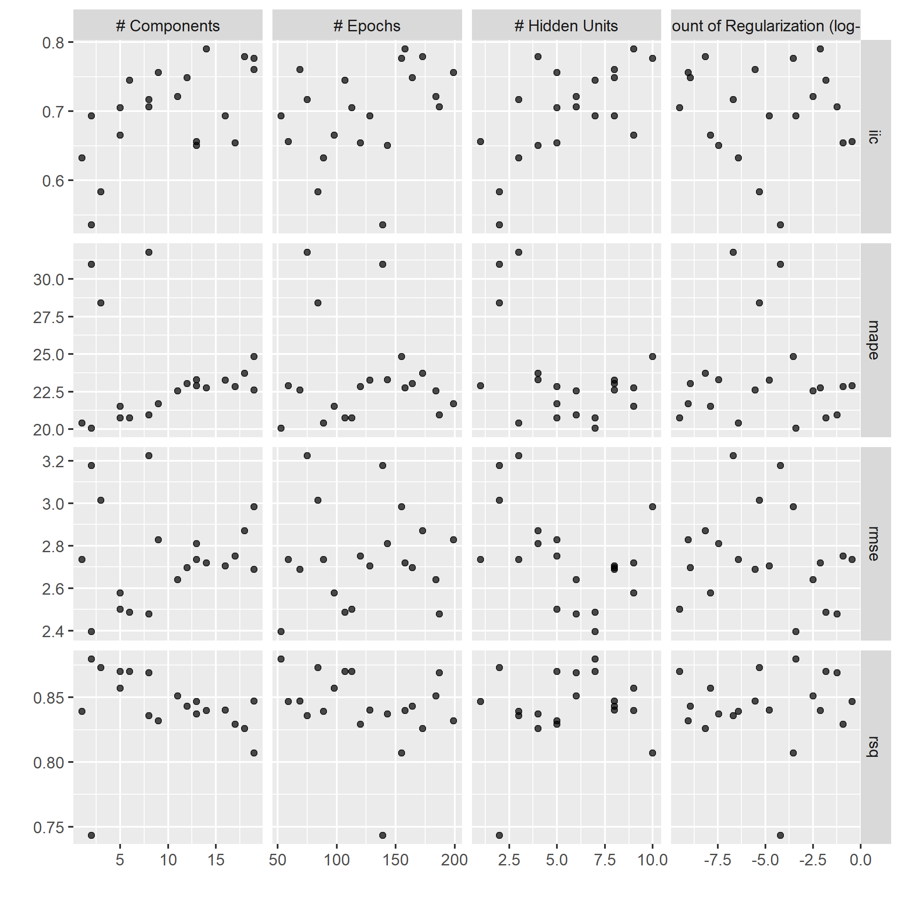

> Care should be taken when examining this plot; since a regular grid is not used, the values of the other tuning parameters can affect each panel.

```{r 13_mlp_max_entropy_bestiic, eval=FALSE}
show_best(mlp_sfd_tune, metric = "iic") %>% select(-.estimator)
```
```
  hidden_units  penalty epochs num_comp .metric  mean     n std_err .config      
         <int>    <dbl>  <int>    <int> <chr>   <dbl> <int>   <dbl> <chr>        
1            9 7.80e- 3    158       14 iic     0.790     8  0.0439 Preprocessor~
2            4 7.01e- 9    173       18 iic     0.779     8  0.0375 Preprocessor~
3           10 2.96e- 4    155       19 iic     0.777     8  0.0293 Preprocessor~
4            8 2.96e- 6     69       19 iic     0.760     8  0.0355 Preprocessor~
5            5 8.76e-10    199        9 iic     0.756     8  0.0377 Preprocessor~
```
It often makes sense to choose a slightly suboptimal parameter combination that is associated with a simpler model. For this model, simplicity corresponds to larger penalty values and/or fewer hidden units.

## Finalizing the model


Two methods:

-   manually choose parameters, or

-   `select_best()`

```{r 13_select_best_mlp_max_entropyiic, eval=FALSE}
select_best(mlp_sfd_tune, metric = "iic")

# or, a manual selection that corresponds to the regular method

reg_param <- 
  tibble(
    num_comp = 0,
    epochs = 200,
    hidden_units = 5,
    penalty = 1	  # log10
  )

```
```
# A tibble: 1 x 5
  hidden_units penalty epochs num_comp .config              
         <int>   <dbl>  <int>    <int> <chr>                
1            9 0.00780    158       14 Preprocessor06_Model1
```

```{r 13_final_workflow_mlp_max_entropy, eval=FALSE}
final_sfd_wflow <- 
  mlp_wflow %>% 
  finalize_workflow(select_best(mlp_sfd_tune, metric = "rmse")) 

```

Now the model can fit the *entire training* set:

```{r 13_fit_entire_chicago_training, eval=FALSE}
final_sfd_fit <- 
  final_sfd_wflow %>% 
  fit(Chicago_train)
```

This object can now be used to make future predictions on new data.

```{r 13_test_rmse_yardstick, eval=FALSE}
final_sfd_fit %>% 
   predict(new_data = Chicago_test) %>% 
   bind_cols(Chicago_test) %>% 
   rmse(truth = ridership, estimate = .pred)
```

```
# A tibble: 1 x 3
  .metric .estimator .estimate
  <chr>   <chr>          <dbl>
1 rmse    standard        3.01
```

```{r 13_test_performance, eval=FALSE}
final_sfd_fit %>% 
   predict(new_data = Chicago_test) %>% 
   bind_cols(Chicago_test) %>% 
   mutate(weekday = wday(date, 
                         label = TRUE)) %>% 
   ggplot(aes(ridership, 
              .pred, 
              color = weekday)) +
   geom_point() +
   geom_abline(color = "red") +
   scale_color_brewer(type = "qual") +
   coord_fixed() +
   expand_limits(x = 0, y = 0)

ggsave("images/13_test_performance.png")

```


I learned here that the **recipe** must exclude the dependent variable for the `predict()` to run on test data.

## Tools for efficient grid search

A few tricks:


### Submodel optimization

Types of models where, from a single model fit, multiple tuning parameters can be evaluated without refitting:

-   Partial Least Squares (no. of components to retain)

-   Boosting models (no. of boosting iterations, i.e. trees)

-   `glmnet` makes (across the amount of regularization)

-   `MARS` adds a set of nonlinear features (number of terms to retain)

> The `tune` package automatically applies this type of optimization whenever an applicable model is tuned. See also [this vignette](https://tune.tidymodels.org/articles/extras/optimizations.html)

```{r 13_submodel_optimizations}
methods("multi_predict")
```

```{r 13_c5.0_suboptimizer}
parsnip:::multi_predict._C5.0 %>% 
  formals() %>% 
  names()

```

For example, if a C5.0 model is fit to this cell classification data challenge, we can tune the trees. With all other parameters set at their default values, we can rapidly evaluate iterations from 1 to 100 :

```{r 13_c5_submodelopt_demo, eval = FALSE}
data(cells)

cells <- cells %>% select(-case)

cell_folds <- vfold_cv(cells)

roc_res <- metric_set(roc_auc)

c5_spec <- 
  boost_tree(trees = tune()) %>% 
  set_engine("C5.0") %>% 
  set_mode("classification")

set.seed(2)
c5_tune <- c5_spec %>%
  tune_grid(
    class ~ .,
    resamples = cell_folds,
    grid = data.frame(trees = 1:100),
    metrics = roc_res
  )

```

> Even though we fit the model without the submodel prediction trick, this optimization is automatically applied by `parsnip`.

```{r 13_c5_submodelopt_plot, eval = FALSE}
autoplot(c5_tune)

ggsave("images/13_c5_submodel.png")
```

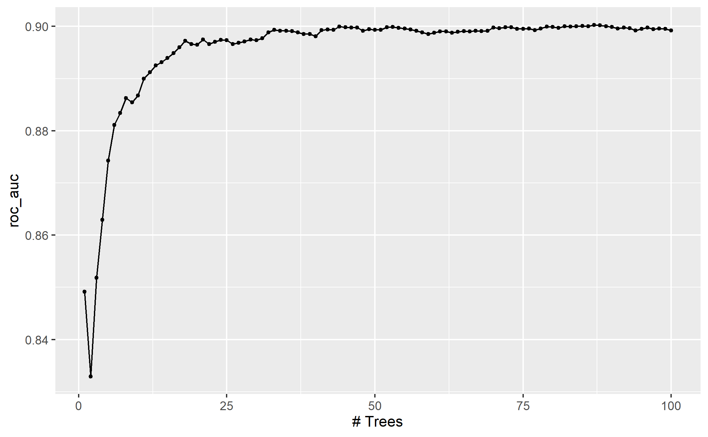

### Parallel processing

backend packages right now are *`doFuture`*, `doMC`, `doMPI`, *`doParallel`*, `doRedis`,`doRNG`, `doSNOW`, and `doAzureParallel`

In `tune_*()`, there are two approaches, often set in `control_grid()` or `control_resamples()`

-   `parallel_over = "resamples` or

-   `parallel_over = "everything"` or

-   `parallel_over = NULL` (the default) chooses "resamples" if there are more than one resample, otherwise chooses "everything" to attempt to maximize core utilization

Note that switching between `parallel_over` strategies is not guaranteed to use the same random number generation schemes. However, re-tuning a model using the same `parallel_over` strategy is guaranteed to be reproducible between runs.

To use them, register the parallel backend first. <p style="color:red;">On a shared server, never never consume all of the cores.</p>

```{r 13_register_backend, eval = FALSE}
all_cores <- parallel::detectCores(logical = FALSE)

library(doParallel)
cl <- makePSOCKcluster(all_cores)
doParallel::registerDoParallel(cl)
```

Be careful to avoid use of variables from the global environment. For example:

```{r 13_parallel_tidy_eval, eval = FALSE}
num_pcs <- 3

recipe(mpg ~ ., data = mtcars) %>% 
  # Bad since num_pcs might not be found by a worker process
  step_pca(all_predictors(), num_comp = num_pcs)

recipe(mpg ~ ., data = mtcars) %>% 
  # Good since the value is injected into the object
  step_pca(all_predictors(), num_comp = !!num_pcs)
```

for the most part, the logging provided by `tune_grid()` will not be seen when running in parallel.

### Benchmarking Parallel with boosted trees

Three scenarios

1.  Preprocess the data prior to modeling using `dplyr`

2.  Conduct the same preprocessing via a `recipe`

3.  With a `recipe`, add a step that has a high computational cost

using variable numbers of worker processes and using the two `parallel_over` options, on a computer with 10 physical cores


For `dplyr` and the simple `recipe`

-   There is little difference in the execution times between the panels.

-   There is some benefit for using `parallel_over = "everything"` with many cores. However, as shown in the figure, the majority of the benefit of parallel processing occurs in the first five workers.

With the expensive preprocessing step, there is a considerable difference in execution times. Using `parallel_over = "everything"` is problematic since, even using all cores, it never achieves the execution time that `parallel_over = "resamples"` attains with just five cores. This is because the costly preprocessing step is unnecessarily repeated in the computational scheme.

> Overall, note that the increased computational savings will vary from model-to-model and are also affected by the size of the grid, the number of resamples, etc. A very computationally efficient model may not benefit as much from parallel processing.

### Racing Methods

The `finetune` package contains functions for racing.

One issue with grid search is that all models need to be fit across all resamples before any tuning parameters can be evaluated. It would be helpful if instead, at some point during tuning, an interim analysis could be conducted to eliminate any truly awful parameter candidates.

In *racing methods* the tuning process evaluates all models on an initial subset of resamples. Based on their current performance metrics, some parameter sets are not considered in subsequent resamples.

As an example, in the Chicago multilayer perceptron tuning process with a regular grid above, what would the results look like after only the first three folds?

We can fit a model where the outcome is the resampled area under the ROC curve and the predictor is an indicator for the parameter combination. The model takes the resample-to-resample effect into account and produces point and interval estimates for each parameter setting. The results of the model are one-sided 95% confidence intervals that measure the loss of the ROC value relative to the currently best performing parameters.

Any parameter set whose confidence interval includes zero would lack evidence that its performance is not statistically different from the best results. We retain 10 settings; these are resampled more. The remaining 10 submodels are no longer considered.


> Racing methods can be more efficient than basic grid search as long as the interim analysis is fast and some parameter settings have poor performance. It also is most helpful when the model does **not** have the ability to exploit submodel predictions.

The `tune_race_anova()` function conducts an Analysis of Variance (ANOVA) model to test for statistical significance of the different model configurations.

```{r 13_tune_race_anova, eval=FALSE}
library(finetune)

set.seed(99)
mlp_sfd_race <-
  mlp_wflow %>%
  tune_race_anova(
    Chicago_folds,
    grid = 20,
    param_info = mlp_param,
    metrics = rmse_mape_rsq_iic,
    control = control_race(verbose_elim = TRUE)
  )

write_rds(mlp_sfd_race, 
          "data/13-Chicago-mlp_sfd_race.rds",
          compress = "gz")
```

```{r 13_load_mlp_sfd_race, include=FALSE, eval = FALSE}

if (file.exists("data/13-Chicago-mlp_sfd_race.rds")) {
mlp_sfd_race <-  read_rds("data/13-Chicago-mlp_sfd_race.rds")
} else {
  print("load the 13_load_mlp_sfd_race code block") 
}

```

```{r 13_plot_mlp_sfd_race, eval = FALSE}
autoplot(mlp_sfd_race)

ggsave("images/13_mlp_sfd_race.png",
       width = 12)
```


```{r 13_tune_race_anova_best, eval = FALSE}
show_best(mlp_sfd_race, n = 6)
```
```
  hidden_units  penalty epochs num_comp .metric .estimator  mean     n
         <int>    <dbl>  <int>    <int> <chr>   <chr>      <dbl> <int>
1            6 3.08e- 5    126        3 rmse    standard    2.47     8
2            8 2.15e- 1    148        9 rmse    standard    2.48     8
3           10 9.52e- 3    157        3 rmse    standard    2.55     8
4            6 2.60e-10     84       12 rmse    standard    2.56     8
5            5 1.48e- 2     94        4 rmse    standard    2.57     8
6            4 7.08e- 1     98       14 rmse    standard    2.60     8
# ... with 2 more variables: std_err <dbl>, .config <chr>
Warning message:
No value of `metric` was given; metric 'rmse' will be used. 
```


## Chapter Summary

-   regular and irregular grids, including space-filling designs

-   build manually or using the family of `grid_*()` functions.

-   `tune_grid()` can evaluate candidate sets of model parameters using resampling.

- autoplot() the tune object for the preferred performance metrics

- show_best() for a list of top models

- fast submodel optimization for some models / parameters on regular grids

-   how to finalize a model, recipe, or workflow to update the parameter values for the final fit

- parallel processing backend capabilities

- consider racing methods to skip poor parameter combinations

Grid search is computationally expensive, but thoughtful choices in the experimental design can make them tractable.

## Meeting Videos

### Cohort 3

`r knitr::include_url("https://www.youtube.com/embed/FTuti94dgYs")`

<details>
  <summary> Meeting chat log </summary>
  
```
00:33:23	jiwan:	how do we go about visualizing/ making sense of hyperparameters when there's more than 3-4
00:52:32	jiwan:	https://juliasilge.com/blog/shelter-animals/
```
</details>


<!--chapter:end:13-grid_search.Rmd-->

# Iterative search

**Learning objectives:**

- Use `tune::tune_bayes()` to optimize model parameters using **Bayesian optimization.**
  - Describe how a **Gaussian process model** can be applied to parameter optimization.
  - Explain how **acquisition functions** can be expressed as a trade-off between **exploration** and **exploitation.**
  - Describe **expected improvement,** the default acquisition function **used by {tidymodels}.**
- Use `finetune::tune_sim_anneal()` to optimize model parameters using **Simulated annealing.**
  - Describe **simulated annealing search.**

## SVM model as motivating example

We're interested in developing a classification model to classify sex for the palmers penguins dataset using a radial basis function support vector machine (svm).

```{r 14-setup, message = FALSE, warning = FALSE}
library(tidyverse)
library(tidymodels)
library(palmerpenguins)
library(patchwork)
library(finetune)
```
```{r 14-data-setup}
penguins_df <- penguins %>%
  filter(!is.na(sex)) %>% # discarding NA obs
  select(-year, -island) # not useful

splits <- initial_split(penguins_df, strata = sex)

penguins_folds <- vfold_cv(training(splits), v = 5, strata = sex)

set.seed(420)

roc_res <- metric_set(roc_auc) # accuracy, a classification metric
```

Let's fit a radial basis function support vector machine to the palmers penguins and tune the SVM cost parameter (`cost()`) and the σ parameter in the kernel function (`rbf_sigma`):

```{r 14-recipe-model}
svm_rec <- 
  recipe(sex ~ ., data = penguins_df) 

svm_spec <-
  svm_rbf(cost = tune(), rbf_sigma = tune()) %>%
  set_mode("classification") %>%
  set_engine("kernlab")
```

Now, let's set up our `workflow()` and feeding it our svm model

```{r 14-workflow}
svm_wflow <- 
  workflow() %>% 
  add_model(svm_spec) %>% 
  add_recipe(svm_rec)
```

Let's zoom in on the default parameter values for our two tuning parameters:

```{r 14-dials-fun}
cost()
rbf_sigma()
```

We can change them:

```{r 14-svm_param, message = F, warning = F}
svm_param <- 
  svm_wflow %>% 
  parameters() %>% 
  update(rbf_sigma = rbf_sigma(c(-7, -1)))
```

Because the methods that we will go over later need some resampled performance statistics before proceeding, we can use `tune_grid()` function to resample these values:

```{r 14-grid, eval = FALSE, message = F, warning = F}
start_grid <- 
  svm_param %>% 
  update(
    cost = cost(c(-6, 1)),
    rbf_sigma = rbf_sigma(c(-6, -4))) %>% 
  grid_regular(levels = 2)

set.seed(2)

svm_initial <- 
  svm_wflow %>% 
  tune_grid(resamples = penguins_folds, grid = start_grid, metrics = roc_res)
```
```{r 14-grid-save, include = FALSE, eval = FALSE}
saveRDS(svm_initial, here::here("data", "14-svm_initial.rds"))
```
```{r 14-grid-load, include = FALSE}
svm_initial <- readRDS(here::here("data", "14-svm_initial.rds"))
```

```{r 14-collect_metrics}
collect_metrics(svm_initial)
```

We can see that there's one point in which the performance is better. There results can be fed into iterative tuning functions as initial values, which we'll see shortly.

## Bayesian Optimization

Bayesian optimization is one of the techniques that can be used to iteratively search for new tuning parameter values.

Bayesian optimization consists of the following steps:

-   create a model predicting new tuning parameter values based on the previously generated resampling results

-   resampling of the new tuning parameter values

-   create another model that recommends additional tuning parameter values based on the resampling results of the previous step

This process can occur:

-   for a predetermined number of iterations, or

-   until there is no improvement in the results

Let's go over the most commonly used technique for Bayesian optimization, called the **Gaussian process model.**

### Gaussian process model, at a high level

In plain terms, Gaussian processes (GP) models allow us to make predictions about our data by incorporating prior knowledge and fitting a function to the data. With a given set of training points, there are potentially an infinite number of functions. GP shine by giving each of these functions a probability. This generates a probability distribution, which can harnessed.

#### How is it used for tuning?

-   As the name suggests, the Gaussian distribution is central to GP models. We're interested in the multivariate case of this distribution, where each random variable is distributed normally and their joint distribution is also Gaussian.

-   **This collection of random variables in the context of our example is the collection of performance metrics for the tuning parameter candidate values.** The 25 random variables making up the grid for our SVM model is assumed to be distributed as multivariate Gaussian.

-   For the GP model:

    -   the inputs (i.e. predictors) are the tuning parameters, `cost` and `rbf_sigma`

    -   the outcome is the performance metric, ROC AUC

    -   the outputs are predicted mean and variance (of ROC AUC) for the new candidate tuning parameters

        -   note: the predicted variance is mostly driven by how far it is from existing data

    -   A candidate is selected

    -   Performance estimate are calculated for all existing results

This process is iterative, and keeps repeating until number of iterations is exhausted or no improvement occurs.

See Max and Julia's notes for an in-depth appreciation of the mathematical implications of GP, along with [this excellent interactive blog post by researchers at the University of Konstanz](https://distill.pub/2019/visual-exploration-gaussian-processes/#Multivariate). The elegant properties of GP allow us to:

-   compute *new* performance statistics because we obtain a full probability model which reflects the entire distribution of the outcome

-   represent highly non-linear relationships between model performance and the tuning parameters

While it's a powerful technique that can yield good results, it can be complex to set up. The two main considerations are:

-   how to set up the model

-   how to pick the parameter values suggested by the model

-   resources, as it can be computationally expensive

Point 2 is further explored in the next section.

#### Acquisition functions

As we saw previously, GP model generates predicted mean and variance for candidate combinations of parameter values. The next step is picking the parameter combination that could give us the best results. This picking process can be tricky, as **there is a trade-off between the predicted mean and variance for new candidates**. This trade-off is similar to another, the exploration-exploitation trade-off:

-   Exploration: selection is towards "relatively unexplored" areas i.e. where there are fewer (or no) candidate models. This results in candidates having relatively ***higher*** variance, as they are "further" from existing data.

-   Exploitation: selection is based on the best mean prediction. This results in candidates having relatively ***lower*** variance, as it focuses on existing data.

The following is an example consisting of 1 tuning parameter (0,1) where the performance metric is r-squared. The points correspond to the observed candidate values for the tuning parameter. The shaded regions represent the mean +/- 1 standard error.

-   From an exploitation standpoint, one might select a parameter value right next to the observed point - i.e. near left vertical line - as it has the best r-squared.

-   From an exploration standpoint, one might consider the parameter value with the largest confidence interval - i.e. near right vertical line - since it would push our selection towards a region with no observed result. This is known as the *confidence bound approach*.

    Max and Julia note that the latter approach is not often used.

    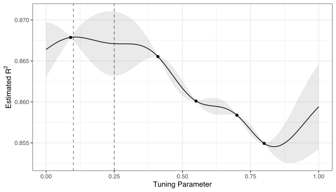

This is where *acquisition functions* come in, as they can help us in this process of picking a suitable parameter value. The most commonly used one is ***expected improvement***. Let's illustrate how it works by bringing back the two candidate parameter values we were considering, 0.1 and 0.25:


We can see that the distribution for 0.1 is much narrower (red line), and has the best r-squared (vertical line). So, 0.1 is our current best ***on average***; however, we can see that for parameter value 0.25 there is higher variance and ***more overall probability area above the current best***. What does this mean for our expected improvement acquisition function?

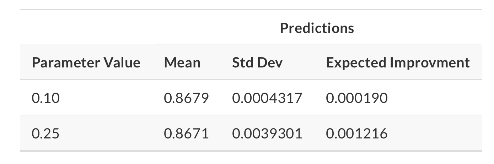

We can see that the expected improvement is significantly higher for parameter value 0.25!

#### The tune_bayes() function

The `tune_bayes()` function sets up Bayesian optimization iterative search. It's similar to `tune_grid()` but with additional arguments. You can specify the maximum number of search iterations, the acquisition function to be used, and whether to stop the search if no improvement is detected. See Max and Julia for details and additional arguments.

Let's keep going with our SVM model. We can use the earlier SVM results as the initial substrate. Once again, we're trying to maximize ROC AUC.

```{r 14-tune, eval = FALSE}
ctrl <- control_bayes(verbose = TRUE) # can also add more arguments, like no_improve

set.seed(420)

svm_bo <-
  svm_wflow %>%
  tune_bayes(
    resamples = penguins_folds, 
    metrics = roc_res, 
    initial = svm_initial, # tune_grid object produced earlier
    param_info = svm_param, # specified earlier too, with our new bounds for rbf_sigma
    iter = 25, # maximum number of search iterations
    control = ctrl
  )
```
```{r 14-save-tune, include = FALSE, eval = FALSE}
saveRDS(svm_bo, here::here("data", "14-svm_bo.rds"))
```
```{r 14-read-tune, include = FALSE}
svm_bo <- readRDS(here::here("data", "14-svm_bo.rds"))
```
Looks like the improvements occurred at iterations 8, 11, 13, 12 and 10. We can pull the best result(s) like so:

```{r 14-show-best}
show_best(svm_bo) # same call as with grid search
```

```{r 14-plot-best}
p1 <- autoplot(svm_bo, type = "performance")
p2 <- autoplot(svm_bo, type = "parameters")

p1 + p2
```

## Simulated annealing

 Simulated annealing is loosely related to annealing in metallurgy.

> When hot, the atoms in the material are more free to move around, and, through random motion, tend to settle into better positions. A slow cooling brings the material to an ordered, crystalline state.
>
> `Page 128, Algorithms for Optimization, 2019.`

If you were to cool rapidly, the atoms would stay wherever they were while the metal was hot and your blade or whatever would be ugly and brittle.

### How it works

At a high level, simulated annealing is an iterative process. It involves:

-   starts with a single candidate value

-   takes a random but constrained walk (*controlled random walk*) in a parameter search space (*local neighborhood*)

-   if the new candidate parameter value is better than the current candidate value - i.e. leads to better performance - then the current value is replaced with this new parameter value

-   the algorithm can still accept worse candidate values sometimes; however it will do so to a lesser extent as:

    -   performance gets worse

    -   iterations increase

    *Why* would it do this? Max and Julia sum it up perfectly:

> "The acceptance probabilities of simulated annealing allows the search to proceed in the wrong direction, at least for the short term, with the potential to find a much better region of the parameter space in the long run."

We can illustrate this graphically:

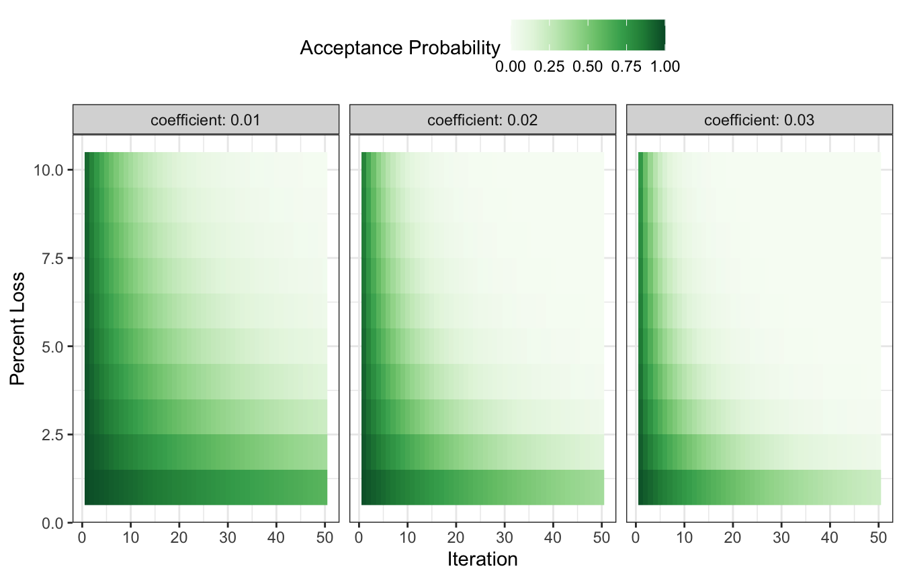 We can imagine the green color - the acceptance probability - is the temperature. At the beginning, it's a real hot girl summer, we're throwing it back everywhere, accepting poor solutions left and right. as the temperature cools, cuffing season starts, we are wayyyy more selective. This is how simulated annealing works - poor candidate parameter values have a higher chance of being accepted by the algorithm at the earlier iterations, and the algorithm hones in on the optimal candidate values as performance gets worse in the later iterations.

On a more serious note, you might be wondering how this probability is worked out. See Max and Julia for formal details. On a high level, it's influenced by:

-   iteration number

-   performance

-   user-specified constant:

    -   coefficient that can be changed from the default value of 0.02 in `finetune::control_sim_anneal()`

From earlier, we said simulation annealing searches for values within a search space, called the *local neighborhood*. This "neighborhood" is defined by a radius that fluctuates randomly over a range and around the initial point. Once a candidate is chosen in that neighborhood, it becomes the new "initial point" and a new candidate is selected randomly in the radius range, and so on. The following graph illustrates this process using the penalty parameter of a *glmnet* model.


For models with non-numeric parameters, we can assign a probability for how often the parameter value changes.

One last note: simulation annealing keeps going until there is no best result within a pre-specified number of iterations. Max and Julia note that you should set a *restart threshold* so that the process can restart after it goes through a bad stretch.

### The tune_sim_anneal() function

The `tune_sim_anneal()` function uses the *generalized simulated annealing* method of Bohachevsky, Johnson, and Stein (1986). There are more flavors in the literature, but this is the one that tidymodels uses. Important specifications include:

-   `no_improve`: the number of iterations before it stops if it finds no improved results

-   `restart`: number of iterations where allowing to be bad before starting anew

-   `radius`: radius range on (0, 1) that defines the search space i.e. local neighborhood

-   `flip`: for non-numeric parameters, this is the probability for how often the parameter value changes

-   `cooling_coef`: dictates how quickly the acceptance probability decreases as the we go through iterations. Larger coefficient values means the probability of accepting a bad result will decrease.

Implemention is very similar to grid search and Bayesian optimization. We can print out the best results, and have visual assessments of our search went across iterations.

```{r 14-sim-anneal, eval = FALSE}
ctrl_sa <- control_sim_anneal(verbose = TRUE, no_improve = 10L)

set.seed(1234)

svm_sa <-
  svm_wflow %>%
  tune_sim_anneal(
    resamples = penguins_folds,
    metrics = roc_res,
    initial = svm_initial,
    param_info = svm_param,
    iter = 50,
    control = ctrl_sa
  )
```
```{r 14-save-sim-anneal, include = FALSE, eval = FALSE}
saveRDS(svm_sa, here::here("data", "14-svm_sa.rds"))
```
```{r 14-read-sim-anneal, include = FALSE}
svm_sa <- readRDS(here::here("data", "14-svm_sa.rds"))
```
```{r 14-show-best-sim-anneal}
show_best(svm_sa)
```

Voilààà!

## References

-   **Get started with tidymodels and TidyTuesday Palmer penguins**: <https://juliasilge.com/blog/palmer-penguins/>
-   **A Visual Exploration of Gaussian Processes**: <https://distill.pub/2019/visual-exploration-gaussian-processes/#Multivariate>

## Meeting Videos

### Cohort 3

`r knitr::include_url("https://www.youtube.com/embed/a_tg77VOtHk")`

<details>
  <summary> Meeting chat log </summary>
  
```
00:11:21	Daniel Chen:	is this like picking the parameters for a given distribution? like beta(0, 1) vs beta(0.1, 0.9)?
00:12:09	Daniel Chen:	ok nvm this is the svm example right now. I guess that question is for the Bayesian point
00:12:49	Jiwan Heo:	I think so, updating priors to make posterior distribution
00:31:36	Daniel Chen:	the usemodels is mainly a way to help you out with somewhat reasonable defaults
00:35:02	Daniel Chen:	like the "caterpillar plot" to help you see if things converged?
00:35:08	Jiwan Heo:	yea!
00:38:13	Daniel Chen:	i forgot what data is using? the post resamples?
00:38:23	Daniel Chen:	you might need to manually pull that out from the data?
00:44:57	Daniel Chen:	for the bayes stuff. is there a way to change the backend for the bayes calculation? e.g., using STAN or something?
00:47:33	Jiwan Heo:	maybe in the model spec?
00:47:43	Jiwan Heo:	bayes.model = linear_reg() %>%
  set_engine(engine = "stan", 
             prior_intercept = prior.dist, 
             prior = prior.dist) %>%
  set_mode(mode = "regression")
00:49:08	Daniel Chen:	oooh. yeah. okay
00:54:52	Daniel Chen:	yeah i guess this ends up being hard since bayes is anaother layer of things to understand the examples
00:55:07	Daniel Chen:	i do wonder if the SVM example or something can/should be simplified to be used as a chapter 0
00:55:26	Daniel Chen:	I've only really used grid search in the past personally in the past
00:55:36	Daniel Chen:	but i was before tidymodels and all hand coded
00:55:42	Daniel Chen:	expand.grid was a friend :)
01:03:16	Jiwan Heo:	have to jump off, thank you for the presentation!
01:09:27	Daniel Chen:	i'm good for next week
```
</details>

<!--chapter:end:14-iterative_search.Rmd-->

# Screening Many Models

**Learning objectives:**

- Use the `{parsnip}` `Generate parsnip model specifications` addin to create a set of **model specifications.**
- Create a **workflow set** with the `{workflowsets}` package.
  - Describe the purposes of the **workflow set columns.**
  - Create a **workflow set** with a `recipe` preprocessor.
  - Create a **workflow set** with a `{dplyr}` selector preprocesor.
- **Tune** and **evaluate workflow sets.**
  - Use `workflowsets::workflow_map()` to **tune all models** in a workflow set.
  - Use convenience functions such as `workflowsets::rank_results()` to **examine** workflow set tuning results.
  - **Visualize** workflow set tuning results.
- Use `workflowsets::workflow_map` with `{finetune}` to **efficiently screen models** using the **racing approach.**
  - **Compare** the **results of the racing approach** to the **results of the full workflow set screening.**
- **Finalize the best model** from a workflow set.

## Obligatory Setup

Using the [2021 World Happiness Report](https://www.kaggle.com/ajaypalsinghlo/world-happiness-report-2021). Why?

-   Small
-   Interesting

<details>

<summary>

How I felt reading this chapter with `concrete` from `{modeldata}`

</summary>


</details>

```{r 15-setup}
library(tidyverse)
library(tidymodels)
theme_set(theme_minimal(base_size = 16))

df <- 
  here::here('data', 'world-happiness-report-2021.csv') %>%
  read_csv() %>% 
  janitor::clean_names()

df %>% skimr::skim()
```

```{r 15-corrr}
library(corrr)
df_selected <-
  df %>%
  select(
    ladder_score,
    logged_gdp_per_capita,
    social_support,
    healthy_life_expectancy,
    freedom_to_make_life_choices,
    generosity,
    perceptions_of_corruption
  )

cors <-
  df_selected %>% 
  select(where(is.numeric)) %>% 
  corrr::correlate() %>% 
  rename(col1 = term) %>% 
  pivot_longer(
    -col1,
    names_to = 'col2',
    values_to = 'cor'
  ) %>% 
  arrange(desc(abs(cor)))
cors %>% filter(col1 == 'ladder_score')

p_cors <-
  cors %>% 
  filter(col1 < col2) %>% 
  ggplot() +
  aes(x = col1, y = col2) +
  geom_tile(aes(fill = cor), alpha = 0.7) +
  geom_text(aes(label = scales::number(cor, accuracy = 0.1))) +
  guides(fill = "none") +
  scale_fill_viridis_c(option = 'E', direction = 1, begin = 0.2) +
  labs(x = NULL, y = NULL) +
  theme(
    panel.grid.major = element_blank(),
    axis.text.x = element_blank()
  )
p_cors
```

## Creating `workflow_set`s

```{r 15-workflowset}
seed <- 2021
col_y <- 'ladder_score'
col_y_sym <- col_y %>% sym()

set.seed(seed)
split <- df_selected %>% initial_split(strata = !!col_y_sym)
df_trn <- split %>% training()
df_tst  <- split %>% testing()

folds <-
  df_trn %>% 
  vfold_cv(strata = !!col_y_sym, repeats = 5)
folds
```

```{r 15-formulas}
# My weird way of creating formulas sometimes, which can be helpful if you're experimenting with different response variables.
form <- paste0(col_y, '~ .') %>% as.formula()
rec_norm <-
  df_trn %>% 
  recipe(form, data = .) %>% 
  step_normalize(all_predictors())

rec_poly <-
  rec_norm %>% 
  step_poly(all_predictors()) %>% 
  step_interact(~ all_predictors():all_predictors())
rec_poly
```

<details>

<summary>

Code for recipes...

</summary>

```{r 15-models}
library(rules)
library(baguette)
f_set <- function(spec) {
  spec %>% 
    set_mode('regression')
}

spec_lr <- 
  linear_reg(penalty = tune(), mixture = tune()) %>% 
  set_engine('glmnet')

spec_mars <- 
  mars(prod_degree = tune()) %>%
  set_engine('earth') %>% 
  f_set()

spec_svm_r <- 
  svm_rbf(cost = tune(), rbf_sigma = tune()) %>% 
  set_engine('kernlab') %>% 
  f_set()

spec_svm_p <- 
  svm_poly(cost = tune(), degree = tune()) %>% 
  set_engine('kernlab') %>% 
  f_set()

spec_knn <- 
  nearest_neighbor(
    neighbors = tune(), 
    dist_power = tune(), 
    weight_func = tune()
  ) %>% 
  set_engine('kknn') %>% 
  f_set()

spec_cart <- 
  decision_tree(cost_complexity = tune(), min_n = tune()) %>% 
  set_engine('rpart') %>% 
  f_set()

spec_cart_bag <- 
  baguette::bag_tree() %>% 
  set_engine('rpart', times = 50L) %>% 
  f_set()

spec_rf <- 
  rand_forest(mtry = tune(), min_n = tune(), trees = 200L) %>% 
  set_engine('ranger') %>% 
  f_set()

spec_xgb <- 
  boost_tree(
    tree_depth = tune(),
    learn_rate = tune(), 
    loss_reduction = tune(), 
    min_n = tune(), 
    sample_size = tune(), 
    trees = 200L
  ) %>% 
  set_engine('xgboost') %>% 
  f_set()

spec_cube <- 
  rules::cubist_rules(committees = tune(), neighbors = tune()) %>% 
  set_engine('Cubist')
```

</details>

<details>

<summary>

How I felt after creating 10 recipes

</summary>


</details>

We can create `workflow_set`s, combining the recipes that standardizes the predictors with the non-linear models that work best when predictors are all on the same scale.

```{r 15-workflowsets-together}
library(workflowsets)

sets_norm <- 
  workflow_set(
    preproc = list(norm = rec_norm), 
    models = list(
      svm_r = spec_svm_r, 
      svm_p = spec_svm_p, 
      knn = spec_knn
    )
  )
sets_norm
```

Let's apply the quadratic pre-processing to models where it is most applicable.

```{r 15-sets-poly}
sets_poly <- 
  workflow_set(
    preproc = list(poly = rec_poly), 
    models = list(lr = spec_lr, knn = spec_knn)
  )
```

Finally, there are several recipes that don't really need pre-processing. Nonetheless, we need to have a `preproc` step, so we can use `workflowsets::workflow_variables()` for a dummy pre-processing step.

```{r 15-sets-simple}
sets_simple <- 
  workflow_set(
    preproc = list(form),
    models = 
      list(
        mars = spec_mars, 
        cart = spec_cart, 
        cart_bag = spec_cart_bag,
        rf = spec_rf, 
        gb = spec_xgb, 
        cube = spec_cube
      )
  )
sets_simple
```

We can bind all of our `workflow_set`s together.

```{r 15-all-sets}
sets <-
  bind_rows(sets_norm, sets_poly, sets_simple) %>% 
  mutate(across(wflow_id, ~str_remove(.x, '^simple_')))
sets
```

And do the thing! (Observe the elegance.)

```{r 15-load-results, echo=F, include=F, eval=T}
path_res_grid <- here::here('data', '15-res_grid.rds')
do_run <- !file.exists(path_res_grid)
```

```{r 15-do-tune, echo=T, include=T, eval=do_run}
ctrl_grid <-
  control_grid(
    save_pred = TRUE,
    parallel_over = 'everything',
    save_workflow = TRUE
  )

res_grid <-
  sets %>%
  workflow_map(
    seed = seed,
    resamples = folds,
    grid = 3,
    control = ctrl_grid,
    verbose = TRUE
  )
```

<details>

<summary>

How I felt waiting for this to finish running

</summary>


</details>

```{r 15-write-res_grid, echo=F, incude=F, eval=do_run}
write_rds(res_grid, path_res_grid)
```

```{r 15-read-res_grid, echo=F, include=F, eval=T}
res_grid <- read_rds(path_res_grid)
```

## Ranking models

Let's look at our results

```{r 15-ranking_models}
# How many models are there?
n_model <-
  res_grid %>% 
  collect_metrics(summarize = FALSE) %>% 
  nrow()
n_model

res_grid_filt <-
  res_grid %>% 
  # 'cart_bag' has <rsmp[+]> in the `results` column, so it won't work with `rank_results()`
  filter(wflow_id != 'cart_bag')

# Note that xgboost sucks if you don't have good parameters
res_ranks <-
  res_grid_filt %>% 
  workflowsets::rank_results('rmse') %>% 
  # Why this no filter out rsquared already?
  filter(.metric == 'rmse') %>%
  select(wflow_id, model, .config, rmse = mean, rank) %>% 
  group_by(wflow_id) %>% 
  slice_min(rank, with_ties = FALSE) %>% 
  ungroup() %>% 
  arrange(rank)
res_ranks
```

Plot the ranks with standard errors.

```{r 15-plots, echo=F, include=T, eval=T, fig.show=T}
# workflowsets:::autoplot.workflow_set
object <- res_grid_filt %>% filter(wflow_id != 'gb') # %>% filter(.metric == 'rmse')
rank_metric <- 'rmse'
metric <- 'rmse'
select_best <- TRUE
std_errs <- 1
metric_info <- workflowsets:::pick_metric(res_grid_filt, rank_metric)
metrics <- workflowsets:::collate_metrics(object)
res <- 
  object %>% 
  workflowsets::rank_results(rank_metric = rank_metric, select_best = select_best) %>% 
  filter(.metric == !!rank_metric) %>% 
  mutate(across(wflow_id, ~fct_reorder(.x, -rank)))

if (!is.null(metric)) {
  keep_metrics <- unique(c(rank_metric, metric))
  res <- dplyr::filter(res, .metric %in% keep_metrics)
}
num_metrics <- length(unique(res$.metric))
has_std_error <- !all(is.na(res$std_err))
p_ranks <- 
  res %>% 
  ggplot() + 
  aes(x = wflow_id, y = mean, color = wflow_id) %>% 
  geom_point(size = 4) +
  geom_errorbar(
    aes(
      # Not sure why I have to repeat `x` and `color` here, but go on.
      x = wflow_id,
      color = wflow_id,
      ymin = mean - std_errs * std_err, 
      ymax = mean + std_errs * std_err
    ), 
    width = diff(range(res$rank))/75
  ) +
  coord_flip() +
  guides(color = "none") +
  theme(legend.position = 'top') +
  labs(
    x = 'Workflow Rank', y = metric_info$metric,
    title = 'Quadratic SVM wins'
  )
p_ranks
```

If we wanted to look at the sub-models for a given `wflow_id`, we could do that with `autoplot()`.

```{r 15-autoplot}
autoplot(
  res_grid, 
  id = 'norm_svm_p', 
  metric = 'rmse'
)
```

<details>

<summary>

How I feel every time I use `autoplot()`

</summary>


</details>

As shown in the book chapter, this could be a really good use case for `finetune::control_race()` and `workflowsets::workflow_map('tune_race_anova', ...)`

## Finalizing the model

Now we can finalize our choice of model.

```{r 15-stacks, echo=F, include=F, eval=F}
library(stacks)

stack <-
  stacks::stacks() %>% 
  stacks::add_candidates(res_grid)
stack

blend <- stack %>% stacks::blend_predictions()
blend

fit_ens <- blend %>% stacks::fit_members()
fit_ens
```

```{r 15-best-stacks}
wflow_id_best <- 
  res_ranks %>% 
  slice_min(rank, with_ties = FALSE) %>% 
  pull(wflow_id)

wf_best <-
  res_grid %>% 
  extract_workflow_set_result(wflow_id_best) %>% 
  select_best(metric = 'rmse')

fit_best <-
  res_grid %>% 
  extract_workflow(wflow_id_best) %>% 
  finalize_workflow(wf_best) %>% 
  last_fit(split = split)

metrics_best <-
  fit_best %>% 
  collect_metrics()
metrics_best
```

Finally, the canonical observed vs. predicted scatter plot.

```{r 15-preds}
p_preds <-
  fit_best %>% 
  collect_predictions() %>% 
  ggplot() +
  aes(x = !!col_y_sym, y = .pred) +
  geom_abline(linetype = 2) +
  # Big cuz we don't have that many points.
  geom_point(size = 4) +
  tune::coord_obs_pred() +
  labs(x = 'observed', y = 'predicted')
p_preds
```

## Meeting Videos

### Cohort 3

`r knitr::include_url("https://www.youtube.com/embed/p87Eum6SdD8")`

<details>
  <summary> Meeting chat log </summary>
  
```
00:16:29	Federica Gazzelloni:	https://www.tidymodels.org/start/models/
00:17:29	Federica Gazzelloni:	https://r4ds.had.co.nz/many-models.html
00:31:46	Daniel Chen (he/him):	since there was a talk about "the whole thing" I feel like this set of examples is a good candidate for it all wihtout having to we-write large swaths of things
00:32:54	Ildiko Czeller:	exactly! I feel like some of the package articles do a better job showing the "whole" thing at one place than the book
00:34:28	Daniel Chen (he/him):	the book is more for learning ml and concepts, but since tidymodels is new (to me) i'm always fighting with how I used to do things or how things are done manually
00:35:17	Daniel Chen (he/him):	I also haven't fit a predictive model since dissertation things. so I know for me personally my confusion and struggle is mainly not actually using it regularly
00:36:57	Ildiko Czeller:	for me too I currently do not need predictive models for work so I need to find use cases outside work... which I haven't done yet but plan to
00:38:32	Ben:	I thought it was only me, I can relate to your struggle, its actually a thing. 
00:53:30	Ildiko Czeller:	workflow_map has a default value fn = "tune_grid", which I would prefer always write explicityly. it is a sensible default but it is just weird to read the code without it for me. like we map without specifying a function
00:55:24	Daniel Chen (he/him):	+1
00:58:39	Daniel Chen (he/him):	40 minutes : |
00:59:00	Daniel Chen (he/him):	the verbose = TRUE is probably there so you know it's doing something. and didn't just stall
00:59:09	Ildiko Czeller:	I wonder which of the 10 models makes it so slow. maybe neural net?
00:59:52	Daniel Chen (he/him):	3min * 12models. that's not too bad
01:00:29	Ildiko Czeller:	hmm there are several models taking several minutes there. interesting. it would probably worth it to set up computing in the cloud on a more powerful computer if it is important.
01:01:18	Ildiko Czeller:	yeah it is not too bad to wait once, but if you realise in the end you made a mistake...
01:05:26	Daniel Chen (he/him):	that was a good review of the most confusing chapters
01:11:28	Daniel Chen (he/him):	i have conference stuff next 2 weeks so i'm +1 for break
```
</details>

<!--chapter:end:15-screening_many_models.Rmd-->

# Review of chapters 10-15 {-}

**Learning objectives:**

- Jon will prefill these.

## Slide 1 Title

Put the content of your slide here.

## Slide 2 Title

Put the content of your second slide here.

<!--chapter:end:15rev-review_tools.Rmd-->

# (PART\*) Other Topics {-}

# Encoding categorical data

**Learning objectives:**

- Jon will prefill these.

## Slide 1 Title

Put the content of your slide here.

## Slide 2 Title

Put the content of your second slide here.

<!--chapter:end:16-encoding_categorical_data.Rmd-->

# Dimensionality reduction

**Learning objectives:**

- Create, prep, and bake recipes outside of a workflow to test or debug the recipes.
- Compare and contrast dimensionality reduction techniques (techniques used to create a small set of features that capture the main aspects of the original predictor set).
- Use principal component analysis (PCA) to reduce dimensionality.
- Use partial least squares (PLS) to reduce dimensionality.
- Use independent component analysis (ICA) to reduce dimensionality.
- Use uniform manifold approximation and projection (UMAP) to reduce dimensionality.
- Use dimensionality reduction techniques in conjunction with modeling techniques.

## {recipes} without {workflows}


## Principal Component Analysis (PCA)

```{r 17-prep, include = FALSE}
library(tidymodels)
tidymodels_prefer()
library(beans)
library(corrplot)
library(ggforce)
library(bestNormalize)
library(learntidymodels)
library(embed)

set.seed(1701)
bean_split <- initial_split(beans, strata = class, prop = 3/4)

bean_train <- training(bean_split)
bean_test  <- testing(bean_split)

set.seed(1702)
bean_val <- validation_split(bean_train, strata = class, prop = 4/5)
bean_val$splits[[1]]
#> <Training/Validation/Total>
#> <8163/2044/10207>

tmwr_cols <- colorRampPalette(c("#91CBD765", "#CA225E"))
bean_train %>% 
  # dplyr::filter(class == levels(bean_train$class)[[5]]) %>% 
  select(-class) %>%
  cor() %>% 
  corrplot(col = tmwr_cols(200), tl.col = "black") +
  ggplot2::facet_wrap(~class)

bean_rec <-
  # Use the training data from the bean_val split object
  recipe(class ~ ., data = analysis(bean_val$splits[[1]])) %>%
  step_zv(all_numeric_predictors()) %>%
  step_orderNorm(all_numeric_predictors()) %>% 
  step_normalize(all_numeric_predictors())

bean_rec_trained <- prep(bean_rec)

show_variables <- 
  bean_rec %>% 
  prep(log_changes = TRUE)

bean_validation <- bean_val$splits %>% pluck(1) %>% assessment()
bean_val_processed <- bake(bean_rec_trained, new_data = bean_validation)

plot_validation_results <- function(recipe, dat = assessment(bean_val$splits[[1]])) {
  recipe %>%
    # Estimate any additional steps
    prep() %>%
    # Process the data (the validation set by default)
    bake(new_data = dat) %>%
    # Create the scatterplot matrix
    ggplot(aes(x = .panel_x, y = .panel_y, col = class, fill = class)) +
    geom_point(alpha = 0.4, size = 0.5) +
    geom_autodensity(alpha = .3) +
    facet_matrix(vars(-class), layer.diag = 2) + 
    scale_color_brewer(palette = "Dark2") + 
    scale_fill_brewer(palette = "Dark2")
}
```

- PCA = unsupervised method, finds up to N new features (where N = # features) to explain variation.

```{r 17-pca}
bean_rec_trained %>%
  step_pca(all_numeric_predictors(), num_comp = 4) %>%
  plot_validation_results() + 
  ggtitle("Principal Component Analysis")
```

## Partial Least Squares (PLS)

- Supervised PCA.

```{r 17-pls}
bean_rec_trained %>%
  step_pls(all_numeric_predictors(), outcome = "class", num_comp = 4) %>%
  plot_validation_results() + 
  ggtitle("Partial Least Squares")
```

## Independent Component Anysis (ICA)

- "As statistically independent from one another as possible."
- "It can be thought of as maximizing the 'non-Gaussianity' of the ICA components.

```{r 17-ica}
# Note: ICA requires the "dimRed" and "fastICA" packages.
bean_rec_trained %>%
  step_ica(all_numeric_predictors(), num_comp = 4) %>%
  plot_validation_results() + 
  ggtitle("Independent Component Analysis")
```

## Uniform Manifold Approximation and Projection (UMAP)

- Uses distance-based nearest neighbor to find local areas where data points are more likely related.
- Relationships saved as directed graph w/most points not connected.
- Create smaller feature set such that graph is well approximated.

```{r 17-umap}
library(embed)
bean_rec_trained %>%
  step_umap(all_numeric_predictors(), outcome = "class", num_comp = 4) %>%
  plot_validation_results() +
  ggtitle("Uniform Manifold Approximation and Projection (supervised)")
```

## Modeling

(This is slow so I don't actually run it here.)

```{r 17-modeling, eval = FALSE}
ctrl <- control_grid(parallel_over = "everything")
bean_res <- 
  workflow_set(
    preproc = list(basic = class ~., pls = pls_rec, umap = umap_rec), 
    models = list(bayes = bayes_spec, fda = fda_spec,
                  rda = rda_spec, bag = bagging_pec,
                  mlp = mlp_spec)
  ) %>% 
  workflow_map(
    verbose = TRUE,
    seed = 1703,
    resamples = bean_val,
    grid = 10,
    metrics = metric_set(roc_auc)
  )

rankings <- 
  rank_results(bean_res, select_best = TRUE) %>% 
  mutate(method = map_chr(wflow_id, ~ str_split(.x, "_", simplify = TRUE)[1])) 

rankings %>% 
  ggplot(aes(x = rank, y = mean, pch = method, col = model)) + 
  geom_point(cex = 3) + 
  theme(legend.position = "right") +
  labs(y = "ROC AUC") +
  coord_cartesian(ylim = c(0, 1))
```

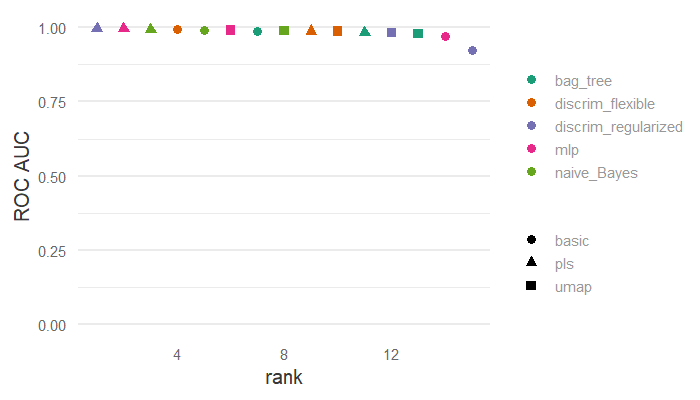

<!--chapter:end:17-dimensionality_reduction.Rmd-->

# Explaining models and predictions

**Learning objectives:**

- Recognize some R packages for model explanations.
- Use {DALEX} and {DALEXtra} to produce local model explanations for a model trained using {tidymodels}.
- Use {DALEX} and {DALEXtra} to produce global model explanations for a model trained using {tidymodels}.
- Use {DALEX} and {DALEXtra} to produce partial dependence profiles for a model trained using {tidymodels}.

## Chapter 18 Setup

Load in the data and set up explainer
```{r 18-load-data, warning=FALSE, message=FALSE}
library(tidymodels)
library(treesnip)
library(skimr)
library(DALEX)
library(DALEXtra)
library(iBreakDown)

rush_model <- readRDS(here::here("data", "18-fit_rush_yards.RDS"))
rush_df <- readRDS(here::here("data", "18-nfl_rush_df.RDS"))

skim(rush_df)

explainer_boost <- 
  explain_tidymodels(
    rush_model, 
    data = rush_df,
    y = rush_df$rushing_yards,
    verbose = TRUE
  )

```
## Overview


## Local Explanations
- Provides information about a prediction for a single observation

- Which variables contribute to this result the most?

- "Break-down" explanations compute the contribution from each feature
  - Results for many explanatory variables can be presented in a limited space
  - Only the additive attributions, misleading for models with interactions
  
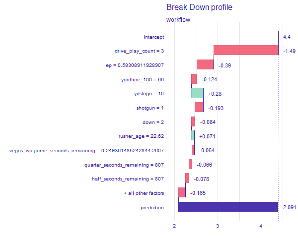
  
- Break-down plots with interactions
  - More accurate if the model itself uses interactions
  - Much more time-consuming
  - Interactions is not based on any formal statistical-significance test
  

  
- SHapley Additive exPlanations (SHAP) are based on “Shapley values”
  - "Cooperation is beneficial, because it may bring more benefit than individual actions"
  - Decompose a model’s predictions into contributions that can be attributed additively to different explanatory variables
  - If the model is not additive, then the Shapley values may be misleading
  


```{r 18-local, eval=FALSE}
#Break-down
boost_breakdown <- predict_parts(explainer = explainer_boost,
                                 new_observation = sample_n(rush_df,1))

png(file="images/18_boost_breakdown.png", width = 600)
plot(boost_breakdown)
dev.off()


#Break-dwon Interactions
boost_breakdown2 <- predict_parts(explainer = explainer_boost,
                                 new_observation = sample_n(rush_df,1),
                                 type = "break_down_interactions")

png(file="images/18_boost_breakdown2.png", width = 600)
plot(boost_breakdown2)
dev.off()

#SHAP
boost_breakdown3 <- predict_parts(explainer = explainer_boost,
                                 new_observation = sample_n(rush_df,1),
                                 type = "shap")

png(file="images/18_boost_breakdown3.png", width = 600)
plot(boost_breakdown3)
dev.off()
```

## Local Explanations for Interactions

- "Ceteris-paribus" profiles show how a model’s prediction would change if the value of a single exploratory variable changed
  - Graphical representation is easy to understand and explain
  - Not a valid assumption with highly correlated or interaction variables
  
  
  
  

```{r 18-ceterus, eval=FALSE}
#Ceterus Paribus
boost_paribus <- predict_profile(explainer = explainer_boost,
                                 new_observation = sample_n(rush_df,1),
                                 variables = c("rusher_age", "yardline_100"))

png(file="images/18_boost_paribus.png")
plot(boost_paribus, variables = c("rusher_age"))
dev.off()

png(file="images/18_boost_paribus2.png")
plot(boost_paribus, variables = c("yardline_100"))
dev.off()
```

## Global Explanations

- Which features are most important in driving the predictions aggregated over the whole training set
- Measure how much does a model’s performance change if the effect of a selected explanatory variable(s) is(are) removed
  - If variables are correlated, then models like random forest are expected to spread importance across many variables
  - Dependent on the random nature of the permutations
  
  

```{r 18-global, eval=FALSE}
boost_vip <- model_parts(explainer_boost, loss_function = loss_root_mean_square)

png(file="images/18_boost_vip.png")
plot(boost_vip, max_featuers = 10)
dev.off()
```


## Global Explanations from Local Explanations

- Partial-dependence plots
  - How does the expected value of model prediction behave as a function of a selected explanatory variable?
  - PD profiles are averages of CP profiles
  - Problematic for correlated explanatory variables
  
   
  
```{r 18-global_profile, eval=FALSE}
boost_profile <- model_profile(explainer_boost,
                               N = 1000, 
                               variables = "rusher_age", 
                               groups = "position")

png(file="images/18_boost_profile.png")
plot(boost_profile)
dev.off()
```


## References

[DALEX Github](https://modeloriented.github.io/DALEX/)

[DALEXtra Github](https://github.com/ModelOriented/DALEXtra)

[Exploratory Model Anaylsis](https://ema.drwhy.ai/)


<!--chapter:end:18-explaining_models_and_predictions.Rmd-->

# When should you trust predictions?

**Learning objectives:**

- Jon will prefill these.

## Slide 1 Title

Put the content of your slide here.

## Slide 2 Title

Put the content of your second slide here.

<!--chapter:end:19-when_should_you_trust_predictions.Rmd-->

# Ensemble models

**Learning objectives:**

- Jon will prefill these.

## Slide 1 Title

Put the content of your slide here.

## Slide 2 Title

Put the content of your second slide here.

<!--chapter:end:20-ensemble_models.Rmd-->

# Inferential analysis

**Learning objectives:**

- Jon will prefill these.

## Slide 1 Title

Put the content of your slide here.

## Slide 2 Title

Put the content of your second slide here.

<!--chapter:end:21-inferential_analysis.Rmd-->

